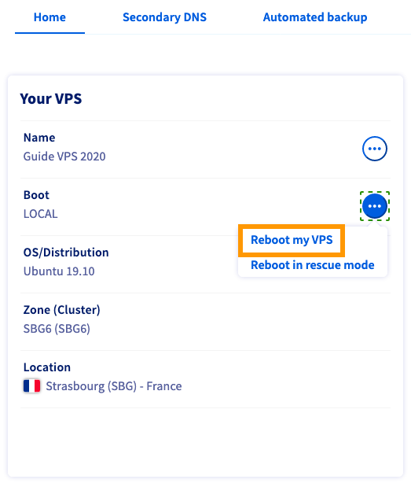

**Letzte Aktualisierung am 11.02.2022**

> [!primary]
> Diese Übersetzung wurde durch unseren Partner SYSTRAN automatisch erstellt. In manchen Fällen können ungenaue Formulierungen verwendet worden sein, z.B. bei der Beschriftung von Schaltflächen oder technischen Details. Bitte ziehen Sie beim geringsten Zweifel die englische oder französische Fassung der Anleitung zu Rate. Möchten Sie mithelfen, diese Übersetzung zu verbessern? Dann nutzen Sie dazu bitte den Button «Mitmachen» auf dieser Seite.
>

## Ziel

Der Rescue-Modus ist ein von OVHcloud bereitgestelltes Werkzeug, um Ihren VPS in einem temporären Betriebssystem zu starten. Sie können es verwenden, um verschiedene Probleme in Ihrem Hauptbetriebssystem zu diagnostizieren und zu beheben.

Der Rescue-Modus ist allgemein geeignet für diese Aufgaben:

- Ihr Root-Passwort ändern
- Netzwerkprobleme diagnostizieren
- Reparatur eines fehlerhaften Betriebssystems
- Fehlkonfiguration der Firewall korrigieren
- Leistung der Festplatte testen

Die Durchführung von Überprüfungen im Rescue-Modus hilft Ihnen auch festzustellen, ob ein Problem mit der Software oder Hardware zusammenhängt. Wir empfehlen Ihnen, diese auszuführen, bevor Sie unsere Support-Teams kontaktieren.

> [!warning]
>
> Wenn Sie Dienste auf Ihrem VPS im laufenden Betrieb haben, wird der Rescue-Modus diese Dienste unterbrechen, da der VPS in das Hilfsbetriebssystem neu gestartet wird.
> 

**Diese Anleitung erklärt, wie Sie Ihren VPS im Rescue-Modus neu starten.**

## Voraussetzungen

- Sie haben Zugriff auf Ihr [OVHcloud Kundencenter](https://www.ovh.com/auth/?action=gotomanager&from=https://www.ovh.de/&ovhSubsidiary=de).
- Sie haben einen bereits eingerichteten [OVHcloud VPS](https://www.ovhcloud.com/de/vps/){.external} in Ihrem Kunden-Account.

> [!warning]
> 
> OVHcloud stellt Ihnen Dienstleistungen zur Verfügung, für die Sie die alleinige Verantwortung tragen. Da wir keinen Zugriff auf diese Maschinen haben, können wir hierfür keinerlei Administrator-Aufgaben übernehmen oder sonstige Hilfeleistung anbieten. Es liegt daher in Ihrer Verantwortung, das Softwaremanagement und die tägliche Sicherheit zu gewährleisten.
>
> Wir stellen Ihnen diese Anleitung zur Verfügung, um Ihnen bei der Bewältigung alltäglicher Verwaltungsaufgaben zu helfen. Wir empfehlen Ihnen jedoch, sich an einen spezialisierten Dienstleister zu wenden, wenn Sie Schwierigkeiten oder Zweifel hinsichtlich der Verwaltung, Nutzung oder Sicherheit eines Servers haben. Sie können sich auch jederzeit an unsere [Community](https://community.ovh.com/en/) wenden, um sich mit anderen Benutzern auszutauschen.
>

## In der praktischen Anwendung

### Aktivierung des Rescue-Modus

Loggen Sie sich in Ihr [OVHcloud Kundencenter](https://www.ovh.com/auth/?action=gotomanager&from=https://www.ovh.de/&ovhSubsidiary=de) ein, gehen Sie in den Bereich `Bare Metal Cloud`{.action} und wählen Sie Ihren Server unter `Virtual Private Server`{.action} aus.

#### Mit einem aktuellen VPS Angebot

Klicken Sie im Tab `Start`{.action} auf `...`{.action} neben "Boot" im Bereich **Ihr VPS**.

{.thumbnail}

Wählen Sie Im Menü `Neustart im Rescue-Modus`{.action}.

#### Mit einem alten VPS Angebot

Klicken Sie im Tab `Start`{.action} auf den Shortcut-Link `Neustart im Rescue-Modus`{.action}.

{.thumbnail}

Klicken Sie im neuen Fenster auf `Bestätigen`{.action}, um den Neustart im Rescue-Modus auszuführen.

### Verwendung des Rescue-Modus

Sobald Sie den Neustart ausgeführt haben, gibt ein Fortschrittsbalken den Fortschritt der Aufgabe an. Bitte beachten Sie, dass dies einige Minuten dauern kann.

> [!primary]
>
> Sie erhalten eine automatische E-Mail mit den SSH-Login-Daten, um im Rescue-Modus auf den VPS zuzugreifen. Bitte warten Sie auf den Eingang der E-Mail, bevor Sie weitere Maßnahmen ergreifen. Diese E-Mail ist auch in Ihrem [OVHcloud Kundencenter](https://www.ovh.com/auth/?action=gotomanager&from=https://www.ovh.de/&ovhSubsidiary=de) verfügbar, sobald sie versendet wurde. Klicken Sie in der rechten oberen Ecke auf den mit Ihrer OVHcloud-Kennung assoziierten Namen und wählen Sie `E-Mails vom Support`{.action} aus.
>

Sie können sich nun via SSH mit Ihrem VPS verbinden, indem Sie die Login-Daten für den Rescue-Modus verwenden. Sobald Ihre Maßnahmen im Rescue-Modus abgeschlossen sind, starten Sie den VPS über Ihr [OVHcloud Kundencenter](https://www.ovh.com/auth/?action=gotomanager&from=https://www.ovh.de/&ovhSubsidiary=de) im "normalen" Modus noch einmal neu.

{.thumbnail}

## Weiterführende Informationen

[Root-Passwort auf einem VPS ändern](../root-password/)

[SSH Einführung](../../dedicated/ssh-einfuehrung/)

Für den Austausch mit unserer User Community gehen Sie auf <https://community.ovh.com/en/>.
