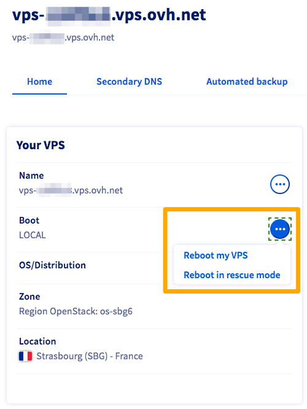
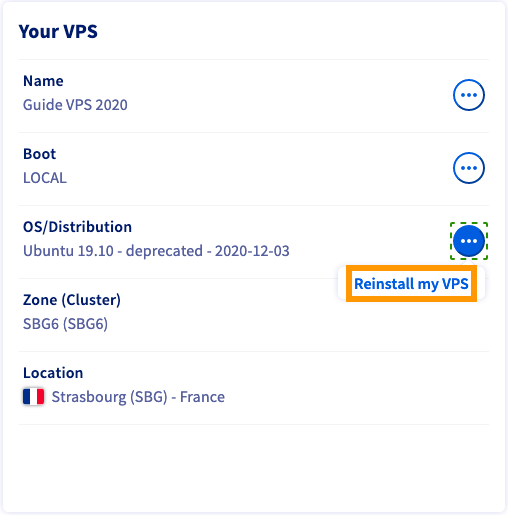

> [!primary]
> Esta traducción ha sido generada de forma automática por nuestro partner SYSTRAN. En algunos casos puede contener términos imprecisos, como en las etiquetas de los botones o los detalles técnicos. En caso de duda, le recomendamos que consulte la versión inglesa o francesa de la guía. Si quiere ayudarnos a mejorar esta traducción, por favor, utilice el botón «Contribuir» de esta página.
> 

**Última actualización: 25/03/2022**

## Objetivo

Un servidor virtual privado (VPS, por sus siglas en inglés) es un servidor dedicado virtualizado. A diferencia de un alojamiento web (compartido), cuya gestión técnica recae en OVHcloud, usted es el único responsable de la administración de su VPS.

**Esta guía ofrece información básica para ayudarle a empezar a utilizar su VPS.**

> [!warning]
>OVHcloud le ofrece los servicios que usted es responsable de configurar y gestionar. Usted es responsable de su buen funcionamiento.
>
>Si necesita ayuda, póngase en contacto con un proveedor de servicios especializado o debata el problema con nuestra comunidad de usuarios en https://community.ovh.com/en/. OVHcloud no puede ofrecerle soporte técnico.
>

## Requisitos

- Tener un [VPS](https://www.ovhcloud.com/es/vps/) en el área de cliente de OVHcloud.
- Haber iniciado sesión en el [área de cliente de OVHcloud](https://www.ovh.com/auth/?action=gotomanager&from=https://www.ovh.es/&ovhSubsidiary=es){.external}.
- Disponer de las claves de acceso enviadas por correo electrónico tras la instalación.

## Procedimiento

Conéctese al [Panel de configuración de OVHcloud](https://www.ovh.com/auth/?action=gotomanager&from=https://www.ovh.es/&ovhSubsidiary=es), acceda a la sección `Bare Metal Cloud`{.action} y seleccione el servidor en la sección `Servidores Privados Virtuales`{.action}.

El panel de control que se le presenta contiene información importante sobre su servicio y le permite realizar operaciones esenciales. La apariencia puede variar según la gama de su VPS. 

- Si acaba de contratar un VPS, la referencia seguirá esta nomenclatura: *vps-XXXXXXX.vps.ovh.net* (donde las *X* representan una secuencia de números y letras). 
- Si tiene un VPS más antiguo, verá que la referencia tiene una estructura diferente: *vpsXXXX.ovh.net* (donde las *X* representan un número). 

Para la gama actual de VPS, lea detenidamente la sección siguiente de esta guía, **Primeros pasos (gama actual de VPS)**. 

Para un modelo de VPS más antiguo, siga leyendo esta guía haciendo clic en el enlace siguiente: [Primeros pasos (antigua gama de VPS)](./#primeros-pasos-antigua-gama-de-vps_1).

### Primeros pasos (gama actual de VPS)

#### Conexión a su VPS (gama actual de VPS)

Al instalar el VPS por primera vez o reinstalarlo desde el área de cliente, se creará un usuario con todos los derechos y recibirá un correo electrónico con los datos de acceso.
El nombre de usuario se generará en función del sistema operativo, por ejemplo, «ubuntu» o «debian». 

Puede conectarse a su VPS por SSH con el nombre de usuario y la contraseña. SSH es un protocolo de comunicaciones seguras. Para más información, consulte [esta guía de introducción al SSH para servidores dedicados OVHcloud](../../dedicated/introduccion-ssh/). Puede acceder al servidor a través de un terminal de línea de comandos (en Linux o Mac) o utilizando un software de terceros en Windows (le recomendamos PuTTy).

Si utiliza PuTTy, tan solo tiene que abrir la aplicación e introducir el nombre del servidor o la dirección IPv4 para establecer la conexión. Tendrá que introducir el nombre de usuario y la contraseña, y a continuación podrá acceder a la interfaz de línea de comandos (CLI).

{.thumbnail}

Una vez abierto el terminal, introduzca el comando siguiente para conectarse a su VPS con los datos de conexión proporcionados en el correo electrónico (nombre de usuario y dirección IPv4):

```bash
ssh nombre_de_usuario@IPv4_de_su_VPS
```

Como ahora está conectado con altos permisos (un usuario *sudo*), puede introducir comandos para realizar tareas administrativas. Le recomendamos que primero cambie su contraseña:

```bash
~$ sudo passwd nombre_de_usuario
New password:
Retype new password:
passwd: password updated successfully
```

Tenga en cuenta que no se muestran las contraseñas. Cambie al usuario root y establezca su contraseña admin:

```bash
~$ sudo su -
~# passwd
New password:
Retype new password:
passwd: password updated successfully
```

#### Activación de las conexiones root

Por motivos de seguridad, la conexión con el usuario root está desactivada por defecto. Si debe autorizar este tipo de conexiones, consulte las instrucciones de [esta guía](../root-password/#activar-la-contrasena-root_1).

#### Reinicio de su VP (gama actual de VPS) <a name="reboot-current-range"></a>

Es posible que necesite reiniciar para aplicar configuraciones actualizadas o resolver un problema. En la medida de lo posible, ejecute el "soft reboot" del servidor en la siguiente línea de comandos:

```bash
reboot
```

No obstante, puede realizar "hard reboot" en cualquier momento desde el [área de cliente de OVHcloud](https://www.ovh.com/auth/?action=gotomanager&from=https://www.ovh.es/&ovhSubsidiary=es). En la pestaña `Inicio`{.action}, haga clic en `...`{.action} frente a "Boot" en la zona **Su VPS** y seleccione `Reiniciar mi VPS`{.action} y `Confirmar`{.action} en la ventana emergente.

{.thumbnail}

#### Instalación o reinstalación de su VPS (gama actual de VPS) <a name="reinstallvps"></a>

Puede realizar cualquier reinstalación directamente desde el área de cliente de OVHcloud. En la pestaña «Inicio», busque «SO / Distribución» en la sección **Su VPS**. Haga clic en `...`{.action}, y en `Reinstalar mi VPS`{.action}.

{.thumbnail}

Se abrirá una ventana donde tendrá que elegir:

- la distribución;
- una [llave SSH](../../dedicated/crear-claves-ssh-dedicadas/) (opcional).

{.thumbnail}

> [!primary]
>
> Algunos sistemas operativos o plataformas propietarias, como Plesk o cPanel, requieren licencias que generan costes adicionales. Las licencias pueden gestionarse desde el área de cliente de OVHcloud: acceda a la sección `Bare Metal Cloud` en la esquina superior izquierda del área de cliente y haga clic en `Licencias`{.action}.
> 
> Para poder ejecutar un sistema operativo **Windows** en su VPS, deberá **seleccionar esta opción durante la contratación** del servicio. Si su VPS tiene otro sistema operativo instalado, no podrá reinstalarlo con Windows según el método arriba descrito.
> 

En el área de cliente se mostrará una barra de progreso indicando el estado de la tarea de reinstalación, que puede tardar hasta 30 minutos.

### Primeros pasos (antigua gama de VPS)

#### Conexión a su VPS (antigua gama de VPS)

Al instalar (o reinstalar) su VPS, recibirá por correo electrónico una contraseña de acceso root, la conexión que utiliza el protocolo SSH. SSH es un protocolo de comunicaciones seguras. Para más información, consulte [esta guía de introducción al SSH para servidores dedicados OVHcloud](../../dedicated/introduccion-ssh/).

Puede acceder al servidor a través de un terminal de línea de comandos (en Linux o Mac) o utilizando un software de terceros en Windows (le recomendamos PuTTy).

Si utiliza PuTTy, tan solo tiene que abrir la aplicación e introducir el nombre del servidor o la dirección IPv4 para establecer la conexión. Tendrá que introducir el nombre de usuario y la contraseña, y a continuación podrá acceder a la interfaz de línea de comandos (CLI).

{.thumbnail}

Una vez abierto el terminal, ejecute el siguiente comando para conectarse a su VPS:

```bash
ssh root@IPv4_de_su_VPS
```

Como alternativa, también puede utilizar este comando:

```bash
ssh root@referencia_de_su_VPS
```

#### Reinicio de su VP (antigua gama de VPS) <a name="reboot-older-range"></a>

Es posible que necesite reiniciar para aplicar configuraciones actualizadas o resolver un problema. En la medida de lo posible, ejecute el "soft reboot" del servidor en la siguiente línea de comandos:

```bash
reboot
```

No obstante, puede realizar "hard reboot" en cualquier momento desde el [área de cliente de OVHcloud](https://www.ovh.com/auth/?action=gotomanager&from=https://www.ovh.es/&ovhSubsidiary=es). En la pestaña `Inicio`{.action}, haga clic en `Reiniciar mi VPS`{.action} y `Confirmar`{.action} en la ventana emergente.

{.thumbnail}

#### Instalación o reinstalación de su VPS (antigua gama de VPS)

La reinstalación se realiza directamente desde el área de cliente. Para ello, haga clic en el botón `Reinstalar mi VPS`{.action} en la pestaña `Inicio`{.action}.

{.thumbnail}

Se abrirá una ventana donde tendrá que elegir:

- la distribución;
- el idioma de instalación, y
- una [llave SSH](../../dedicated/crear-claves-ssh-dedicadas/) (opcional).

{.thumbnail}

> [!primary]
>
> Algunos sistemas operativos o plataformas propietarias, como Plesk o cPanel, requieren licencias que generan costes adicionales. Las licencias pueden gestionarse desde el área de cliente de OVHcloud: acceda a la sección `Bare Metal Cloud` en la esquina superior izquierda del área de cliente y haga clic en `Licencias`{.action}.
> 
> Para poder ejecutar un sistema operativo **Windows** en su VPS, deberá **seleccionar esta opción durante la contratación** del servicio. Si su VPS tiene otro sistema operativo instalado, no podrá reinstalarlo con Windows según el método arriba descrito.
> 

En el área de cliente se mostrará una barra de progreso indicando el estado de la tarea de reinstalación, que puede tardar hasta 30 minutos.

### Proteger el VPS

Como se explica en la sección "Objetivo" de esta guía, usted es el administrador de su VPS. Como tal, usted es responsable de sus datos y de su seguridad.

Para más información, consulte la guía [Proteger un VPS](../consejos-proteccion-vps/).

### Asociar un dominio

El uso de su VPS para la publicación de un sitio web implica generalmente la asociación de un dominio a través de DNS. Si tiene un dominio en OVHcloud, consulte nuestra guía sobre la [modificación de su zona DNS](../../domains/web_hosting_como_editar_mi_zona_dns/) para recibir instrucciones.

### Proteger el dominio con un certificado SSL

Una vez haya instalado y protegido su VPS, es probable que también quiera proteger su nombre de dominio y su sitio web. Para ello, debe instalar un certificado SSL que le permita tener su sitio en *https* y no solo en *http*.

Puede instalar dicho certificado SSL directamente en el VPS de forma manual. Para ello, consulte la documentación oficial de la distribución que utilice.

Si prefiere automatizar la protección de su sitio web, OVHcloud le ofrece la solución [SSL Gateway](https://www.ovh.es/ssl-gateway/). Para más información, consulte la [página comercial](https://www.ovh.es/ssl-gateway/){.external} o las [guías](https://docs.ovh.com/es/ssl-gateway/){.external} de la solución.

## Más información

[Crear una llave SSH](../../dedicated/crear-claves-ssh-dedicadas/)

[Proteger un VPS](../consejos-proteccion-vps/)

Únase a nuestra comunidad de usuarios en <https://community.ovh.com/en/>.
