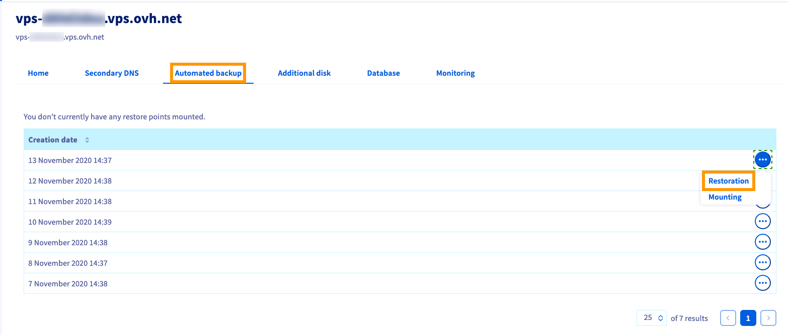
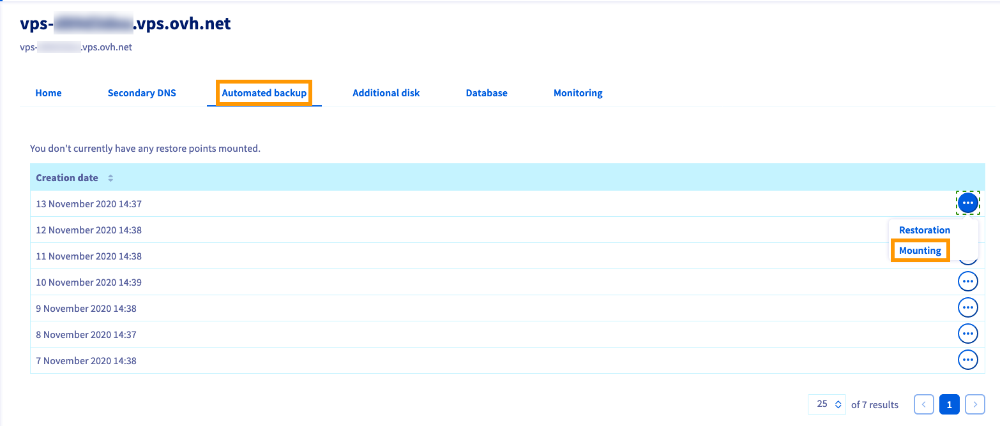

**Dernière mise à jour le 01/02/2022**

## Objectif

Cette option vous offre un moyen pratique de disposer fréquemment de sauvegardes VPS complètes à partir de l'espace client OVHcloud sans avoir à vous connecter au serveur pour les créer et les restaurer manuellement. Un autre avantage est que vous pouvez aussi choisir de monter une image de sauvegarde et y accéder en SSH.

**Ce guide explique comment utiliser la sauvegarde automatique pour votre VPS.**

<iframe width="560" height="315" src="https://www.youtube-nocookie.com/embed/Pazh9ozbkEk" title="YouTube video player" frameborder="0" allow="accelerometer; autoplay; clipboard-write; encrypted-media; gyroscope; picture-in-picture" allowfullscreen></iframe>

> [!primary]
>Avant d'appliquer une option de sauvegarde, nous vous recommandons de consulter les [options VPS](https://www.ovhcloud.com/fr-ca/vps/options/) afin de comparer les détails et tarifs de chaque option.
>

## Prérequis

- Être connecté à [l'espace client OVHcloud](https://ca.ovh.com/auth/?action=gotomanager&from=https://www.ovh.com/ca/fr/&ovhSubsidiary=qc).
- Un [VPS OVHcloud](https://www.ovhcloud.com/fr-ca/vps/options/) déjà configuré
- Un accès administrateur (root) en SSH à votre VPS (facultatif)

## En pratique

Connectez-vous à votre [espace client OVHcloud](https://ca.ovh.com/auth/?action=gotomanager&from=https://www.ovh.com/ca/fr/&ovhSubsidiary=qc), rendez-vous dans la section `Bare Metal Cloud`{.action} et sélectionnez votre serveur sous la partie `Serveur privés virtuels`{.action}.

### Étape 1 : souscrire l'option de sauvegarde automatique

Après avoir sélectionné votre VPS, cliquez sur l'onglet `Backup automatisé`{.action} dans la barre de menu horizontale.

Veuillez prendre alors connaissance des informations de tarification de cette option, puis cliquez sur `Commander`{.action}.
Vous serez guidé dans le processus de commande et recevrez un e-mail de confirmation. Les sauvegardes seront désormais créées quotidiennement jusqu'à ce que l'option soit annulée par vos soins.

### Étape 2 : restaurer une sauvegarde à partir de l'espace client OVHcloud

Sélectionnez votre VPS puis cliquez sur l'onglet `Backup automatisé`{.action} dans le menu horizontal. Un maximum de 7 sauvegardes quotidiennes seront disponibles (15 sauvegardes quotidiennes pour les VPS d'anciennes gammes). Cliquez sur `...`{.action} à droite de la sauvegarde à restaurer et sélectionnez `Restauration`{.action}.

{.thumbnail}

Si vous avez récemment modifié votre mot de passe root, assurez-vous de cocher l'option « Modifier le mot de passe root lors de la restauration » dans la fenêtre contextuelle pour conserver votre mot de passe root actuel et cliquez sur `Confirmer`{.action}. Vous recevrez un e-mail dès que la restauration sera terminée. Celle-ci peut prendre un certain temps, selon l'espace disque utilisé.

> [!alert]
>
Notez que les sauvegardes automatisées n'incluent pas vos éventuels disques additionnels.
>

### Monter et accéder à une image de sauvegarde

Cette option permet d'accéder aux données de sauvegarde au cas où vous ne souhaitez pas remplacer complètement votre service existant par la restauration.

> [!warning]
>
> OVHcloud met à votre disposition des services dont la configuration, la gestion et la responsabilité vous incombent. Il vous revient de ce fait d'en assurer le bon fonctionnement.
>
> Nous mettons à votre disposition ce guide afin de vous accompagner au mieux sur des tâches courantes. Néanmoins, nous vous recommandons de faire appel à un prestataire spécialisé et/ou de contacter l'éditeur du service si vous éprouvez des difficultés. En effet, nous ne serons pas en mesure de vous fournir une assistance. Plus d'informations dans la section « Aller plus loin » de ce guide.
>

#### Étape 1 : depuis l'espace client

Cliquez sur `...`{.action} à droite de la sauvegarde souhaitée et sélectionnez `Montage`{.action}.

{.thumbnail}

Une fois le processus terminé, vous recevrez un e-mail. Vous pourrez alors vous connecter à votre VPS et ajouter la partition où se trouve votre sauvegarde.

#### Sous Linux

Connectez-vous à votre VPS en SSH.

Vous pouvez utiliser la commande suivante pour vérifier le nom du nouveau périphérique connecté :

```
$ lsblk
```

Voici un exemple de résultat de cette commande :

```
NAME    MAJ:MIN RM  SIZE RO TYPE MOUNTPOINT
sda       8:0    0   25G  0 disk 
├─sda1    8:1    0 24.9G  0 part /
├─sda14   8:14   0    4M  0 part 
└─sda15   8:15   0  106M  0 part 
sdb       8:16   0   25G  0 disk 
├─sdb1    8:17   0 24.9G  0 part 
├─sdb14   8:30   0    4M  0 part 
└─sdb15   8:31   0  106M  0 part /boot/efi
```

Dans cet exemple, la partition contenant votre système de fichiers de sauvegarde est nommée "sdb1".
Créez à présent un répertoire pour cette partition et définissez-le comme point de montage :

```
$ mkdir -p /mnt/restore
$ mount /dev/sdb1 /mnt/restore
```

Vous pouvez maintenant basculer vers ce dossier et accéder à vos données de sauvegarde.

#### Sous Windows

Établissez une connexion RDP (Remote Desktop) avec votre VPS.

Une fois connecté, faites un clic-droit sur le bouton `Démarrer`{.action} et ouvrez `Gestion des disques`{.action}.

{.thumbnail}

Votre sauvegarde montée apparaîtra comme un disque de base avec le même espace de stockage que votre disque principal.

{.thumbnail}

Le disque apparaîtra comme `hors ligne`, faites un clic-droit sur le disque et sélectionnez `En ligne`(action).

{.thumbnail}

Par la suite, votre sauvegarde montée sera accessible dans `Explorateur de fichiers`.

{.thumbnail}

> [!warning]
> Veuillez noter qu'un redémarrage du serveur se produira lors du démontage de la sauvegarde.
>

### Bonnes pratiques pour l'utilisation de la sauvegarde automatique

La fonctionnalité de sauvegarde automatique est basée sur les snapshots VPS. Nous vous recommandons de suivre les étapes ci-dessous pour éviter toute anomalie avant d'utiliser cette option.

#### Configuration de l'agent QEMU sur un VPS

Les snapshots sont des images instantanées de votre système en cours d'exécution (« live snapshots »). Pour garantir la disponibilité de votre système lors de la création du snapshot, l'agent QEMU est utilisé pour préparer le système de fichiers au processus.

Le *qemu-guest-agent* requis n'est pas installé par défaut sur la plupart des distributions. En outre, les restrictions de licence peuvent empêcher OVHcloud de l'inclure dans les images d'OS disponibles. Par conséquent, il est recommandé de vérifier et d'installer l'agent au cas où il ne serait pas activé sur votre VPS. Connectez-vous à votre VPS en SSH et suivez les instructions ci-dessous, selon votre système d'exploitation.

##### **Distributions Debian (Debian, Ubuntu)**

Utilisez la commande suivante pour vérifier si le système est correctement configuré pour les snapshots :

```
$ file /dev/virtio-ports/org.qemu.guest_agent.0
/dev/virtio-ports/org.qemu.guest_agent.0: symbolic link to ../vport2p1
```

Si le résultat est différent (« No such file or directory »), installez le dernier package :

```
$ sudo apt-get update
$ sudo apt-get install qemu-guest-agent
```

Redémarrez le VPS:

```
$ sudo reboot
```

Démarrez le service pour vous assurer qu'il est en cours d'exécution :

```
$ sudo service qemu-guest-agent start
```

##### **Distributions Redhat (CentOS, Fedora)**

Utilisez la commande suivante pour vérifier si le système est correctement configuré pour les snapshots :

```
$ file /dev/virtio-ports/org.qemu.guest_agent.0
/dev/virtio-ports/org.qemu.guest_agent.0: symbolic link to ../vport2p1
```

Si le résultat est différent (« No such file or directory »), installez et activez l'agent :

```
$ sudo yum install qemu-guest-agent
$ sudo chkconfig qemu-guest-agent on
```

Redémarrez le VPS:

```
$ sudo reboot
```

Démarrez l'agent et vérifiez qu'il est en cours d'exécution :

```
$ sudo service qemu-guest-agent start
$ sudo service qemu-guest-agent status
```

##### **Windows**

Vous pouvez installer l'agent via un fichier MSI, disponible sur le site du projet Fedora: <https://fedorapeople.org/groups/virt/virtio-win/direct-downloads/latest-qemu-ga/>

Vérifiez que le service est en cours d'exécution à l'aide de la commande powershell suivante :

```
PS C:\Users\Administrator> Get-Service QEMU-GA
Status   Name               DisplayName
------   ----               -----------
Running  QEMU-GA            QEMU Guest Agent
```

## Aller plus loin

[Utiliser les snapshots sur un VPS](../snapshot-vps/)

Échangez avec notre communauté d'utilisateurs sur <https://community.ovh.com>.
