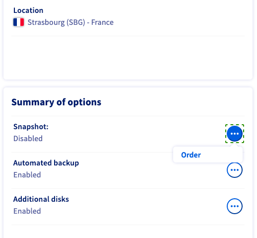

**Letzte Aktualisierung am 24.09.2020**


## Ziel

Mithilfe eines Snapshots haben Sie die Möglichkeit, schnell und einfach ein laufendes System zu sichern, etwa bevor Änderungen vorgenommen werden, die unerwünschte oder unvorhergesehene Folgen haben können (z.B. Testen einer neuen Konfiguration oder Software). Es handelt sich jedoch nicht um eine vollständige Backup-Strategie.

**Diese Anleitung erläutert die Verwendung von Snapshots für Ihren OVHcloud VPS.**

> [!primary]
>
Bevor Sie Backup-Optionen anwenden, empfehlen wir, die [Produktseiten und FAQ](https://www.ovhcloud.com/de/vps/options/) zu Preisvergleichen und weiteren Details zu konsultieren.
>

## Voraussetzungen

- Sie haben Zugriff auf Ihr [OVHcloud Kundencenter](https://www.ovh.com/auth/?action=gotomanager&from=https://www.ovh.de/&ovhSubsidiary=de).
- Sie haben einen [VPS](https://www.ovhcloud.com/de/vps/) in Ihrem Kunden-Account.


## In der praktischen Anwendung

Loggen Sie sich in Ihr [OVHcloud Kundencenter](https://www.ovh.com/auth/?action=gotomanager&from=https://www.ovh.de/&ovhSubsidiary=de) ein, gehen Sie in den Bereich `Bare Metal Cloud`{.action} und wählen Sie links im Menü unter `VPS`{.action} Ihren Server aus.

### Schritt 1: Snapshot-Option aktivieren

Scrollen Sie im Tab `Start`{.action} nach unten zum Feld mit der Bezeichnung „Zusammenfassung der Optionen“. Klicken Sie auf `...`{.action} neben der Option „Snapshot“. Im Kontextmenü klicken Sie auf `Bestellen`{.action}.

{.thumbnail}

Beachten Sie im nächsten Schritt die Kosteninformation und klicken Sie dann auf `Bestellen`{.action}. Sie werden durch den Bestellvorgang geführt und erhalten eine Bestätigungsmail.

### Schritt 2: Einen Snapshot erstellen

Sobald die Option aktiviert ist, klicken Sie auf `...`{.action} neben der Option „Snapshot“. Im Kontextmenü klicken Sie auf `Snapshot erstellen`{.action}. Das Erstellen des Snapshot kann einige Minuten dauern. Anschließend wird der Zeitstempel der Erstellung im Bereich „Zusammenfassung der Optionen“ angezeigt.

### Schritt 3: Einen Snapshot löschen/wiederherstellen

Da immer nur ein Snapshot aktiviert sein kann, muss der vorhandene Snapshot gelöscht werden, bevor ein neuer erstellt wird. Wählen Sie dazu einfach `Snapshot löschen`{.action} aus dem Kontextmenü.

{.thumbnail}

Wenn Sie sicher sind, dass Sie Ihren VPS auf den Stand des Snapshots zurücksetzen möchten, klicken Sie auf `Snapshot wiederherstellen`{.action} und bestätigen Sie die Aktion im Popup-Fenster. Dabei ist zu beachten, das der Snapshot im Zuge der Wiederherstellung gelöscht wird.

### Optimale Vorgehensweise zur Snapshot-Erstellung

#### Konfiguration des QEMU-Agents auf einem VPS

Snapshots sind Momentaufnahmen Ihres Systems bei der Ausführung („live snapshot“). Um die Verfügbarkeit Ihres Systems während der Erstellung des Snapshots zu gewährleisten, wird der QEMU-Agent verwendet, um das Dateisystem für diesen Vorgang vorzubereiten.

Der hierzu benötigte *qemu-guest-agent* ist bei den meisten Distributionen nicht standardmäßig installiert. Auch können lizenzbedingte Einschränkungen OVHcloud daran hindern, diese Bedingung in die Images der verfügbaren Betriebssysteme einzubeziehen. Es wird daher geraten, dies zu überprüfen, und den Agent zu installieren, falls er nicht auf Ihrem VPS aktiviert ist. Verbinden Sie sich per SSH mit Ihrem VPS und folgen Sie je nach Betriebssystem den unten stehenden Anleitungen. 

##### **Debian Distributionen (Debian, Ubuntu)**

Überprüfen Sie mit folgendem Befehl, ob das System richtig für Snapshots konfiguriert ist.

```
$ file /dev/virtio-ports/org.qemu.guest_agent.0
/dev/virtio-ports/org.qemu.guest_agent.0: symbolic link to ../vport2p1
```

Erscheint ein anderes Ergebnis („No such file or directory“), dann installieren Sie das aktuelle Paket:

```
$ sudo apt-get update
$ sudo apt-get install qemu-guest-agent
```

Starten Sie den VPS neu:

```
$ sudo reboot
```

Überprüfen Sie, ob der Dienst ausgeführt wird:

```
$ sudo service qemu-guest-agent status
```

##### **Redhat Distributionen (CentOS, Fedora)**

Überprüfen Sie mit folgendem Befehl, ob das System richtig für Snapshots konfiguriert ist.

```
$ file /dev/virtio-ports/org.qemu.guest_agent.0
/dev/virtio-ports/org.qemu.guest_agent.0: symbolic link to ../vport2p1
```

Erscheint ein anderes Ergebnis („No such file or directory“), dann installieren und aktivieren Sie den Agent:

```
$ sudo yum install qemu-guest-agent
$ sudo chkconfig qemu-guest-agent on
```

Starten Sie den VPS neu:

```
$ sudo reboot
```

Überprüfen Sie, ob der Dienst ausgeführt wird:

```
$ sudo service qemu-guest-agent status
```

##### **Windows**

Sie können den QEMU Guest Agent über eine MSI-Datei installieren. Diese ist auf der Webseite des *Fedora project* verfügbar: <https://fedorapeople.org/groups/virt/virtio-win/direct-downloads/latest-qemu-ga/>

Überprüfen Sie, ob der Dienst ausgeführt wird. Verwenden Sie dazu folgenden Powershell-Befehl:

```
PS C:\Users\Administrator> Get-Service QEMU-GA

Status   Name               DisplayName
------   ----               -----------
Running  QEMU-GA            QEMU Guest Agent
```


## Weiterführende Informationen

[Automatische Backups auf einem VPS verwenden](../verwendung-automatische-backups-vps)


Für den Austausch mit unserer User Community gehen Sie auf <https://community.ovh.com/en/>.
