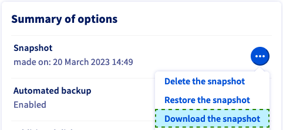
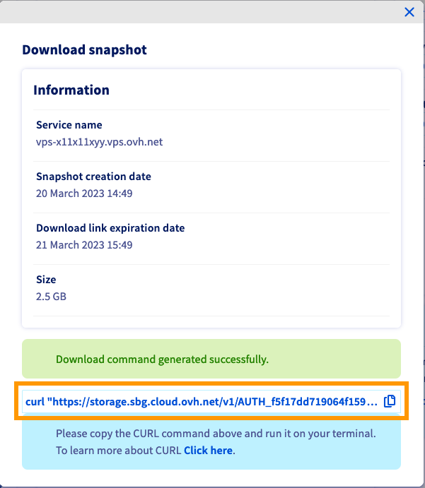

> [!primary]
> Esta traducción ha sido generada de forma automática por nuestro partner SYSTRAN. En algunos casos puede contener términos imprecisos, como en las etiquetas de los botones o los detalles técnicos. En caso de duda, le recomendamos que consulte la versión inglesa o francesa de la guía. Si quiere ayudarnos a mejorar esta traducción, por favor, utilice el botón «Contribuir» de esta página.
>


## Objetivo

Crear una instantánea (<i>snapshot</i>) es una forma simple y rápida de proteger un sistema en funciones antes de realizar cambios (p. ej., probar una nueva configuración o <i>software</i>) que puedan tener consecuencias indeseadas o imprevistas. Sin embargo, no constituye una estrategia completa de copia de seguridad del sistema.

**En esta guía, se explica cómo usar las instantáneas en su servidor virtual privado (VPS) de OVHcloud.**

> [!primary]
>
Antes de aplicar las opciones de copia de seguridad, le recomendamos que consulte las [preguntas frecuentes y demás páginas del producto](https://www.ovhcloud.com/es/vps/options/) para acceder a una comparativa de los precios y otras informaciones.
>

## Requisitos

- Tener acceso al [panel de control de OVHcloud](https://ca.ovh.com/auth/?action=gotomanager&from=https://www.ovh.com/world/&ovhSubsidiary=ws).
- Tener un [servicio de servidor virtual privado (VPS)](https://www.ovhcloud.com/es/vps/) de OVHcloud configurado.


## Procedimiento

Conéctese al [Panel de configuración de OVHcloud](https://ca.ovh.com/auth/?action=gotomanager&from=https://www.ovh.com/world/&ovhSubsidiary=ws), acceda a la sección `Bare Metal Cloud`{.action} y seleccione el servidor en la sección `Servidores Privados Virtuales`{.action}.

### Paso 1: Suscribirse a la opción «Instantáneas»

Acceda a la pestaña `«Inicio»`{.action} y desplácese hacia abajo hasta el cuadro «Resumen de opciones». Haga clic en `...`{.action} junto a la opción «Instantáneas» y, seguidamente, en `Contratar`{.action} (en el menú contextual).

{.thumbnail}

En el siguiente paso, preste atención a la información sobre los precios y, a continuación, haga clic en `Contratar`{.action}. Se le guiará por el proceso de contratación y recibirá un mensaje de correo electrónico de confirmación.

### Paso 2: Tomar una instantánea

Una vez activada la opción, haga clic en `...`{.action} junto a la opción «Instantáneas» y, seguidamente, en «Tomar una instantánea» (en el menú contextual). El tiempo de creación del snapshot depende del espacio de almacenamiento utilizado. Después, aparecerá la fecha y hora de su creación en el cuadro «Resumen de opciones».

### Paso 3: Eliminar o restaurar una instantánea

Puesto que las instantáneas solo se pueden activar de una en una, se debe eliminar la instantánea existente antes de crear una nueva. En el menú contextual, seleccione `Eliminar la instantánea`{.action}.

{.thumbnail}

Si está seguro de que desea restablecer su servidor virtual privado (VPS) al estado de la instantánea, haga clic en `Restaurar la instantánea`{.action} y confirme la acción de restauración en la ventana emergente.

> [!alert]
> 
> Tenga en cuenta que, al restaurar un VPS a partir de un snapshot, el snapshot se eliminará. Si desea conservar la misma instantánea, debe tomar una nueva antes de realizar cambios en el sistema restaurado.
>

### Descargar un snapshot

El snapshot actual puede recuperarse mediante un enlace de descarga. Haga clic en el botón `...`{.action} situado junto a la opción `Snapshot` y seleccione `Descargar el snapshot`{.action} en el menú contextual.

{.thumbnail}

> [!primary]
>
> Si su VPS proviene de una antigua gama, es posible que reciba un mensaje de error, ya que la opción no está disponible en los antiguos VPS. Su VPS procede de una antigua gama si su modelo de denominación es similar a: *vpsXXXX.ovh.net* (donde *X* representa un número). Puede consultar esta referencia del servidor en la pestaña `Inicio`{.action} del [área de cliente de OVHcloud](https://ca.ovh.com/auth/?action=gotomanager&from=https://www.ovh.com/world/&ovhSubsidiary=ws).
>

En la nueva ventana, haga clic en `Generar el enlace de descarga`{.action}.

{.thumbnail}

Al cabo de unos segundos, se mostrará un mensaje de éxito. Abajo, puede copiar el comando completo de descarga en un clic.

{.thumbnail}

También se mostrarán el tamaño del snapshot y la fecha de expiración del enlace.

Tenga en cuenta que el enlace de descarga expirará después de **24 horas**.

La orden de descarga utiliza un `curl` en el siguiente formato:

```bash
curl "https://storage.sbg.cloud.ovh.net/v1/AUTH_f5fgh4674dd706f15f6ffgf4z667d3f4g5f05/glance/5ceg3f93-8b49-436b-aefe-4185f9fc3f78?
temp_url_sig=f508cacda60256d5f211ddddf3f81130e935f0e4&temp_url_expires=1678247579" --output vps-x11x11xyy.vps.ovh.net --fail
```

Este comando debe funcionar desde cualquier terminal de línea de comandos. No obstante, cuando utilice Windows *PowerShell*, deberá ajustar el comando de la siguiente forma:

```powershell
curl -Uri "https://storage.sbg.cloud.ovh.net/v1/AUTH_f5fgh4674dd706f15f6ffgf4z667d3f4g5f05/glance/5ceg3f93-8b49-436b-aefe-4185f9fc3f78?
temp_url_sig=f508cacda60256d5f211ddddf3f81130e935f0e4&temp_url_expires=1678247579" -OutFile vps-x11x11xyy.vps.ovh.net
```

{.thumbnail}

> [!primary]
>
> No obstante, para no consumir demasiado espacio de almacenamiento, le recomendamos que no descargue los snapshots directamente en el VPS.
>

### Buenas prácticas para la creación de un snapshot

#### Configuración del software QEMU en un VPS

Los snapshots son imágenes instantáneas de su sistema en ejecución (« live snapshots »). Para garantizar la disponibilidad de su sistema durante la creación del snapshot, el software QEMO permite preparar el sistema de archivos para este proceso.

El *qemu-guest-agent* necesario no está instalado por defecto en la mayoría de distribuciones. Además, las restricciones de licencia pueden impedir que OVHcloud lo incluya en las imágenes de los SO disponibles. Por lo tanto, le recomendamos que compruebe si este agente está activado en su VPS y, en caso negativo, que lo instale. Para ello, conéctese a su VPS por SSH y siga las instrucciones que se indican en función de su sistema operativo.

##### **Distribuciones Debian (Debian, Ubuntu)**

Utilice el siguiente comando para comprobar si el sistema está configurado correctamente para los snapshots:

```
$ file /dev/virtio-ports/org.qemu.guest_agent.0
/dev/virtio-ports/org.qemu.guest_agent.0: symbolic link to ../vport2p1
```

Si el resultado es diferente (« No such file or directory »), instale la última versión del paquete:

```
$ sudo apt-get update
$ sudo apt-get install qemu-guest-agent
```

Reiniciar el VPS :

```
$ sudo reboot
```

Verifique el servicio para garantizar que está en ejecución:

```
$ sudo service qemu-guest-agent start
```

##### **Distribuciones Red Hat (CentOS, Fedora)**

Utilice el siguiente comando para comprobar si el sistema está configurado correctamente para los snapshots:

```
$ file /dev/virtio-ports/org.qemu.guest_agent.0
/dev/virtio-ports/org.qemu.guest_agent.0: symbolic link to ../vport2p1
```

Si el resultado es diferente (« No such file or directory »), instale y active el software:

```
$ sudo yum install qemu-guest-agent
$ sudo chkconfig qemu-guest-agent on
```

Reiniciar el VPS :

```
$ sudo reboot
```

Verifique el software y compruebe que está en ejecución:

```
$ sudo service qemu-guest-agent status
```

##### **Windows**

Puede instalar el software mediante un archivo MSI disponible en el sitio web del proyecto Fedora: <https://fedorapeople.org/groups/virt/virtio-win/direct-downloads/latest-qemu-ga/>

Compruebe que el servicio está en ejecución con el siguiente comando *PowerShell*:

```powershell
PS C:\Users\Administrator> Get-Service QEMU-GA

Status   Name               DisplayName
------   ----               -----------
Running  QEMU-GA            QEMU Guest Agent
```

## Más información

[Usar copias de seguridad automatizadas en un servidor virtual privado (VPS)](../usar-copias-de-seguridad-automatizadas-en-un-vps/)


Interactúe con nuestra comunidad de usuarios en <https://community.ovh.com/en/>.
