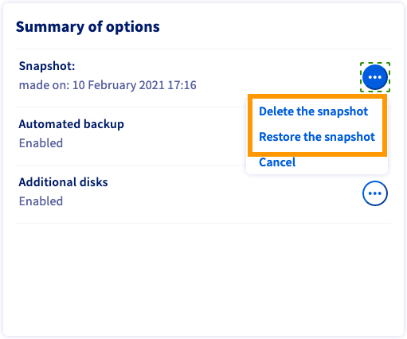

> [!primary]
> Tłumaczenie zostało wygenerowane automatycznie przez system naszego partnera SYSTRAN. W niektórych przypadkach mogą wystąpić nieprecyzyjne sformułowania, na przykład w tłumaczeniu nazw przycisków lub szczegółów technicznych. W przypadku jakichkolwiek wątpliwości zalecamy zapoznanie się z angielską/francuską wersją przewodnika. Jeśli chcesz przyczynić się do ulepszenia tłumaczenia, kliknij przycisk “Zaproponuj zmianę” na tej stronie.
>

**Ostatnia aktualizacja: 10-09-2021**


## Wprowadzenie

Utworzenie migawki jest szybkim i prostym sposobem na zabezpieczenie działania systemu przed wprowadzeniem zmian, które mogą mieć niepożądane lub nieprzewidziane konsekwencje, na przykład podczas testowania nowej konfiguracji albo oprogramowania. Nie stanowi to jednak pełnej strategii tworzenia kopii zapasowych systemu.

**Dowiedz się, jak korzystać z migawek na prywatnym serwerze wirtualnym (VPS) OVHcloud.**

> [!primary]
>
Przed zastosowaniem opcji tworzenia kopii zapasowych zalecamy przejrzenie [stron produktów oraz często zadawanych pytań (FAQ)](https://www.ovhcloud.com/pl/vps/options/) w celu porównania cen i uzyskania szczegółowych informacji.
>

## Wymagania początkowe

- dostęp do [Panelu klienta OVHcloud](https://www.ovh.com/auth/?action=gotomanager&from=https://www.ovh.pl/&ovhSubsidiary=pl)
- skonfigurowana [usługa VPS](https://www.ovhcloud.com/pl/vps/) OVHcloud


## W praktyce

Zaloguj się do [Panelu klienta OVHcloud](https://www.ovh.com/auth/?action=gotomanager&from=https://www.ovh.pl/&ovhSubsidiary=pl), przejdź do sekcji “Serwer” i wybierz serwer na lewym pasku bocznym pod pozycją `VPS`{.action}.

### Krok 1: subskrybowanie opcji kopii zapasowej

Na karcie `Strona główna`{.action} przewiń do obszaru z nagłówkiem “Podsumowanie opcji”. Kliknij ikonę `...`{.action} obok opcji “Migawka” i wybierz z menu kontekstowego pozycję `Zamówienie`{.action}.

{.thumbnail}

W następnym kroku przeczytaj informację o cenie i kliknij pozycję `Zamów`{.action}. Po przejściu kolejnych kroków procesu zamówienia otrzymasz e-mail z potwierdzeniem.

### Krok 2: tworzenie migawki

Po włączeniu opcji kliknij ikonę `...`{.action} obok opcji “Migawka” i wybierz z menu kontekstowego pozycję `Utwórz migawkę`{.action}. Utworzenie migawki może zająć kilka minut. Po utworzeniu migawki w obszarze “Podsumowanie opcji” pojawi się jej znacznik czasu.

### Krok 3: usuwanie / przywracanie migawki

Ponieważ jednocześnie może być aktywna tylko jedna migawka, przed utworzeniem nowej migawki trzeba usunąć istniejącą. W tym celu po prostu wybierz z menu kontekstowego pozycję `Usuń migawkę`{.action}.

{.thumbnail}

Jeśli na pewno chcesz zresetować status prywatnego serwera wirtualnego do stanu z migawki, kliknij pozycję `Przywróć migawkę`{.action} i potwierdź zadanie przywracania w wyświetlonym oknie.

> [!alert]
>
> Pamiętaj, że przywrócenie systemu ze snapshota spowoduje usunięcie samego shapshota. Jeśli chcesz zachować tę samą migawkę, musisz wykonać nową przed wprowadzeniem zmian w przywróconym systemie.
>

### Dobre praktyki dotyczące tworzenia migawek

#### Konfiguracja agenta QEMU na serwerze VPS

Migawki to kopie systemu tworzone w ściśle określonym momencie (“live snapshots”). Aby zapewnić dostępność systemu podczas tworzenia migawki, wykorzystywany jest agent QEMU, który pozwala przygotować system plików do tego procesu.

W większości dystrybucji wymagany *qemu-guest-agent* nie jest zainstalowany domyślnie. Ponadto, wymogi licencyjne mogą uniemożliwić OVHcloud włączenie go do dostępnych obrazów systemu operacyjnego. Dlatego zalecamy zainstalowanie agenta, jeśli nie jest on aktywowany na Twoim prywatnym serwerze wirtualnym. W tym celu połącz się z VPS przez SSH i postępuj zgodnie z poleceniami dotyczącymi Twojego systemu operacyjnego.

##### **Distributions Debian (Debian, Ubuntu)**

Wprowadź poniższą komendę, aby sprawdzić, czy system został poprawnie skonfigurowany pod kątem tworzenie migawek:

```
$ file /dev/virtio-ports/org.qemu.guest_agent.0
/dev/virtio-ports/org.qemu.guest_agent.0: symbolic link to ../vport2p1
```

Jeśli wynik jest inny (“No such file or directory”), zainstaluj najnowszy pakiet:

```
$ sudo apt-get update
$ sudo apt-get install qemu-guest-agent
```

Uruchom usługę, aby upewnić się, że działa:

```
$ sudo service qemu-guest-agent start
```

##### **Distributions Redhat (CentOS, Fedora)**

Wprowadź poniższą komendę, aby sprawdzić, czy system został poprawnie skonfigurowany pod kątem tworzenie migawek:

```
$ file /dev/virtio-ports/org.qemu.guest_agent.0
/dev/virtio-ports/org.qemu.guest_agent.0: symbolic link to ../vport2p1
```

Jeśli wynik jest inny (“No such file or directory”), zainstaluj i aktywuj agenta:

```
$ sudo yum install qemu-guest-agent
$ sudo chkconfig qemu-guest-agent on
```

Uruchom agenta i sprawdź, czy działa:

```
$ sudo service qemu-guest-agent start
$ sudo service qemu-guest-agent status
```

##### **Windows**

Możesz zainstalować agenta, korzystając z pliku MSI, dostępnego na stronie projektu Fedora <https://fedorapeople.org/groups/virt/virtio-win/direct-downloads/latest-qemu-ga/>

Sprawdź, czy usługa działa za pomocą poniższej komendy powershell:

```
PS C:\Users\Administrator> Get-Service QEMU-GA

Status   Name               DisplayName
------   ----               -----------
Running  QEMU-GA            QEMU Guest Agent
```


## Sprawdź również

[Korzystanie z automatycznych kopii zapasowych na prywatnym serwerze wirtualnym](../uzywanie-automatyczne-kopie-zapasowe-vps/)


Dołącz do naszej społeczności użytkowników: <https://community.ovh.com/en/>.
