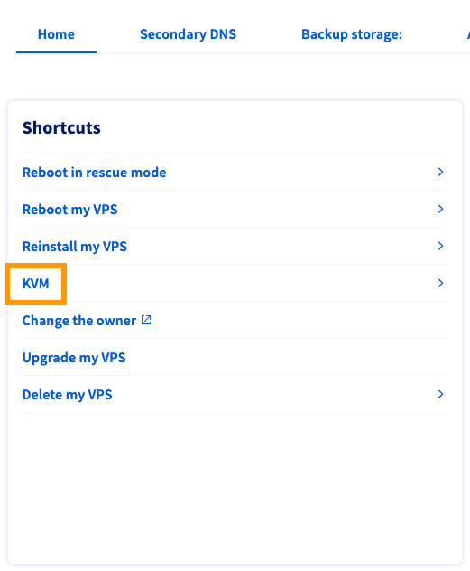
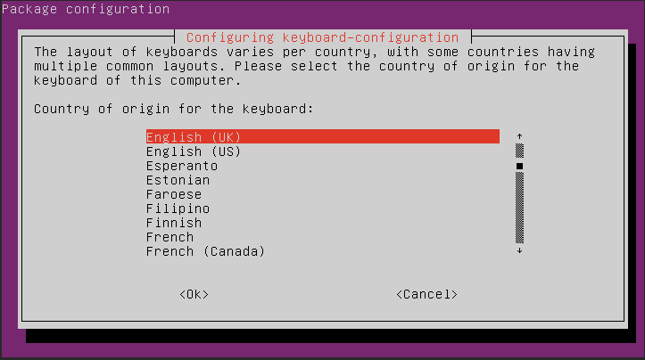

> [!primary]
> Questa traduzione è stata generata automaticamente dal nostro partner SYSTRAN. I contenuti potrebbero presentare imprecisioni, ad esempio la nomenclatura dei pulsanti o alcuni dettagli tecnici. In caso di dubbi consigliamo di fare riferimento alla versione inglese o francese della guida. Per aiutarci a migliorare questa traduzione, utilizza il pulsante "Modifica" di questa pagina.
>

**Ultimo aggiornamento: 30/08/2022**

## Obiettivo

La console KVM consente di stabilire una connessione diretta al tuo VPS senza utilizzare client esterni come Terminal o Putty. Questa console è disponibile nello Spazio Cliente OVHcloud o tramite le API OVHcloud.  

**Questa guida ti mostra i due metodi di accesso al KVM.**

## Prerequisiti

- Un [VPS](https://www.ovhcloud.com/it/vps/) nel tuo account OVHcloud
- Avere accesso allo [Spazio Cliente OVHcloud](https://www.ovh.com/auth/?action=gotomanager&from=https://www.ovh.it/&ovhSubsidiary=it)

## Procedura

### Accedi al KVM dallo Spazio Cliente OVHcloud

#### Gamma VPS attuale

Accedi allo [Spazio Cliente OVHcloud](https://www.ovh.com/auth/?action=gotomanager&from=https://www.ovh.it/&ovhSubsidiary=it), clicca su `Bare Metal Cloud`{.action} e seleziona il tuo server nella sezione `Server Privati Virtuali`{.action}. In questa sezione, clicca sui tre puntini `...`{.action} in corrispondenza del nome del tuo VPS nella sezione "Il tuo VPS".

{.thumbnail}

#### VPS precedente

Accedi allo [Spazio Cliente OVHcloud](https://www.ovh.com/auth/?action=gotomanager&from=https://www.ovh.it/&ovhSubsidiary=it), clicca su `Bare Metal Cloud`{.action} e seleziona il tuo server nella sezione `Server Privati Virtuali`{.action}. In questa sezione, clicca sul link di accesso intitolato `KVM`{.action}.

{.thumbnail}

### Utilizzo della console KVM

Si apre lo schermo KVM. È una finestra minuscola che indica la connessione al tuo server. Dato che la finestra è abbastanza piccola, può essere molto difficile navigare nell'interfaccia del tuo server con l'aiuto delle barre di sfregamento. Di conseguenza, ti consigliamo di aprire il KVM in una nuova finestra a schermo intero con il pulsante "Apri in una nuova finestra" situato nell'angolo inferiore destro della finestra contestuale.

> [!primary]
>
> Se si verificano problemi di doppia immissione, questo può essere dovuto a una registrazione automatica dello schermo. Cliccando su "Apri in una nuova finestra", ti consigliamo di aprire il KVM in una nuova finestra.
>
> Se riscontri problemi con lo schermo, ti consigliamo di eliminare dall'URL la parte "Automatica". Se l'URL è https://compute.sbg1.cloud.ovh.net:6080/vnc_auto.html?token=xxxxxxxxxxxx, deve diventare https://compute.sbg1.cloud.ovh.net:6080/vnc.html?token=xxxxxxxxxxxx (il link per voi può essere diverso, l'esempio dato illustra solo la parte dell'URL da eliminare)
>

{.thumbnail}

> [!primary]
>
> La tastiera può avere una disposizione diversa dalla sua. Assicurati di verificarlo, ad esempio, perché la tastiera può essere AZERTY invece di QWERTY.
>

#### Modifica della disposizione della tastiera

Puoi attivare la configurazione di tastiera che preferisci per rendere più pratico l'utilizzo della console. Digita questo comando:

```bash
sudo dpkg-reconfigure keyboard-configuration
```

Si apre un menu grafico che ti permette di selezionare un modello di tastiera.

{.thumbnail}

Utilizza i tasti frecciati per accedere all'opzione più vicina al tuo hardware e clicca su "Enter". 

Nel menu successivo seleziona il tuo paese.

{.thumbnail}

Il terzo menu ti permette di specificare la disposizione effettiva della tastiera.

{.thumbnail}

In base alla tua scelta, dopo il terzo menu potrebbero apparire altre opzioni.

Torna alla linea di comando, inserisci questo comando per applicare le modifiche:

```bash
sudo systemctl restart keyboard-setup
```

### Connettiti al KVM via API

Potrebbe verificarsi un problema di connessione al KVM tramite il tuo pannello di configurazione OVHcloud, in particolare con le versioni precedenti. In questo caso, è possibile utilizzare la soluzione API. Per farlo, accedi via API [OVHcloud](https://api.ovh.com/).

#### Sui VPS 2014

Se hai un VPS 2014, puoi riscontrare un *errore 1006*. Controllare l'API tramite la chiamata qui sotto potrebbe risolvere questo problema.

> [!faq]
>
> API:
>
>> > [!api]
>> >
>> > @api {POST} /vps/{serviceName}/openConsoleAccess
>> >
>>
>
> Impostazioni di chiamata API:
>
>> > **serviceName**
>> >
>> >> ID del VPS che assomiglia a vpsxxxxx.ovh.net
>> >
>> > **protocol** 
>> >
>> >> VNC
>

L’operazione di connessione potrebbe richiedere uno o due minuti, il tempo necessario affinché la porta sia effettivamente aperta.

Ti consigliamo di utilizzare uno dei seguenti clienti:

- [UltraVnc](https://www.uvnc.com/downloads/ultravnc.html){.external}
- [VNC Viewer](https://www.realvnc.com/en/connect/download/viewer/){.external}

Utilizza i dettagli forniti dalla chiamata API per connetterti da remoto al VPS con l'aiuto di uno dei client software di cui sopra.

#### Sui VPS 2016

Con i VPS 2016, l'API consigliata per accedere al KVM è la seguente:

> [!faq]
>
> API:
>
>> > [!api]
>> >
>> > @api {POST} /vps/{serviceName}/getConsoleUrl
>> >
>>
>
> Impostazioni di chiamata API:
>
>> > **serviceName**
>> >
>> >> ID del VPS che assomiglia a vpsxxxxx.ovh.net
>

> [!primary]
>
> Se hai sempre problemi con lo schermo, ti consigliamo di eliminare dall'URL la parte "Automatica". Se l'URL è (il link per voi può essere diverso, questo esempio illustra solo la parte dell'URL da eliminare) https://compute.sbg1.cloud.ovh.net:6080/vnc_auto.html?token=xxxxxxxxxxxx allora deve diventare https://compute.sbg1.cloud.ovh.net:6080/vnc.html?token=xxxxxxxxxxxx
>

## Per saperne di più

Contatta la nostra Community di utenti all’indirizzo <https://community.ovh.com/en/>.
