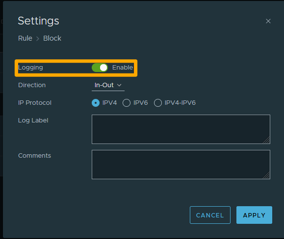

## Objectif

**NSX est un réseau à définition logicielle ou "Software-Define Networking" (SDN) en anglais développée par Vmware.
OVHcloud propose ce service à la place de NSX-V dans sa solution Vmware sur OVHcloud.
Cette documentation permet d'obtenir les logs des noeuds NSX grâce à l'API reliée**
  
## Prérequis

Pour que la version actuelle de NSX fonctionne, deux hôtes sont déployés avec une machine virtuelle dédiée pour NSX sur chaque hôte, ce qui permet la redondance en cas de défaillance de l'un des hôtes. 

De plus il est nécessaire :

- Avoir déployé les hôtes NSX.
- Avoir un utilisateur ayant les droits d'accès au NSX.
- Vérifier que le noeud soit activé.

> [!primary]
>
> A l'heure actuelle (18 Sep 2023) il n'est pas possible d'exporter les logs d'un NSX-T par le biais d'un syslog serveur dû à l'implémentation d'OVHcloud. Pour y remédier il est possible des récupérer quelques logs via des appels API.
>


### Activation des logs
  
En premier lieu, avant de pouvoir récupérer les logs, il est nécessaire d'activer l'option "logging" la règle correspondant. 

Attention, par défaut les logs ne sont pas activés sur les règles !

Nous prenons l'exemple d'une règle bloquant tout les adresses IP entre 192.168.211.0/24 to 8.8.8.8/32.

Pour arriver sur le panneau de configuration, veuillez cliquer sur le bouton de paramètre se situant sur la droite de la règle correspondante. (roue crantée)

{.thumbnail}

Nous arrivons ainsi aux configurations de notre règle. Il suffit d'activer l'option `logging`{.action}. (celui-ci doit être en vert)

{.thumbnail}


N'oubliez pas d'appliquer les nouvelles configurations et de publier celle-ci.


### Récuperation des logs


- Pour pouvoir obtenir l'accès aux logs, nous devons identifier l'ID du NSX Edge. Pour cela, nous faisons un premier appel API.

```bash
 curl -k -u user@pcc-123-123-123-123.ovh.com:<password> https://nsxt.pcc-123-123-123-123.ovh.com/api/v1/transport-nodes/
```

- Notre appel API peut nous retourner les deux ID de nos deux noeuds Edges :

``` bash
"resource_type" : "EdgeNode",

      "external_id" : "8a8e0033-9eee-4d13-a5e2-7cd2dbdebc6c",


 "resource_type" : "EdgeNode",

      "external_id" : "b35873da-ca7f-48ff-961e-5d6fa8bc5bf7"
```


- Une fois l'id de notre noeud Edge obtenu nous faisons notre appel API pour obtenir les logs de notre règle.

``` bash
curl -k -u user@pcc-123-123-123-123.ovh.com:<password> https://nsxt.pcc-123-123-123-123.ovh.com/api/v1/transport-nodes/8a8e0033-9eee-4d13-a5e2-7cd2dbdebc6c/node/logs/firewallpkt.log/data
```


- Nous pouvons ainsi observer en retour de notre appel les logs associés à notre règle.

``` bash
2023-09-15T13:15:05.548Z edge321-3995b.sbg1a.pcc.ovh.net NSX 5188 FIREWALL [nsx@6876 comp="nsx-edge" subcomp="datapathd" s2comp="firewallpkt" level="INFO"] <30 d612293055f3431f:8b01687591afe36e> INET reason-match DROP 2312 OUT 84 PROTO 1 192.168.211.169->8.8.8.8
```


## Aller plus loin
  
Échangez avec notre communauté d'utilisateurs sur <https://community.ovh.com>.