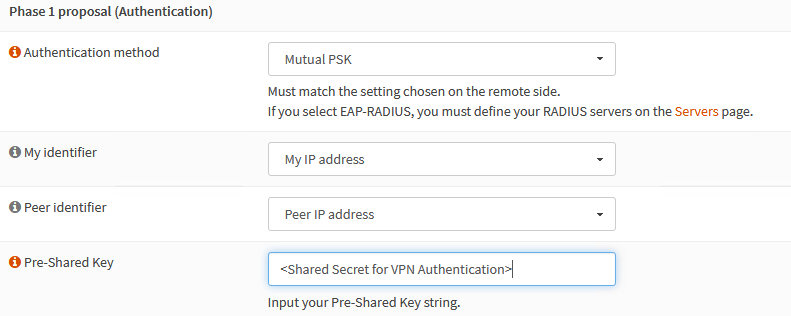
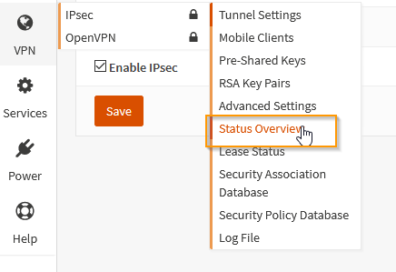
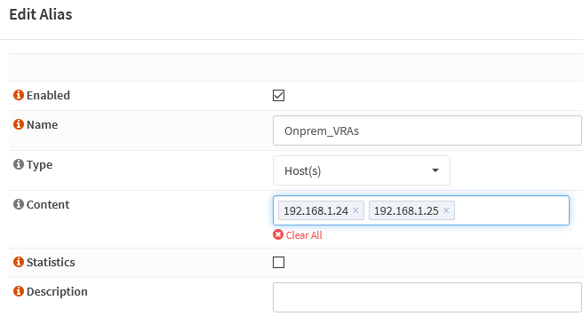

## Objective

This guide provides an outline of how to configure a virtual private network between an OVHcloud Hosted Private Cloud and a different platform.
We will use the OPNsense open-source VPN Solution as an example, and explain the simplest way to set up a VPN tunnel to the Zerto network. 

Check out [Zerto between two OVHcloud datacenters](/pages/hosted_private_cloud/hosted_private_cloud_powered_by_vmware/zerto_virtual_replication_as_a_service) for the other scenario.

**Find out how to get started with a VPN for OVHcloud Zerto DRP.**

## Requirements

- One public IP, available on the target Hosted Private Cloud for the VPN endpoint
- A Zerto platform installed on the on-premises platform
- VRAs (Virtual Replication Appliances) on both sides that are able to connect to the counterpart on TCP ports 4007 and 4008
- Zerto administration consoles or ZVMs (Zerto Virtual Managers) that are able to connect to the counterpart on TCP port 9081

> [!primary]
>
> For an operational Zerto installation:
>
> - [Download Zerto](https://www.zerto.com/myzerto/login/?redirect_to=%2Fmyzerto%2Fsupport%2Fdownloads%2F). You need to have an account.
> - [Read the Zerto installation documentation](https://help.zerto.com/bundle/Install.VC.HTML/page/Installing_the_Zerto_Solution.htm).
>

> [!warning]
>
> OVHcloud supports the N-1 version of Zerto (currently up to and including version 9.7).
> You can find the different versions available here : <https://help.zerto.com/kb/000004585>.
>

### Solution overview

{.thumbnail}

**Listed parameters**:

On-premises side:

- VPN endpoint public IP address (1)
- VPN endpoint internal IP address (2)
- ZVM internal IP address (3)
- ZVM internal network (4)

OVHcloud side:

- VPN endpoint public IP address (5)
- ZVM internal network (6)
- ZVM internal IP address (7)

## Instructions

> [!primary]
>
>You need to decide which network to deploy the OVHcloud ZVM in. This avoids any overlap with local networks, which would prevent routing.
>
>You can either accept the suggested network or provide your own, as long as it is within a valid /23 range.
>

### Step 1: Activate Zerto features.

It is easy to activate Zerto features from the OVHcloud Control Panel. You just need to select the data centre linked to the Hosted Private Cloud solution that you want to use, from the `Disaster Recovery Plan`{.action} tab.

{.thumbnail}

First select `Between your infrastructure and an OVHcloud Private Cloud`{.action}, then click `Activate Zerto DRP`{.action}. Next, select a free public IP from the dropdown menu and enter the desired network range for the ZVM deployment. Confirm the VRA Network range and then click `Install`{.action}.

{.thumbnail}

{.thumbnail}

{.thumbnail}

{.thumbnail}

### Step 2: Activate IPSec service.

From the OPNsense interface, go to the `VPN`{.action} menu on the left, `IPSec`{.action} section and select `Tunnel Setting`{.action}. Click `Enable IPsec`{.action} and click save. 

{.thumbnail}

{.thumbnail}

### Step 3: Set up IPSec tunnel.

You can configure the IPSec tunnel by defining two sets of parameters: **Phase 1** and **Phase 2**.

##### 3.1 Set up Phase 1.

In the `VPN`{.action} menu, go to `Tunnel settings`{.action}, and click on the `+`{.action} to add a new **Phase 1**:

{.thumbnail}

##### 3.1.1 Phase 1: General information.

> {.thumbnail}

If the default values are correct:

- Connection Method: Default
- Key Exchange version: V2
- Internet Protocol: IPv4
- Interface: WAN

The only required parameter is the OVHcloud IPSec endpoint IP address.

##### 3.1.2 Phase 1: Authentification.

Once the default values are valid, you only need to provide the shared secret for authentication.

{.thumbnail}

##### 3.1.3 Phase 1: Encryption algorithms.

{.thumbnail}

Supported values for each parameters:

- Encryption algorithms: AES 256 bits
- Hash algorithms: SHA256
- Diffie-Hellman key group: 14 (2048 bits)
- Lifetime: 28,800 seconds

You can keep the default values for the other parameters. Click `Save`{.action}, then `Apply changes`{.action}.

The new Phase 1 is now present in the interface:

{.thumbnail}

#### 3.2 Set up Phase 2.

Click on `Show Phase 2 entries`{.action}.

{.thumbnail}

There is no phase 2 available, so you will need to add one:

{.thumbnail}

Click on `+`{.action}.

{.thumbnail}

##### 3.2.1 Phase 2: General information

Check that the mode is set to  "Tunnel IPv4".

{.thumbnail}

##### 3.2.2 Phase 2: Local Network

The local network type must be set to  "Lan subnet".

{.thumbnail}

##### 3.2.3 Phase 2: Remote Network

You need to give the ZVM IP and the associated network range.

On OVHcloud side, the ZVM network is always a /23 network (512 IPs).

> [!warning]
>
>Make sure to double-check the parameters, otherwise the VPN tunnel won't come up.
>

{.thumbnail}

##### 3.2.4 Phase 2: Key exchange

Supported values are:

- Protocole: ESP
- Encryption algorithm: AES 256 bits
- Hash algorithms: SHA256
- PFS: Off

{.thumbnail}

You can leave advanced parameters to their default value. Click `Save`{.action}, then `Apply changes`{.action}.

#### 3.3. Check VPN status.

{.thumbnail}

Click the orange triangle on the right to initialise the connection:

{.thumbnail}

If all the parameters are correct, the tunnel will come up and two new icons will appear:

* tear down tunnel
* tunnel information

{.thumbnail}

Click on the information icon.

{.thumbnail}

The tunnel is now up. Make sure to add, if required, a route to the OVHcloud ZVM network on your local ZVM.

**Troubleshooting**

If the tunnel is not coming up, make sure that the parameters values are identical on both sides:

- Shared secret
- Remote endpoint IP address
- Remote network range

Make sure that a firewall is not interfering in the dialog between the local and remote endpoints.

You can check the IPSec logfile in /var/log/ipsec.log on the OPNsense appliance to get more information.

### Step 4: Set up firewall.

To allow pairings of on-premises and OVHcloud instances, traffic must be authorised on the following ports:

* TCP 9081 between ZVMs
* TCP 4007/4008 between vRAs

#### 4.1 ZVM opening.

Go to the `Firewall`{.action} menu, `Rules`{.action}  section, `IPSec`{.action} interface:

{.thumbnail}

Click on `Add`{.action} to create a new rule.

{.thumbnail}

{.thumbnail}

Rule parameters are as follow:

- Action: "Pass" (authorise traffic)
- Interface: "IPsec" (incoming traffic coming from the VPN tunnel)
- Protocol: "TCP"

For "Source" and "Destination", select "Single host or Network" type. The source is the OVHcloud ZVM, and the destination is your on-premises ZVM.

{.thumbnail}

Destination TCP port is 9081. Click `Save`{.action} and `Apply Change`{.action}.

#### 4.2 vRAs opening.

vRAs opening is a bit more complex since there are multiple vRAs on each side that need to be able to exchange information on TCP ports 4007 and 4008.
To simplify this setup, we are going to use the alias feature of OPNsense. An alias is a group of objects IPs, networks, URLs…) that can be used in firewall rules.

We will define three aliases:

* one for vRA IPs on the customer side
* one for vRA IPs on the OVHCloud side
* one for the ports

You can get the OVHcloud vRAs IP from the destination Private Cloud vCenter interface.  

{.thumbnail}

Let's create the OVH_VRA alias for OVHCLoud vRAs:

{.thumbnail}

Similarly, we can create an alias for the on-premises vRAs:

{.thumbnail}

Finally, you need to create the ports alias:

{.thumbnail}

We have now all the elements we need to implement the required firewall rules to authorise data coming from the OVHcloud platform. It is the same procedure as before, we just need to use the aliases instead of explicit IPs or ports:

{.thumbnail}

At this point, we have a functional and secure link between our on-premises platform and cloud instance.

{.thumbnail}

### Step 5: ZVM Pairing

Log in to your on-premises ZVM. The following screen is displayed:

{.thumbnail}

Select `Pair to a site with a licence`{.action}, enter the OVHcloud ZVM IP and press `Start`{.action}.

In the dashboard, you can see the pairing is ongoing:

{.thumbnail}

You will be notified when the pairing is successfull:

{.thumbnail}

You can check that your OVHcloud PCC is visible in the `Sites`{.action} tab.

{.thumbnail}

At this point, your Zerto setup is functional and you can start to create your virtual protection groups (VPGs).

#### Troubleshooting

If the on-premises ZVM is not able to successfully contact the OVHcloud ZVM (due to an incorrect firewall setup, for example) you will get the following message:

{.thumbnail}

You will then be brought back to the log-in screen, with the following error message:

{.thumbnail}

The most probable cause is that the OVHcloud ZVM is not authorised to contact your on-premises ZVM on TCP 9081 (it needs to be able to initiate the connection).

## Go further

Join our community of users on <https://community.ovh.com/en/>.
