## Objective

This guide will outline the steps you need to take to get started with your Nutanix on OVHcloud cluster:

- [Deploy a rebound VM](#deploy-vm)
- [Secure cluster](#secure-cluster)

> [!warning]
> OVHcloud provides services for which you are responsible, responsible and responsible for their configuration. You are therefore responsible for ensuring that it works properly.
>
> This guide is designed to help you with common tasks. Nevertheless, we recommend contacting the [OVHcloud Professional Services team](https://www.ovhcloud.com/es-es/professional-services/) or a [specialist provider](https://partner.ovhcloud.com/es-es/directory/) if you experience any difficulties or doubts when it comes to administering, using or setting up a service on a server.
>

**Find out how to get started with your Nutanix cluster.**

## Requirements

- A Nutanix cluster in your OVHcloud account
- Access to your [OVHcloud Control Panel](https://www.ovh.com/auth/?action=gotomanager&from=https://www.ovh.es/&ovhSubsidiary=es)
- You must be logged in to Prism Central on the cluster

> [!warning]
>
> Some software, such as Microsoft products, require a license. You must therefore ensure that all installed systems and software have these licenses.

## Instructions

### Deploy a rebound VM <a name="deploy-vm"></a>

The rebound VM will serve as an entry point for the operations you will need to carry out to secure your cluster.
It can also be used as a relay to reach other VMs after being put into production.

Continue reading this guide, depending on your OS: [Linux - Rebound via SSH](#ssh) or [Windows - Rebound via RDP](#rdp).

#### Rebound via SSH <a name="ssh"></a>

##### Creating and configuring the Linux VM

In this example, the network configuration is as follows:

- Network: 172.16.0.0/22
- Mask: 255.255.252.0
- Gateway: 172.16.3.254

> [!warning]
> Adapt this configuration to your cluster.
> You can find this information by using this [OVHcloud API call](https://api.ovh.com/console/#/nutanix/%7BserviceName%7D~GET).
>

Import your Linux image into the cluster. For more details, please refer to our guide on [importing images into Nutanix](/pages/hosted_private_cloud/nutanix_on_ovhcloud/05-image-import).

In the left-hand menu of **Prism Central**, expand `Compute & Storage`{.action} and click `VMs`{.action}.

{.thumbnail}

Click the `Create VM`{.action} button.

{.thumbnail}

Customize the name and features of the VM.

{.thumbnail}

Click `Next`{.action}.

You then need to attach a disk. To do this, you can select the image already present on your cluster (Alpine Linux).

{.thumbnail}

{.thumbnail}

Click `Save`{.action}.

Then click `Attach Subnet`{.action}.

Select the "infra" network and click `Save`{.action}.

{.thumbnail}

Click `Next`{.action}.

Select cloud-init, copy the "cloud-init" script, then click `Next`{.action} and finally `Create VM`{.action}.

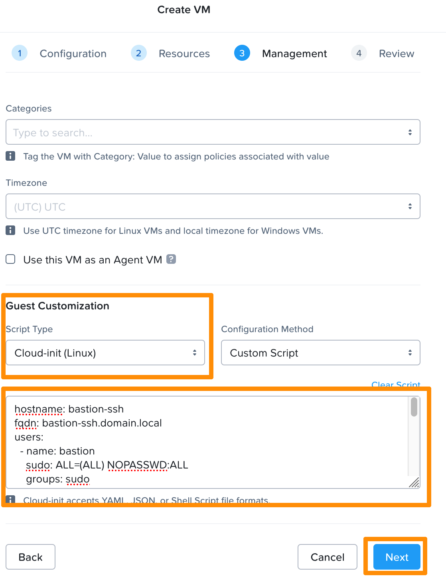{.thumbnail}

> [!warning]
> Adapt this configuration to your cluster.
> You can find this information by using this [OVHcloud API call](https://api.ovh.com/console/#/nutanix/%7BserviceName%7D~GET).
> Make sure to adapt your password and IP configuration.
>

```yaml
#cloud-config
hostname: bastion-ssh
fqdn: bastion-ssh.domain.local
users:
  - name: bastion
    sudo: ALL=(ALL) NOPASSWD:ALL
    groups: sudo
    shell: /bin/ash
    ssh_pwauth: true
    lock_passwd: false
    plain_text_passwd: OVHcloudR0cks!

growpart:
  mode: growpart
  devices: ["/dev/sda2"]
  ignore_growroot_disabled: true

write_files:
   - path: /etc/network/interfaces
     content: |
        auto lo
        iface lo inet loopback

        auto eth0
        iface eth0 inet static
        address 172.16.2.200
        netmask 255.255.255.252
        gateway 172.16.3.254

runcmd:
   - echo "nameserver 213.186.33.99" > /etc/resolv.conf
   - rc-service networking restart
   - apk update
   - apk upgrade
   - apk add sudo
   - sed -i s/'PasswordAuthentication no'/'PasswordAuthentication yes'/g /etc/ssh/sshd_config
   - sed -i s/'#KbdInteractiveAuthentication yes'/'KbdInteractiveAuthentication yes'/g /etc/ssh/sshd_config
   - rc-service sshd restart
   - lvextend -l +100%FREE /dev/vg0/lv_root
   - resize2fs /dev/vg0/lv_root
   - reboot

final_message: "The system is finally up, after $UPTIME seconds"
```

Open the console after restarting the VM. You can see that the VM has taken the settings from the cloud-init file.

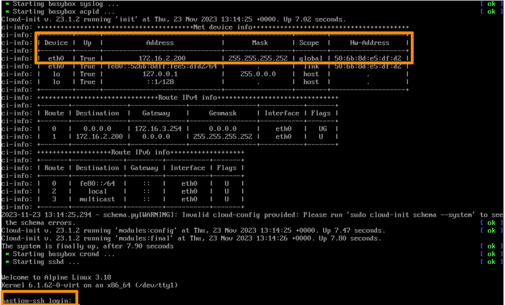{.thumbnail}

#### Load Balancer configuration

Log in to your [OVHcloud Control Panel](https://www.ovh.com/auth/?action=gotomanager&from=https://www.ovh.es/&ovhSubsidiary=es). Open the Nutanix Cluster configuration page.

In the `Cluster network` box at the bottom of the page, click on the Load Balancer.

{.thumbnail}

In the `Server clusters`{.action} tab, click `Add a server cluster`{.action}.

{.thumbnail}

Name your server farm, then select `TCP`{.action} and enter this information:

- Port: 22
- Datacenter: ALL
- Private network: nutanix

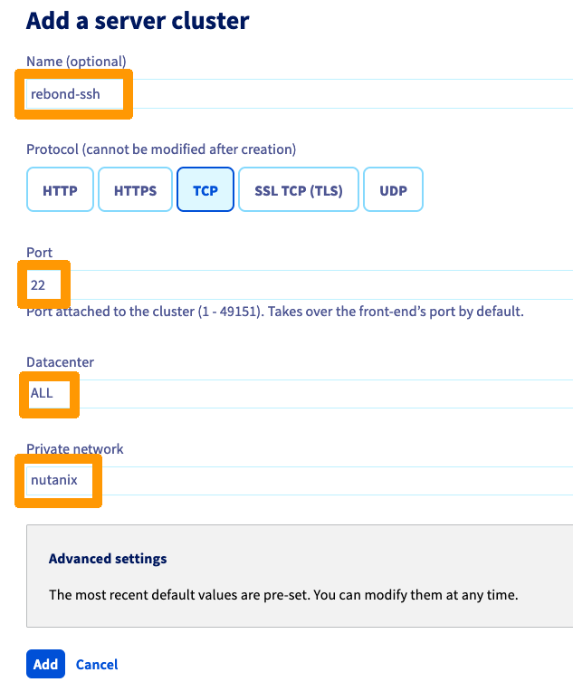{.thumbnail}

Click `Add`{.action} to confirm the creation of the server cluster.

Then click `Add a server`{.action}.

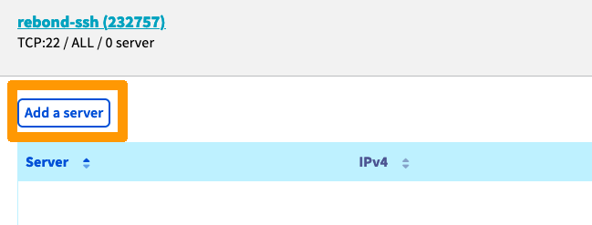{.thumbnail}

Enter these values:

- **Name (optional)**: `SSH`
- **IPv4 address**: `IP address of your Windows VM`
- **Port**: `22`

Click `Add`{.action} to confirm the server creation.

{.thumbnail}

Then click on the `Front-ends`{.action} tab, and on `Add a front-end`{.action}.

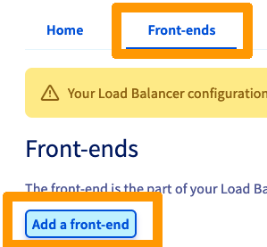{.thumbnail}

Name your front-end, choose the `TCP`{.action} protocol and modify these values:

- **Port**: `22`
- **Datacenter**: `ALL`
- **Default server cluster**: `rebound-ssh (TCP)`

Click `Add`{.action}.

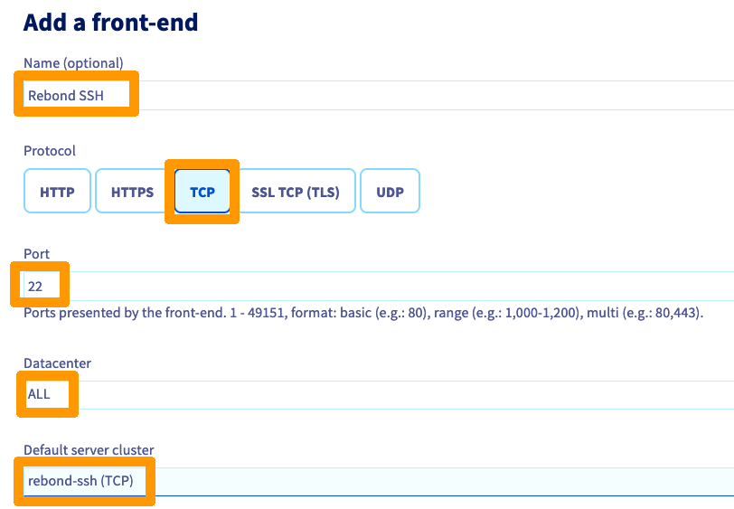{.thumbnail}

Click `Apply configuration`{.action}.

{.thumbnail}

Select the `Datacentre`{.action} and click `Apply configuration`{.action}.

{.thumbnail}

You can track the progress of the changes in the `Tasks`{.action} tab.

{.thumbnail}

The Load Balancer is now configured. Use your preferred terminal to connect to your machine.
You can enter your cluster’s DNS name or Load Balancer’s IP address:

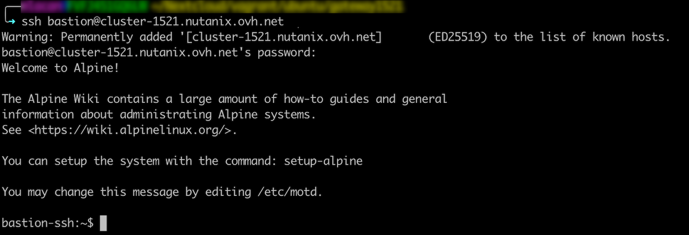{.thumbnail}

You can now rebound on the different elements of the cluster:

- CVMs
- Hosts
- Prism Element

For example, for a CVM, enter the following in the terminal:

```bash
ssh nutanix@ipcvm
```

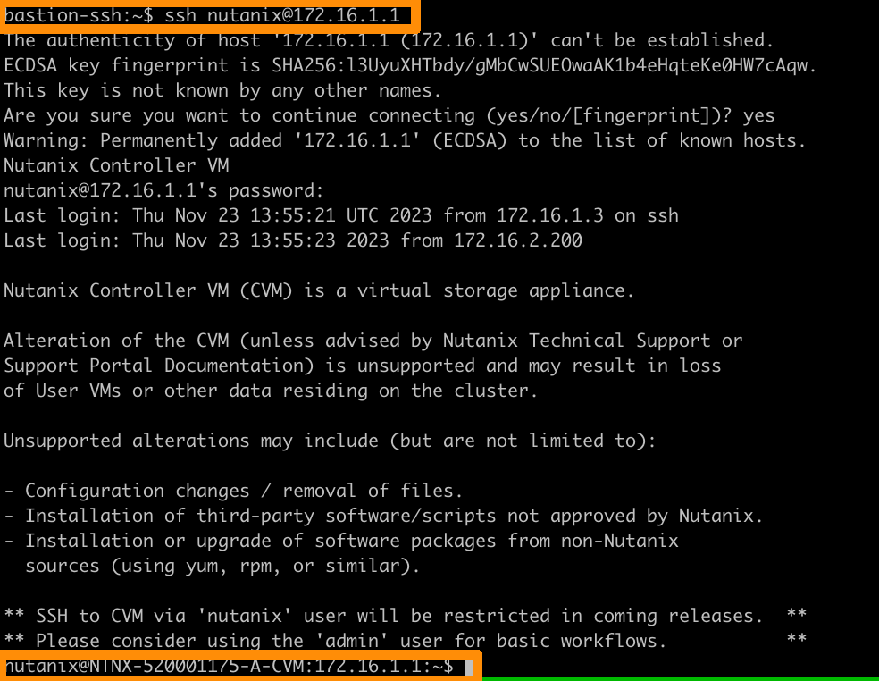{.thumbnail}

#### Rebound via RDP <a name="rdp"></a>

##### Creating and configuring the Windows VM

Import your Windows image into the cluster. Read our guide on [importing images into Nutanix](/pages/hosted_private_cloud/nutanix_on_ovhcloud/05-image-import).

In the left-hand menu of **Prism Central**, expand `Compute & Storage`{.action} and click `VMs`{.action}.

{.thumbnail}

Click the `Create VM`{.action} button.

{.thumbnail}

Enter a name in `Name`{.action}, choose the options in `VM Properties`{.action} and click `Next`{.action}.

{.thumbnail}

1\. **Adding a system disk**

Click the button`Attach Disk`{.action}.

{.thumbnail}

Enter **60** in the `capacity` field and click `Save`{.action} to create a 60 GB disk.

{.thumbnail}

2\. **Adding the Windows Server 2022 installation ISO image**

The image must be imported before it can be used in a new virtual machine.

For more details on importing images, please refer to our guide on [importing images into Nutanix](/pages/hosted_private_cloud/nutanix_on_ovhcloud/05-image-import).

Click `Attach Disk`{.action}.

{.thumbnail}

Change the `Type`{.action} parameters to **CD-ROM**, `Operation`{.action} to **Clone from Image** , `Image`{.action} to **WS2022EN.ISO**.

Click `Save`{.action}.

{.thumbnail}

3\. **Adding ISO image containing AHV-specific drivers**

This image contains the disk controller driver and must also be imported. It is available on the Nutanix website if you have a Nutanix customer account.

Click `Attach Disk`{.action}.

{.thumbnail}

Change the `Type`{.action} parameters to **CD-ROM**, `Operation`{.action} to **Clone from Image**, `Image`{.action} to **Nutanix-VirtIO-1.1.7.iso**.

Click `Save`{.action}.

{.thumbnail}

4\. **Network configuration**

Click `Attach Subnet`{.action}.

{.thumbnail}

Select the "infra" network and click `Save`{.action}.

{.thumbnail}

Click `Next`{.action}.

{.thumbnail}

Select the time zone of your country in the `Timezone`{.action} field and click `Next`{.action}.

{.thumbnail}

Click `Create VM`{.action}.

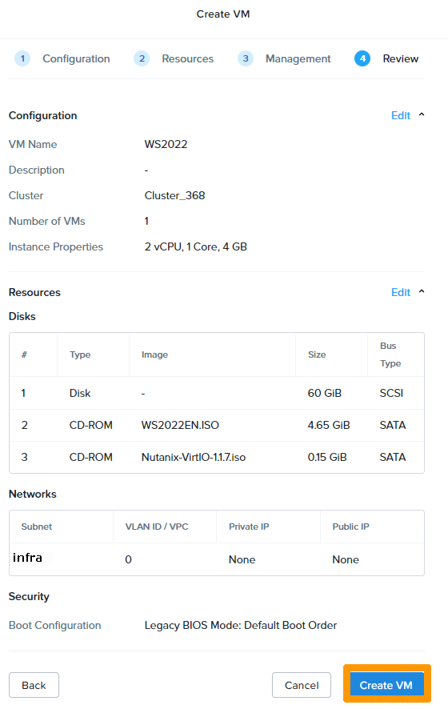{.thumbnail}

The newly created virtual machine will then appear in the dashboard.

{.thumbnail}.

#### Installation of Windows Server 2022

Select the virtual machine on which you want to install Windows Server 2022, by ticking the box on the left of the VM.

{.thumbnail}

1\. **Boot the VM**

Click the `Actions`{.action} menu, then `Power ON`{.action}.

{.thumbnail}

2\. **Launch the console**

Click the `Actions`{.action} menu, then `Launch Console`{.action}.

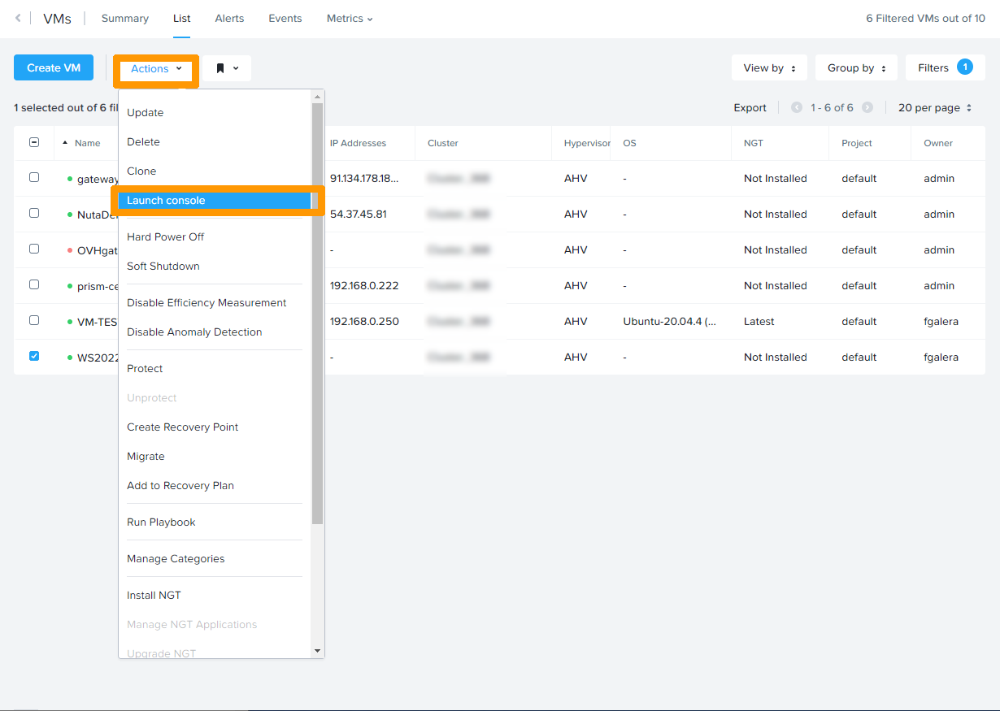{.thumbnail}

3\. **Start the installation**

Choose your locale and click `Next`{.action}.

{.thumbnail}

Click `Install now`{.action}.

{.thumbnail}

Select **Windows Server 2022 Standard (Desktop Experience)** and click `Next`{.action}.

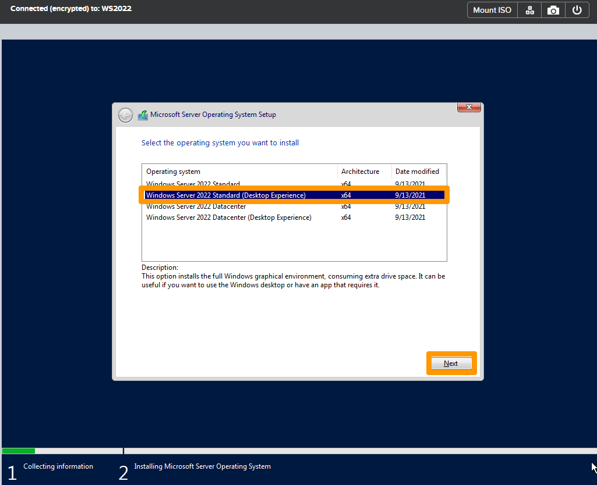{.thumbnail}

Read the Microsoft software license terms and conditions, confirm their acceptance, and click `Next`{.action}.

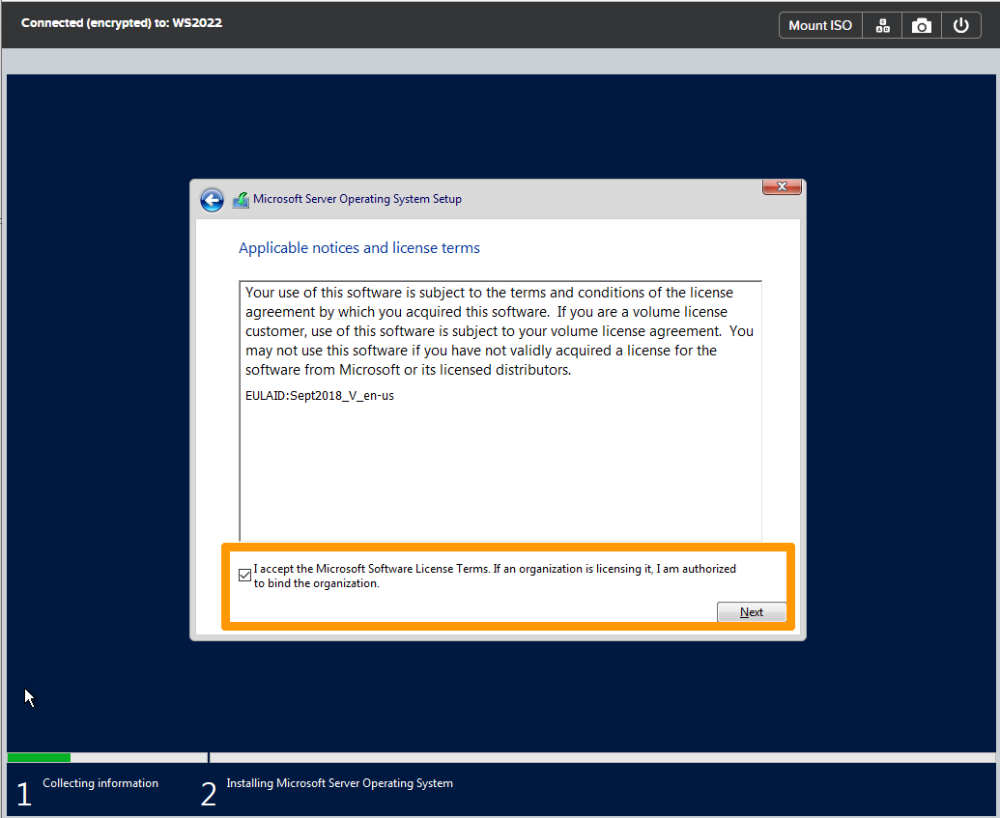{.thumbnail}

Click `Custom: Install Microsoft Server Operating System only (advanced)`{.action}.

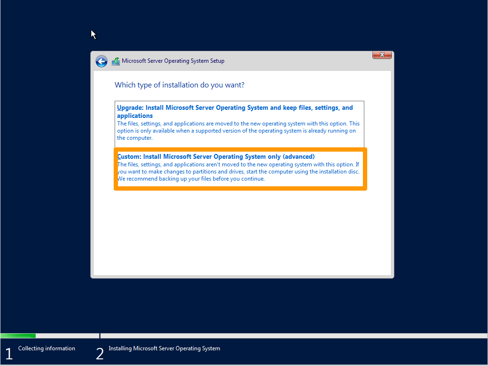{.thumbnail}

Click `Load driver`{.action}.

{.thumbnail}

Click `Browse`{.action}.

{.thumbnail}

Select the correct folder `e:\Windows Server 2022\amd64` and click `OK`{.action}.

{.thumbnail}

Select these drivers:

- `Nutanix VirtIO Balloon Driver`{.action}
- `Nutanix VirtIO Ethernet Adapter`{.action}
- `Nutanix VirtIO SCSI pass-through controller`{.action}
- `QEMU FWCfg Device`{.action}

Click `Next`{.action}.

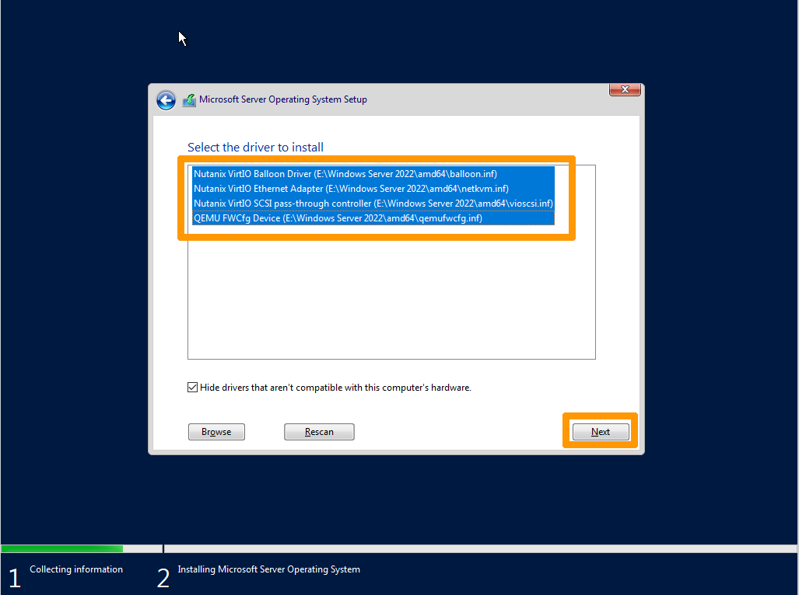{.thumbnail}

The 60 GB disk appears, click `Next`{.action}.

{.thumbnail}

Enter and confirm the password in the two fields provided, and click `Finish`{.action}.

{.thumbnail}

Windows Server 2022 and WS2022-specific drivers for the **AHV** hypervisor have been successfully installed.

{.thumbnail}

4\. **Windows Configuration**

Log in and assign an IP address to the machine in the "infra" network.
In this example, the network configuration is as follows:

- Network: 172.16.0.0/22
- Mask: 255.255.252.0
- Gateway: 172.16.3.254

> [!warning]
> Adapt this configuration to your cluster.
> You can find this information by using this [OVHcloud API call](https://api.ovh.com/console/#/nutanix/%7BserviceName%7D~GET).
>

{.thumbnail}

In the system settings, enable "Remote Desktop".

{.thumbnail}

> [!warning]
> Check the firewall configuration if necessary.
>

#### Load Balancer configuration

Log in to your [OVHcloud Control Panel](https://www.ovh.com/auth/?action=gotomanager&from=https://www.ovh.es/&ovhSubsidiary=es). Open the Nutanix Cluster configuration page. In the `Cluster network` box at the bottom of the page, click on the Load Balancer.

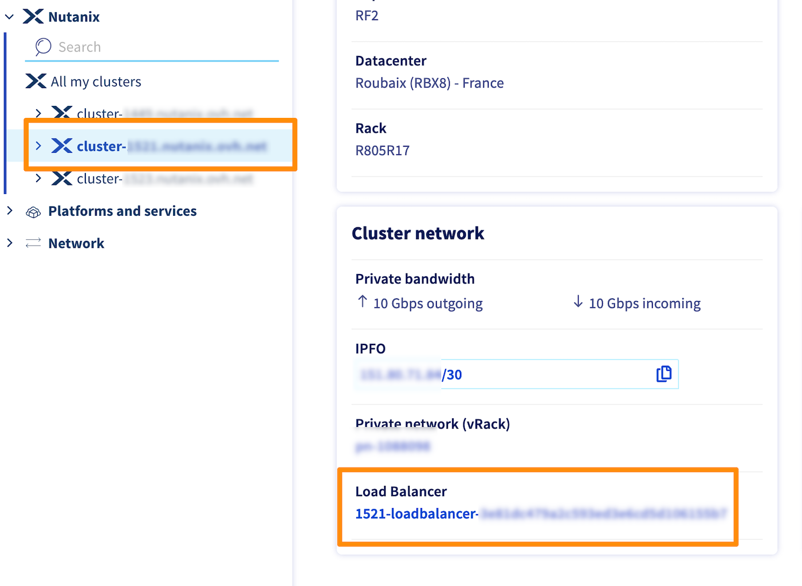{.thumbnail}

In the `Server clusters`{.action} tab, click `Add a server cluster`{.action}.

{.thumbnail}

Name your server farm, then select `TCP`{.action} and enter this information:

- **Port**: `3389`
- **Datacenter**: `ALL`
- **Private network**: `nutanix`

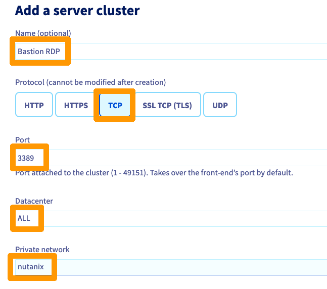{.thumbnail}

Click `Add`{.action} to confirm the creation of the server farm.

Click `Add a server`{.action}.

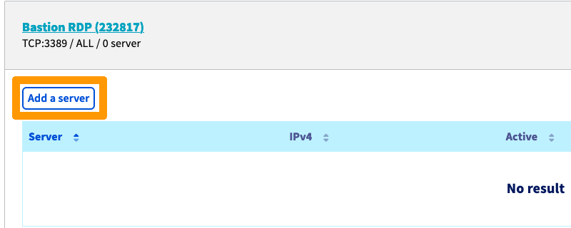{.thumbnail}

Enter these values:

- **Name (optional)**: `RDP`
- **IPv4 address**: `IP address of your Windows VM`
- **Port**: `3389`

Click `Add`{.action} to confirm the cluster creation.

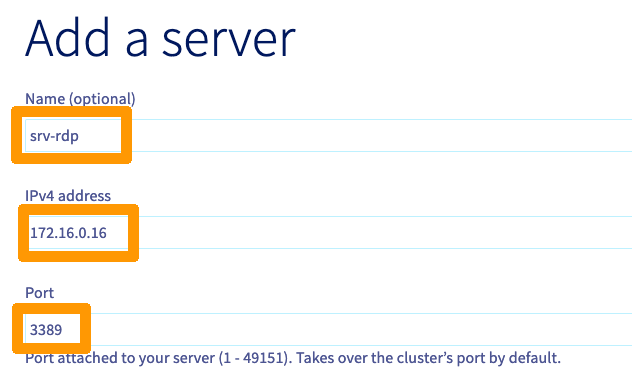{.thumbnail}

Then click on the `Front-ends`{.action} tab, and on `Add a front-end`{.action}.

{.thumbnail}

Name your front-end, choose the protocol `TCP`{.action} and modify these values:

- **Port**: `3389`
- **Datacenter**: `ALL`
- **Default farm**: `Bastion RDP (TCP)`

Click `Add`{.action}.

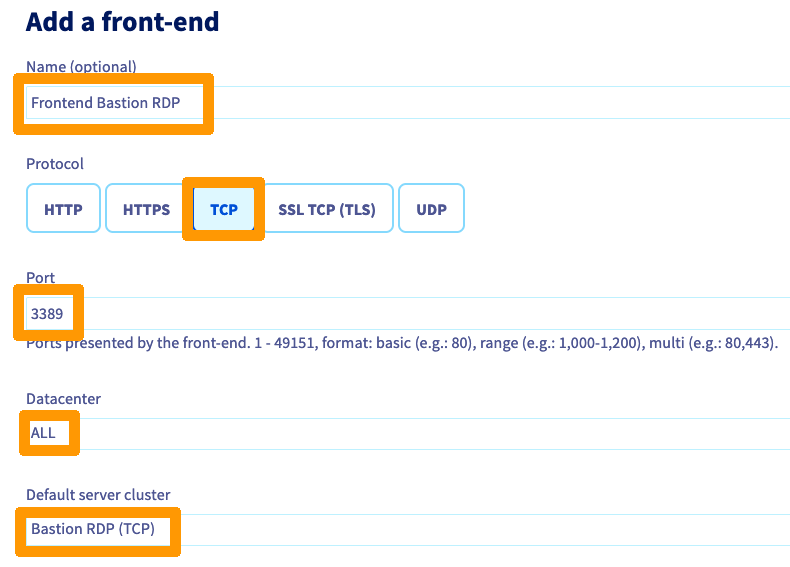{.thumbnail}

Click `Apply configuration`{.action}.

{.thumbnail}

Select the `Datacentre`{.action} and click `Apply configuration`{.action}.

{.thumbnail}

You can track the progress of the changes in the `Tasks`{.action} tab.

{.thumbnail}

The Load Balancer is now configured. Use your favorite RDP client to connect to your machine.
You can enter your cluster’s DNS name or Load Balancer’s IP address:

{.thumbnail}

You can now rebound on the different elements of the cluster:

- CVMS
- HOSTS
- Prism Element

For example, for a CVM, open powershell and type:

```bash
ssh nutanix@ipcvm
```

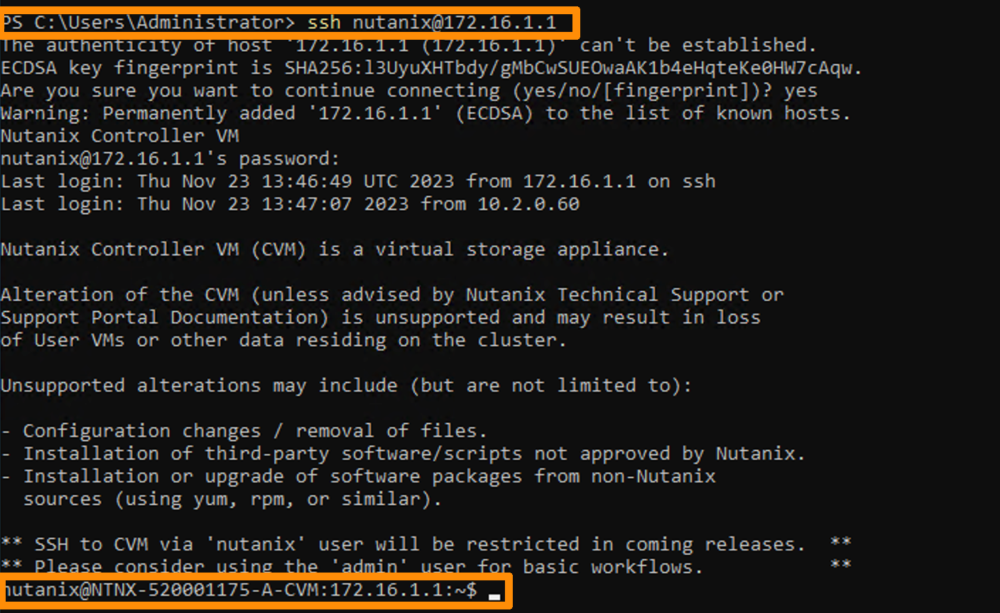{.thumbnail}

### Secure the cluster <a name="secure-cluster"></a>

To secure your cluster, we recommend changing your passwords. Use the Nutanix knowledge base to perform these operations: [kb6153 - Secure your Nutanix cluster](https://portal.nutanix.com/page/documents/kbs/details?targetId=kA00e000000LKXcCAO).

You can also [secure access to Prism Central](/pages/hosted_private_cloud/nutanix_on_ovhcloud/25-secure-prism-web-access).

## Go further <a name="gofurther"></a>

If you need training or technical assistance to implement our solutions, contact your sales representative or click on [this link](https://www.ovhcloud.com/es-es/professional-services/) to get a quote and ask our Professional Services experts for assisting you on your specific use case of your project.

Join our community of users on <https://community.ovh.com/en/>.
