## Objectif

Ce guide vous détaille les étapes d'installation d'OVHcloud Backint Agent pour SAP HANA et son utilisation.

OVHcloud Backint Agent pour SAP HANA vous permet de sauvegarder et de restaurer votre base de données SAP HANA sur un ou plusieurs buckets Object Storage S3 OVHcloud.

{.thumbnail}

OVHcloud Backint Agent pour SAP HANA a été certifié par SAP, vous pouvez retrouver les informations de la certification à ces adresses :

- [SAP Certified Solutions Directory](https://www.sap.com/dmc/exp/2013_09_adpd/enEN/#/solutions?search=backint&id=s:c5927e8a-cf79-40c1-84ad-cdd354554389)
- [SAP Note 2031547](https://me.sap.com/notes/0002031547)
- [SAP Note 3344150](https://me.sap.com/notes/3344150)

## Prérequis

- Un accès à l’[espace client OVHcloud](https://ca.ovh.com/auth/?action=gotomanager&from=https://www.ovh.com/ca/fr/&ovhSubsidiary=qc)
- [Un projet Public Cloud](/pages/public_cloud/compute/create_a_public_cloud_project) dans votre compte OVHcloud avec :
    - [Un bucket Object Storage S3](/pages/storage_and_backup/object_storage/s3_create_bucket) et [un utilisateur S3](/pages/storage_and_backup/object_storage/s3_identity_and_access_management#creation-dun-utilsateur) avec le droit de lecture et d'écriture
- Une base de données SAP HANA installée

## En pratique

> [!primary]
>
> [**Accès rapide à l'URL de téléchargement d'OVHcloud Backint Agent**](#ovhcloud-backint-agent-pour-sap-hana)
>

### Object Storage S3

> [!primary]
>
> Pour obtenir les informations relatives à la configuration et à l'utilisation des commandes AWS S3 CLI, veuillez vous référer au chapitre « Utilisation de AWS CLI » de la documentation [Premiers pas avec Object Storage](/pages/storage_and_backup/object_storage/s3_getting_started_with_object_storage).  
>
> Il n'est pas obligatoire d'installer AWS S3 CLI sur votre serveur hébergeant votre base de données SAP HANA. Les actions de ce chapitre peuvent être réalisées depuis votre serveur d'administration ou également depuis votre poste client.
>

Le versioning du bucket Object Storage S3 doit être activé afin d'assurer le bon fonctionnement d'OVHcloud Backint Agent. Le versioning permet de garder plusieurs versions d'un même objet dans votre bucket Object Storage S3.

Dans le cas des sauvegardes SAP HANA, le versioning vous permet de réaliser plusieurs sauvegardes avec le même nom (comme par exemple « COMPLETE_DATA_BACKUP ») et de garder la possibilité de restaurer une version spécifique de la sauvegarde « COMPLETE_DATA_BACKUP ». Si le versioning n'est pas activé, seule la dernière version de la sauvegarde « COMPLETE_DATA_BACKUP » peut être restaurée.

Pour vérifier si le versioning est activé sur votre bucket Object Storage S3, exécutez la commande suivante :

```bash
aws --profile <nom_du_profile> s3api get-bucket-versioning --bucket <nom_du_bucket>

# Exemple :
# aws --profile default s3api get-bucket-versioning --bucket mon-bucket-sap-hana
```

Sortie attendue :

```console
{
    "Status": "Enabled"
}
```

Si la sortie de commande est vide, cela signifie que le versioning de votre bucket Object Storage S3 n'est pas activé. Pour y remédier, veuillez exécuter la commande suivante :

```bash
aws --profile <nom_du_profile> s3api put-bucket-versioning --bucket <nom_du_bucket> --versioning-configuration Status=Enabled

# Exemple :
# aws --profile default s3api put-bucket-versioning --bucket mon-bucket-sap-hana --versioning-configuration Status=Enabled
```

### OVHcloud Backint Agent pour SAP HANA

Depuis votre serveur hébergeant la base de données SAP HANA, accédez au répertoire `/usr/sap/<SID>/SYS/global/hdb/opt/` et [téléchargez l'archive d'OVHcloud Backint Agent pour SAP HANA](https://ovhcloud-backint-agent.s3.rbx.io.cloud.ovh.net/ovhcloud-backint-agent.zip) contenant :

- la licence d'utilisation d'OVHcloud Backint Agent pour SAP HANA
- le fichier NOTICE incluant les copyrights
- le fichier VERSION
- un modèle de fichier de configuration
- l'exécutable d'OVHcloud Backint Agent pour SAP HANA

Pour télécharger l'archive, vous pouvez utiliser la commande suivante :

```bash
wget https://ovhcloud-backint-agent.s3.rbx.io.cloud.ovh.net/ovhcloud-backint-agent.zip -P /usr/sap/<SID>/SYS/global/hdb/opt/
```

L'archive `ovhcloud-backint-agent.zip` doit être décompressée, vous pouvez utiliser la commande suivante :

```bash
unzip /usr/sap/<SID>/SYS/global/hdb/opt/ovhcloud-backint-agent.zip -d /usr/sap/<SID>/SYS/global/hdb/opt/
```

À présent, cinq fichiers sont présents dans le répertoire `/usr/sap/<SID>/SYS/global/hdb/opt/` :

- LICENSE
- NOTICE
- VERSION
- hdbbackint.cfg
- hdbbackint

> [!primary]
>
> Veuillez prendre connaissance du contenu du fichier LICENSE. En utilisant ou en téléchargeant OVHcloud Backint Agent pour SAP HANA, vous acceptez les termes de la licence.
>

Le fichier `hdbbackint.cfg` doit posséder les droits de lecture et d'écriture, le fichier `hdbbackint` doit posséder les droits de lecture et d'exécution. Ces droits doivent s'appliquer à l'utilisateur SAP HANA (sid)adm.

```bash
chown <sid>adm:sapsys /usr/sap/<SID>/SYS/global/hdb/opt/hdbbackint.cfg
chown <sid>adm:sapsys /usr/sap/<SID>/SYS/global/hdb/opt/hdbbackint
chmod 600 /usr/sap/<SID>/SYS/global/hdb/opt/hdbbackint.cfg
chmod 500 /usr/sap/<SID>/SYS/global/hdb/opt/hdbbackint
```

Vérifiez que vous pouvez exécuter OVHcloud Backint Agent avec l'utilisateur SAP HANA.

```bash
su - <sid>adm -c "/usr/sap/<SID>/SYS/global/hdb/opt/hdbbackint -v"
```

Sortie attendue :

```console
"Backint 1.04" "OVHcloud Backint Agent version 1.0 for SAP HANA"
```

### Configuration

Éditez le contenu du fichier `hdbbackint.cfg` et remplacez les valeurs entre chevrons par les informations liées à votre bucket Object Storage S3. Ci-dessous, un exemple de son contenu après édition.

```ini
[trace]
default = INFO
destination = outputfile
 
[ovhcloud]
endpoint_url = https://s3.rbx.io.cloud.ovh.net
bucket = mon-bucket-sap-hana
region = rbx
access_key = 12345678901234567890123456789012
secret_key = 12345678901234567890123456789012
max_concurrency = 10
multipart_chunksize = 1GB
multipart_threshold = 1GB
```

Les paramètres `multipart_chunksize` et `multipart_threshold` acceptent les valeurs en bytes (exemple : 52428800 équivaut à 50MB), en KB, en GB et en TB. Si l'unité de mesure n'est pas indiquée, l'unité par défaut est le byte.

- Le paramètre `multipart_threshold` permet le déclenchement de l'envoi de l'objet en plusieurs parties (multipart).
- Le paramètre `multipart_chunksize` spécifie la taille des parties de l'objet à envoyer.

Les valeurs fournies par défaut des paramètres `multipart_chunksize` et `multipart_threshold` dans le fichier `hdbbackint.cfg` offrent une performance optimale dans de nombreux cas, mais elles peuvent être augmentées ou diminuées en fonction de votre environnement.

>[!warning]
>
> Les commandes qui vont suivre vont modifier la configuration de sauvegarde de votre base de données SAP HANA, veillez à exécuter ces commandes avec précaution.
>
> Il est également conseillé de réaliser une sauvegarde complète de votre base de données SAP HANA après la modification de la configuration, dans le but de valider cette dernière.
>

Veuillez exécuter ces commandes SQL afin de mettre à jour la configuration de sauvegarde de votre base de données SAP HANA.

*Remplacez, dans les commandes SQL ci-dessous, les caractères* `<SID>` *par le SID de votre base de données SAP HANA.*

```SQL
ALTER SYSTEM ALTER CONFIGURATION('global.ini','SYSTEM') SET('backup','catalog_backup_parameter_file')='/usr/sap/<SID>/SYS/global/hdb/opt/hdbbackint.cfg' WITH RECONFIGURE;
ALTER SYSTEM ALTER CONFIGURATION('global.ini','SYSTEM') SET('backup','catalog_backup_using_backint')='true' WITH RECONFIGURE;
ALTER SYSTEM ALTER CONFIGURATION('global.ini','SYSTEM') SET('backup','data_backup_parameter_file')='/usr/sap/<SID>/SYS/global/hdb/opt/hdbbackint.cfg' WITH RECONFIGURE;
ALTER SYSTEM ALTER CONFIGURATION('global.ini','SYSTEM') SET('backup','log_backup_parameter_file')='/usr/sap/<SID>/SYS/global/hdb/opt/hdbbackint.cfg' WITH RECONFIGURE;
ALTER SYSTEM ALTER CONFIGURATION('global.ini','SYSTEM') SET('backup','log_backup_using_backint')='true' WITH RECONFIGURE;
```

Si votre base de données SAP HANA a une taille supérieure à 128GB, il est possible d'optimiser les performances de sauvegarde et de restauration en activant le multi-streaming. Pour cela, veuillez exécuter les commandes SQL suivantes :

```SQL
ALTER SYSTEM ALTER CONFIGURATION('global.ini','SYSTEM') SET('backup','parallel_data_backup_backint_channels')='4' WITH RECONFIGURE COMMENT 'SAP NOTE 2458043';
ALTER SYSTEM ALTER CONFIGURATION('global.ini','SYSTEM') SET('backup','data_backup_buffer_size')='2048' WITH RECONFIGURE COMMENT 'SAP NOTE 2458043';
```

La valeur du paramètre `data_backup_buffer_size` est dépendante de celle du paramètre `parallel_data_backup_backint_channels`.  
Sa valeur est le résultat de l'opération « 512 x `parallel_data_backup_backint_channels` ».

>[!primary]
>
> Pour connaître l'exhaustivité des paramètres liés à la sauvegarde SAP HANA, nous vous recommandons la [documentation SAP](https://help.sap.com/docs/SAP_HANA_PLATFORM/009e68bc5f3c440cb31823a3ec4bb95b/e28fbdf1024c40e1a97fca48380aad98.html?locale=en-US). Dans la colonne « Section », indiquez « Backup ».
>

### Sauvegarde

Afin de valider la configuration, vous pouvez réaliser des sauvegardes manuelles depuis un accès SSH, via les commandes suivantes :

*Remplacez, dans les commandes ci-dessous, les caractères* `<SID>` *par le SID de votre base de données SAP HANA et les caractères* `<NI>` *par le numéro d'instance de votre base de données SAP HANA.*

```bash
# Sauvegarde du SYSTEMDB
/usr/sap/<SID>/HDB<NI>/exe/hdbsql -u SYSTEM -d SYSTEMDB "BACKUP DATA USING BACKINT ('MANUAL_COMPLETE_BACKUP');"

# Sauvegarde du TENANTDB
/usr/sap/<SID>/HDB<NI>/exe/hdbsql -u SYSTEM -d SYSTEMDB "BACKUP DATA FOR <SID> USING BACKINT ('MANUAL_COMPLETE_BACKUP');"
```

Vous pouvez également réaliser ces sauvegardes via SAP HANA Cockpit, en sélectionnant `Backint`{.action} dans la catégorie `Destination Type`{.action}.

{.thumbnail}

Suite à la réalisation de ces sauvegardes, plusieurs fichiers nommés `_databackup_` sont présents sur votre bucket Object Storage S3, ils correspondent aux sauvegardes de votre base de données SAP HANA via OVHcloud Backint Agent.

Deux fichiers nommés `log_backup_0_0_0_0` ayant pour préfixe `DB_<SID>` et `SYSTEMDB` se trouvent également dans votre bucket Object Storage S3. Ces fichiers correspondent aux sauvegardes du catalogue de sauvegardes SAP HANA, vous permettant de lister les sauvegardes connues par SAP HANA.

Les fichiers nommés `log_backup` correspondent aux sauvegardes des fichiers de logs de SAP HANA.

{.thumbnail}

Si les sauvegardes ne sont pas effectuées comme attendu, vous avez la possibilité de démarrer votre diagnostic en étudiant le contenu de deux fichiers :

- backint.log
- backup.log

Ces deux fichiers se trouvent dans le répertoire `/usr/sap/<SID>/HDB<NI>/<hostname>/trace` pour la sauvegarde du SYSTEMDB et dans le répertoire `/usr/sap/<SID>/HDB<NI>/<hostname>/trace/DB_<SID>` pour la sauvegarde du TENANTDB.

Le fichier `backint.log` vous apportera des informations relatives à l'exécution d'OVHcloud Backint Agent, comme par exemple un problème de permissions sur le bucket Object Storage S3 :

```log
botocore.exceptions.ClientError: An error occurred (AccessDenied) when calling the PutObject operation: Access Denied.
```

Le fichier `backup.log` vous apportera des informations relatives à l'exécution même de la sauvegarde à travers SAP HANA, sa progression et ses erreurs rencontrées.

```log
INFO    BACKUP   state of service: nameserver, <hostname>:30001, volume: 0, BackupExecuteTopologyAndSSFSBackupInProgress
INFO    BACKUP   state of service: nameserver, <hostname>:30001, volume: 0, BackupError
INFO    BACKUP   state of service: nameserver, <hostname>:30001, volume: 1, BackupAbortSavepointInProgress
INFO    BACKUP   state of service: nameserver, <hostname>:30001, volume: 1, BackupAbortSavepointFinished
ERROR   BACKUP   SAVE DATA finished with error: [447] backup could not be completed
```

### Planification

La planification de vos sauvegardes de votre base de données SAP HANA doit être modifiée.

Nous vous conseillons de vous référer à la SAP Note [2782059](https://launchpad.support.sap.com/#/notes/2782059), qui présente quatre options pour planifier les sauvegardes sur une base de données SAP HANA.

Voici un exemple de planification quotidienne de sauvegardes du TENANTDB SAP HANA via SAP HANA Cockpit :

1\. Sélectionnez le TENANTDB sur lequel vous souhaitez planifier les sauvegardes. Cliquez sur `+`{.action} pour ajouter une planification.

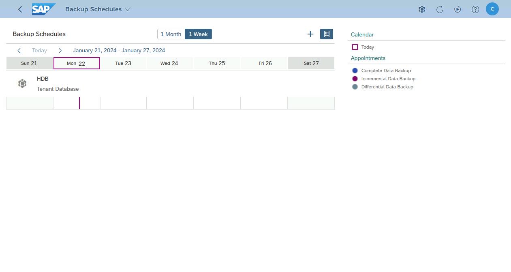{.thumbnail}

2\. Sélectionnez l'option `Schedule a Series of Backups`{.action}.

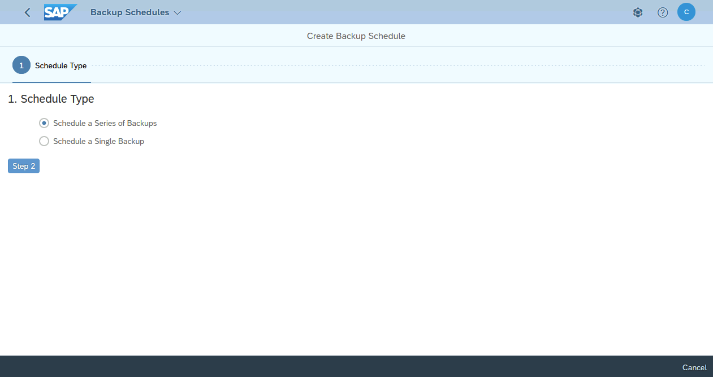{.thumbnail}

3\. Donnez un nom à votre planification.

{.thumbnail}

4\. Sélectionnez l'option `Complete`{.action} puis `Backint`{.action}. Vous avez la possibilité de configurer un préfixe à vos sauvegardes. Par défaut, la date et l'heure sont préfixées.

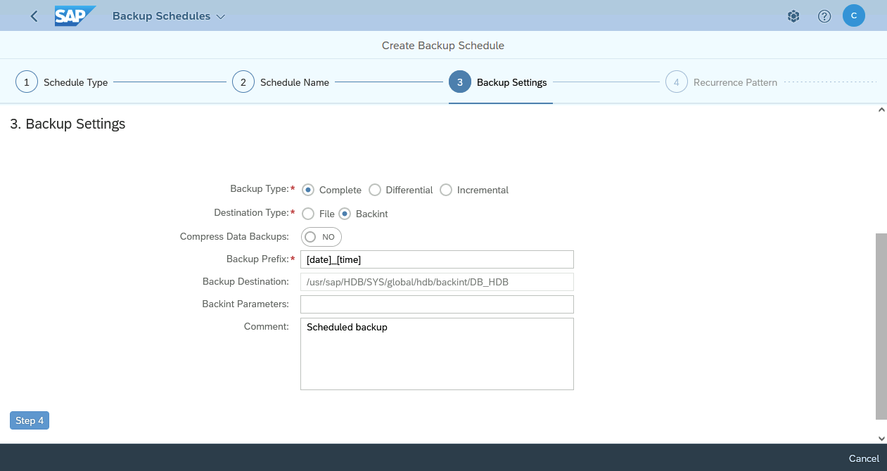{.thumbnail}

5\. Sélectionnez l'option `Weekly`{.action}.

{.thumbnail}

6\. Sélectionnez votre fuseau horaire, l'heure du déclenchement de votre sauvegarde et les jours de déclenchement. Dans cet exemple de sauvegardes quotidiennes, nous cochons tous les jours de la semaine.

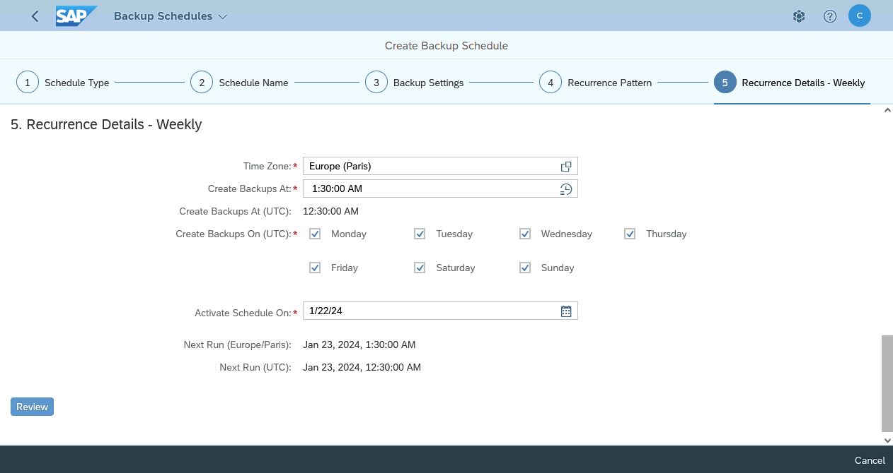{.thumbnail}

7\. Veuillez vérifier les paramètres de votre planification avant de valider.

{.thumbnail}

8\. La planification quotidienne est à présent opérationnelle pour votre TENANTDB.

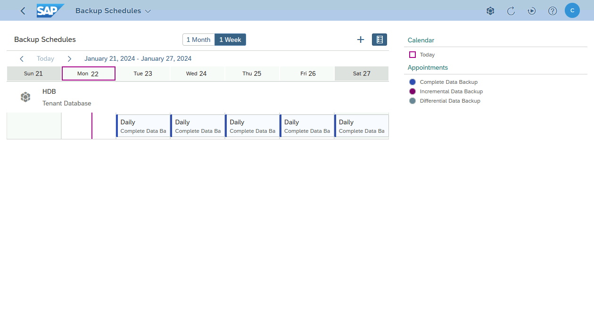{.thumbnail}

Retrouvez ci-dessous la même planification quotidienne de sauvegardes du TENANTDB SAP HANA via crontab :

*Remplacez, dans les commandes ci-dessous, les caractères* `<SID>` *par le SID de votre base de données SAP HANA et les caractères* `<NI>` *par le numéro d'instance de votre base de données SAP HANA.*

```bash
# Sauvegarde complète du TENANTDB - Tous les jours
30 1 * * * /usr/sap/<SID>/HDB<NI>/exe/hdbsql -U BACKUP "BACKUP DATA FOR <SID> USING BACKINT ('$(date +\%d\%m\%Y_\%H\%M\%S\%s)_COMPLETE_BACKUP');"
```

> [!primary]
>
> L'option `-U` permet d'appeler une clé stockée dans le hdbuserstore. Pour en savoir plus sur l'ajout d'une clé dans le hdbuserstore, nous vous invitons à prendre connaissance de la documentation SAP disponible à [cette adresse](https://help.sap.com/docs/SAP_HANA_PLATFORM/b3ee5778bc2e4a089d3299b82ec762a7/ddbdd66b632d4fe7b3c2e0e6e341e222.html?version=2.0.02&locale=en-US).
>
> Dans cet exemple, la clé `BACKUP` a été créée contenant le couple identifiant / mot de passe d'un utilisateur sur la base de données SAP HANA ayant le rôle de sauvegarde. La liste des rôles devant être associés à cet utilisateur est disponible à [cette adresse](https://help.sap.com/docs/SAP_HANA_PLATFORM/6b94445c94ae495c83a19646e7c3fd56/c4b71703bb571014810ebb38dc59cf51.html).
>

### Restauration

Pour restaurer de votre base de données SAP HANA depuis une sauvegarde réalisée avec OVHcloud Backint Agent, vous pouvez réaliser les étapes suivantes depuis SAP HANA Cockpit :

1\. Dans l'onglet `Database Management`{.action}, sélectionnez votre TENANTDB. Cliquez sur `Tenant Actions`{.action} puis sélectionnez `Recover Tenant`{.action}.

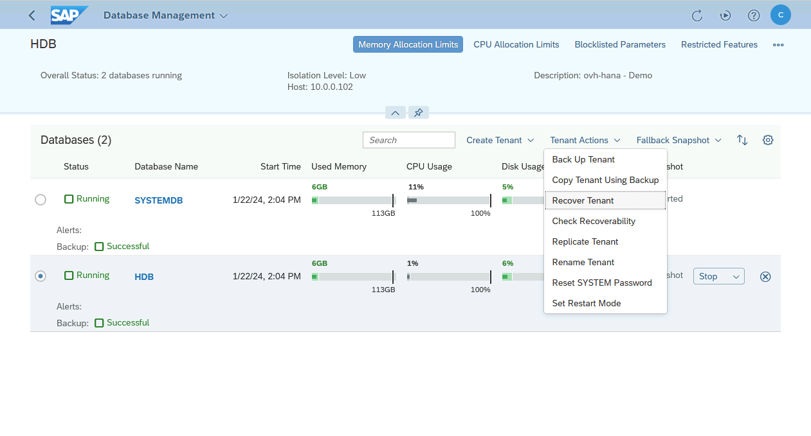{.thumbnail}

2\. Le TENANTDB doit être éteint pour réaliser sa restauration.

Veillez à arrêter votre système SAP lié à cette base de données SAP HANA avant de démarrer la restauration.

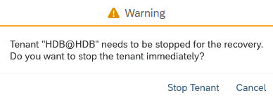{.thumbnail}

3\. Sélectionnez l'option souhaitée :

- `Data and logs backups`{.action} vous permet de revenir à une date et une heure précise.
- `Full data backup only`{.action} vous permet de revenir à un état d'une sauvegarde complète.

Dans notre exemple, nous choisissons l'option `Data and logs backups`{.action}.

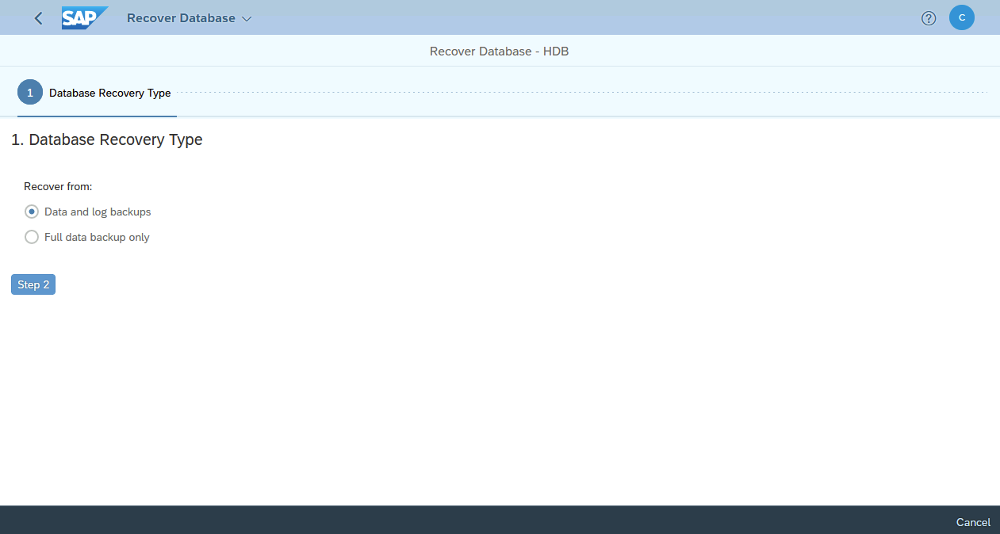{.thumbnail}

4\.

Si vous avez sélectionné l'option précédente `Data and logs backups`{.action}, vous avez deux possibilités :
  
- `Recover to the most recent state`{.action} vous permet de revenir à l'état le plus récent possible.
- `Recover to a specific point in time`{.action} vous permet de revenir à une date et une heure précise.

Dans notre exemple, nous choisissons l'option `Recover to the most recent state`{.action}.

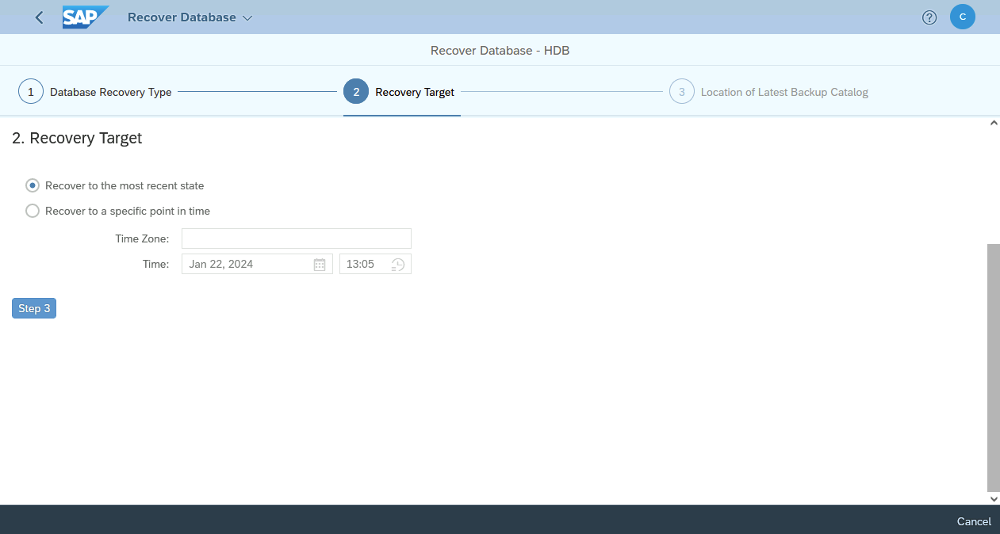{.thumbnail}

5\. Si vous n'avez pas modifié la localisation du catalogue de sauvegardes, l'option `Backup location only`{.action} est correcte.

Dans le cas contraire, veuillez indiquer le chemin.

{.thumbnail}

6\. Après quelques secondes, les sauvegardes complètes inscrites dans le catalogue de sauvegardes de votre base de données SAP HANA sont listées.

{.thumbnail}

7\. Vous pouvez laisser l'option `Yes (recommended)`{.action} sélectionnée.

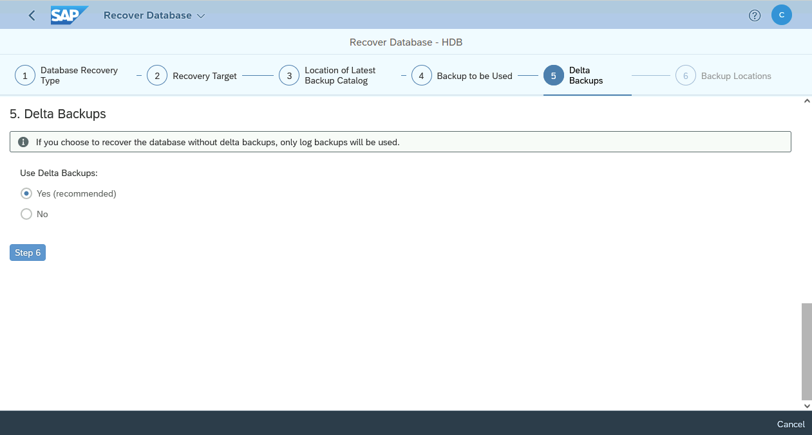{.thumbnail}

8\. Si vous n'avez pas modifié la localisation des sauvegardes et des sauvegardes de logs, laissez les champs vides.

Dans le cas contraire, veuillez indiquer le chemin.

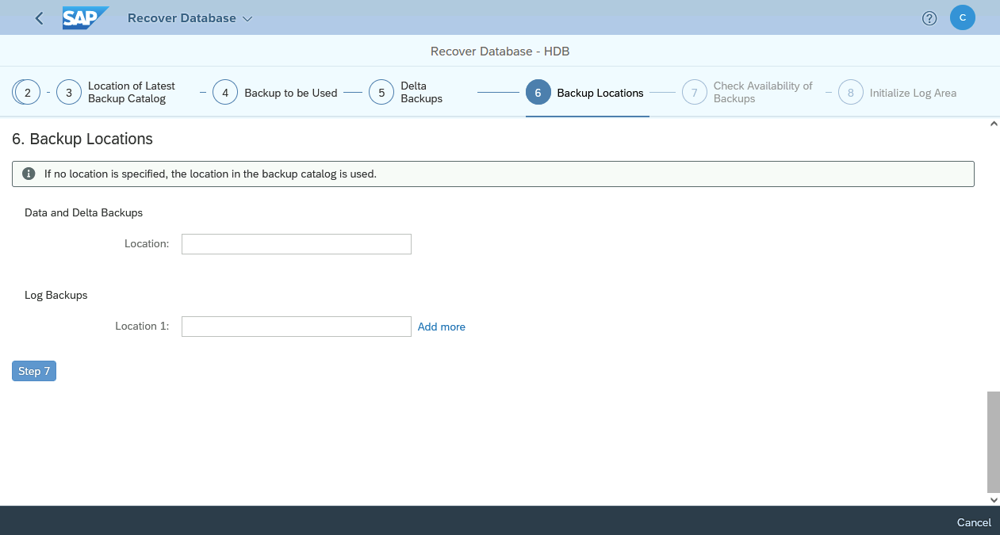{.thumbnail}

9\. Nous vous recommandons de sélectionner l'option `Yes`{.action} pour la catégorie `Backint`{.action}. Cette option permet de vérifier la disponibilité des sauvegardes avant de déclencher la restauration.

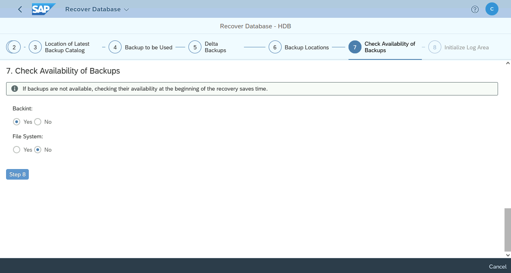{.thumbnail}

10\. Dans notre exemple, nous sélectionnons l'option `No`{.action} pour l'étape `Initialize the log area`{.action}.

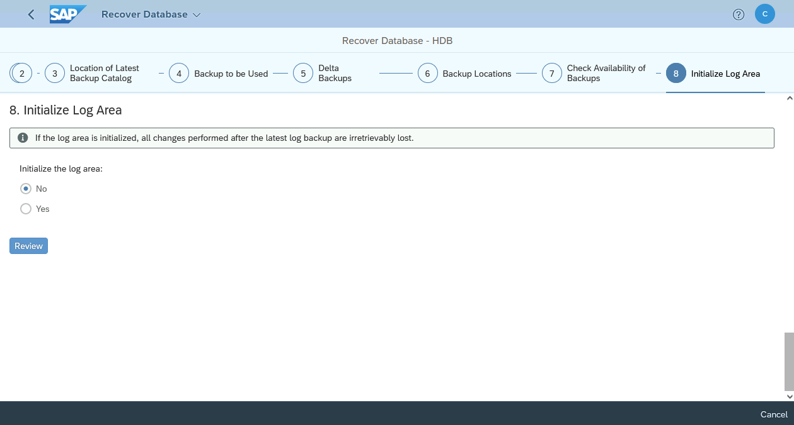{.thumbnail}

11\. Veuillez vérifier les paramètres de restauration avant de valider.

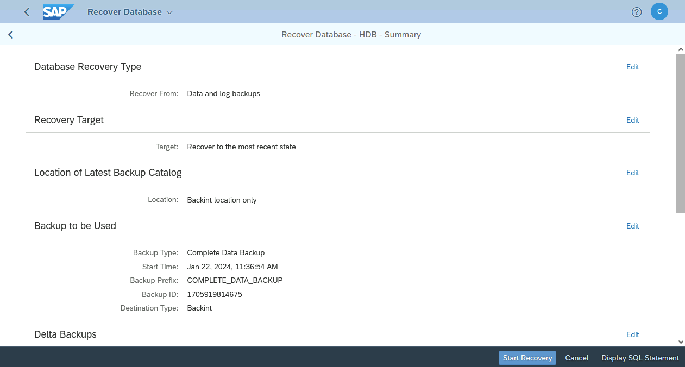{.thumbnail}

12\. La restauration des services du TENANTDB démarre.

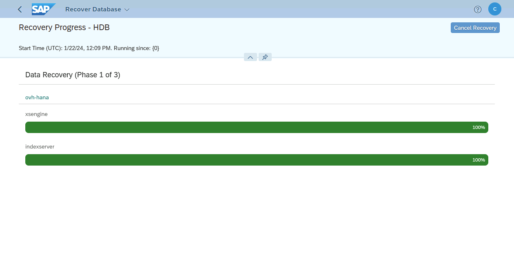{.thumbnail}

13\. Une fois la restauration réalisée avec succès, votre base de données SAP HANA est démarrée et disponible.

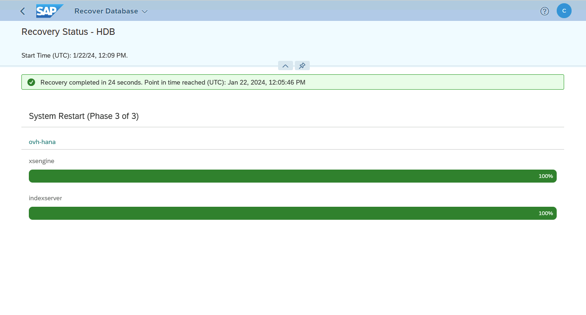{.thumbnail}

## Aller plus loin

- Afin d'améliorer la sécurité de vos sauvegardes, nous vous conseillons de mettre en place la [gestion de l'immutabilité](/pages/storage_and_backup/object_storage/s3_managing_object_lock/)
- Vous pouvez également [réaliser les sauvegardes SAP HANA avec OVHcloud Backint Agent pour SAP HANA avec plusieurs buckets Object Storage S3](/pages/hosted_private_cloud/sap_on_ovhcloud/cookbook_configure_ovhcloud_backint_agent_several_buckets/)

Si vous avez besoin d'une formation ou d'une assistance technique pour la mise en oeuvre de nos solutions, contactez votre commercial ou cliquez sur [ce lien](https://www.ovhcloud.com/fr-ca/professional-services/) pour obtenir un devis et demander une analyse personnalisée de votre projet à nos experts de l’équipe Professional Services.

Échangez avec notre communauté d'utilisateurs sur <https://community.ovh.com>.
