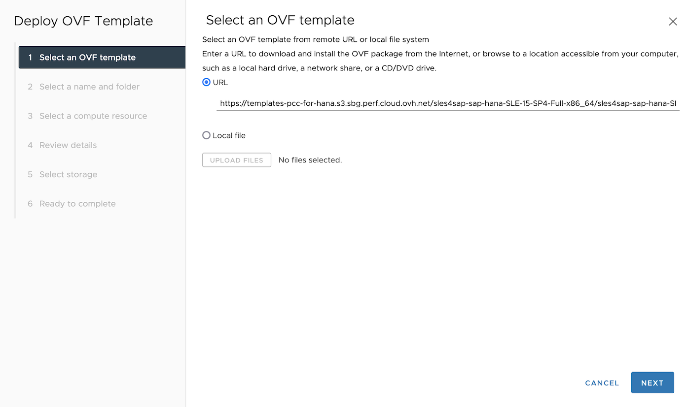
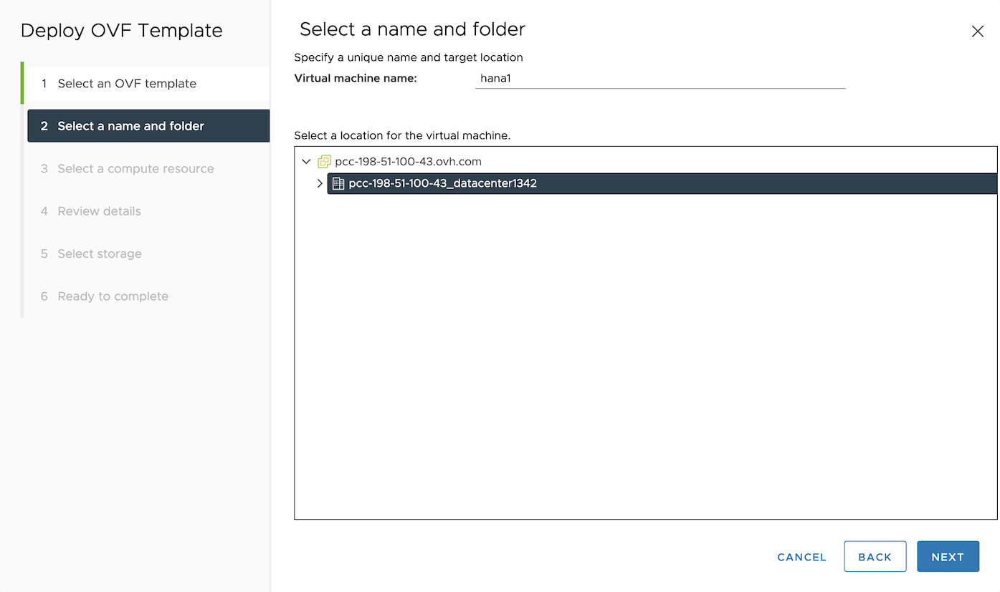
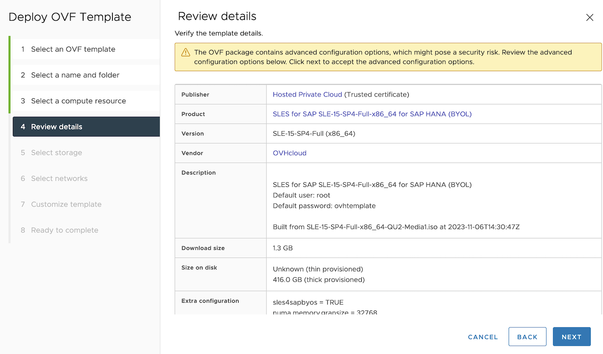
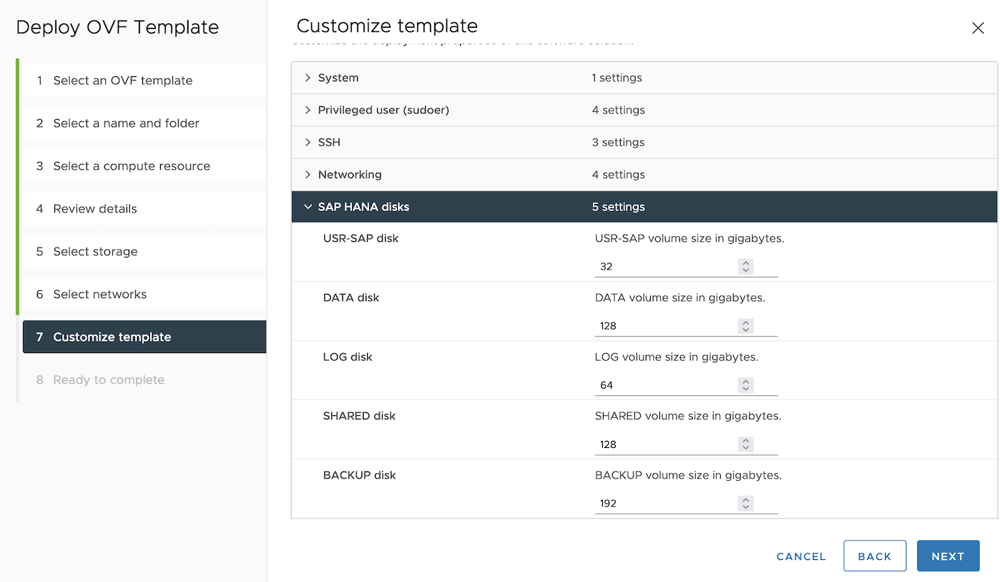
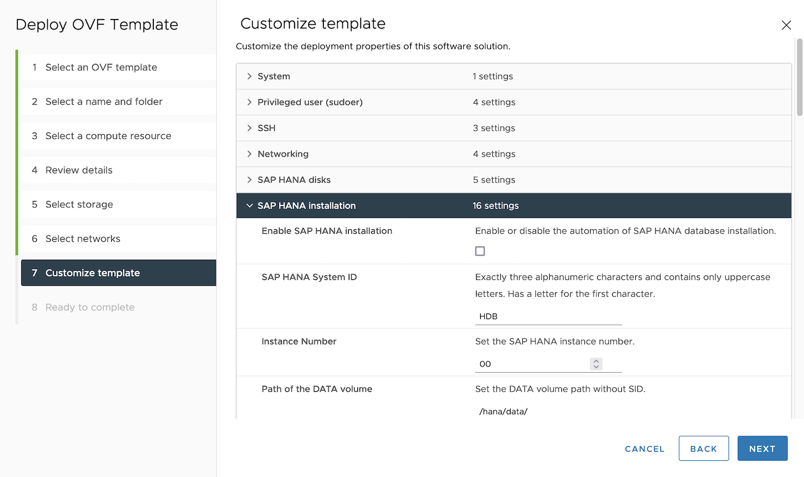
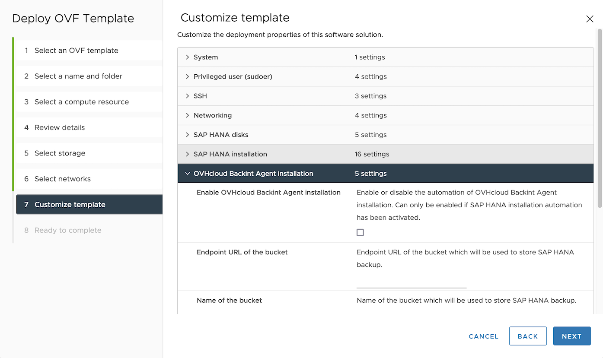

## Objectif

Ce guide vous détaille les étapes pour le déploiement d'une machine virtuelle SUSE Linux Enterprise Server for SAP Applications avec SAP HANA et OVHcloud Backint Agent for SAP HANA pré-installés sur la solution VMware on OVHcloud en utilisant un template OVF créé par OVHcloud.

## Prérequis

- Un accès à l’[espace client OVHcloud](https://www.ovh.com/auth/?action=gotomanager&from=https://www.ovh.com/fr/&ovhSubsidiary=fr).
- Une [solution VMware on OVHcloud](https://www.ovhcloud.com/fr/hosted-private-cloud/vmware/) déployée.
- [Un projet Public Cloud](/pages/platform/public-cloud/create_a_public_cloud_project) dans votre compte OVHcloud.
- [Un bucket Object Storage S3](/pages/cloud/storage/object_storage/s3_create_bucket).
- [Un utilisateur S3](/pages/cloud/storage/object_storage/s3_identity_and_access_management#creation-dun-utilsateur) avec le droit de lecture.
- [Un second bucket Object Storage S3](/pages/cloud/storage/object_storage/s3_create_bucket).
- [Un utilisateur S3](/pages/cloud/storage/object_storage/s3_identity_and_access_management#creation-dun-utilsateur) avec les droits de lecture et d'écriture sur ce second bucket Object Storage S3.

## En pratique

> [!primary]
> [**Accès rapide à l'URL du template OVF**](#ovf_link)
>

### Déploiement

OVHcloud met à disposition un template OVF comprenant le système d'exploitation SUSE Linux Enterprise Server for SAP Applications pré-configuré pour accueillir une installation SAP HANA.

Afin de respecter le ratio vCPU/RAM pour les charges de travail OLAP et OLTP, trois modèles de machine virtuelle destinés à accueillir SAP HANA sont recommandés pour un environnement de production.

|        Host        |  vCPU  |  Socket |  Mémoire  |
|:------------------:|:------:|:-------:|:---------:|
| SAP HANA vSAN 1536 |   24   |   0.5   |   384 GB  |
| SAP HANA vSAN 1536 |   48   |    1    |   768 GB  |
| SAP HANA vSAN 1536 |   96   |    2    |  1436 GB<sup><sub>1</sub></sup>  |

<sup><sub>[1] Nous conseillons de réserver 100 GB de mémoire pour le host ESXi.</sup></sub>

Ce template OVF vous offre la possibilité d'installer SAP HANA, ainsi que notre OVHcloud Backint Agent for SAP HANA de manière automatisée, réduisant ainsi le temps de mise à disposition d'une base de données SAP HANA.

Vous devez dans un premier temps déposer les sources nécessaires à l'installation de SAP HANA sur votre premier bucket Object Storage S3 demandé dans les prérequis. Les sources doivent être déposées sous la même forme qu'elles ont été téléchargées, soit par exemple « 51056821.ZIP ».

> [!warning]
> Les SAP HANA Components (AFL, EML, LCAPPS, EPMMDS, etc.) ne sont pas pris en charge par cette automatisation et devront être gérés en post-installation.
>

Nous vous recommandons de suivre notre [guide Object Storage S3](/pages/cloud/storage/object_storage/s3_getting_started_with_object_storage), si ce sont vos premiers pas avec un bucket Object Storage S3.

Une fois les sources SAP HANA déposées dans votre bucket Object Storage S3, vous pouvez à présent vous rendre sur l'interface vSphere de votre solution VMware on OVHcloud. Obtenez l'URL à [cette adresse](https://www.ovh.com/manager/#/dedicated/dedicated_cloud).

> [!warning]
> Une problématique actuelle sur la Content Library et la fonctionnalité de disque dynamique ([KB85842](https://kb.vmware.com/s/article/85842)) nous oblige à passer via le lien direct du template OVF.
>

1. Dans votre interface vSphere, sélectionnez votre datacenter, cliquez sur `Action`{.action} puis `Déployer un modèle OVF`{.action}.

{.thumbnail}

<ol start="2"><li>
Entrez l'URL suivante pour atteindre notre template OVF pour SAP HANA, puis cliquez sur <code class="action">Next</code>.
</li></ol>

<a name="ovf_link"></a>
```
https://templates-pcc-for-hana.s3.sbg.perf.cloud.ovh.net/sles4sap-sap-hana-SLE-15-SP4-Full-x86_64/sles4sap-sap-hana-SLE-15-SP4-Full-x86_64.ovf
```

{.thumbnail}

<ol start="3"><li>
Donnez un nom à votre machine virtuelle et sélectionnez votre datacenter, puis cliquez sur <code class="action">Next</code>.
</li></ol>

{.thumbnail}

<ol start="4"><li>
Sélectionnez « Cluster1 » puis cliquez sur <code class="action">Next</code>.
</li></ol>

{.thumbnail}

<ol start="5"><li>
Vérifiez que le modèle sélectionné a bien pour nom « SLES for SAP SLE-15-SP4-Full-x86_64 for SAP HANA (BYOL) » puis cliquez sur <code class="action">Next</code>.
</li></ol>

{.thumbnail}

<ol start="6"><li>
Sélectionnez « vsanDatastore » pour le stockage de votre machine virtuelle SAP HANA, afin de respecter les recommandations SAP et VMware.
</li></ol>

{.thumbnail}

<ol start="7"><li>
Sélectionnez le réseau dans lequel vous souhaitez déployer votre base de données SAP HANA, puis cliquez sur <code class="action">Next</code>.<br>
À la fin du déploiement, vous aurez la possibilité d'éditer la machine virtuelle pour ajouter d'autres cartes réseaux si vous le désirez.
</li></ol>

{.thumbnail}

<ol start="8"><li>
Le modèle « SLES for SAP SLE-15-SP4-Full-x86_64 for SAP HANA (BYOL) » offre plusieurs paramètres pour personnaliser la machine virtuelle.<br><br>

Dans ce guide, nous nous focalisons sur les trois catégories suivantes :

<ul>
<li>SAP HANA disks ;</li>
<li>SAP HANA installation ;</li>
<li>OVHcloud Backint Agent installation.</li>
</ul><br>

Dans la catégorie <code class="action">SAP HANA disks</code>, vous devez renseigner les tailles des disques qui seront créés. Les valeurs pré-remplies correspondent aux recommandations de stockage pour une base de données SAP HANA de 64 GB.</li></ol>

{.thumbnail}

Voici un tableau des recommandations SAP pour les tailles des disques :

|     Disques     |                        Taille                        |
|:---------------:|:----------------------------------------------------:|
| usrsap          |  MIN(32 GB)                                          |
| hanadata        |  1 x RAM                                             |
| hanalog         | [RAM ≤ 512 GB] = 1/2 x RAM<br>[RAM > 512 GB] = 512 GB|
| hanashared      |  MIN(1 x RAM; 1 TB)                                  |
| hanabackup      |  hanadata + hanalog                                  |

<ol start="9"><li>
Si vous souhaitez bénéficier de l'installation automatisée de votre base de données SAP HANA, cochez l'activation de l'installation et renseignez les informations de la catégorie <code class="action">SAP HANA installation</code>.
</li></ol>

> [!primary]
> Veuillez prendre connaissance de la [SAP Note 1979280](https://me.sap.com/notes/1979280/E) qui liste les SID SAP HANA ne pouvant être utilisés.
>

{.thumbnail}

<ol start="10"><li>
Si vous souhaitez bénéficier de l’installation automatisée d'OVHcloud Backint Agent for SAP HANA pour sauvegarder votre base de données sur un Object Storage S3, cochez l'activation de l'installation et renseignez les informations de la catégorie <code class="action">OVHcloud Backint Agent installation</code>.

<div class="callout warning">Cette option est uniquement disponible dans le cas où vous avez activé l'installation de SAP HANA dans la précédente catégorie.</div>
</li></ol>

{.thumbnail}

Une fois ces étapes réalisées, le déploiement de votre machine virtuelle à partir du template OVF créé par OVHcloud s'exécute.

Nous vous conseillons de prendre connaissance et de réaliser les actions du chapitre [Configuration des paramètres avancés](#advanced-settings) avant de démarrer votre machine virtuelle.

<a name="advanced-settings"></a>

### Configuration des paramètres avancés

Le template OVF créé par OVHcloud prend en compte de nombreux paramètres. Cependant, certains paramètres additionnels ne peuvent être configurés qu'une fois la machine virtuelle déployée.

1. Pour réaliser cet ajout de paramètres, sélectionnez votre machine virtuelle, cliquez sur `Action`{.action} puis `Modifier les paramètres`{.action}.

{.thumbnail}

<ol start="2"><li>
Cliquez sur l'onglet <code class="action">Options VM</code>, puis développez le menu <code class="action">Avancé</code> et cliquez sur <code class="action">Modifier la configuration</code>.
</li></ol>

{.thumbnail}

<ol start="3"><li>
Nous vous recommandons d'appliquer ces paramètres sur votre machine virtuelle SAP HANA :
</li></ol>

|           Paramètre           |  Valeur |
|:-----------------------------:|:-------:|
| tools.guestlib.enableHostInfo |  TRUE   |
| numa.memory.gransize          |  32768  |

{.thumbnail}

Pour plus de détails à propos de ces paramètres, nous vous invitons à prendre connaissance de la [SAP Note 1606643](https://me.sap.com/notes/1606643/E), ainsi que la [documentation VMware](https://core.vmware.com/resource/sap-hana-vmware-vsphere-best-practices-and-reference-architecture-guide).

<ol start="4"><li>
Dans le cas où votre machine virtuelle SAP HANA utilise un demi socket ou un socket, il est également recommandé d'appliquer le paramètre suivant :
</li></ol>

|      Paramètre     |  Valeur |
|:------------------:|:-------:|
| numa.vcpu.preferHT |  TRUE   |

<ol start="5"><li>
Nous vous recommandons d'appliquer une stratégie de stockage VM en provisionnement statique. Pour créer une stratégie de stockage VM, cliquez sur <code class="action">vSphere Client</code> puis sur l'icône <code class="action">Stratégies de stockage VM</code>.<br><br>

Ci-dessous, les paramètres de la règle que nous conseillons de créer pour SAP HANA.
</li></ol>

|                  Paramètre                 |               Valeur              |
|:------------------------------------------:|:---------------------------------:|
| Type de stockage                           | VSAN                              |
| Tolérance aux pannes du site               | Aucun - cluster standard          |
| Pannes tolérées                            | 1 panne : RAID-1 (mise en miroir) |
| Nombre de bandes de disque par objet       | 1                                 |
| Limite d'IOPS pour un objet                | 0                                 |
| Réservation d'espace d'objet               | Provisionnement statique          |
| Réservation de Flash Read Cache            | 0 %                               |
| Désactiver le total de contrôle de l'objet | Non                               |
| Forcer le provisionnement                  | Non                               |
| Services de chiffrement                    | Aucune préférence                 |
| Efficacité de l'utilisation de l'espace    | Déduplication et compression      |
| Niveau de stockage                         | Intégralement Flash               |

<ul>
Cette stratégie de stockage VM est à appliquer pour les disques hébergeant les volumes /hana/shared (Hard disk 3),<br>
/hana/data (Hard disk 4) et /hana/log (Hard disk 5) de votre machine virtuelle.
</ul>

<ol start="6"><li>Vous pouvez à présent démarrer votre machine virtuelle.<br><br>

Dans le cas où vous avez activé l'installation SAP HANA à minima, l'installation démarrera lors du premier démarrage de votre machine virtuelle. L'installation dure un peu plus de 15 minutes, veuillez à ne réaliser aucune action sur votre machine virtuelle durant le processus d'installation.<br><br>

Vous serez informé de l'avancée de l'installation par l'affichage d'un statut lors de votre connexion SSH à votre machine virtuelle, ainsi que par des messages une fois connecté.
</li></ol>

### Post-configuration

Nous vous recommandons de réaliser ces actions avant la mise en production de votre base de données SAP HANA.

1. Enregistrez votre système d'exploitation SUSE Linux Enterprise Server for SAP Applications et récupérez les dernières mises à jour en exécutant la commande suivante :

```bash
zypper update -y
```

<ol start="2"><li>
Installez la licence de votre base de données SAP HANA.
</li></ol>

<ol start="3"><li>
Configurez votre planification de sauvegarde SAP HANA. Nous présentons des exemples de planification avec OVHcloud Backint Agent for SAP HANA dans <a href="/pages/cloud/sap/cookbook-install-ovhcloud-backint-agent/">notre guide</a>.
</li></ol>

<ol start="4"><li>
Nous vous recommandons de configurer les mêmes serveurs de temps (NTP) utilisés par vos hosts ESXi de votre solution VMware on OVHcloud au niveau de votre OS.<br><br>

Cette information est disponible dans votre interface vSphere, en sélectionnant un host ESXi, onglet <code class="action">Configurer</code>, menu <code class="action">Configuration de l'heure</code>.<br><br>

Sur SLES, éditez le fichier <code>/etc/chrony.conf</code> et ajoutez les adresses IP des serveurs de temps :
</li></ol>

```bash
# Allow NTP client access from local network.
# Use public servers from the pool.ntp.org project.
# Please consider joining the pool (https://www.pool.ntp.org/join.html).
{ip-ntp-server1}
{ip-ntp-server2}
{ip-ntp-server3}
{ip-ntp-server4}
```

<ul>
Il vous suffit de démarrer le service et de l'activer pour les prochains démarrages :
</ul>

```bash
systemctl start chronyd.service
systemctl enable chronyd.service
```

## Aller plus loin

- [Installer et utiliser OVHcloud Backint Agent pour SAP HANA](/pages/cloud/sap/cookbook-install-ovhcloud-backint-agent)
- [Utiliser OVHcloud Backint Agent avec plusieurs buckets Object Storage S3](/pages/cloud/sap/cookbook-configure-ovhcloud-backint-agent-several-buckets)
- [SAP HANA on VMware vSphere Best Practices and Reference Architecture Guide](https://core.vmware.com/resource/sap-hana-vmware-vsphere-best-practices-and-reference-architecture-guide)
- [SAP Note 1606643 - Linux: VMware vSphere host monitoring interface](https://me.sap.com/notes/1606643/E)
- [SAP Note 2470289 - FAQ: SAP HANA Non-Uniform Memory Access (NUMA)](https://me.sap.com/notes/2470289)
- [SAP Note 2779240 - Workload-based sizing for virtualized environments](https://me.sap.com/notes/2779240)
- [SAP HANA on VMware vSphere](https://wiki.scn.sap.com/wiki/display/VIRTUALIZATION/SAP+HANA+on+VMware+vSphere)

Si vous avez besoin d'une formation ou d'une assistance technique pour la mise en oeuvre de nos solutions, contactez votre commercial ou cliquez sur [ce lien](https://www.ovhcloud.com/fr/professional-services/?_gl=1*39h6u1*_gcl_au*MzU3MTAzMzA5LjE2ODY1NTk4MTE.) pour obtenir un devis et demander une analyse personnalisée de votre projet à nos experts de l’équipe Professional Services.

Échangez avec notre communauté d'utilisateurs sur https://community.ovh.com.