## Objective

This guide provides instructions for backuping an SAP HANA database with Veeam Backup and Replication and Veeam Plug-in for SAP HANA.

[Veeam Enterprise Plus with OVHcloud](https://www.ovhcloud.com/en-sg/storage-solutions/veeam-enterprise/) allows you to use Veeam Backup and Replication within your OVHcloud infrastructure and benefiting from a Veeam Enterprise Plus licence.

## Requirements

- An SAP HANA database installed.
- A Windows server which will host the [Veeam Backup and Replication](https://www.ovhcloud.com/en-sg/storage-solutions/veeam-enterprise/) solution.
- A space on a shared storage for a non-SecNumCloud need or a virtual machine on [SecNumCloud-qualified Hosted Private Cloud powered by VMware](https://www.ovhcloud.com/en-sg/enterprise/products/secnumcloud/) acting as an NFS or SMB server for SNC need.

## Instructions

### Veeam Backup and Replication installation

If you want to be helped during the installation of Veeam Backup and Replication on your Windows server, we recommend you [our guide](/pages/cloud/storage/backup/veeam_veeam_backup_replication).

### Backup Repository configuration

After the installation of Veeam Backup and Replication on your Windows server, you must configure the Backup Repository.

A Backup Repository is a storage space where Veeam Backup and Replication hosts backups.

#### Backup and Replication for a non-SecNumCloud need

For this configuration, you can use a space on a shared storage as well as a S3 Object Storage to secure your backups on another location.

**Backup Repository creation**

> [!tabs]
> **Step 1**
>>
>> In Veeam Backup and Replication console, select `Backup Infrastructure`{.action}, then `Backup Repositories`{.action}.
>>
>> Click on `Add Repository`{.action} to start the configuration wizard.
>>
>> 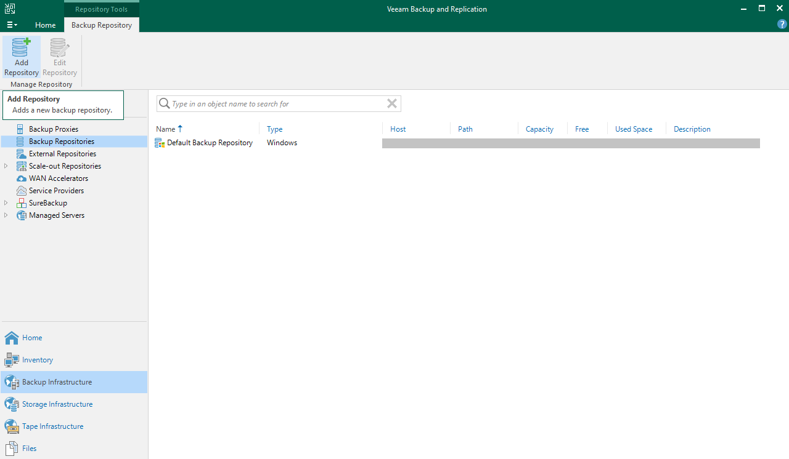{.thumbnail}
>>
> **Step 2**
>>
>> Select `Network attached storage`{.action}.
>>
>> {.thumbnail}
>>
> **Step 3**
>>
>> Select the protocol that your server of shared files listen.
>>
>> You will be helped in steps to set information as IP address or the fully qualified domain name of your server, or the path where you want to store your SAP HANA backups.
>>
>> {.thumbnail}
>>
> **Step 4**
>>
>> Your NFS or SMB Backup Repository is now displayed in the Veeam Backup and Replication console and usable by backup configurations.
>>
>> You can go further in the configuration of this Backup Repository with setting access permissions for a user or specific group of users and encrypting backups which will be stored in this Backup Repository. Find more information about that in the [Veeam guide](https://helpcenter.veeam.com/archive/backup/110/vsphere/access_permissions.html).
>> 
>> 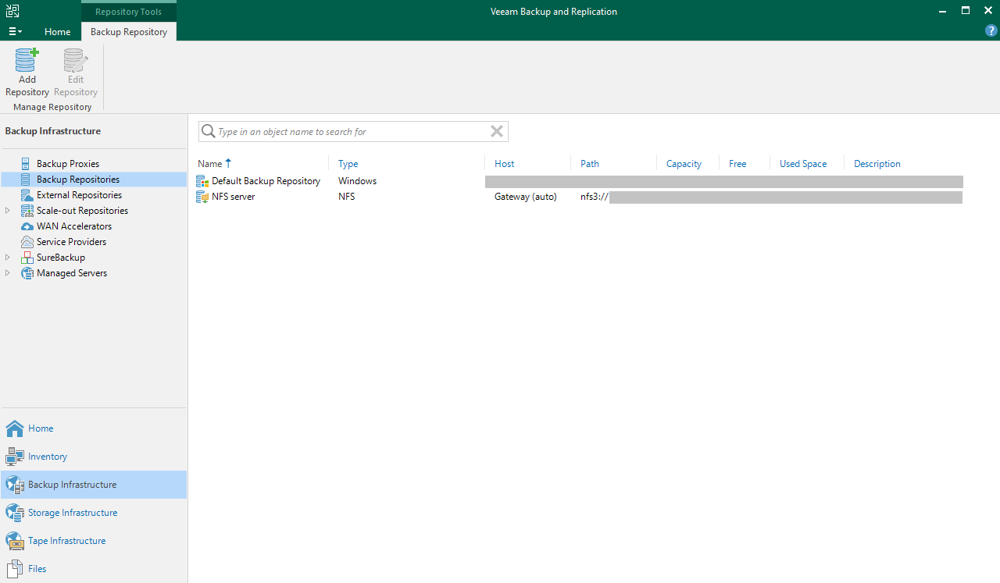{.thumbnail}
>>

**Object Storage Backup Repository creation**

This Backup Repository will be used for secure your backups on another storage space and another OVHcloud location.

To discover a S3 Object Storage creation steps, we recommend our [our guide](/pages/cloud/storage/object_storage/s3_create_bucket).

> [!tabs]
> **Step 1**
>>
>> In Veeam Backup and Replication console, select `Backup Infrastructure`{.action}, then `Backup Repositories`{.action}.
>>
>> Click on `Add Repository`{.action} to start the configuration wizard.
>>
>> {.thumbnail}
>>
> **Step 2**
>>
>> Select `Object storage`{.action}.
>>
>> 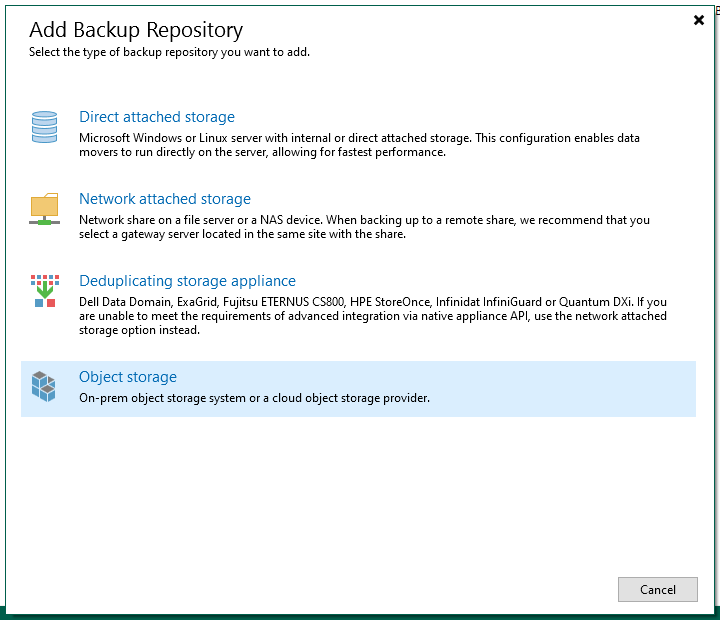{.thumbnail}
>>
> **Step 3**
>>
>> Select `S3 Compatible`{.action}.
>>
>> {.thumbnail}
>>
> **Step 4**
>>
>> Give a name for your Object Storage Repository
>>
>> {.thumbnail}
>>
> **Step 5**
>>
>> Set the `Service point`{.action} which match the endpoint of the S3 Object Storage bucket as well as its region.
>>
>> Add your credentials which have the Administrator role on this S3 Object Storage bucket. It's the user's access key and the user's secret key linked to the S3 Object Storage bucket. Find more information about that in [our guide](/pages/cloud/storage/object_storage/s3_identity_and_access_management).
>>
>> {.thumbnail}
>>
> **Step 6**
>>
>> Set the name of the S3 Object Storage bucket in which you will store your SAP HANA backups.
>>
>> You also must set or create a directory within this S3 Object Storage bucket.
>>
>> {.thumbnail}
>>
> **Step 7**
>>
>> Your S3 Compatible Backup Repository is now displayed in Veeam Backup and Replication console and usable by backup configurations.
>>
>> {.thumbnail}
>>

**Scale-out Backup Repository creation**

> [!tabs]
> **Step 1**
>>
>> In Veeam Backup and Replication console, select `Backup Infrastructure`{.action}, then `Scale-out Repositories`{.action}.
>>
>> Click on `Add Scale-out Repository`{.action} to start the configuration wizard.
>>
>> 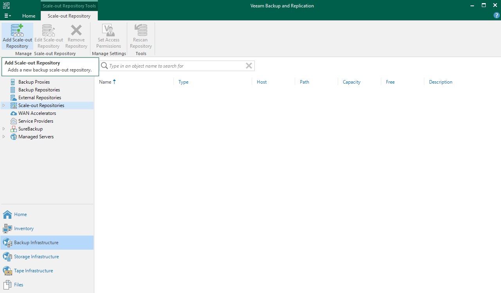{.thumbnail}
>>
> **Step 2**
>>
>> Give a name of your Scale-out Backup Repository.
>>
>> 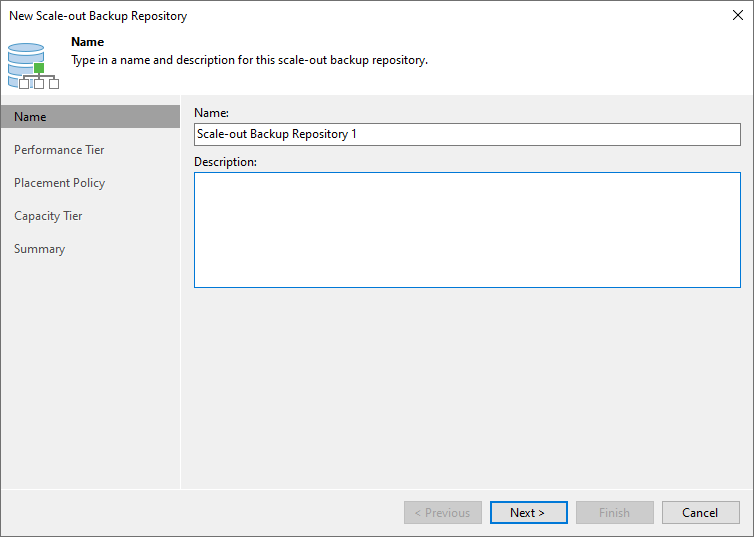{.thumbnail}
>>
> **Step 3**
>>
>> Click on `Add`{.action} and select your Backup Repository previously created.
>>
>> 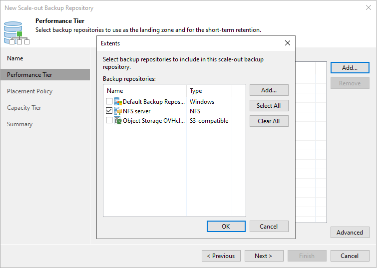{.thumbnail}
>>
> **Step 4**
>>
>> Select the placement policy wanted. We advise the `Data locality`{.action} policy.
>>
>> 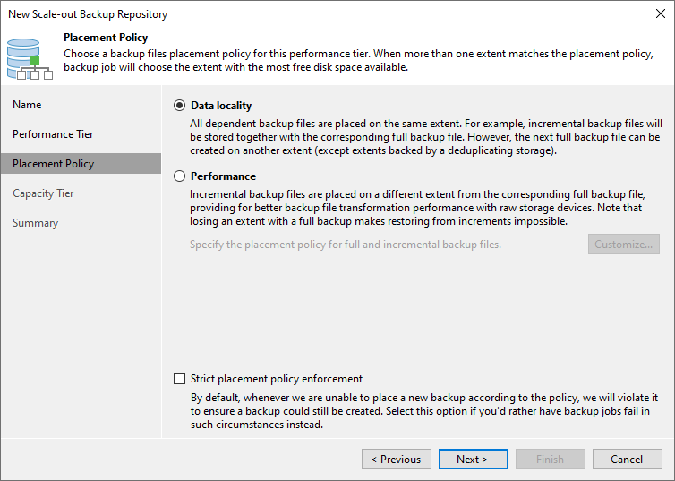{.thumbnail}
>>
> **Step 5**
>>
>> Tick `Extend scale-out backup repository capacity with object storage`{.action} then select the Object Storage Backup Repository previously created.
>>
>> - The first option allows to copy backups to the S3 Object Storage as soon as backups have been created on the shared storage.
>> - The second option allows to move backups to the S3 Object Storage after a defined period, releasing the space on the shared storage.
>>
>> We advise you to enable these both options, assuring a safety of your backups and an automated cleaning of the shared storage.
>>
>> {.thumbnail}
>>
> **Step 6**
>>
>> By default, no access is allowed to this Scale-out Repository.
>>
>> Select your Scale-out Repository and click on `Set Access Permissions`{.action}.
>>
>> 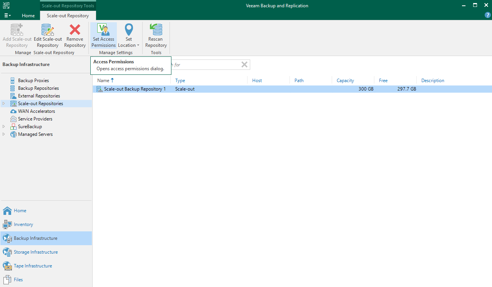{.thumbnail}
>>
> **Step 7**
>>
>> You have the possibility to allow all user accounts to use this Scale-out Repository or limit to a defined list.
>>
>> We recommend you allowing a limited user accounts.
>>
>> 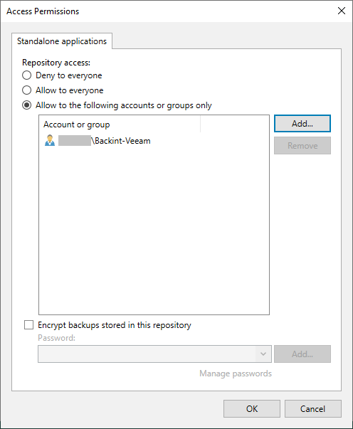{.thumbnail}
>>
> **Step 8**
>>
>> On your S3 Object Storage bucket, you have now a tree created by Veeam Backup and Repository.
>>
>> {.thumbnail}
>>

Once these steps have been done, you can continue this guide with the chapter [Veeam Plug-in for SAP HANA installation](#veeam-plug-in-for-sap-hana-installation_1)

#### Backup Repository for a SecNumCloud need

The S3 Object Storage solution is not yet SecNumCloud qualified. It cannot be used to store your backups in a SecNumCloud context.

To meet this need, we propose to create a virtual machine on [SecNumCloud-qualified Hosted Private Cloud powered by VMware](https://www.ovhcloud.com/en-sg/enterprise/products/secnumcloud/) acting as a NFS or SMB server.

> [!warning]
> In the case of using a virtual machine to host a NFS or SMB server, take care of protect this virtual machine and its content with duplicating its data on another location.
>
> To meet this need, create a second Backup Repository on another location can be considered.
>

> [!tabs]
> **Step 1**
>>
>> In Veeam Backup and Replication console, select `Backup Infrastructure`{.action}, then `Backup Repositories`{.action}.
>>
>> Click on `Add Repository`{.action} to start the configuration wizard.
>> {.thumbnail}
>>
> **Step 2**
>>
>> Select `Network attached storage`{.action}.
>>
>> 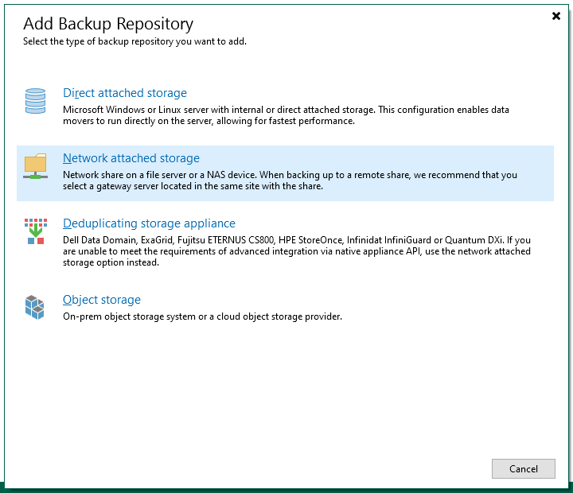{.thumbnail}
>>
> **Step 3**
>>
>> Select the protocol that your server of shared files listen.
>>
>> You will be helped in steps to set information as IP address or the fully qualified domain name of your server, or the path where you want to store your SAP HANA backups.
>>
>> 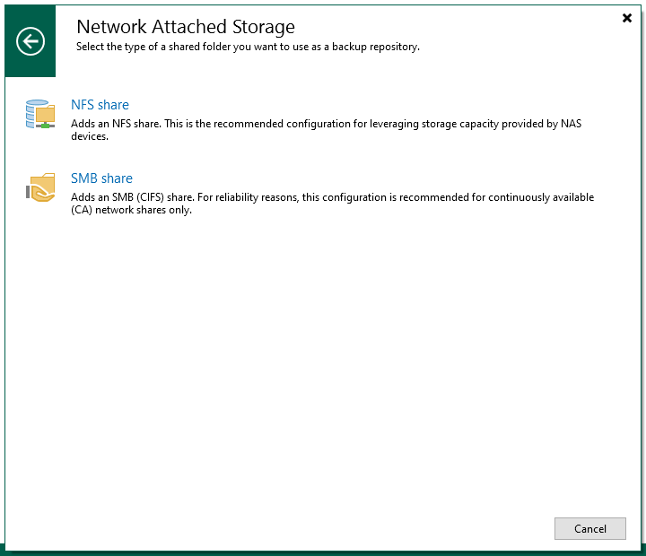{.thumbnail}
>>
> **Step 4**
>>
>> Your NFS or SMB Backup Repository is now displayed in the Veeam Backup and Replication console and usable by backup configurations.
>>
>> You can go further in the configuration of this Backup Repository with setting access permissions for a user or specific group of users and encrypting backups which will be stored in this Backup Repository. Find more information about that in the [Veeam guide](https://helpcenter.veeam.com/archive/backup/110/vsphere/access_permissions.html).
>> 
>> {.thumbnail}
>>

For more information about the Backup Repository configuration, we invite you to refer to the [Veeam Backup Repository documentation](https://helpcenter.veeam.com/archive/backup/110/vsphere/backup_repository.html).

### Veeam Plug-in for SAP HANA installation

1. Copy Veeam Plugin for SAP-HANA from the Veeam Backup and Replication Installation ISO to your server which hosts your SAP HANA database.

2. Start the installation with the following command:

```bash
rpm -i VeeamPluginforSAPHANA-xx.x.x.xxxx-x.x86_64.rpm
```

<ol start=3><li>With the SAP HANA user (sid)adm, run the configuration wizard:</li></ol>

```bash
./SapBackintConfigTool --wizard
```

```textile
Enter backup server name or IP address: <IP address of your Windows server>
Enter backup server port number [10006]:
Enter username: <username> (1)
Enter password for <username>: password> (1)
Available backup repositories:
1. Backup Repository
Enter repository number: <Give the number of the Backup Repository previously created>
Configuration result:
    SID <SID> has been configured
```

> [!primary]
> (1) We advise you to create a dedicated Veeam Backup and Replication account which has only Veeam Backup Operator and Veeam Restore Operator roles. Only one role can be added per line in Veeam Backup and Replication console, you must add a second line with the second role. Find more information [here](https://helpcenter.veeam.com/archive/backup/110/vsphere/users_roles.html).
>

<ol start=4><li>You can now trigger a backup of your SAP HANA database to check if your configuration works as expected.<br><br>

A SAP HANA backup task is now displayed in the Veeam Backup and Replication console.</li></ol>

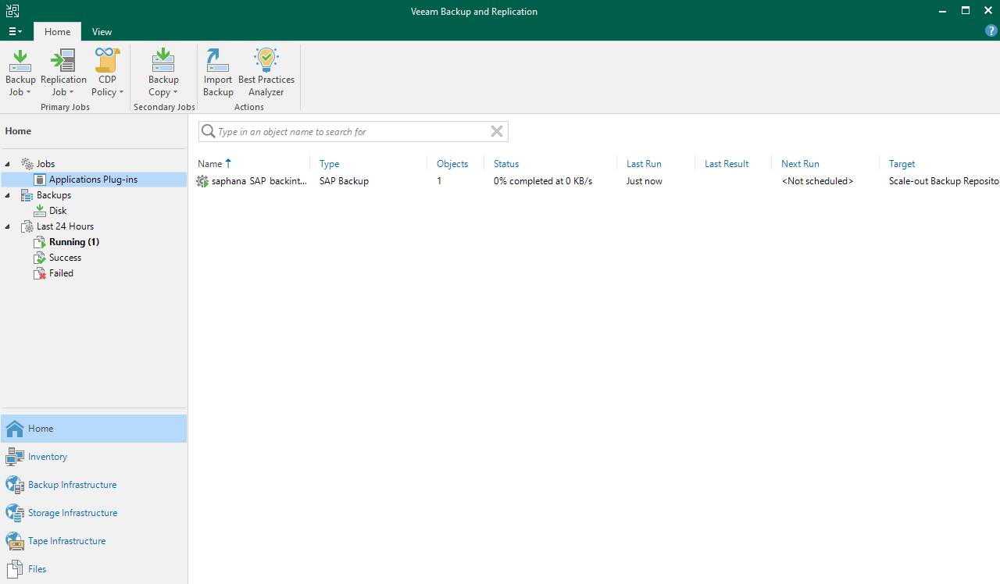{.thumbnail}

If you have configured a Scale-out Repository with a S3 Object Storage, you should observe your backups in your S3 Object Storage bucket.

{.thumbnail}

If you want to discover all possibilities with Veeam Plug-in for SAP HANA, we recommend you taking in consideration the documentation available on [Veeam](https://helpcenter.veeam.com/archive/backup/110/plugins/sap_hana_plugin.html).

### Backup scheduling

> [!warning]
> Veeam Backup and Replication console does not offer the scheduling with Veeam Plug-in for SAP HANA.
>

We advise you to refer to the [SAP Note 2782059](https://launchpad.support.sap.com/#/notes/2782059) which presents four options to schedule backup for an SAP HANA database.

An example of SAP HANA backup scheduling with crontab.

*Replace, in commands below,* `<SID>` *characters by your SAP HANA database SID.*

```bash
# Full backup of TENANTDB - MON THU SUN
0 0 * * 1,4,7 /usr/sap/<SID>/HDB00/exe/hdbsql -U BACKUP "BACKUP DATA FOR <SID> USING BACKINT ('SCHEDULED_$(date +'%H%M%S%s')_COMPLETE_BACKUP')";
 
# Differential backup of TENANTDB - TUE WED FRI SAT
0 0 * * 2,3,5,6 /usr/sap/<SID>/HDB00/exe/hdbsql -U BACKUP "BACKUP DATA DIFFERENTIAL FOR <SID> USING BACKINT ('SCHEDULE_$(date +'%H%M%S%s')_DIFFERENTIAL_BACKUP')";
 
# Full backup of SYSTEMDB - SUN
0 0 * * 7 /usr/sap/<SID>/HDB00/exe/hdbsql -U BACKUP "BACKUP DATA USING BACKINT ('SCHEDULE_$(date +'%H%M%S%s')_COMPLETE_BACKUP)";
```

> [!primary]
> The `-U` option allows to call a key stored in the hdbuserstore. To know more about the adding of a key in the hdbuserstore, we invite you to read the SAP documentation available [here](https://help.sap.com/docs/SAP_HANA_PLATFORM/b3ee5778bc2e4a089d3299b82ec762a7/ddbdd66b632d4fe7b3c2e0e6e341e222.html?version=2.0.02&locale=en-US).
>
> In this example, the key named "BACKUP" have been created including credentials from a user in SAP HANA with the backup role. The list of roles which have to be added to this user is available [here](https://help.sap.com/docs/SAP_HANA_PLATFORM/6b94445c94ae495c83a19646e7c3fd56/c4b71703bb571014810ebb38dc59cf51.html).

### Recover

To recover your SAP HANA database from a backup done by Veeam Backup and Replication, you can do perform the following steps in SAP HANA Studio :

> [!tabs]
> **Step 1**
>>
>> Select your TENANTDB on which you want to recover.
>>
>> Then click on `Next`{.action}.
>>
>> {.thumbnail}
>>
> **Step 2**
>>
>> Select the option that you want to use to recover your TENANTDB:
>>
>> - Recover to the most recent state
>> - Recover to the following point in time
>> - Recover to a specific data backup
>>
>> Then click on `Next`{.action}.
>>
>> {.thumbnail}
>>
> **Step 3**
>>
>> Take care of select `Recover using the backup catalog`{.action} and `Search for the backup catalog in Backint only`{.action} options.
>>
>> Then click on `Next`{.action}.
>>
>> 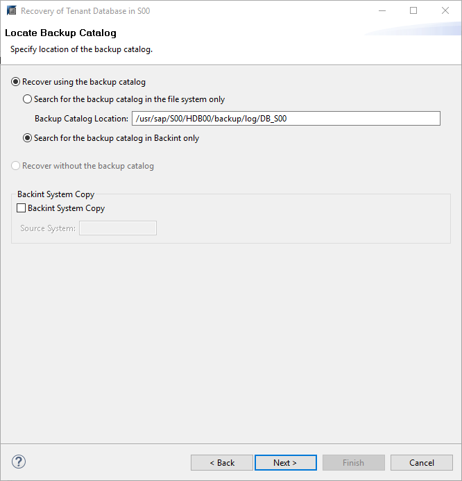{.thumbnail}
>>
> **Step 4**
>>
>> The TENANTDB must be shut down to do the recover.
>>
>> Take care of shut down the SAP system linked to this SAP HANA database before starting the recover.
>>
>> {.thumbnail}
>>
> **Step 5**
>>
>> After few seconds, SAP HANA studio displays the full backups recorded in the backup catalog of your SAP HANA database.
>>
>> It's also recommended clicking on `Check Availability`{.action} to ensure the availability of the backup on the storage.
>>
>> Then click on `Next`{.action}.
>>
>> {.thumbnail}
>>
> **Step 6**
>>
>> If you didn't change the location of your log backups, you can click on `Next`{.action}.
>>
>> Otherwise, set the path. Then click on `Next`{.action}.
>> 
>> 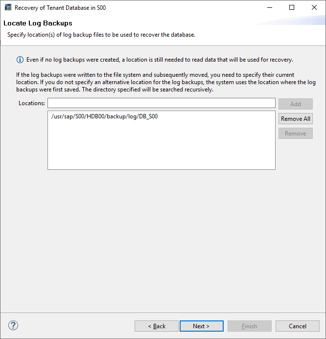{.thumbnail}
>>
> **Step 7**
>>
>> Take care of select the `Third-Party Backup Tool (Backint)`{.action} option and unselect the `File System`{.action} option.
>>
>> Then click on `Next`{.action}.
>>
>> {.thumbnail}
>>
> **Step 8**
>>
>> The recover of your SAP HANA database starts.
>>
>> 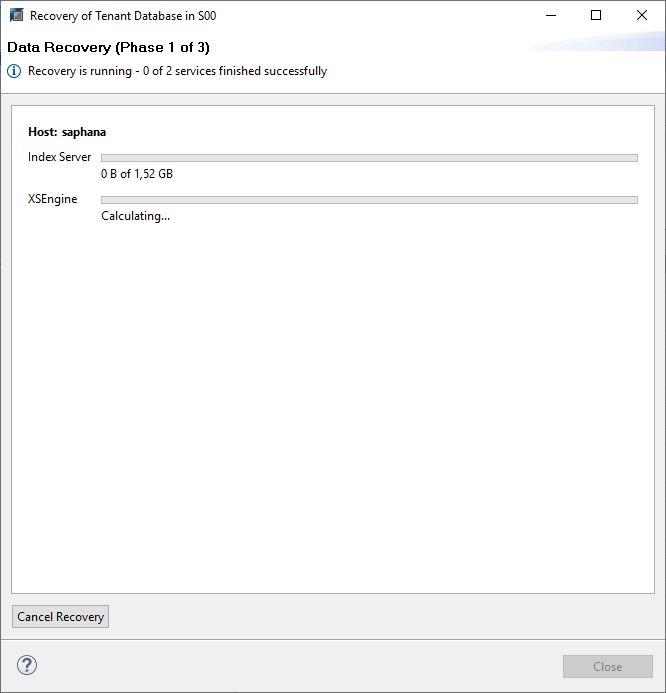{.thumbnail}
>>

Once the recover has been done successfully, your SAP HANA database is started and available.

## Go further

If you need training or technical assistance to implement our solutions, contact your sales representative or click on [this link](https://www.ovhcloud.com/en-sg/professional-services/) to get a quote and ask our Professional Services experts for assisting you on your specific use case of your project.

Join our community of users on <https://community.ovh.com/en/>.
