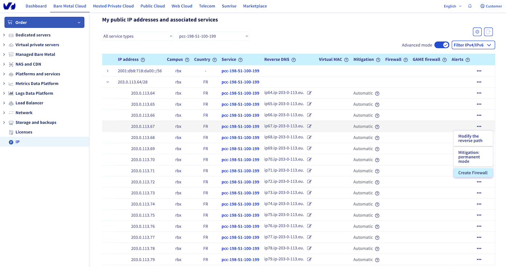
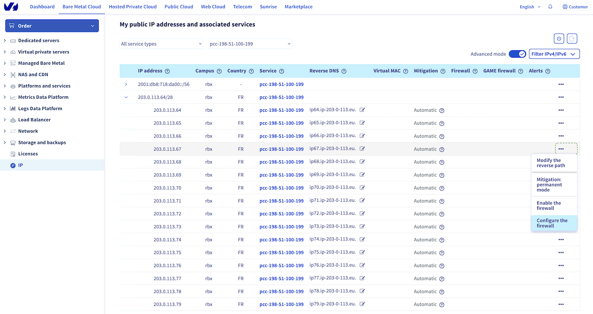
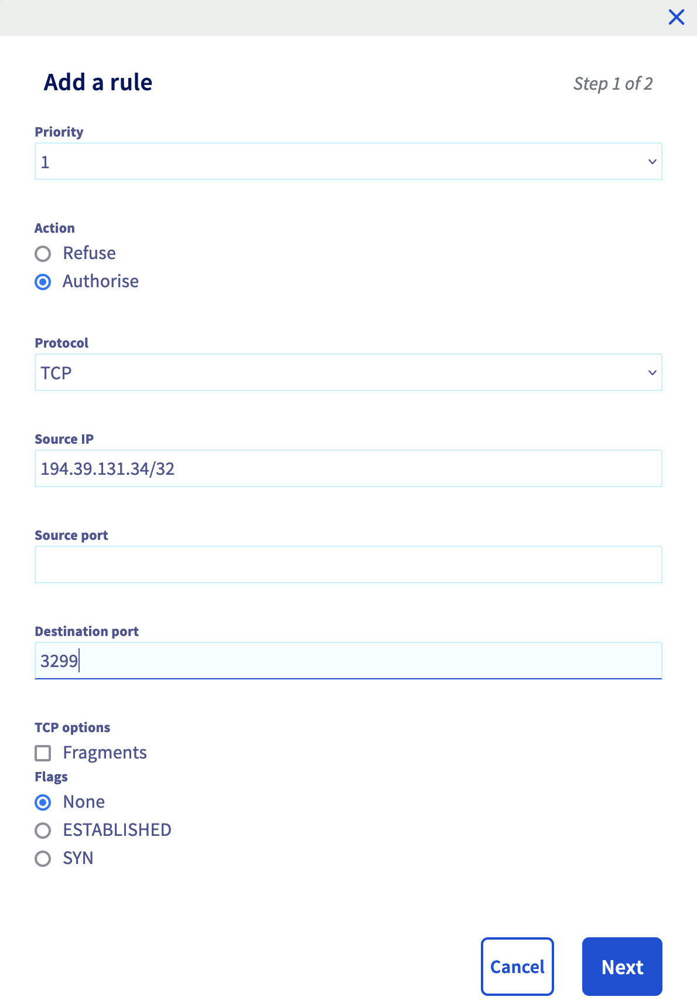
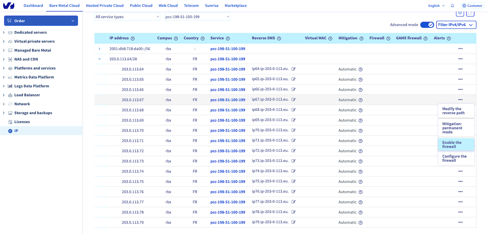
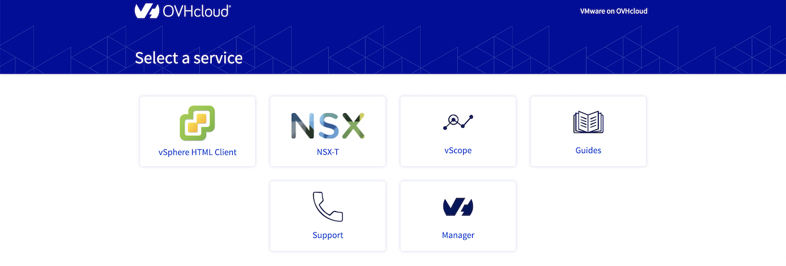
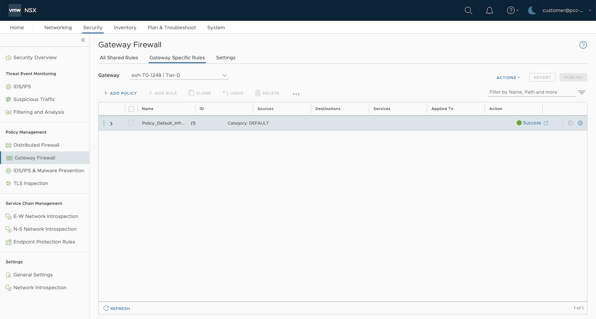
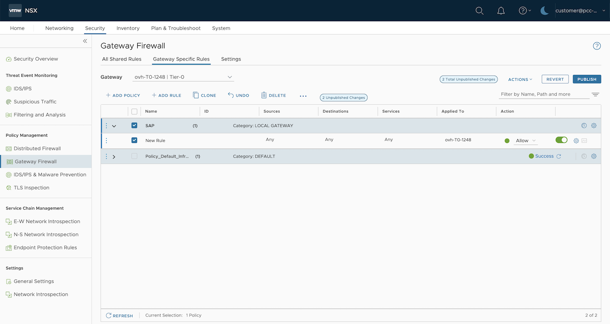
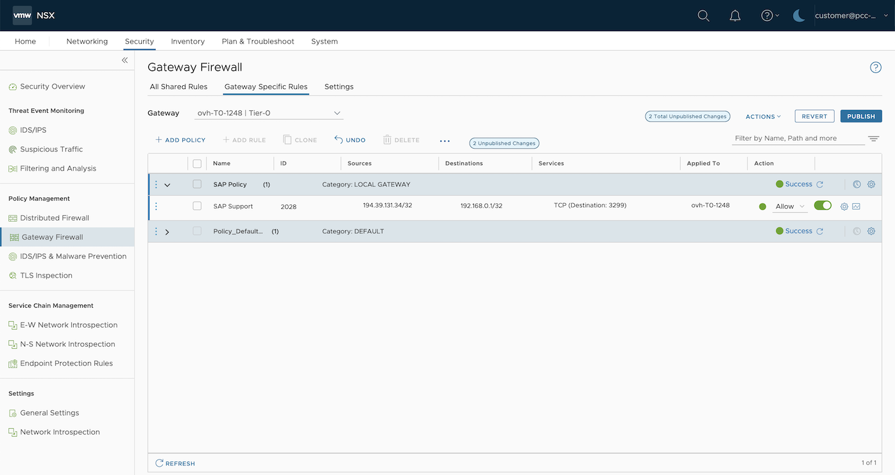
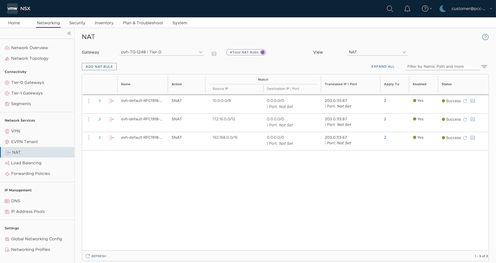
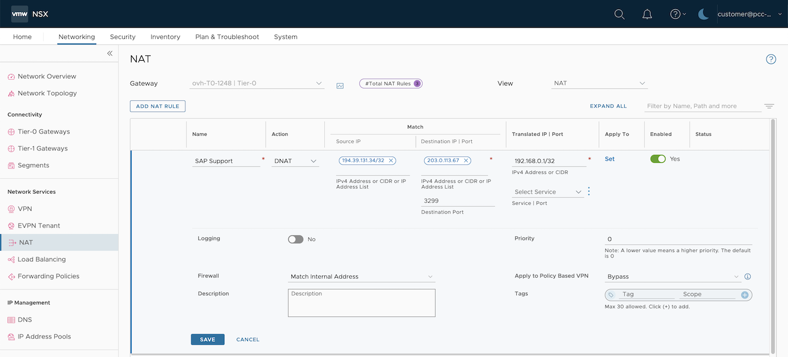

## Objectif

Ce guide vous détaille le déploiement d'un SAProuter sur VMware on OVHcloud avec NSX.

## Prérequis

- Être connecté à l’[espace client OVHcloud](https://www.ovh.com/auth/?action=gotomanager&from=https://www.ovh.com/fr/&ovhSubsidiary=fr).
- Une solution [VMware on OVHcloud](https://www.ovhcloud.com/fr/enterprise/products/hosted-private-cloud/) avec NSX déployée dans votre compte OVHcloud.
- Un accès avec les droits de gestion pour NSX.

## En pratique

### Configuration du Network Firewall

OVHcloud propose un pare-feu paramétrable et intégré à la solution Anti-DDoS, le Network Firewall. Cette option vous permet de limiter l’exposition de votre service aux attaques provenant du réseau public. Nous vous conseillons de l'activer pour l'adresse IP publique que vous utiliserez dans cette configuration.

Si vous n'avez pas créé de Network Firewall et de règles de filtrage réseau pour l'adresse IP publique de votre gateway NSX, suivez les instructions ci-dessous pour réaliser sa mise en oeuvre. Si vous êtes familier avec le Network Firewall, vous pouvez passer à l'étape 4 dédiée à la création de la règle pour le SAProuter.

> [!tabs]
> **Étape 1**
>>
>> Connectez-vous à votre [espace client OVHcloud](https://www.ovh.com/auth/?action=gotomanager&from=https://www.ovh.com/fr/&ovhSubsidiary=fr), ouvrez l'onglet `Bare Metal Cloud`{.action}, menu `Network`{.action} puis cliquez sur `IP`{.action}.
>>
>> Si vous possédez plusieurs adresses IP publiques ou services, vous pouvez soit filtrer avec les valeurs `Tous les types de service`{.action} et sélectionner `Hosting Private Cloud (VMware)`{.action}, soit avec les valeurs `Tous les services`{.action} et sélectionner votre solution VMware on OVHcloud.
>>
>> Dans notre documentation [Premiers pas avec NSX](/pages/hosted_private_cloud/hosted_private_cloud_powered_by_vmware/nsx-01-first-steps), le chapitre [Affichage de l'adresse IP virtuelle HA VIP](/pages/hosted_private_cloud/hosted_private_cloud_powered_by_vmware/nsx-01-first-steps/#displaying-the-ha-vip-virtual-ip-address) vous présente le moyen d'obtenir votre adresse IP publique portée par votre gateway NSX.
>>
>> Développez votre bloc d'adresses IPv4, sélectionnez l'adresse IPv4 utilisée par votre gateway NSX et cliquez sur `Créer Firewall`{.action}.
>>
>> {.thumbnail}
>>
> **Étape 2**
>> 
>> Cliquez sur `Configurer le firewall`{.action} pour entrer en mode édition dans votre Network Firewall.
>>
>> {.thumbnail}
>>
> **Étape 3**
>>
>> Nous vous conseillons de créer 2 règles par défaut dans votre Network Firewall.
>>
>> Cliquez sur `Ajouter une règle`{.action} puis renseignez ces informations :
>>
>> 1. La première règle a pour paramètres :
>>      - Priorité : 0
>>      - Action : Autoriser
>>      - Protocole : TCP
>>      - Drapeaux : ESTABLISHED
>>
>> Nous vous conseillons d'autoriser le protocole TCP sur toutes les adresses IP avec le drapeau `ESTABLISHED`. Cela vous permet de vérifier que le paquet fait partie d'une session précédemment ouverte/initiée. Si vous ne l'autorisez pas, le serveur ne recevra pas les retours du protocole TCP des requêtes SYN/ACK.
>>
>> <ol start="2"> <li>La seconde règle a pour paramètres :</li>
>> <ul>
>> <li>Priorité : 19</li>
>> <li>Action : Refuser</li>
>> <li>Protocole : IPv4</li>
>> </ul></ol>
>> Nous vous conseillons de refuser tout trafic de protocole IPv4 qui n'a été accepté par aucune règle antérieure.
>>
>> {.thumbnail}
>>
> **Étape 4**
>>
>> Créez la règle pour autoriser la connexion depuis les infrastructures du support SAP. 
>>
>> Cliquez sur `Ajouter une règle`{.action} puis renseignez ces informations :
>> 
>> - Priorité : 1
>> - Action : Autoriser
>> - Protocole : TCP
>> - IP source : 194.39.131.34/32
>> - Port de destination : 3299
>> - Drapeaux : Aucun
>>
>> {.thumbnail width="500" height="500"}
>>
>> Retrouvez plus d'information sur les adresses IP publiques du support SAP sur le [site du support SAP](https://support.sap.com/en/tools/connectivity-tools/saprouter/install-saprouter.html?anchorId=section_498561288).
>>
> **Étape 5**
>>
>> Après quelques secondes, la règle est active.
>>
>> {.thumbnail}
>>
> **Étape 6**
>>
>> Cliquez sur le bouton `Retour`{.action}, sélectionnez l'adresse IP où vous venez d'ajouter la règle et cliquez sur `Activer le firewall`{.action}.
>>
>> {.thumbnail}
>>

### Configuration de la gateway NSX

La gateway NSX est la passerelle entre Internet et votre infrastructure SAP hébergée sur votre solution VMware on OVHcloud. Il est nécessaire de la configurer pour permettre la connexion du support SAP à votre infrastructure SAP via le SAProuter.

#### Firewall

Nous vous recommandons de réaliser un filtrage réseau sur votre gateway NSX, en plus du filtrage réseau réalisé via le Network Firewall précédemment effectué.

Ce filtrage réseau sur votre gateway NSX permet de sécuriser l'exposition du SAProuter en cas de désactivation du Network Firewall sur votre adresse IP publique.

> [!tabs]
> **Étape 1**
>>
>> Connectez-vous à l'interface NSX en vous rendant à l'adresse de votre solution VMware on OVHcloud, puis en cliquant sur la tuile NSX.
>>
>> {.thumbnail}
>>
> **Étape 2**
>>
>> Cliquez sur l'onglet `Sécurité`{.action}, puis dans la catégorie `Gestion des stratégies`{.action}, cliquez sur `Pare-feu de passerelle`{.action} et sélectionnez votre gateway T0 « ovh-T0-xxxx ».
>>
>> {.thumbnail}
>>
> **Étape 3**
>>
>> Cliquez sur `Ajouter une stratégie`{.action}, puis donnez lui un nom (exemple: SAP). Cette stratégie regroupera l'ensemble des règles firewall que vous pourriez avoir en lien avec SAP.
>>
>> Sélectionnez votre nouvelle stratégie et cliquez sur `Ajouter une règle`{.action}.
>>
>> {.thumbnail}
>>
> **Étape 4**
>>
>> Saisissez les informations suivantes :
>>
>> - Nom : Support SAP
>> - Source : 194.39.131.34/32
>> - Destination : *Adresse IP privée de votre SAProuter*
>> - Service : TCP - Ports de destination : 3299
>> - Action : Autoriser
>>
>> {.thumbnail}
>>
> **Étape 5**
>>
>> Une fois la règle créée, cliquez sur `Publier`{.action} afin que les modifications soient prises en compte par la gateway NSX.
>>

#### NAT

Le SAProuter ne possède pas d'adresse IP publique configurée. Vous devez appliquer la configuration pour router le trafic sur le port tcp/3299 depuis l'adresse IP publique portée par votre gateway NSX vers votre SAProuter.

Pour cela, vous devez créer une règle de translation d'adresse (NAT) de destination.

Cette partie vous détaille les étapes pour créer une règle NAT de destination (DNAT) sur une gateway NSX.

> [!tabs]
> **Étape 1**
>>
>> Cliquez sur l'onglet `Mise en réseau`{.action}, puis dans la catégorie `Services réseau`{.action}, cliquez sur `NAT`{.action}.
>>
>> {.thumbnail}
>>
> **Étape 2**
>>
>> Sélectionnez votre gateway T0 « ovh-T0-xxxx », puis cliquez sur `Ajouter une règle NAT`{.action}.
>>
>> Veuillez saisir ces paramètres :
>> 
>> - Nom : SAP Support
>> - Action: DNAT
>> - IP source : 194.39.131.34/32
>> - Adresse IP | Port de destination : *Adresse IP publique de votre gateway NSX* | 3299
>> - Adresses IP traduites | Port : *Adresse IP privée de votre SAProuter* | *Vide*
>>
>> {.thumbnail}
>>
> **Étape 3**
>>
>> Une fois la règle DNAT créée, cliquez sur `Publier`{.action} afin que les modifications soient prises en compte par la gateway NSX.
>>

À présent, le trafic provenant de l'adresse IP publique 194.39.131.34/32 détenue par SAP à destination de l'adresse IP publique de votre gateway NSX sur le port tcp/3299 sera redirigé vers votre SAProuter.

### Installation du SAProuter

Pour la réalisation de l'installation du service SAProuter sur votre machine virtuelle dédiée à cet usage, nous vous recommandons de suivre les [instructions proposées par le support SAP](https://support.sap.com/en/tools/connectivity-tools/saprouter/install-saprouter.html). Des étapes doivent être réalisées sur votre espace SAP Support LaunchPad afin de sécuriser la communication entre le support SAP et le SAProuter.

Nous vous conseillons de mettre à jour régulièrement le SAProuter et de le positionner dans un réseau surveillé et isolé du réseau de votre infrastructure SAP. Le SAProuter ne doit communiquer avec votre infrastructure SAP que sur les ports nécessaires pour le support SAP.

[Ce guide](/pages/hosted_private_cloud/hosted_private_cloud_powered_by_vmware/nsx-06-manage-gateway-firewall) détaille les options disponibles lors de la configuration de règles de filtrage réseau sur une gateway NSX.

## Aller plus loin

- [Configurer le Network Firewall](/pages/bare_metal_cloud/dedicated_servers/firewall_network)
- [Instructions pour installer un SAProuter](https://support.sap.com/en/tools/connectivity-tools/saprouter/install-saprouter.html)
- [Gestion du pare-feu des passerelles dans NSX](/pages/hosted_private_cloud/hosted_private_cloud_powered_by_vmware/nsx-06-manage-gateway-firewall)

Si vous avez besoin d'une formation ou d'une assistance technique pour la mise en oeuvre de nos solutions, contactez votre commercial ou cliquez sur [ce lien](https://www.ovhcloud.com/fr/professional-services/) pour obtenir un devis et demander une analyse personnalisée de votre projet à nos experts de l’équipe Professional Services.

Échangez avec notre communauté d'utilisateurs sur <https://community.ovh.com>.