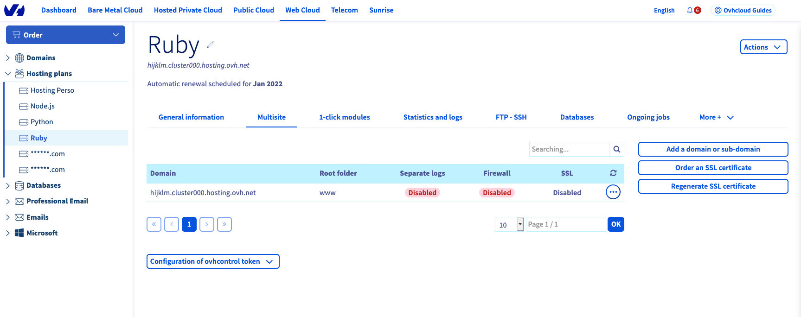
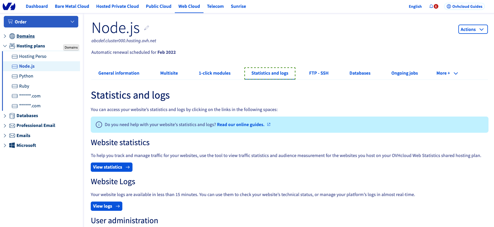

<style>
 pre {
     font-size: 14px;
 }
 pre.console {
   background-color: #300A24; 
   color: #ccc;
   font-family: monospace;
   padding: 5px;
   margin-bottom: 5px;
 }
 pre.console code {
   border: solid 0px transparent;
   font-family: monospace !important;
 }
 .small {
     font-size: 0.75em;
 }
</style>

**Last updated 3<sup>rd</sup> February 2021**

## Objective

You've subscribed to a Web POWER web hosting plan to deploy **Node.js**, **Python** or **Ruby** applications, and you want to begin developing your project.

This guide will explain how to manage your POWER web hosting using the [OVHcloud Control Panel](https://www.ovh.com/auth/?action=gotomanager) and the [OVHcloud APIs](https://api.ovh.com/).

**Find out how to get started with a POWER web hosting plan.**


## Requirements

- one of the 3 POWER web hosting plans: [Node.js](https://labs.ovh.com/managed-nodejs), [Python](https://labs.ovh.com/managed-python) ou [Ruby](https://labs.ovh.com/managed-ruby)
- access to the [OVH Control Panel](https://www.ovh.com/auth/?action=gotomanager)

## Instructions

### From the OVH Control Panel

The POWER web hosting management UI is in the `Web Cloud`{.action} section, at the `web hosting plans`{.action} section in the sidebar. 


{.thumbnail}

#### FTP - SSH access <a name="ssh"></a>

At the activation of your POWER web hosting plan, we have sent you an email with the SSH and FTP credentials. You can also manage them from the `FTP - SSH`{.action}.

{.thumbnail}

You will find detailed information of this topic in our [Accessing a web web hosting plan via SSH](../../web_hosting_ssh_on_web_hosting_packages/) guide.


#### Adding a domain name

For default, your POWER web hosting plan is attached to a generated URL. In order to use your own [domain name](https://www.ovh.com/world/domains/), you can add it in the `Multisite` {.action} tab.

{.thumbnail}

You will find detailed information of this topic in our [Hosting multiple websites on your Web Hosting plan](../../hosting/multisites-configuring-multiple-websites/) guide.


#### Using a database

Your POWER web hosting plan includes databases. They can be accessed from the `Databases`{.action} tab.

{.thumbnail}

You will find detailed information of this topic in our [Creating and managing a database in your Web Hosting plan](../../hosting/creating-database/) guide.


#### Accessing logs and statistics

Web server logs and website statistics are included in your POWER web hosting plan,under the `Statistics and logs`{.action} tab. 


{.thumbnail}

You will find detailed information of this topic in our [Accessing a website’s logs and statistics on a Web Hosting](../../hosting/shared_view_my_websites_logs_and_statistics/) guide.

### Node.js

#### Hello World in Node.js 

Let's suppose you have the default configuration for Node.js hosting:

- Runtime : nodejs 14   
- Entrypoint : index.js 
- DocumentRoot : www

> [!primary]
>
> To verify your configuration, you can use the [Retrieve active configuration](#api-get-active-configuration) API endpoint

Access via SSH to your POWER web hosting, go to the `www` folder and create and `index.js` file there:

`index.js`
```javascript
const http = require('http');
const port = 3000;
const msg = `Hello World from NodeJS ${process.version}\n`;
const server = http.createServer((req, res) => {
res.statusCode = 200;
res.setHeader('Content-Type', 'text/plain');
res.end(msg);
});
server.listen(port);
```


Then [restart your instance](#restart)

<pre class="console"><code>~ $ vi www/index.js
const http = require('http');
const port = 3000;
const msg = `Hello World from NodeJS ${process.version}\n`;
const server = http.createServer((req, res) => {
res.statusCode = 200;
res.setHeader('Content-Type', 'text/plain');
res.end(msg);
});
server.listen(port);

~ $ mkdir -p www/tmp
~ $ touch www/tmp/restart.txt</code></pre>


{.thumbnail}

### Python

#### Hello World in Python

Let's suppose you have the default configuration for Pyhton hosting:

- Runtime : Pyhton 3.7   
- Entrypoint : app.py
- DocumentRoot : www

> [!primary]
>
> To verify your configuration, you can use the [Retrieve active configuration](#api-get-active-configuration) API endpoint

Access via SSH to your POWER web hosting, go to the `www` folder and create and `app.py` file there:

`app.py`
```python
import sys
 
def application(environ, start_response):
    status = '200 OK'
    output = '\n'.join(['Hello World!', f"Version : {sys.version}",
                        f"Executable : {sys.executable}"])
 
    response_headers = [('Content-type', 'text/plain'),
                        ('Content-Length', str(len(output)))]
    start_response(status, response_headers)
 
    return [output]    
```

Then [restart your instance](#restart)


### Ruby

#### Hello World in Ruby 

Let's suppose you have the default configuration for Ruby hosting:

- Runtime : Ruby 2.6   
- Entrypoint : config.ru
- DocumentRoot : www

> [!primary]
>
> To verify your configuration, you can use the [Retrieve active configuration](#api-get-active-configuration) API endpoint

Access via SSH to your POWER web hosting, go to the `www` folder and create and `config.ru` file there:

`config.ru`
```ruby
require 'socket'
require 'timeout'
 
class Application
 
    def call(env)
        msg = "Hello World from ruby #{ RUBY_VERSION }p#{ RUBY_PATCHLEVEL }"
        [200, { "Content-Type" => "text/plain" }, [msg]]
    end
end
 
run Application.new
```

Then [restart your instance](#restart)

{.thumbnail}


### From the API

This tutorial presupposes that you already have some familiarity with the [OVHcloud APIs](https://api.ovh.com/). If you want to know more on this topic, please look at the [First Steps with the OVHcloud APIs](../../api/first-steps-with-ovh-api/) guide.

The [OVHcloud APIs](https://api.ovh.com/) currently available for POWER hosting plans are:

#### List available configurations

> [!api]
>
> @api {GET} /web hosting/web/{serviceName}/availableConfigurations


#### Retrieve active configuration <a name="api-get-active-configuration"></a>

> [!api]
>
> @api {GET} /web hosting/web/{serviceName}/configuration

> This endpoint allows you to verify your configuration parameters, for example your entry point
 
#### Modify active configuration

> [!api]
>
> @api {PUT} /web hosting/web/{serviceName}/configuration

> This endpoint allows you to modify your configuration parameters, for example your entry point

#### Restart the service

> [!api]
>
> @api {POST} /web hosting/web/{serviceName}/attachedDomain/{domain}/restart


### Setting up a redirection from HTTP to HTTPS

You can create an `.htacess` file in your POWER web hosting root folder (usually `www`) to set up a redirection from HTTP to HTTPS:

```
RewriteCond %{ENV:HTTPS} !on
RewriteRule (.*) https://%{HTTP_HOST}%{REQUEST_URI} [L,R=301]
```


<pre class="console"><code>~ $ cd www
~/www $ vi .htaccess
RewriteCond %{ENV:HTTPS} !on
RewriteRule (.*) https://%{HTTP_HOST}%{REQUEST_URI} [L,R=301]</code></pre>

### Restart your instance <a name="restart"></a>

Each time you modify your application, you should tell the server to restart it

In your document root you should `touch` the file `tmp/restart.txt` 


<pre class="console"><code>~ $ cd www
~/www$ mkdir tmp
~/www$ touch tmp/restart.txt</code></pre>

> [!primary]
>
> As this operation is performed on SSH server, you may need to wait before the web server notices your changes (max 30 seconds)

## Go further

[Accessing a web web hosting plan via SSH](../../web_hosting_ssh_on_web_hosting_packages/) 

[Hosting multiple websites on your Web Hosting plan](../../hosting/multisites-configuring-multiple-websites/)

[Creating and managing a database in your Web Hosting plan](../../hosting/creating-database/)

[Accessing a website’s logs and statistics on a Web Hosting](../../hosting/shared_view_my_websites_logs_and_statistics/)

Join our community of users on [https://community.ovh.com/en/](https://community.ovh.com/en/).


**Join [our Gitter room](https://gitter.im/ovh/power-web-hosting) to discuss directly with the POWER Web Hosting team and the other users of this lab**