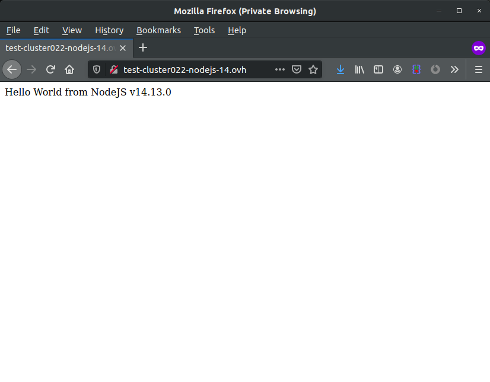

<style>
 pre {
     font-size: 14px;
 }
 pre.console {
   background-color: #300A24; 
   color: #ccc;
   font-family: monospace;
   padding: 5px;
   margin-bottom: 5px;
 }
 pre.console code {
   border: solid 0px transparent;
   font-family: monospace !important;
 }
 .small {
     font-size: 0.75em;
 }
</style>

**Dernière mise à jour le 03/02/2021**

## Objectif

Vous avez souscrit à un hébergement web POWER Node.js et vous voulez y deployer un projet basé sur [Express](https://expressjs.com/). Ce guide vous explique comment.

## Prérequis

- Disposer d'une de l'offre d'hébergement web POWER [Python](https://labs.ovh.com/managed-python).
- Être connecté à votre [espace client OVHcloud](https://www.ovh.com/auth/?action=gotomanager){.external}.

Si vous venez de commencer à utiliser votre hébergement web POWER, nous vous conseillons de consulter notre guide [Premiers pas avec un hébergement web POWER](../premiers-pas-avec-hebergement-web-POWER/) avant de poursuivre.

## En pratique

Supossons que vous avez la configuration normal pour un hébergement web POWER :

- Moteur : nodejs 14 
- Point d'entrée : index.js 
- Dossier racine : www 


> [!primary]
>
> Pour vérifier votre configuration, vous pouvez appeler en point d'entrée [Visualiser la configuration activ](../premiers-pas-avec-hebergement-web-POWER/#api-get-active-configuration) de l'API OVHcloud


[Accédez via SSH](../premiers-pas-avec-hebergement-web-POWER/#ssh) à votre hébergement web POWER et y installer Express avec `npm`: 

```sh
npm install express --save
```

Then go to the `www` folder and create and `index.js` file there:

`index.js`
```javascript
const express = require('express');
const port = 3000;
const msg = `Hello World from NodeJS ${process.version}\n`;
const app = express();app.get('/', function (req, res) {
res.send(msg);
});
app.listen(port);
```

Faites un [rédemarrage de votre instace](../premiers-pas-avec-hebergement-web-POWER/#restart), votre application Expresss sera en ligne.

{.thumbnail}

Sortie du terminal:

<pre class="console"><code>~/www $ cd www
~/www $ node -v
v14.13.0
~/www $ npm install express --save
~/www $ vi index.js
const express = require('express');
const port = 3000;
const msg = `Hello World from NodeJS ${process.version}\n`;
const app = express();app.get('/', function (req, res) {
res.send(msg);
});
app.listen(port);
~/www $ mkdir -p tmp
~/www $ touch tmp/restart.txt</code></pre>


## Aller plus loin

Échangez avec notre communauté d'utilisateurs sur <https://community.ovh.com/>.

**Pour discuter avec les autres utilisateurs du lab et avec l'équipe POWER Web Hosting, venez sur [notre room Gitter](https://gitter.im/ovh/power-web-hosting)**