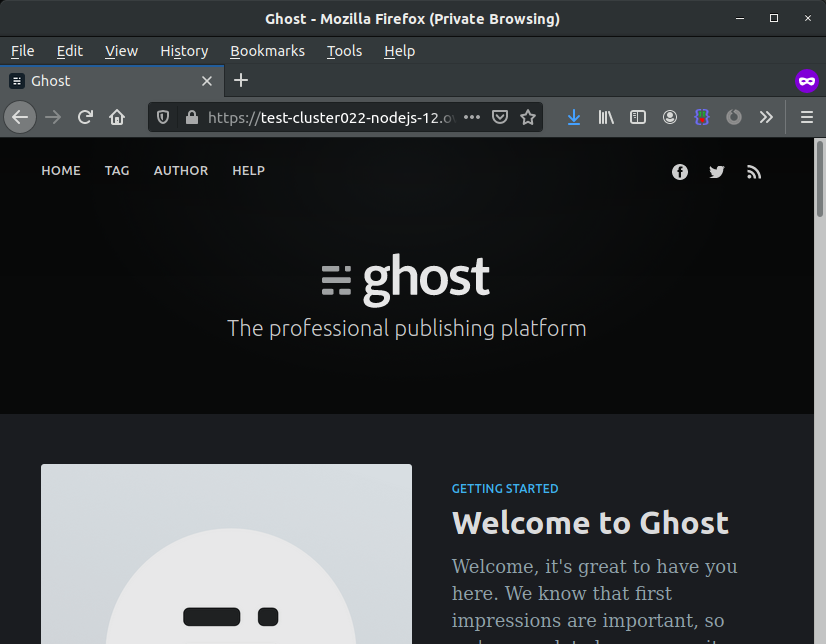

<style>
 pre {
     font-size: 14px;
 }
 pre.console {
   background-color: #300A24; 
   color: #ccc;
   font-family: monospace;
   padding: 5px;
   margin-bottom: 5px;
 }
 pre.console code {
   border: solid 0px transparent;
   font-family: monospace !important;
 }
 .small {
     font-size: 0.75em;
 }
</style>

**Dernière mise à jour le 03/02/2021**

## Objectif

Vous avez souscrit à un hébergement web POWER Node.js et vous voulez y deployer une plateforme de blog [Ghost](https://ghost.org/).

**Découvrez comment installer Ghost sur votre hébergement web POWER**

## Prérequis

- Disposer d'une de l'offre d'hébergement web POWER [Python](https://labs.ovh.com/managed-python).
- Être connecté à votre [espace client OVHcloud](https://ca.ovh.com/auth/?action=gotomanager){.external}.

Si vous venez de commencer à utiliser votre hébergement web POWER, nous vous conseillons de consulter notre guide [Premiers pas avec un hébergement web POWER](../premiers-pas-avec-hebergement-web-POWER/) avant de poursuivre.

## En pratique

Supposons que vous avez la configuration normale pour un hébergement web POWER :

- Moteur : nodejs 14 
- Point d'entrée : index.js 
- Dossier racine : www 


> [!primary]
>
> Vous pouvez appeler l'API OVHcloud pour [visualiser la configuration active](../premiers-pas-avec-hebergement-web-POWER/#api-get-active-configuration)


[Accédez via SSH](../premiers-pas-avec-hebergement-web-POWER/#ssh) à votre hébergement web POWER. 

Définissez le nom de domaine dans une variable `DOMAIN` :

```sh
echo "Enter your domain (my-domain.ovh for example):"
read DOMAIN
```

Installez Ghost dans votre repertoire principal (pas dans `www`) avec `npm` :

```sh
cd $HOME
npm install ghost-cli@latest
export PATH=$HOME/node_modules/.bin:$PATH
rm -rf www
# Install Ghost
ghost install local --development --dir www --no-setup --no-start --no-enable
# Setup configuration
cd www
cat << EOF > config.${OVH_ENVIRONMENT}.json
{
  "url": "https://${DOMAIN}",
  "paths": {
    "contentPath": "content"
  },
  "database": {
    "client": "sqlite3",
    "connection": {
      "filename": "content/data/ghost-development.db"
    },
    "useNullAsDefault": true,
    "debug": false
  }
}

EOF
# Symlink index.js entrypoint
VERSION=$(ghost --version | sed -n 's/Ghost version: \([0-9.]*\).*/\1/p')
ln -fs versions/${VERSION}/index.js index.js
```

[Rédemarrez votre instance](../premiers-pas-avec-hebergement-web-POWER/#restart), puis votre plateforme Ghost sera en ligne.

{.thumbnail}

Sortie du terminal:

<pre class="console"><code> $ echo "Enter your domain (my-domain.ovh for example):"
Enter your domain (my-domain.ovh for example):

~/www $ read DOMAIN
power.lostinbrittany.dev

~/www $ cd $HOME
~ $ npm install ghost-cli@latest
> yarn@1.22.10 preinstall /home/powerlp/node_modules/yarn
> :; (node ./preinstall.js > /dev/null 2>&1 || true)
[...]
+ ghost-cli@1.15.3
added 420 packages from 208 contributors and audited 420 packages in 20.791s
[...]
`npm audit fix` to fix them, or `npm audit` for details

~ $ export PATH=$HOME/node_modules/.bin:$PATH

~ $ rm -rf www

~ $ ghost install local --development --dir www --no-setup --no-start --no-enable
✔ Checking system Node.js version
✔ Checking current folder permissions
✔ Checking memory availability
✔ Checking free space
✔ Checking for latest Ghost version
✔ Setting up install directory
✔ Downloading and installing Ghost v3.41.3
✔ Finishing install process

~ $ cd www

~/www $ cat << EOF > config.${OVH_ENVIRONMENT}.json
> {
>   "url": "https://${DOMAIN}",
>   "paths": {
>     "contentPath": "content"
>   },
>   "database": {
>     "client": "sqlite3",
>     "connection": {
>       "filename": "content/data/ghost-development.db"
>     },
>     "useNullAsDefault": true,
>     "debug": false
>   }
> }
>
> EOF

~/www $ VERSION=$(ghost --version | sed -n 's/Ghost version: \([0-9.]*\).*/\1/p')

~/www $ ln -fs versions/${VERSION}/index.js index.js

~/www $ mkdir -p tmp

~/www $ touch tmp/restart.txt
</code></pre>


## Aller plus loin

Échangez avec notre communauté d'utilisateurs sur <https://community.ovh.com/>.

**Pour discuter avec les autres utilisateurs du lab et avec l'équipe POWER Web Hosting, venez sur [notre room Gitter](https://gitter.im/ovh/power-web-hosting)**