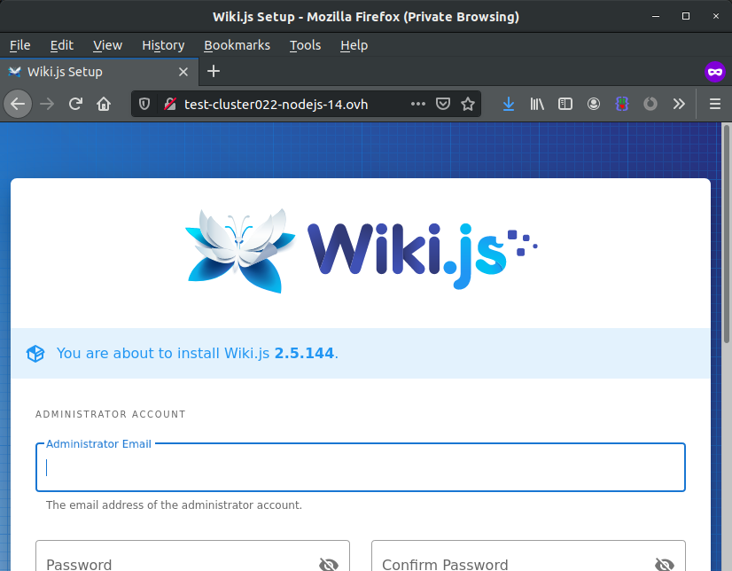

<style>
 pre {
     font-size: 14px;
 }
 pre.console {
   background-color: #300A24; 
   color: #ccc;
   font-family: monospace;
   padding: 5px;
   margin-bottom: 5px;
 }
 pre.console code {
   border: solid 0px transparent;
   font-family: monospace !important;
 }
 .small {
     font-size: 0.75em;
 }
</style>

**Dernière mise à jour le 03/02/2021**

## Objectif

Vous avez souscrit à un hébergement web POWER Node.js et vous voulez y deployer un wiki basé sur [WikiJS](https://wiki.js.org/). Ce guide vous explique comment.

## Prérequis

- Disposer d'une de l'offre d'hébergement web POWER [Python](https://labs.ovh.com/managed-python).
- Être connecté à votre [espace client OVHcloud](https://www.ovh.com/auth/?action=gotomanager){.external}.

Si vous venez de commencer à utiliser votre hébergement web POWER, nous vous conseillons de consulter notre guide [Premiers pas avec un hébergement web POWER](../premiers-pas-avec-hebergement-web-POWER/) avant de poursuivre.

## En pratique

Supossons que vous avez la configuration normal pour un hébergement web POWER :

- Moteur : nodejs 14 
- Point d'entrée : index.js 
- Dossier racine : www 


> [!primary]
>
> Pour vérifier votre configuration, vous pouvez appeler en point d'entrée [Visualiser la configuration activ](../premiers-pas-avec-hebergement-web-POWER/#api-get-active-configuration) de l'API OVHcloud


[Accédez via SSH](../premiers-pas-avec-hebergement-web-POWER/#ssh) à votre hébergement web POWER. 

Allez sur `www` et téléchargez le fichier d'installation de WikiJS :

```sh
cd www
wget https://github.com/Requarks/wiki/releases/download/2.5.170/wiki-js.tar.gz
tar xzf wiki-js.tar.gz
rm -f wiki-js.tar.gz
```

Créez un fichier de configuration `config.yml` :

```yaml
port: 3000
db:
  type: sqlite
  storage: database.sqlite
logLevel: info
dataPath: ./data
```

recompilez le module `sqlite3` : 

```sh
npm rebuild sqlite3
```

Établisez un lien symbolique pour le point d'entrée:

```sh
ln -fs server/index.js index.js
```


Faites un [rédemarrage de votre instace](../premiers-pas-avec-hebergement-web-POWER/#restart), votre CMS sur Strapi sera en ligne.

{.thumbnail}


Sortie de la console:

<pre class="console"><code> ~ $ rm -rf www

~ $ npx create-strapi-app www --quickstart --no-run
npx : 91 installé(s) en 6.741s
Creating a new Strapi application at /home/user/www.
Creating a quickstart project.
Creating files.
Dependencies installed successfully.
[...]

~ $ cat << 'EOF' > www/index.js
const strapi = require('strapi');
 
strapi(/* {...} */).start();
EOF
~ $ cat << 'EOF' > www/.htaccess
RewriteCond %{ENV:HTTPS} !on
RewriteRule (.*) https://%{HTTP_HOST}%{REQUEST_URI} [L,R=301]
EOF

~/www $ mkdir -p tmp

~/www $ touch tmp/restart.txt

</code></pre>


## Aller plus loin

Échangez avec notre communauté d'utilisateurs sur <https://community.ovh.com/>.

**Pour discuter avec les autres utilisateurs du lab et avec l'équipe POWER Web Hosting, venez sur [notre room Gitter](https://gitter.im/ovh/power-web-hosting)**