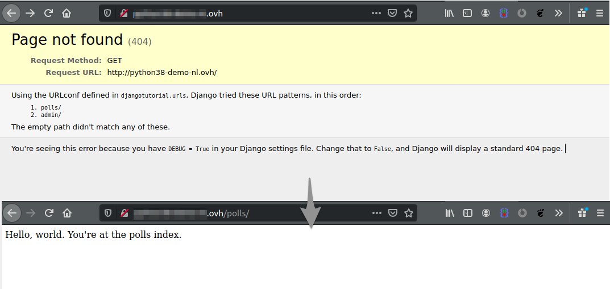
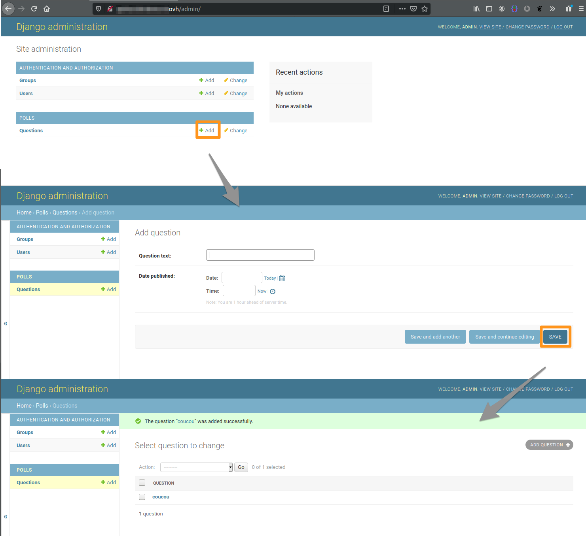

**Dernière mise à jour le 25/01/2021**

## Objectif

Vous souhaitez bénéficier d'un environement de dévellopement simple vous permettant d'être rapide, le framework Django répond à ces qualités.

**Découvrez comment installer Django sur votre hébergement web POWER**

## Prérequis

- Disposer d'une de l'offre d'hébergement web POWER [Python](https://labs.ovh.com/managed-python).
- Être connecté à votre [espace client OVHcloud](https://www.ovh.com/auth/?action=gotomanager){.external}.

Si vous venez de commencer à utiliser votre hébergement web POWER, nous vous conseillons de consulter notre guide [Premiers pas avec un hébergement web POWER](../premiers-pas-avec-hebergement-web-POWER/) avant de poursuivre.

## En pratique

### Installer et mettre en ligne une première page

Point d'entrée : app.py <br>
Dossier racine : www <br>


Pour utiliser les frameworks python wsgi, i lest plus simple d'utiliser virtualenv.

```sh
~$ cd www
~/www$ virtualenv venv
~/www$ source venv/bin/activate
```

Mettez à jour `pip`

```sh
~/www$ pip install --upgrade pip
```

Installez maintenant Django

```sh
~/www$ pip install django
Collecting django
Downloading Django-3.1.2-py3-none-any.whl (7.8 MB)
|████████████████████████████████| 7.8 MB 7.3 MB/s
Collecting asgiref~=3.2.10
Downloading asgiref-3.2.10-py3-none-any.whl (19 kB)
Collecting pytz
Downloading pytz-2020.1-py2.py3-none-any.whl (510 kB)
|████████████████████████████████| 510 kB 58.7 MB/s
Collecting sqlparse>=0.2.2
Downloading sqlparse-0.3.1-py2.py3-none-any.whl (40 kB)
|████████████████████████████████| 40 kB 7.4 MB/s
Installing collected packages: asgiref, pytz, sqlparse, django
Successfully installed asgiref-3.2.10 django-3.1.2 pytz-2020.1 sqlparse-0.3.1
```

Créez le nouveau project Django

```sh
django-admin startproject config
```

Par défaut, l'application `wsgi` de Django se trouve dans `config/wsgi.py`
Comme le point d'entrée configuré est `app.py`, vous pouvez créer le lien symbolique suivant :

```sh
~/www$ ln -s config/wsgi.py app.py
```

Django est installé dans un environnement virtuel, nous devez demander à l'application de l'utiliser. Nous pouvez le faire en ajoutant ces 2 lignes dans `app.py` avant l'importation de django.

```sh
this_file = "venv/bin/activate_this.py"
exec(open(this_file).read(), {'__file__': this_file})
```

Vous obtenez alors ceci :

```sh
~/www $ cat app.py
"""
WSGI config for config project.
 
It exposes the WSGI callable as a module-level variable named ``application``.
 
For more information on this file, see
https://docs.djangoproject.com/en/3.1/howto/deployment/wsgi/
"""
 
import os
 
this_file = "venv/bin/activate_this.py"
exec(open(this_file).read(), {'__file__': this_file})
 
from django.core.wsgi import get_wsgi_application
 
os.environ.setdefault('DJANGO_SETTINGS_MODULE', 'config.settings')
 
application = get_wsgi_application()
```

Django doit déclarer les hôtes autorisés pour le site Web. Il sont déclarés dans config/settings.py , par exemple :

```sh
ALLOWED_HOSTS = ['yourdomainname', 'www.yourdomainname', 'yourftpuser.cluster022.hosting.ovh.net']
```

La démo Django est prête, n'oubliez pas de redémarrer si nécessaire.

### installer une application

Nous allons donc commencer par lancer l'application.

```sh
pythontest@ssh00.cluster000.gra.hosting.ovh.net (python/3.8/development) ~ $ cd www/
pythontest@ssh00.cluster000.gra.hosting.ovh.net (python/3.8/development) ~/www $ python manage.py startapp polls
pythontest@ssh00.cluster000.gra.hosting.ovh.net (python/3.8/development) ~/www $ ls -ltr
total 6
-rwxr-xr-x+ 1 pythonz users 670 oct.  28 20:18 manage.py
lrwxrwxrwx  1 pythonz users  22 oct.  28 20:19 app.py -> config/wsgi.py
drwxr-xr-x+ 2 pythonz users   3 oct.  28 20:20 tmp
drwxr-xr-x+ 2 pythonz users   3 oct.  28 20:26 __pycache__
drwxr-xr-x+ 3 pythonz users   8 oct.  28 20:28 config
drwxr-xr-x+ 3 pythonz users   9 oct.  28 20:35 polls
```

Créez le chemin (route) pour pouvoir appeler l'application.

```sh
pythontest@ssh00.cluster000.gra.hosting.ovh.net (python/3.8/development) ~/www $ cat << 'EOF' > polls/views.py
from django.http import HttpResponse
 
 
def index(request):
    return HttpResponse("Hello, world. You're at the polls index.")
EOF
 
pythontest@ssh00.cluster000.gra.hosting.ovh.net (python/3.8/development) ~/www $ cat << 'EOF' > polls/urls.py
from django.urls import path
 
from . import views
 
urlpatterns = [
    path('', views.index, name='index'),
]
EOF
 
pythontest@ssh00.cluster000.gra.hosting.ovh.net (python/3.8/development) ~/www $ cat << 'EOF' > config/urls.py
from django.contrib import admin
from django.urls import include, path
 
urlpatterns = [
    path('polls/', include('polls.urls')),
    path('admin/', admin.site.urls),
]
EOF
```

Redemmarrez **passenger**.

```sh
pythontest@ssh00.cluster000.gra.hosting.ovh.net (python/3.8/development) ~/www $ touch tmp/restart.txt
```

Vous devriez obtenir quelque chose comme ceci.

{.thumbnail}

Mettre à jour notre modèle pour pouvoir afficher autre chose que "Hello World".

```sh
pythontest@ssh00.cluster000.gra.hosting.ovh.net (python/3.8/development) ~/www $ python manage.py migrate
Operations to perform:
  Apply all migrations: admin, auth, contenttypes, sessions
Running migrations:
  Applying contenttypes.0001_initial... OK
  Applying auth.0001_initial... OK
  Applying admin.0001_initial... OK
  Applying admin.0002_logentry_remove_auto_add... OK
  Applying admin.0003_logentry_add_action_flag_choices... OK
  Applying contenttypes.0002_remove_content_type_name... OK
  Applying auth.0002_alter_permission_name_max_length... OK
  Applying auth.0003_alter_user_email_max_length... OK
  Applying auth.0004_alter_user_username_opts... OK
  Applying auth.0005_alter_user_last_login_null... OK
  Applying auth.0006_require_contenttypes_0002... OK
  Applying auth.0007_alter_validators_add_error_messages... OK
  Applying auth.0008_alter_user_username_max_length... OK
  Applying auth.0009_alter_user_last_name_max_length... OK
  Applying auth.0010_alter_group_name_max_length... OK
  Applying auth.0011_update_proxy_permissions... OK
  Applying auth.0012_alter_user_first_name_max_length... OK
  Applying sessions.0001_initial... OK
 
pythontest@ssh00.cluster000.gra.hosting.ovh.net (python/3.8/development) ~/www $ cat << 'EOF' > polls/models.py
from django.db import models
 
 
class Question(models.Model):
    question_text = models.CharField(max_length=200)
    pub_date = models.DateTimeField('date published')
 
 
class Choice(models.Model):
    question = models.ForeignKey(Question, on_delete=models.CASCADE)
    choice_text = models.CharField(max_length=200)
    votes = models.IntegerField(default=0)
EOF
```

Mettre à jour les paramètres depuis cette version.

```sh
pythontest@ssh00.cluster000.gra.hosting.ovh.net (python/3.8/development) ~/www $ cat config/settings.py
...
# Application definition
 
INSTALLED_APPS = [
    'django.contrib.admin',
    'django.contrib.auth',
    'django.contrib.contenttypes',
    'django.contrib.sessions',
    'django.contrib.messages',
    'django.contrib.staticfiles',
]
 
...
```
Vers la version.

```sh
pythontest@ssh00.cluster000.gra.hosting.ovh.net (python/3.8/development) ~/www $ cat config/settings.py
...
INSTALLED_APPS = [
    'polls.apps.PollsConfig',
    'django.contrib.admin',
    'django.contrib.auth',
    'django.contrib.contenttypes',
    'django.contrib.sessions',
    'django.contrib.messages',
    'django.contrib.staticfiles',
]
...
```

Lancer une nouvelle migration et créer les tables

```sh
pythontest@ssh00.cluster000.gra.hosting.ovh.net (python/3.8/development) ~/www $ python manage.py makemigrations polls
Migrations for 'polls':
  polls/migrations/0001_initial.py
    - Create model Question
    - Create model Choice
 
pythontest@ssh00.cluster000.gra.hosting.ovh.net (python/3.8/development) ~/www $ python manage.py sqlmigrate polls 0001
BEGIN;
--
-- Create model Question
--
CREATE TABLE "polls_question" ("id" integer NOT NULL PRIMARY KEY AUTOINCREMENT, "question_text" varchar(200) NOT NULL, "pub_date" datetime NOT NULL);
--
-- Create model Choice
--
CREATE TABLE "polls_choice" ("id" integer NOT NULL PRIMARY KEY AUTOINCREMENT, "choice_text" varchar(200) NOT NULL, "votes" integer NOT NULL, "question_id" integer NOT NULL REFERENCES "polls_question" ("id") DEFERRABLE INITIALLY DEFERRED);
CREATE INDEX "polls_choice_question_id_c5b4b260" ON "polls_choice" ("question_id");
COMMIT;
```

Et le dernier modèle de migration et de mise à niveau

```sh
pythontest@ssh00.cluster000.gra.hosting.ovh.net (python/3.8/development) ~/www $ python manage.py migrate
Operations to perform:
  Apply all migrations: admin, auth, contenttypes, polls, sessions
Running migrations:
  Applying polls.0001_initial... OK
 
 
pythontest@ssh00.cluster000.gra.hosting.ovh.net (python/3.8/development) ~/www $ cat << 'EOF' > polls/models.py
import datetime
 
from django.db import models
from django.utils import timezone
 
 
class Question(models.Model):
    question_text = models.CharField(max_length=200)
    pub_date = models.DateTimeField('date published')
    def __str__(self):
        return self.question_text
    def was_published_recently(self):
        return self.pub_date >= timezone.now() - datetime.timedelta(days=1)
 
 
class Choice(models.Model):
    question = models.ForeignKey(Question, on_delete=models.CASCADE)
    choice_text = models.CharField(max_length=200)
    votes = models.IntegerField(default=0)
    def __str__(self):
        return self.question_text
EOF
```

Maintenant le modèle en place et correct, créez un utilisateur "admin" et une façon d'y accéder via notre WebUI.

```sh
pythontest@ssh00.cluster000.gra.hosting.ovh.net (python/3.8/development) ~/www $ python manage.py createsuperuser
Username (leave blank to use 'pythonz'): admin
Email address: admin@mydomain.com
Password:
Password (again):
Superuser created successfully.
 
pythontest@ssh00.cluster000.gra.hosting.ovh.net (python/3.8/development) ~/www $ grep STATIC_URL config/settings.py
STATIC_URL = '/static/'
pythontest@ssh00.cluster000.gra.hosting.ovh.net (python/3.8/development) ~/www $ echo 'STATIC_ROOT = "'${HOME}'/www/static/"' >> config/settings.py
pythontest@ssh00.cluster000.gra.hosting.ovh.net (python/3.8/development) ~/www $ python manage.py collectstatic
 
132 static files copied to '/homez.41/pythonz/www/static'.
 
pythontest@ssh00.cluster000.gra.hosting.ovh.net (python/3.8/development) ~/www $ cat << 'EOF' > config/urls.py
from django.contrib import admin
from django.urls import include, path
from django.conf import settings
from django.conf.urls.static import static
 
urlpatterns = [
    path('polls/', include('polls.urls')),
    path('admin/', admin.site.urls),
] + static(settings.STATIC_URL, document_root=settings.STATIC_ROOT)
EOF
```

Redémarrez **passenger**.

```sh
pythontest@ssh00.cluster000.gra.hosting.ovh.net (python/3.8/development) ~/www $ touch tmp/restart.txt
```

Vous êtes maintenant connecté

{.thumbnail}

Vous pouvez maintenant ajouter une question, puis redémarrer votre application.

```sh
pythontest@ssh00.cluster000.gra.hosting.ovh.net (python/3.8/development) ~/www $ cat << 'EOF' > polls/admin.py
from django.contrib import admin
 
from .models import Question
 
admin.site.register(Question)
EOF
 
pythontest@ssh00.cluster000.gra.hosting.ovh.net (python/3.8/development) ~/www $ touch tmp/restart.txt
```

{.thumbnail}

### Plus d'informations sur Django

Retrouvez la documentation officiel de Django sur <https://docs.djangoproject.com/fr/3.1/>

## Aller plus loin

Échangez avec notre communauté d'utilisateurs sur <https://community.ovh.com/>.