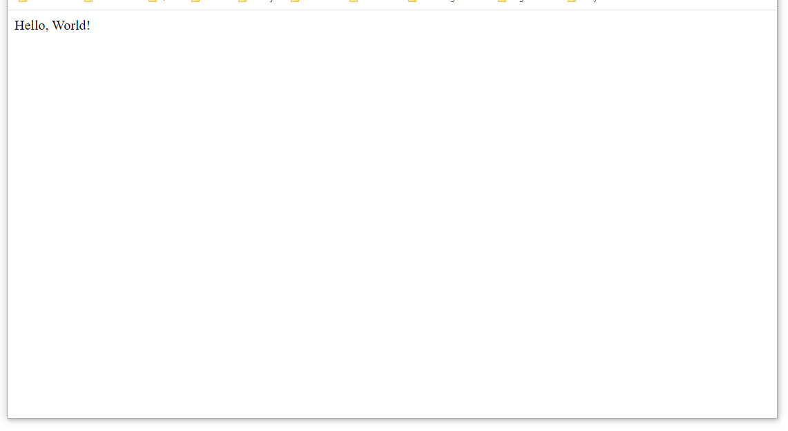

<style>
 pre {
     font-size: 14px;
 }
 pre.console {
   background-color: #300A24; 
   color: #ccc;
   font-family: monospace;
   padding: 5px;
   margin-bottom: 5px;
 }
 pre.console code {
   border: solid 0px transparent;
   font-family: monospace !important;
 }
 .small {
     font-size: 0.75em;
 }
</style>

**Last updated 5th January 2021**

## Objective

You've subscribed to a Web POWER web hosting plan to deploy **Python** applications, and you want to deploy [Flask](https://flask.palletsprojects.com/en/1.1.x/){.external} on it.

This guide will explain how to do it.


**Find out how to install Flask on your POWER web hosting plan.**


## Requirements

- A [Python](https://labs.ovh.com/managed-python) POWER web hosting plan
- access to the [OVHcloud Control Panel](https://www.ovh.com/auth/?action=gotomanager&from=https://www.ovh.co.uk/&ovhSubsidiary=GB)

If you have just started to use your Web POWER web hosting plan, we suggest to have a look at our [Getting started with a POWER web hosting plan](../getting-started-with-power-web-hosting/) guide before going further.

## Instructions


Let's suppose you have the default configuration for Python hosting:

- Runtime: Python 3.8   
- Entrypoint: app.py 
- DocumentRoot: www

> [!primary]
>
> To verify your configuration, you can use the [Retrieve active configuration](../getting-started-with-power-web-hosting/#api-get-active-configuration) API endpoint.


To use [Python WSGI](https://www.fullstackpython.com/wsgi-servers.html) frameworks, using [virtualenv](https://pypi.org/project/virtualenv/) is the simplest choice. 

[Connect via SSH](../getting-started-with-power-web-hosting/#ssh) to your POWER web hosting and activate `virtualenv`:


```sh
cd www
virtualenv venv
source venv/bin/activate
```

Update `pip`:

```sh
pip install --upgrade pip
```

Install Flask.

```sh
pip install Flask
```

Create `app.py` with the following content, using the same trick to activate the  `virtualenv`:

```python
this_file = "venv/bin/activate_this.py"
exec(open(this_file).read(), {'__file__': this_file})
 
from flask import Flask
application = Flask(__name__)
 
@application.route('/')
def hello_world():
    return 'Hello, World!'
```

Then [restart your instance](../getting-started-with-power-web-hosting/#restart) and your Flask project will be online.


{.thumbnail}


Terminal output:

<pre class="console"><code>~ $ cd www

~/www $ virtualenv venv
created virtual environment CPython3.8.7.final.0-64 in 1273ms
  creator CPython3Posix(dest=/home/powerlp/www/venv, clear=False, global=False)
  seeder FromAppData(download=False, pip=bundle, setuptools=bundle, wheel=bundle, via=copy, app_data_dir=/home/powerlp/.local/share/virtualenv)
    added seed packages: pip==20.2.2, setuptools==49.6.0, wheel==0.35.1
  activators BashActivator,CShellActivator,FishActivator,PowerShellActivator,PythonActivator,XonshActivator

~/www $ source venv/bin/activate

~/www $ pip install --upgrade pip
Collecting pip
  Using cached pip-21.0.1-py3-none-any.whl (1.5 MB)
Installing collected packages: pip
  Attempting uninstall: pip
    Found existing installation: pip 20.2.2
    Uninstalling pip-20.2.2:
      Successfully uninstalled pip-20.2.2
Successfully installed pip-21.0.1

~/www $ pip install Flask
Collecting Flask
  Using cached Flask-1.1.2-py2.py3-none-any.whl (94 kB)
Collecting itsdangerous>=0.24
  Using cached itsdangerous-1.1.0-py2.py3-none-any.whl (16 kB)
Collecting Werkzeug>=0.15
  Using cached Werkzeug-1.0.1-py2.py3-none-any.whl (298 kB)
Collecting click>=5.1
  Using cached click-7.1.2-py2.py3-none-any.whl (82 kB)
Collecting Jinja2>=2.10.1
  Using cached Jinja2-2.11.3-py2.py3-none-any.whl (125 kB)
Collecting MarkupSafe>=0.23
  Using cached MarkupSafe-1.1.1-cp38-cp38-manylinux2010_x86_64.whl (32 kB)
Installing collected packages: MarkupSafe, Werkzeug, Jinja2, itsdangerous, click, Flask
Successfully installed Flask-1.1.2 Jinja2-2.11.3 MarkupSafe-1.1.1 Werkzeug-1.0.1 click-7.1.2 itsdangerous-1.1.0


~/www $ mkdir -p tmp

~/www $ touch tmp/restart.txt
</code></pre>


## Go further

Join our community of users on [https://community.ovh.com/en/](https://community.ovh.com/en/).

**Join [our Gitter room](https://gitter.im/ovh/power-web-hosting) to discuss directly with the POWER Web Hosting team and the other users of this lab.**