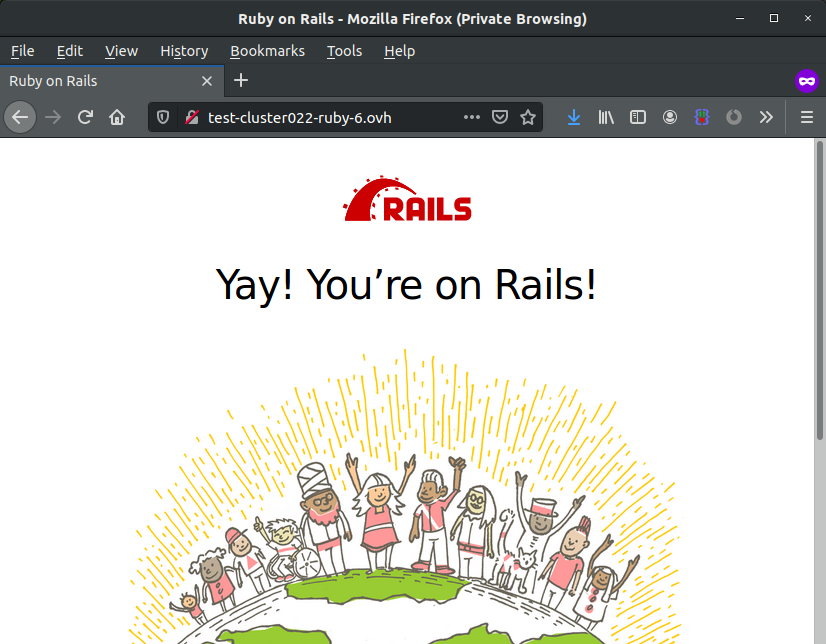
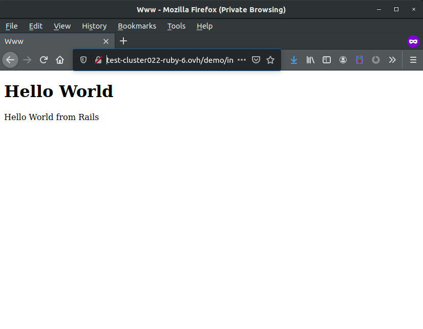

<style>
 pre {
     font-size: 14px;
 }
 pre.console {
   background-color: #300A24; 
   color: #ccc;
   font-family: monospace;
   padding: 5px;
   margin-bottom: 5px;
 }
 pre.console code {
   border: solid 0px transparent;
   font-family: monospace !important;
 }
 .small {
     font-size: 0.75em;
 }
</style>

**Dernière mise à jour le 03/02/2021**


## Objectif

Vous avez souscrit à un hébergement web POWER Ruby et vous voulez y deployer [Rails](https://rubyonrails.org/), le framework de développement d'applications web en Ruby.

**Découvrez comment installer Rails sur votre hébergement web POWER**


## Prérequis

- Disposer d'une de l'offre d'hébergement web POWER [ruby](https://labs.ovh.com/managed-ruby).
- Être connecté à votre [espace client OVHcloud](https://ca.ovh.com/auth/?action=gotomanager){.external}.

Si vous venez de commencer à utiliser votre hébergement web POWER, nous vous conseillons de consulter notre guide [Premiers pas avec un hébergement web POWER](../premiers-pas-avec-hebergement-web-POWER/) avant de poursuivre.


## En pratique

Supposons que vous avez la configuration normale pour un hébergement web POWER :

- Moteur : ruby 2.6 
- Point d'entrée : config.ru 
- Dossier racine : www 


> [!primary]
>
> Vous pouvez appeler l'API OVHcloud pour [visualiser la configuration active](../premiers-pas-avec-hebergement-web-POWER/#api-get-active-configuration)


[Accédez via SSH](../premiers-pas-avec-hebergement-web-POWER/#ssh) à votre hébergement web POWER. 

Supprimez le dossier racine pour l'initialiser avec Rails. N'oubliez pas d'exporter votre `gempath`ou l'installation du bundle va échouer :

```sh
rm -rf www
gem env gempath
export GEM_HOME=$(gem env gempath | cut -d ':' -f1)
rails new www
cd www/
rails  webpacker:install
```

Déclarez votre nom de domaine sur liste blanche dans `www/config/environments/development.rb` :

```ruby
Rails.application.configure do
  # Whitelist one hostname
  config.hosts << "your-domain.ovh"
```

Et désactivez la vérification `check_yarn_integrity` dans la partie `development` de `www/config/webpacker.yml` :

```yaml
development:
  <<: *default
  compile: true

  # Verifies that correct packages and versions are installed by inspecting package.json, yarn.lock, and node_modules
  check_yarn_integrity: false
```

[Rédemarrez votre instance](../premiers-pas-avec-hebergement-web-POWER/#restart), votre Rails sera en ligne.


{.thumbnail}


Générez maintenant un *Hello World* avec Rails.

```sh
export SPRING_SERVER_COMMAND="$HOME/www/bin/spring server"
rails generate controller demo index
```

Et créez un fichier `app/views/demo/index.html.erb`.
 
 ```html
vim app/views/demo/index.html.erb
<h1>Hello World</h1>
<p>Hello World from Rails</p>
```

Ensuite construisez le *Hello World*.

```sh
./bin/webpack
```

Après redémarrage de votre instance, vous pourez visualser votre page dans https://&lt;votre-nom-de-domaine>/demo/index.html

{.thumbnail}

Sortie de la console:

<pre class="console"><code>~ $ rm -rf www

~ $ gem env gempath
/homez.41/powerlp/.gem/ruby/2.6.0:/usr/local/ruby2.6/lib/ruby/gems/2.6.0

~ $ rails new www
      create
      create  README.md
      create  Rakefile
      create  .ruby-version
[...]
Fetching webpacker 4.3.0
Installing webpacker 4.3.0
Bundle complete! 17 Gemfile dependencies, 75 gems now installed.
Use `bundle info [gemname]` to see where a bundled gem is installed.
         run  bundle binstubs bundler
[...]   
Installing all JavaScript dependencies [4.3.0]
         run  yarn add @rails/webpacker@4.3.0 from "."
yarn add v1.22.10
[...]
├─ strip-eof@1.0.0
├─ thunky@1.1.0
├─ type-is@1.6.18
├─ unpipe@1.0.0
├─ url-parse@1.4.7
├─ utils-merge@1.0.1
├─ wbuf@1.7.3
├─ webpack-dev-middleware@3.7.3
├─ webpack-dev-server@3.11.2
├─ websocket-driver@0.7.4
├─ websocket-extensions@0.1.4
└─ ws@6.2.1
Done in 6.19s.
Webpacker successfully installed 🎉 🍰

~ $ cd www/

~/www $ rails  webpacker:install
   identical  config/webpacker.yml
Copying webpack core config
       exist  config/webpack
   identical  config/webpack/development.js
   identical  config/webpack/environment.js
   identical  config/webpack/production.js
   identical  config/webpack/test.js
[...]
info Direct dependencies
└─ webpack-dev-server@3.11.2
info All dependencies
└─ webpack-dev-server@3.11.2
Done in 3.81s.
Webpacker successfully installed 🎉 🍰


~/www $ export SPRING_SERVER_COMMAND="$HOME/www/bin/spring server"

~/www $ rails generate controller demo index
Running via Spring preloader in process 11410
      create  app/controllers/demo_controller.rb
       route  get 'demo/index'
      invoke  erb
      create    app/views/demo
      create    app/views/demo/index.html.erb
      invoke  test_unit
      create    test/controllers/demo_controller_test.rb
      invoke  helper
      create    app/helpers/demo_helper.rb
      invoke    test_unit
      invoke  assets
      invoke    scss
      create      app/assets/stylesheets/demo.scss

~/www $ vim app/views/demo/index.html.erb
&lt;h1>Hello World&lt;/h1>
&lt;p>Hello World from Rails&lt;/p>

~/www $ ./bin/webpack
Hash: 15d1bb7b54cf6326b9ba
Version: webpack 4.44.2
Time: 1102ms
[...]

~/www $ mkdir -p tmp

~/www $ touch tmp/restart.txt
</code></pre>


### Plus d'information sur Rails

Pour plus d'informations sur Rails, n'hésitez pas à consulter la documentation officiel sur <https://guides.rubyonrails.org/>.

## Aller plus loin

Échangez avec notre communauté d'utilisateurs sur <https://community.ovh.com/>.

**Pour discuter avec les autres utilisateurs du lab et avec l'équipe POWER Web Hosting, venez sur [notre room Gitter](https://gitter.im/ovh/power-web-hosting)**