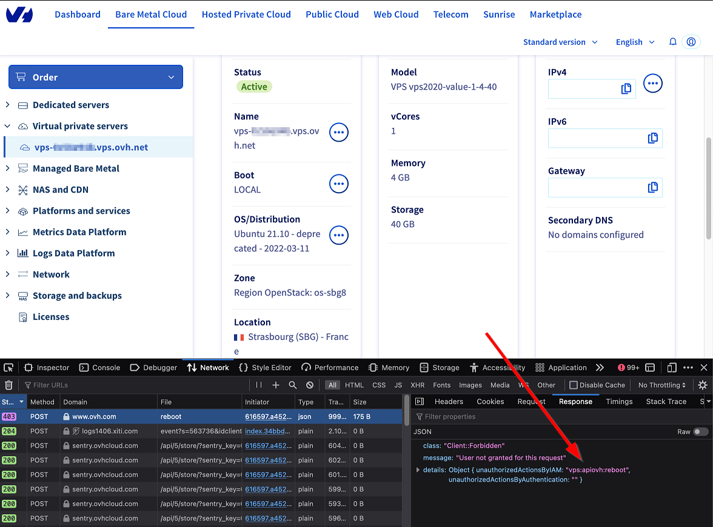

 

## Objectif

L'objectif de ce guide est de présenter les différentes méthodes disponibles pour identifier les actions manquantes dans les politiques IAM 

## Prérequis

- Un [compte client OVHcloud](/pages/account_and_service_management/account_information/ovhcloud-account-creation).
- Savoir configurer des [politiques d'accès via l'espace client](/pages/account_and_service_management/account_information/iam-policy-ui).
- Savoir configurer des [politiques d'accès via API](/pages/account_and_service_management/account_information/iam-policies-api).
- Savoir [envoyer les logs de politiques IAM vers LDP](/pages/manage_and_operate/iam/iam-logs-forwarding)

## En pratique

### Dans les réponses HTTP

Lors des call d'API il est possible d'obtenir le nom de l'action manquante dans la réponse de la requete HTTP dans le champ `unauthorizedActionsByIAM`
Dans l'exemple suivant, l'action manquante est "*vps:apiovh:reboot*"

```json
{
  "class": "Client::Forbidden",
  "message": "User not granted for this request",
  "details": {
    "unauthorizedActionsByAuthentication": "",
    "unauthorizedActionsByIAM": "vps:apiovh:reboot"
  }
}
```

Il est aussi possible d'accéder à cette information à travers les outils de développement du navigateur en analysant les erreurs 403.
Pour cela aller dans l'onglet `Network`{.action} et sélectionner la requète retournant un statut **403**, puis aller dans l'onglet `Response`{.action}

{.thumbnail}

### Dans les logs LDP

Si la [transmission des logs du compte OVHcloud](/pages/manage_and_operate/iam/iam-logs-forwarding) vers LDP est activée, il est possible de trouver l'information dans les logs des politiques d'accès.

Dans l'interface de Graylog, faire une recherche sur le login de l'utilisateur concerné et les logs contenant des `unauthorized_actions_array` avec la requete `identities_array:*My_user* AND unauthorized_actions_array:*`

{.thumbnail}

Les logs ansi filtrés montrent les actions refusées par l'IAM d'OVHcloud pour l'utilisateur.

{.thumbnail}

Ici par exemple, l'utilisateur *Ines* a essayé de réaliser l'action *vps:apiovh:reboot* sans succès

Il est aussi possible de filtrer la recherche sur `authorized_actions_array` pour lister les actions autorisées par l'IAM d'OVHcloud


## Aller plus loin

Échangez avec notre communauté d'utilisateurs sur <https://community.ovh.com/>.