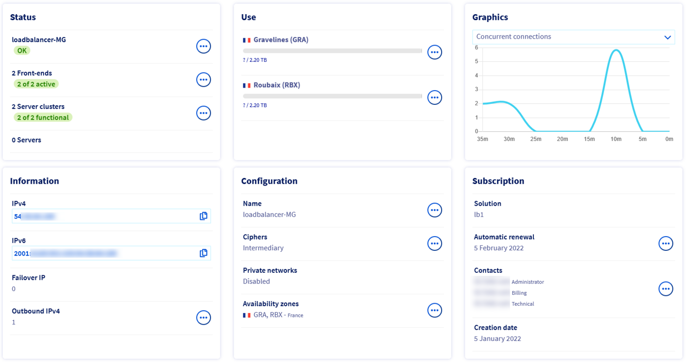
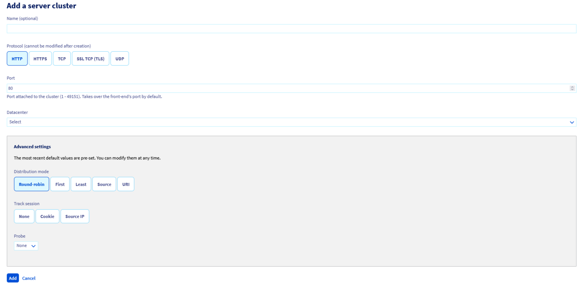
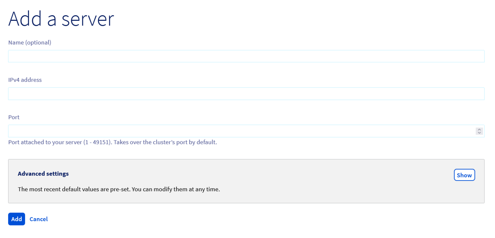

## Objectif

Ce guide a pour but de vous aider à créer votre premier service HTTP/HTTPS avec l'offre OVHcloud Load Balancer OVHcloud. Nous allons ici configurer un service OVHcloud Load Balancer simple pour répartir la charge HTTP d'un service, tel qu'un site web.

Un frontend sera créé pour écouter sur le port 80, tandis qu'un autre écoutera sur le port 443 avec un certificat SSL/TLS. Ces frontends seront configurés pour diriger leur trafic vers une ferme HTTP commune. Cette ferme peut disposer d'un ou plusieurs serveurs, selon la configuration choisie / adaptée.

Pour rappel, le service OVHcloud Load Balancer est composé de 4 parties élémentaires :

- les `frontends` ;
- les `fermes` de serveurs et leurs `serveurs` ;
- les `routes` avancées entre les Frontends et les Fermes de serveurs (bientôt disponible dans le manager) ;
- les certificats `SSL/TLS` permettant de chiffrer les connexions TCP et/ou HTTP.

## Prérequis

- Posséder une offre [OVHcloud Load balancer](https://www.ovh.com/fr/solutions/load-balancer/) dans votre compte OVHcloud.
- Être connecté à votre [espace client OVHcloud](https://www.ovh.com/auth/?action=gotomanager&from=https://www.ovh.com/fr/&ovhSubsidiary=fr).
- Posséder une ferme configurée
- Posséder un frontend configuré
- Posséder un certificat SSL

## En pratique

> [!warning]
>
> Nous allons vous guider au travers des différentes étapes. Selon vos choix d'architecture, certaines configurations peuvent différer.
> 

Avant de vous lancer, si vous ne l'avez pas encore lue, nous vous conseillons de consulter la présentation générale du service OVHcloud Load Balancer: [Présentation de l'OVHcloud Load Balancer](/pages/network/load_balancer/use_presentation).

> [!warning]
>
> L'ordre de création des éléments est important. En particulier, les fermes de serveurs doivent être configurées avant de pouvoir leur attacher un certificat SSL/TLS ou des serveurs. De même, les frontends doivent être configurés après les fermes de serveurs afin de pouvoir configurer la ferme par défaut du frontend.
> 

Dans l'espace client OVHcloud, nous allons retrouver les fonctionnalités détaillées ci-dessous:

{.thumbnail}

Pour plus d'informations sur les fonctionnalités de l'espace client OVHcloud, consultez la page « [Gestion du service Load Balancer via l’espace client](/pages/network/load_balancer/use-lb) ».

Via l'API OVHcloud, utilisez l'appel suivant :

> [!api]
>
> @api {GET} /ipLoadbalancing
> 

Pour plus d'informations sur les fonctionnalités de l'API, consultez la page [Détails des fonctions API](/pages/network/load_balancer/use_api_details){.ref}

### Ajouter une ferme de serveurs

Nous allons ajouter une ferme de serveurs HTTP à notre service, la partie en charge de répartir le trafic sur les serveurs.

#### Depuis l'espace client OVHcloud

Dans l'onglet `Fermes de serveurs`{.action}, cliquez sur le bouton `Ajouter une ferme de serveurs`{.action}.

Remplissez les champs. Les seuls champs obligatoires pour une configuration simple sont le *Protocole* et le *Datacentre*. Il est recommandé de définir explicitement un *Port*, généralement le port 80 pour un service web. Si aucun port n'est spécifié, votre OVHcloud Load Balancer utilisera automatiquement le même port que le frontend correspondant et les sondes pourront ne pas fonctionner comme prévu.

Si vous ajoutez plusieurs serveurs dans votre ferme, il est recommandé de configurer une `sonde de disponibilité` HTTP. Lorsqu'une sonde est configurée, le service OVHcloud Load Balancer pourra automatiquement désactiver un serveur qui serait en panne ou en maintenance, de manière à ne pas affecter les visiteurs.

{.thumbnail}

Cliquez sur le bouton `Ajouter`{.action} une fois les champs remplis.

Votre ferme de serveurs devrait apparaitre dans la liste, sous l'onglet `Fermes de serveurs`{.action}.

{.thumbnail}

#### Depuis l'API OVHcloud

- Liste des fermes de serveurs HTTP :

> [!api]
>
> @api {GET} /ipLoadbalancing/{serviceName}/http/farm
> 

- Détails d'un serveur HTTP spécifique :

> [!api]
>
> @api {GET} /ipLoadbalancing/{serviceName}/http/farm/{farmId}
> 

- Ajout d'une nouvelle ferme de serveurs HTTP :

> [!api]
>
> @api {POST} /ipLoadbalancing/{serviceName}/http/farm
> 

- Modification d'une ferme de serveurs spécifique :

> [!api]
>
> @api {PUT} /ipLoadbalancing/{serviceName}/http/farm/{farmId}
> 

- Suppression d'une ferme de serveurs spécifique :

> [!api]
>
> @api {DELETE} /ipLoadbalancing/{serviceName}/http/farm/{farmId}
> 

### Ajouter un Serveur

Nous allons maintenant ajouter un serveur à notre ferme de serveurs.

#### Depuis l'espace client OVHcloud

Toujours dans l'onglet `Fermes de serveurs`{.action}, sélectionnez la ferme dans laquelle vous souhaitez ajouter un serveur en cliquant sur la ligne correspondante. La liste des Serveurs déjà configurés dans la ferme apparaît en dessous de la liste des fermes, ainsi qu'un bouton `Ajouter un serveur`{.action}. Cliquez sur ce bouton pour ajouter un nouveau serveur.

Seul le champ *Adresse IPv4* est obligatoire. Si un serveur n'utilise pas le même port que celui défini plus haut dans la ferme, il est possible de le surcharger dans la configuration du serveur. Cependant, afin de conserver une configuration la plus homogène et maintenable possible, il est recommandé de n'utiliser ce paramètre que dans les cas avancés.

{.thumbnail}

Cliquez sur le bouton `Ajouter`{.action} une fois les champs remplis.

Votre serveur devrait apparaître dans la liste des serveurs, dans l'onglet `Fermes de serveurs`{.action}, juste en dessous de la liste des fermes.

{.thumbnail}

#### Depuis l'API OVHcloud

- Liste des serveurs de la ferme :

> [!api]
>
> @api {GET} /ipLoadbalancing/{serviceName}/http/farm/{farmId}/server
> 

- Détails d'un serveur spécifique :

> [!api]
>
> @api {GET} /ipLoadbalancing/{serviceName}/http/farm/{farmId}/server/{serverId}
> 

- Ajout d'un nouveau serveur :

> [!api]
>
> @api {POST} /ipLoadbalancing/{serviceName}/http/farm/{farmId}/server
> 

- Modification d'un Serveur spécifique :

> [!api]
>
> @api {PUT} /ipLoadbalancing/{serviceName}/http/farm/{farmId}/server
> 

- Suppression d'un serveur spécifique :

> [!api]
>
> @api {DELETE} /ipLoadbalancing/{serviceName}/http/farm/{farmId}/server
> 

### Ajouter un frontend

Nous allons maintenant ajouter un `frontend` à notre service et le connecter à notre ferme de serveurs. Le frontend est la partie de votre OVHcloud Load Balancer qui sert à exposer votre service sur Internet. Dans un premier temps, nous allons le configurer en HTTP uniquement, sans certificat SSL/TLS.

#### Depuis l'espace client OVHcloud

Dans l'onglet `Frontends`{.action}, cliquez sur le bouton `Ajouter un frontend`{.action}.

Remplissez les champs. Les seuls champs obligatoires pour une configuration simple sont le *Protocole*, le *Port* (80 pour un service web HTTP standard) et le *Datacentre*. Si vous souhaitez que votre service soit disponible sur plusieurs ports en même temps, vous pouvez spécifier une liste de ports séparés par des virgules ou une plage de ports de la forme « START_PORT-END_PORT ».

Si vous avez routé des Additional IP vers votre service OVHcloud Load Balancer, vous pouvez également attacher un frontend à une ou plusieurs Additional IP spécifiques.

{.thumbnail}

Cliquez sur le bouton `Ajouter`{.action} une fois les champs remplis.

Votre frontend devrait apparaître dans la liste, sous l'onglet `Frontends`{.action}.

{.thumbnail}

#### Depuis l'API OVHcloud

- Liste des frontends HTTP :

> [!api]
>
> @api {GET} /ipLoadbalancing/{serviceName}/http/frontend
> 

- Détails d'un frontend spécifique :

> [!api]
>
> @api {GET} /ipLoadbalancing/{serviceName}/http/frontend/{frontendId}
> 

- Ajout d'un nouveau frontend :

> [!api]
>
> @api {POST} /ipLoadbalancing/{serviceName}/http/frontend
> 

- Modification d'un frontend spécifique :

> [!api]
>
> @api {PUT} /ipLoadbalancing/{serviceName}/http/frontend/{frontendId}
> 

- Suppression d'un frontend spécifique :

> [!api]
>
> @api {DELETE} /ipLoadbalancing/{serviceName}/http/frontend/{frontendId}
> 

### Ajouter un certificat SSL/TLS

La section précédente décrivait la configuration générale pour un frontend HTTP. Cette section décrit les étapes supplémentaires pour activer le support du protocole HTTPS sur un Frontend HTTP. En particulier, il faudra :

- basculer le Frontend sur le port 443, standard pour le protocole HTTPS ;
- configurer un certificat SSL/TLS afin d'authentifier et chiffrer les connexions.

Que vous optiez pour une configuration via l'API ou via l'espace client OVHcloud, vous aurez le choix entre 2 stratégies pour vos certificats SSL/TLS, ce choix dépendant de vos besoins ainsi que des solutions actuellement en place :

- Importer un certificat SSL/TLS existant.
- Commander un certificat SSL/TLS géré automatiquement. La commande de certificats DV et EV arrivera prochainement.

Si vous optez pour l'importation d'un certificat SSL/TLS commandé et géré par vos soins, vous devrez le renouveler périodiquement vous-même et le mettre à jour dans votre service OVHcloud Load Balancer. La majorité des certificats sont valides pour 1 an. Certains peuvent l'être plus longtemps. Les certificats Let's Encrypt ne sont quant à eux valides que 3 mois. Il est recommandé d'utiliser le service géré automatiquement par votre OVHcloud Load Balancer pour les certificats Let's Encrypt afin de ne pas accidentellement rater une échéance.

Si vous optez pour un certificat géré par votre service OVHcloud Load Balancer, celui-ci sera automatiquement commandé, validé, installé et renouvelé périodiquement par votre OVHcloud Load Balancer. 
Pour que les opérations de validation et de renouvellement fonctionnent, il est nécessaire que le ou les domaines pour lesquels vous commandez ce certificat soient routés vers votre service OVHcloud Load Balancer. Cela implique que les champs *A* et *AAAA* de votre domaine pointent respectivement sur l'IPv4 et l'IPv6 de votre OVHcloud Load Balancer ou l'une de ses Additional IPs. Lors de la commande, vous recevrez un email qui vous guidera dans les étapes de la validation.

> [!primary]
>
> Pour assurer la continuité de service lors du basculement de votre domaine vers l'IP de votre service OVHcloud Load Balancer afin de valider votre certificat, une bonne pratique est de commencer par configurer et tester complètement la configuration HTTP sur le port 80. De cette manière, votre site reste accessible sans interruption.
> Si votre site dispose déjà d'une connexion HTTPS et que vous souhaitez migrer vers des certificats gérés par votre service OVHcloud Load Balancer, vous pouvez importer vos certificats existants, configurer et tester votre Frontend HTTPS et enfin commander un nouveau certificat pour le même domaine. Il sera automatiquement pris en compte avant l'expiration de votre ancien certificat.
> 

Les certificats configurés sur votre service OVHcloud Load Balancer sont automatiquement disponibles pour l'ensemble des frontend de votre service OVHcloud Load Balancer sur lesquels l'options *SSL* est activée.

$${\color{lightgreen}StartUpdateJulien}$$
#### Support de TLS 1.3
Avec l'évolution constante des normes de sécurité sur Internet, OVHcloud s'engage à fournir les technologies les plus récentes et les plus sûres pour vos services. Nous sommes ravis d'annoncer le support de TLS 1.3 pour le Load Balancer OVHcloud.

##### Qu'est-ce que TLS 1.3 ?
TLS 1.3 est la dernière version du protocole TLS, offrant des améliorations significatives en matière de sécurité et de performance par rapport à TLS 1.2. Les avantages clés incluent un processus de handshake plus rapide, réduisant ainsi le temps nécessaire pour établir des connexions sécurisées, et l'utilisation de suites de chiffrement plus sûres pour renforcer la sécurité des données transmises.

##### Pourquoi utiliser TLS 1.3 avec OVHcloud Load Balancer ?
En intégrant TLS 1.3, votre Load Balancer OVHcloud bénéficiera d'une sécurité renforcée et d'une performance améliorée, assurant une expérience utilisateur optimale pour vos visiteurs. La réduction du temps de handshake accélère le chargement des pages, tandis que les améliorations de sécurité garantissent que vos données sont protégées avec les normes les plus récentes et les plus sûres.

Pour plus d'informations sur TLS 1.3 et ses avantages, consultez [notre guide détaillé](https://github.com/jtaverne/ovh/blob/main/tls_1.3.md).
$${\color{lightgreen}EndUpdateJulien}$$

#### Depuis l'espace client OVHcloud

La liste des certificats SSL/TLS configurés sur votre service OVHcloud Load Balancer se trouve dans l'onglet `Certificats SSL`{.action}. Cette interface vous propose les 2 options évoquées un peu plus haut, à savoir importer un certificat existant (via le bouton `Ajouter un certificat SSL`{.action}) et `Commander un certificat SSL`{.action} géré automatiquement par votre service OVHcloud Load Balancer.

{.thumbnail}

Si vous optez pour l'importation d'un certificat SSL/TLS existant, cliquez sur `Ajouter un certificat SSL`{.action}. Les champs *Clef privée* et *Certificat* sont obligatoires.

Cliquez sur le bouton `Ajouter`{.action} une fois les champs remplis. Votre certificat apparaîtra alors dans la liste des certificats.

{.thumbnail}

Pour ajouter un certificat Let's Encrypt, cliquez sur `Commander un certificat SSL`{.action}, renseignez votre domaine, assurez vous que celui-ci pointe bien sur votre service OVHcloud Load Balancer et laissez-vous guider par les e-mails que vous recevrez. Vous le verrez ensuite apparaître dans la liste des certificats disponibles.

{.thumbnail}

Une fois votre / vos certificats configurés, vous pouvez créer un frontend HTTPS, sur le même modèle que le frontend HTTP créé plus haut avec le port 443 et l'option *SSL* active. 
Optionnellement, vous pouvez également activer l'option *HSTS*. Si cette option est active, les navigateurs enregistreront que ce site Internet ne doit *plus jamais* être visité sans HTTPS après leur première visite en HTTPS. Cela permet de renforcer la sécurité globale en se protégeant contre les attaques de type « Homme du milieu » dans laquelle un acteur malveillant pour faire croire que votre site Internet n'est pas disponible en HTTPS et forcer vos visiteurs à basculer en « HTTP ».

> [!warning]
>
> Bien que l'ajout de sécurité soit conséquent, il est recommandé d'attendre quelques temps avant d'activer cette option, le temps de s'assurer qu'il n'y a pas d'effets de bords en HTTPS. En effet, une fois HSTS activé, il n'y a plus de retour arrière possible.
>

#### Depuis l'API OVHcloud

- Lister les certificats SSL/TLS en place :

> [!api]
>
> @api {GET} /ipLoadbalancing/{serviceName}/ssl
> 

- Obtenir les détails d'un certificat SSL/TLS :

> [!api]
>
> @api {GET} /ipLoadbalancing/{serviceName}/ssl/{id}
> 

- Ajout d'un nouveau certificat SSL/TLS existant :

> [!api]
>
> @api {POST} /ipLoadbalancing/{serviceName}/ssl
> 

- Modification d'un certificat SSL/TLS spécifique (seul le nom affiché peut être modifié) :

> [!api]
>
> @api {PUT} /ipLoadbalancing/{serviceName}/ssl/{id}
> 

- Suppression d'un certificat SSL/TLS spécifique :

> [!api]
>
> @api {DELETE} /ipLoadbalancing/{serviceName}/ssl/{id}
> 

### Appliquer les modifications

Les modifications apportées à votre service OVHcloud Load Balancer soivent être *appliquées explicitement* dans chacune des zones configurées pour votre service OVHcloud Load Balancer. C'est seulement à ce moment qu'elles seront visibles pour vos visiteurs. Cela permet de faire un changement complexe de configuration en une seule fois.

Si vous avez plusieurs zones, vous devrez appliquer la même configuration pour chacune de vos zones.

#### Depuis l'espace client OVHcloud

Rendez-vous sur la page d'accueil de votre service OVHcloud Load Balancer et cliquez sur le bouton `Appliquer la configuration`{.action}.

{.thumbnail}

Selectionnez ensuite la liste des zones que vous souhaitez deployer et cliquez sur le bouton `Appliquer la configuration`{.action}.

{.thumbnail}

#### Depuis l'API OVHcloud

- Rafraîchir une zone :

> [!api]
>
> @api {POST} /ipLoadbalancing/{serviceName}/refresh
> 

### Validation

Une fois toutes ces étapes terminées, vous devriez disposer d'un service de répartition de charge fonctionnel. Vous pouvez valider l'état du service en visitant votre site.

## Aller plus loin

Échangez avec notre communauté d'utilisateurs sur <https://community.ovh.com>.
