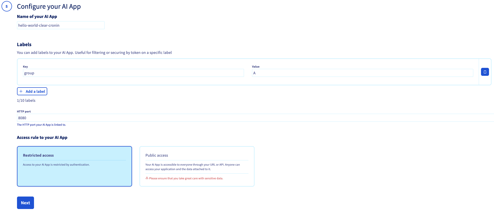
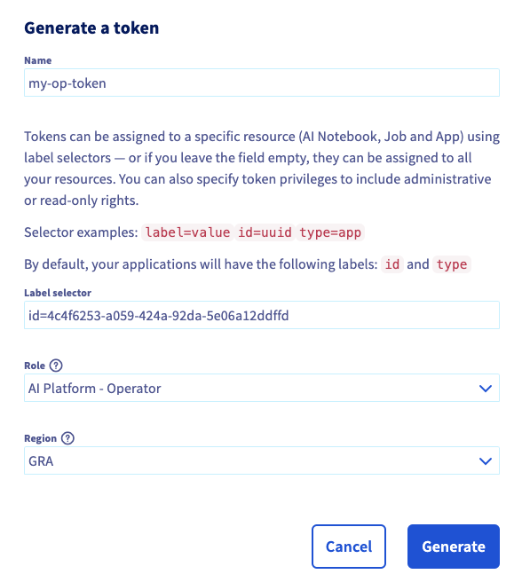
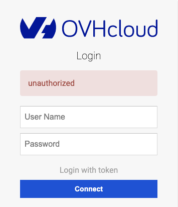

**Last updated January 7th, 2022.**

## Objective

This guide covers the creation of application tokens for AI Apps.

## Requirements

- a **Public cloud** project
- access to the [OVHcloud Control Panel](https://ca.ovh.com/auth/?action=gotomanager&from=https://www.ovh.com/ca/en/&ovhSubsidiary=ca)
- a Running AI app (the deployed AI App in this guide uses the Docker image [infrastructureascode/hello-world](https://hub.docker.com/r/infrastructureascode/hello-world))

## Instructions

### Adding labels to an App

Tokens are scoped based on labels added to your AI App. To scope a token you need to add a label to your AI App upon submission.

{.thumbnail}

In this instance we add the label `group=A` to the AI App. A set of defaults labels are added to all AI Apps:

- `ovh/id` which value is the ID of the AI App
- `ovh/type` with value `app`, the type of AI resource

> [!primary]
> Labels prefixed by `ovh/` are reserved by the platform, those labels are overriden upon submission if any are provided.

All the labels of an AI App are listed on the AI App details under **Tags**:

{.thumbnail}

### Generating tokens

From the **AI Apps** page, you access the tokens management page by clicking the `Tokens`{.action} tab.


Once on the token management tab, simply click on `New Token`{.action}.

{.thumbnail}

#### Read token

There are two types of roles that can be assigned to a token:

- AI Platform - Read-only
- AI Platform - Operator

A Read-only token will only grant you the right to query the deployed AI App while an Operator token would also allow you to manage the AI App itself.

Let us create a token for the AI Apps matching the label `group=A` with read-only access in the GRA cluster.
To create an AI App token we need to specify 3 parameters:

- The token scope specified through label selectors, a token will be scoped over any AI app matching the set of label selectors. In this case `group=A`
- The token role: AI Training - Read-only
- The region (cluster in which are deployed the AI Apps): GRA.

Fill out the form:

{.thumbnail}

Click `Generate`{.action}. Upon success, you are redirected to the token list with the new generated token displayed at the top:

{.thumbnail}

Save the token string for later use.

> [!warning] 
> The token is only displayed once, make sure to save it before leaving the page or you will need to regenerate the token.

This newly generated token provides read access over all resources tagged with the label `group=A` including the ones submitted after the creation of the token.

#### Operator token

An operator token grants read access along with management access for the matching AI apps. This means that you can manage the AI App lifecycle (start/stop/delete) using either the CLI (more info [here](https://docs.ovh.com/ca/en/publiccloud/ai/training/install-client/)) or the [AI Training API](https://gra.training.ai.cloud.ovh.net/) by providing this token.

This Operator token will be scoped on a specific AI App and we will use the default `ovh/id` label to do so (since it is reserved, there is only one AI App that can match this label selector).

- Token scope: `ovh/id=4c4f6253-a059-424a-92da-5e06a12ddffd`
- The token role: AI Training - Operator
- The region: GRA.

{.thumbnail}

Additional information about the use of a token to manage an AI Training resource can be found [here](https://docs.ovh.com/ca/en/publiccloud/ai/training/app-token-cli/#use-the-app-token).

### Using a token to query an AI App

With the token we generated in the previous step we will now query the AI App. For this demonstration, we deployed a simple Hello World app that always responds `Hello, World!`.

You can get the access URL of your AI App in the details of the AI App, above the **Tags**.

#### Browser

When accessing the AI App via its URL in your browser, you will reach a Login page:

{.thumbnail}

To use the token to access this AI App, you can click on `Login with token`. Fill in your token in the dedicated field and click `Connect`{.action}.

You now land on the exposed AI App service:

{.thumbnail}

#### Code integration

You can also directly CURL the AI App using the token as an `Authorization` header:

```bash
export TOKEN=<your-token>
curl "https://<your-app-id>.app.<your-app-region>.training.ai.cloud.ovh.net" -H "Authorization: Bearer $TOKEN"

> Hello, World!
```

### Token lifecycle

Once a token is created, you can either regenerate the token or delete it.

#### Regenerating a token

When creating a token, the actual token string is only displayed once upon creation. It is not possible to retrieve the actual token afterwards, so make sure to save it when creating a new one.

If you lost the token or if it leaked and you need to invalidate the token, you can generate it again. This causes the existing token to expire.

From the list of tokens, click on the action menu and select `Regenerate`{.action}:

{.thumbnail}

Then click on `Regenerate`{.action} to confirm.

{.thumbnail}

#### Deleting a token

If you simply need to invalidate the token, you can delete it using the same action menu to regenerate a token. This will invalidate the existing token.


## Feedback

Please feel free to send us your questions, feedback and suggestions to help our team improve the service on the OVHcloud [Discord server](https://discord.com/invite/vXVurFfwe9) 
