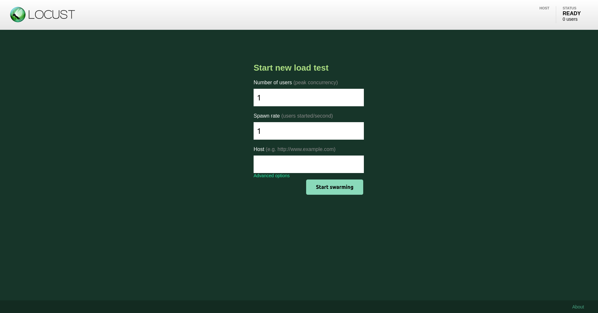
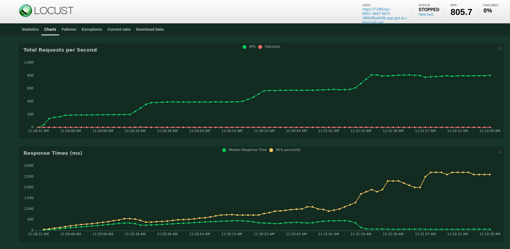

**Last updated 10th March, 2023.**

## Objective

The aim of this tutorial is to load test your deployed applications, by gradually query your APIs  with a load testing tool.
Usually, your challenge is to forecast your compute needs, for example how many CPUs or GPUs will be required for 1000 API calls per hour and acceptable latency.

There are several applications to simulate an amount of users and an amount of requests that you want to simulate. 

In this tutorial, we will use one of them and interpret the results.

**Requirements**

- Access to the [OVHcloud Control Panel](https://www.ovh.com/auth/?action=gotomanager&from=https://www.ovh.co.uk/&ovhSubsidiary=GB);
- A Public Cloud project created;
- An app with an API running in AI Deploy on your public cloud project;
- A python environment, with enough CPU and RAM and internet access (a virtual machine is recommended).

## Selecting the right load testing tool for your needs

Depending on your preferred programming language and time to spend on this topic, you can opt for different options.

First you can go for SaaS load tester, such as [Gatling.io](https://gatling.io/) or [K6.io](https://k6.io). Nothing to install, easy to start.

A second option is using open source load testing tools. Some tools are only command-line based, such as [hey](https://github.com/rakyll/hey) or [Wrk2](https://github.com/giltene/wrk2), other comes with a web interface like [Locust](https://locust.io/). 

Select the right tool for the right test is mandatory. For the next parts, **we will select and use locust**, allowing us to show visual graphs. 


## Instructions

### Deploy an app with a REST API

Feel free to deploy any app and API that your would like to load test, as long as we can query it via REST queries.

For this tutorial, we will load test a spam classifier API from [AI Deploy app portfolio](https://docs.ovh.com/gb/en/publiccloud/ai/deploy/apps-portfolio/). 
This API takes sentences (emails) as input text, and output a spam probability score. 

You can deploy this API easily from our OVHcloud control panel or OVHcloud CLI. A good strategy is to deploy with autoscaling, with a minimum and maximum replicas. This way we will monitor the growth of used replicas.

Here is the CLI command used to deploy it, with autoscaling going from 1 to 5 replicas and a CPU threshold of 75%:

```console
ovhai app run --name spamclassifier --cpu 1 \
--auto-min-replicas 1 \
--auto-max-replicas 5 \
--auto-resource-type CPU \
--auto-resource-usage-threshold 75 \
priv-registry.gra.training.ai.cloud.ovh.net/ai-deploy-portfolio/fastapi-spam-classification
```


### Verify that your API is up and running with cURL

Once deployed, Let's test first our API with a simple cURL command. Here is the command to try in a terminal:
 
```console 
curl -s -X POST \ 
"<api_url>/spam_detection_path \
-H "Authorization: Bearer <token>" \
-H "Content-Type: application/json" \
-d '{"message":"This is a test from my machine"}' | jq
```

Here is the result given by our call:

```console
{
  "label": "ham",
  "label_probability": 0.9875114695528484
}
```

Here are a few explanations of the lines:
 
- In the first line, we specify that we will use a post method. 
- We specify the url where the post request will be executed. The `api_url` is the url of your API. It should look something like this: `https://baac2c13-2e69-4d0f-ae6b-dg9eff9be513.app.gra.ai.cloud.ovh.net/`. 
- We put the token to access our API, generated via our control panel or `ovhai` CLI. We specify it in the header of the request. 
- We specify that our body is in a JSON format.
- We put in our body the message we want to send to the spam classifier. In your case, the body could be different because it depends of the API. And we hope the spam classifier will send us the probability of each response. The last `| jq` instruction allow us to have a good display of the result in the terminal. 

We now have the confirmation that our API is up and running, let's try to load test it. 

We will simply simulate several curl command. With the tool locust, we can simulate several users and define a number of calls per minute to the API. This can be easily done with the locust's interface. But before using this interface, we need to launch the locust and configure the tool. This can be easily done with python. Let's do this !

### Install locust.io

Locust is an open source Python package, that you can install with one line of code. Follow their [official documentation](https://docs.locust.io/en/stable/index.html):

```console
pip3 install locust
```

You can install it on your personal computer, but keep in mind that load testing tools will require four things to **not become the bottleneck in your load test**:
- Enough compute (CPU).
- Enough memory (RAM).
- Low latency connectivity to your API.
- no "noisy neighbors", meaning no software installed that can compromise your results. imagine your CPU power getting used by video rendering, it will biases your results.

For all these reasons, a **Cloud instance is recommended**, such as a medium-sized virtual machine. For this tutorial, we will take an OVHcloud instance B2-30.


### Configure Locust

To configure the software, you need to create a file named `locustfile.py`. In this file, you can put the path where you want to make your request, the headers of your request, the type of the request (POST, GET, etc) and the body if you want to add a body to the request. 

A generic file will look like this:

```python
from locust import HttpUser, task

class HelloWorldUser(HttpUser):
    @task
    def hello_world(self):
        self.client.get("/hello")
        self.client.get("/world")
```

For my API and my needs, the locust file will be slightly modified: 

```python
# Import the Locust dependencies
from locust import HttpUser, task

# Import general library from python
import os
import random

# Import lorem ipsum library to generate some random texts
from lorem_text import lorem

# Import dotenv to load the environments variables
from dotenv import load_dotenv
load_dotenv()

# Create a table with some lorem ipsum texts
messages = []

# Add 1000 random texts of 10 paragraphs each (simulate 1000 emails)
for i in range(1000):
    messages.append(lorem.paragraphs(10))

# Define the headers of the request. Token is stored as an environment variable here
headers = {
    "Authorization": "Bearer {os.getenv('TOKEN')}", "Content-Type": "application/json"}


class HelloWorldUser(HttpUser):
    # Definition of the first path where we do our post request
    @task
    def hello_world(self):
        # Define the body with the email choose randomly from the tab of all the emails
        body = {"message": random.choice(messages)}
        # Do the post request on the spam detection path
        self.client.post("/spam_detection_path",
                         headers=headers, json=body)
```

For your own needs, you will have to change the path, the headers and the body because these are parameters who change from one API to another. 

Once your `locustfile.py` is ready, open the Locust web interface on `<http://your_IP:8089>`. 

Web interface should look as below:

{.thumbnail}

### Run your load tests

You now have your app running on OVHcloud, and locust configured. Let's simulate some user calls! 

From the web interface, fill the amount of simultaneous users (API calls) and incremental step (spaw rate).

For this tutorial, we will add 480 users in total, and a spawn rate of 2 users added per second. We will simulate this for a duration of 4 minutes. We suppose that this case is for a rush on the API. Most of the time, we can assume that there are not so much users on the platform. 

Launch the test. Tic, Tac, the results will be in the next part! 

### Interpret the results via Locust

At the end of the load test, you will see this quick summary: 

{.thumbnail}

If we want to get more details about our test, we can see the graphs provided by Locust in the tab `charts`. Here is what we can see:

{.thumbnail}


We deployed this API from 1 to 5 replicas, with 1 CPU for each of them, completed with auto-scaling. We can see that our API has been a bit overloaded. Indeed, with the graphics or with the quick summary, we can see some failures. These failures are due to server error. We may suppose  that we reached some hardware limits at some point, for example before scaling to a greater amount of replicas.

Also, we can see an increasing call latency over time. At the end, we can expect more than 3 seconds per call.

Result interpretation may depend of your needs and performance criterias. We can of course make a new test with more users to see the limits of our APIs, and put several tasks in the `locustfile.py`. 

One thing cannot be seen here: OVHcloud backend scaling. We deployed our app with autoscaling, from 1 replica minimum to 3 replicas maximum.
Did we use them ? Were they useful and at maximum capacity?

Let's see the same results in details with the AI Deploy monitoring tool.

### Interpret the results with the AI Deploy Monitoring

Go in OVHcloud control panel, and get the detail of your deployed application. Click on the `Access Dashboards`button.


This dashboard is provided for free in AI Deploy, for each deployed application. All of the deployed apps are combined in a simple Grafana Dashboard.

You can select the deployed app on the top of this Grafana dashboard, as shown below: 

{.thumbnail}

With this dashboard, you can see the percentage of CPU used in real time, the HTTP latency of your API, the autoscaling of the app, network bandwidth and more. 
Vertical blue bar shows scaling events.

Here is the result for the CPU load, overall (all replicas combined): 

{.thumbnail}

We can see that our app has scaled few times hasn't reach maximum capacity usage, thanks to autoscaling. Let's now take a look at the latency of our application:

{.thumbnail}

Here we see that the latency has increased  gradually, since we hava a spawn rate of two new user per second. API latency was stable with approximately 750ms then peaked to 1.5s. 

Again, interpretation will depends of your needs. Do we need to provide more CPU because the latency is too high ? This question will vary depending of your customers needs. For an anti-spam, adding 1 second it quite big for a company receiving thousands of mails per day, not so disturbing if it's a dozen per day. Let's now take a look at the scaling of our application:
 
{.thumbnail}

We can see that the threshold has be capped at 75% for the autoscaling and this has been respected. On the 5 replicas provided to the application, 4 has been used. 

As a conclusion, both locust and AI Deploy Monitoring are useful to interpret results, but more than tools the most important thing is to define realisting workloads and performance criterias.
 
Last point : while locust is measuring a latency end-to-end (from locust virtual machine here, to the API model deployed), AI Deploy monitoring is only measuring backbone latency (from the query to the answer). That's why latency values are higher on Locust side, reaching 2.5 seconds. 


## Go further

Locust official documentation : [Locust.io](https://docs.locust.io/en/stable/)

Comparison of load testing tools : [Comparison of load testing tools](https://k6.io/blog/comparing-best-open-source-load-testing-tools/)

## Feedback

Please send us your questions, feedback and suggestions to improve the service:

- On the OVHcloud [Discord server](https://discord.com/invite/vXVurFfwe9)
