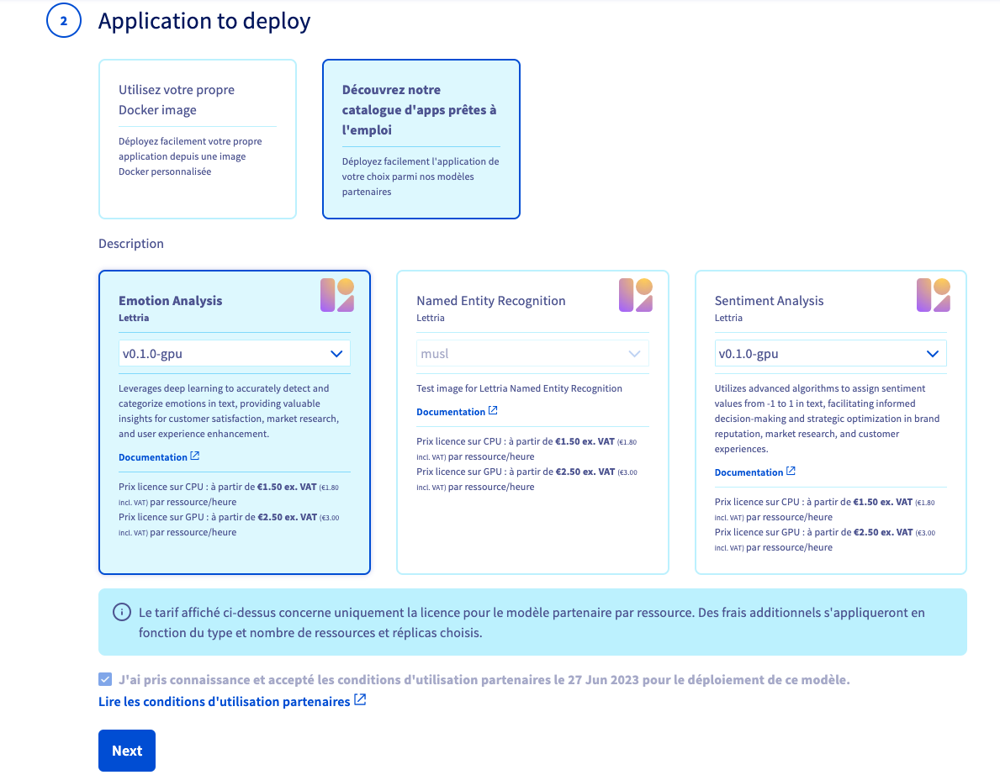

**Last updated 15th May, 2023.**

## Objective

OVHcloud's **AI Ecosystem Partner** provides Artificial Intelligence partner services for NLP, audio and image tasks. You will benefit from ready-to-use and quickly deployable applications with AI Deploy according to your needs.

**Lettria is an OVHcloud partner that offers AI services dedicated to text. This guide covers Lettria models features, how it works and its billing principle.**

## Introduction

**Lettria** is a start-up specialized in **NLP** (Natural Language Processing). The platform allows all organizations, from start-ups to large corporations, to perform textual analysis on their data to make the best strategic decisions.

Lettria provides text understanding models that allow users to easily identify and extract key information from their text. This method relies on artificial intelligence and NLP techniques to understand the sentiment or emotions of a text.

The uses are varied:
- Customer service automation
- Social media monitoring
- Content moderation
- Text classification

## Lettria models features

The Lettria models available at OVHcloud cover two NLP tasks: **sentiment analysis** and **emotion extraction**.

### Sentiment

The goal of sentiment analysis is to automatically classify textual data as **positive**, **negative** or **neutral** based on the underlying sentiment expressed in the text.

Input example:
```console
I love Lettria and OVH!
```

Output example:

```console
{ "value": 0,87 }
```

> [!primary]
>
> To learn more about **Lettria's sentiment analysis model**, please refer to this [documentation](https://doc.lettria.com/api-reference/comprehension/2.0/schemas/sentence/ml-sentiment).
>

### Emotion

Lettria allows you to extract emotion from text data. The goal is to automatically classify text data according to the emotions it conveys: **happiness**, **sadness**, **anger**, **fear**, ...

Input example:
```console
I love Lettria and OVH !
```

Output example:

```console
{ "type": "love", "value": 0.99 },
{ "type": "admiration", "value": 0.65 },
{ "type": "joy", "value": 0.59 }
```

> [!primary]
>
> To learn more about **Lettria's emotion extraction model**, please refer to this [documentation](https://doc.lettria.com/api-reference/comprehension/2.0/schemas/sentence/ml-emotion).
>

## Lettria quick start

To be able to query the Lettria models, you must first deploy one of the Lettria images with AI Deploy.

In this example, we will rely on the **emotions extraction** from a text.

### Launch a Lettria app

To launch an AI Deploy app, there are several possibilities. You can do it from the [OVHcloud Control Panel](https://www.ovh.com/auth/?action=gotomanager&from=https://www.ovh.co.uk/&ovhSubsidiary=GB) or the CLI `ovhai`.

#### Launch an app from the OVHcloud Control Panel

To launch your Lettria app from the UI, you have to fill in some information:

- **Location**
- **Application to deploy** - *in this example, we choose the "emotions" image*

{.thumbnail}

- **Resources** - *we advise you to use 1 GPU*
- **Configure your app** - *add an label if you have chosen a restricted access*

> [!primary]
>
> To know how to launch an app from the [OVHcloud Control Panel](https://www.ovh.com/auth/?action=gotomanager&from=https://www.ovh.co.uk/&ovhSubsidiary=GB), refer to this [guide](/pages/platform/ai/deploy_guide_02_getting_started).
>

#### Launch an app with ovhai CLI

You can also start this app with the `ovhai` [CLI](/pages/platform/ai/cli_10_howto_install_cli) by running the following command:

```console
ovhai app run \
  	--gpu 1 \
	  --default-http-port 8080 \
	  --label <name=value> \
	  <lettria_image_name>
```

> [!primary]
>
> Replace `<label=name>` by the variables corresponding to your **token**. To know more about the management of the token, refer to this [documentation](/pages/platform/ai/deploy_guide_03_tokens).
>

#### Access to your Lettria apps

Once the app is launched and in `RUNNING` status, you can copy the URL and access your app. Then, you will be redirected and you can interact in the following way with Lettria API.

{.thumbnail}

### Ask Lettria models

Now, you can question the **Lettria models** about your text sentiments or emotions.

> [!primary]
>
> In the following example, we will focus on the model that extracts text **emotions**.
> For more detailed information on Lettria models, please refer to this [documentation](PATH_TO_OVH_LETTRIA_DOC).
>

#### Generate a cURL query

Now that your Lettria app is running with AI Deploy, you are ready for questioning the AI models.

You can use the following example with the following parameters:
- url of the app - *replace `<app_url>` by yours*
- access token (since we are on restricted access) - *replace `<your_token_bearer>` by yours*
- data format
- data to process (text)

```console
curl --request POST \
    --url <app_url>/predict \
    -H "Authorization: Bearer <your_token_bearer>" \
    --header 'Content-Type: application/json' \
    --data '["Congratulations! You have successfully launched your Lettria app."]'
```

Giving us:

```console
[{"document":"Congratulations! You have successfully launched your Lettria app.","sentiment":0.946,"emotions":{"gratitude":0.936,"admiration":0.921,"pride":0.861,"joy":0.701,"excitement":0.689,"amusement":0.306,"caring":0.244,"approval":0.239,"optimism":0.207,"relief":0.168,"neutral":0.154,"surprise":0.148,"realization":0.081,"curiosity":0.07,"love":0.06,"desire":0.04,"anger":0.04,"annoyance":0.035,"fear":0.019,"embarrassment":0.017,"disappointment":0.017,"disapproval":0.014,"confusion":0.014,"grief":0.013,"sadness":0.012,"disgust":0.011,"nervousness":0.005,"remorse":0.004}}]
```

#### Generate a Python query

If you want to query the **Lettria API** with Python, this code sample with Python Request library may suit you:

```console
import requests
import json
from requests.structures import CaseInsensitiveDict

url = "<app_url>/predict"

headers = CaseInsensitiveDict()
headers = {'content-type': 'application/json',
           'Accept-Charset': 'UTF-8',
           'Authorization': 'Bearer <your_token_bearer>'}

j_data = json.dumps(["Congratulations! You have successfully launched your Lettria app."])
r = requests.post(url, data = j_data, headers = headers)

print(r.text)
```

Result:

```console
[{"document":"Congratulations! You have successfully launched your Lettria app.","sentiment":0.946,"emotions":{"gratitude":0.936,"admiration":0.921,"pride":0.861,"joy":0.701,"excitement":0.689,"amusement":0.306,"caring":0.244,"approval":0.239,"optimism":0.207,"relief":0.168,"neutral":0.154,"surprise":0.148,"realization":0.081,"curiosity":0.07,"love":0.06,"desire":0.04,"anger":0.04,"annoyance":0.035,"fear":0.019,"embarrassment":0.017,"disappointment":0.017,"disapproval":0.014,"confusion":0.014,"grief":0.013,"sadness":0.012,"disgust":0.011,"nervousness":0.005,"remorse":0.004}}]
```

## Lettria billing concept

The pricing of Lettria differs slightly from the classic AI Deploy offer. In order to better understand your invoice, we detail the offer below.

> [!primary]
>
> The total cost of your app will include the price of the resources you have selected as well as the partner's model licence price.
>

### How to calculate the total cost of a Lettria app?**

You will need two items:
- The price of the **resources selected with AI Deploy**
- The price of the **Lettria model licenses**

#### Selected resources price

To learn more about the basic cost of an app launched with AI Deploy, please refer to this documentation.

basic-app-hour-price = ai-deploy-price-<resource-type>-minute x 60 x nb-resources x nb-replicas

OR

basic-app-hour-price = price-<resource-type>-hour x nb-resources x nb-replicas

#### Lettria model licenses price

lettria-model-price-licensing = lettria-price-<resource-type>-minute x 60 x nb-resources x nb-replicas

OR

lettria-model-price-licensing = lettria-price-<resource-type>-hour x nb-resources x nb-replicas

#### Total price

total-price = basic-app-hour-price + lettria-model-price-licensing
