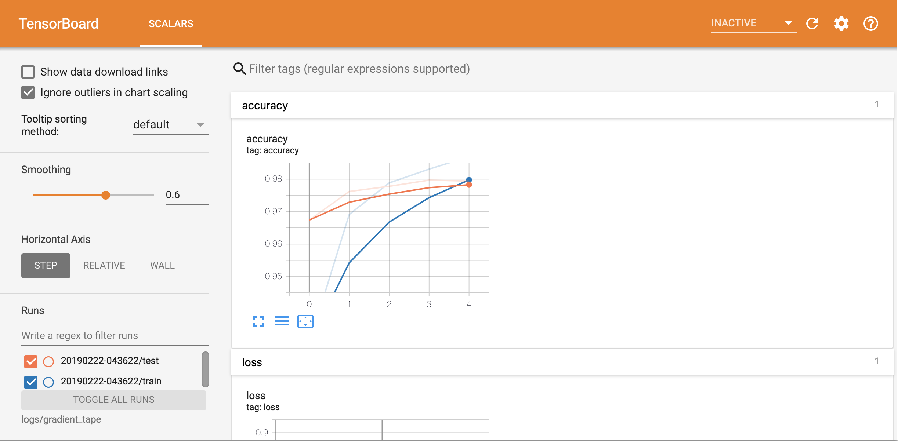
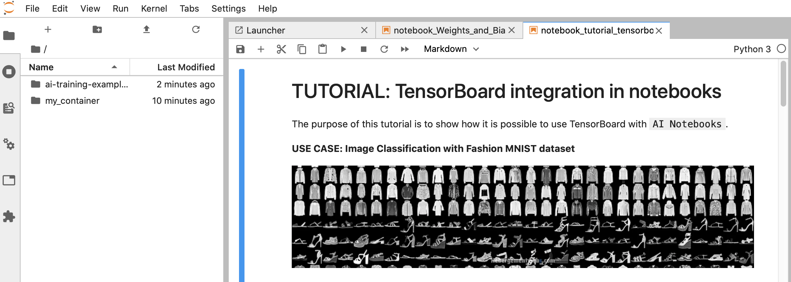

**Last updated 9th of September, 2021.**

## Objective

The purpose of this tutorial is to show how it is possible to launch a [TensorBoard](https://www.tensorflow.org/tensorboard?hl=fr) inside an `AI Notebooks`.

TensorBoard is a tool made by TensorFlow, for providing the measurements and visualizations needed during the machine learning workflow. It enables tracking experiment metrics like loss and accuracy, visualizing the model graph, projecting embeddings to a lower dimensional space, and much more.

TensorBoard provides a visual interface :

{.thumbnail}

The tutorial presents a simple example of launching **TensorBoard** in a notebook.

## Requirements

- access to the [OVHcloud Control Panel](https://www.ovh.com/auth/?action=gotomanager&from=https://www.ovh.ie/&ovhSubsidiary=ie)
- an AI Notebooks project created inside a Public Cloud project
- a user for AI Notebooks

## Instructions

### Launch and access Jupyter notebook

If you want to launch it from the [OVHcloud Control Panel](https://www.ovh.com/auth/?action=gotomanager&from=https://www.ovh.ie/&ovhSubsidiary=ie), just create a new notebook and select **TensorFlow** docker image.

If you want to launch it with the [CLI](https://docs.ovh.com/gb/en/publiccloud/ai/notebooks/getting-started-cli/), just choose the name of your notebook (`<notebook-name>`) and the number of GPUs (`<nb-gpus>`) your want and use the following command:

``` {.bash}
ovhai notebook run tensorflow jupyterlab \
    --name <notebook-name> \
    --gpu <nb-gpus>
```

You can then reach your notebook's URL once the notebook is running.

### Clone the GitHub repository

The GitHub repository containing all examples for OVHcloud AI NOTEBOOKS is available [here](https://github.com/ovh/ai-training-examples).

Inside your notebook, open a new Terminal tab by clicking `File` > `New` > `Terminal`.

{.thumbnail}

Run the following command in the notebook's terminal to clone the repository:

``` {.bash}
git clone https://github.com/ovh/ai-training-examples.git
```

### Experiment with example notebook

The example notebook is based on the Fashion MNIST dataset.

{.thumbnail}

Then access the example notebook via the following path:

`ai-training-examples` > `notebooks` > `tensorflow` > `tuto` > `notebook_tutorial_tensorboard.ipynb`

The aim of this tutorial is to show how it is possible, thanks to TensorBoard, to see the dynamic display of different metrics.

A preview of this notebook can be found on [GitHub](https://github.com/ovh/ai-training-examples/blob/main/notebooks/tensorflow/tuto/notebook_tutorial_tensorboard.ipynb).

### How to use TensorBoard with AI training ?

If you want to launch TensorBoard in a job, please refer to this [documentation](https://docs.ovh.com/ie/en/ai-training/tuto-tensorboard-inside-job).

## Feedback

Please send us your questions, feedback and suggestions to improve the service:

- On the OVHcloud [Discord server](https://discord.com/invite/vXVurFfwe9) 
