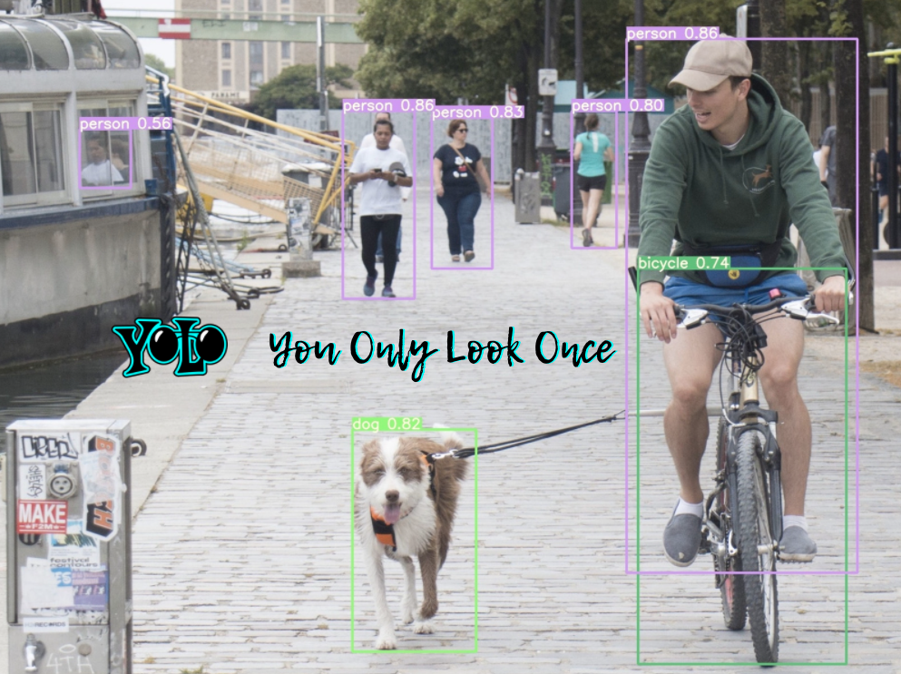
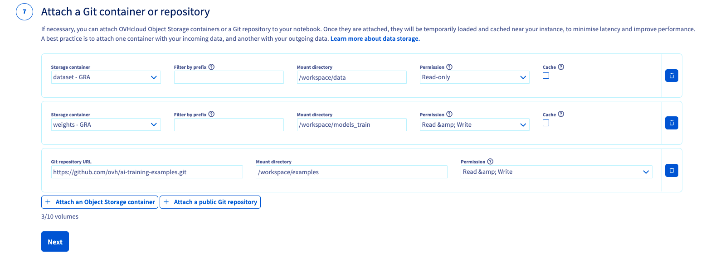
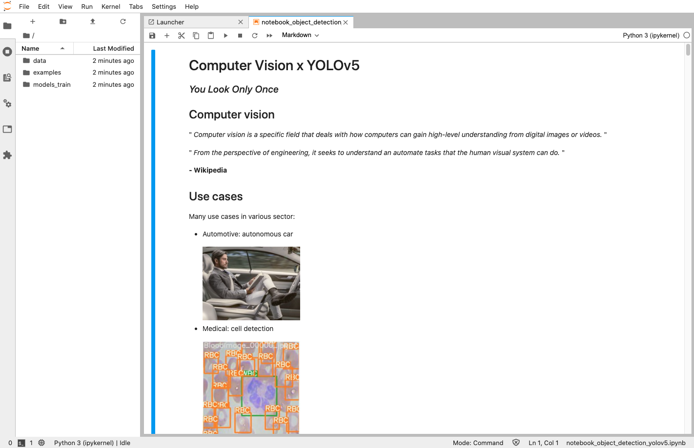

**Last updated 6th June, 2022.**

## Objective

The purpose of this tutorial is to show how it is possible to train YOLOv5 to recognize objects. YOLOv5 is an object detection algorithm. Although closely related to image classification, object detection performs image classification on a more precise scale. Object detection locates and categories features in images.

{.thumbnail}

It is based on the YOLOv5 open source repository by [Ultralytics](https://github.com/ultralytics/yolov5).

## Requirements

- Access to the [OVHcloud Control Panel](https://ca.ovh.com/auth/?action=gotomanager&from=https://www.ovh.com.au/&ovhSubsidiary=au);
- An AI Notebooks project created inside a [Public Cloud project](https://www.ovhcloud.com/en-au/public-cloud/) in your OVHcloud account;
- A user for AI Notebooks;
- Your own dataset.

## Instructions

### Uploading your dataset on Public Cloud Storage

If you want to upload it from the [OVHcloud Control Panel](https://ca.ovh.com/auth/?action=gotomanager&from=https://www.ovh.com.au/&ovhSubsidiary=au), go to the Object Storage section and create a new object container by clicking `Object Storage`{.action} > `Create an object container`{.action}.

{.thumbnail}

If you want to run it with the CLI, just follow this [guide](https://docs.ovh.com/au/en/publiccloud/ai/cli/access-object-storage-data/). You have to choose the region, the name of your container and the path where your data is located and use the following command:

```bash
ovhai data upload <region> <container> <paths>
```

> [!primary]
>
> This tutorial has been realized with the COCO dataset. If you don't have your own dataset, you can use it by downloading the COCO version "YOLOv5 PyTorch" available for free on [Roboflow](https://public.roboflow.com/object-detection/microsoft-coco-subset/).
>

### Launching and accessing Jupyter notebook with PyTorch framework

You need to attach a volume if your data is in your OVHcloud object storage and you want to use it during your experiment, or if you need to save the results of your work in the object storage. For more information on data, volumes and permissions, see [our guide on data](https://docs.ovh.com/au/en/publiccloud/ai/cli/access-object-storage-data/).

If you want to launch it from the [OVHcloud Control Panel](https://ca.ovh.com/auth/?action=gotomanager&from=https://www.ovh.com.au/&ovhSubsidiary=au), just follow this [guide](https://docs.ovh.com/au/en/publiccloud/ai/notebooks/definition/).

1. `Name your notebook`
2. `Choose Jupyterlab editor`
3. `Select the PyTorch framework`
4. `Choose the access type`
5. `Select the datacenter location (same region as your object container)`
6. `Choose the number of GPUs or CPUs you need`

> [!warning]
>
> For this tutorial, we advise you to use at least **2 GPUs**.
>

<ol start="7">
  <li><code>Attach Object Storage containers</code></li>
</ol>

> [!warning]
>
> In this tutorial, you need 2 object containers.
>

- the **first object container** contains your dataset (labelled and separated) and your `data.yaml` file.
- the **second object container** is empty. It is intended to save your model weights (for a future inference for example).

{.thumbnail}

Once the repository has been cloned, find the YOLOv5 notebook by following this path: `ai-training-examples` > `notebooks` > `computer-vision` > `object-detection` > `miniconda` > `notebook_object_detection_yolov5.ipynb`.

<ol start="8">
  <li><code>Attach public ssh keys only if you want to</code></li>
  <li><code>Check that everything is ok and launch your notebook</code></li>
</ol>

If you want to launch it with the CLI, choose the [volumes](https://docs.ovh.com/au/en/publiccloud/ai/cli/access-object-storage-data/) you want to attach and the number of GPUs (`<nb-gpus>`) to use on your notebook and use the following command:

```bash
ovhai notebook run pytorch jupyterlab \
	--name <name> \
	--gpu <nb-gpus> \
	--volume <dataset-container>@<region>/:/workspace/data:<permission> \
	--volume <weights-container>@<region>/:/workspace/models_train:<permission>
```

You can then reach your notebook’s URL once it is running.

You should have this overview:

{.thumbnail}

### Experimenting YOLOv5 notebook

Once your dataset is ready and uploaded, you are able to train the YOLOv5 model of your choice!

A preview of this notebook can be found on GitHub [here](https://github.com/ovh/ai-training-examples/blob/main/notebooks/computer-vision/object-detection/miniconda/notebook_object_detection_yolov5.ipynb).

### Go further

Do you want to observe the evolution of your metrics during the training of your model? Click [here](https://docs.ovh.com/au/en/publiccloud/ai/notebooks/tuto-weights-and-biases/)!

Do you want to use your YOLOv5 model in an app? [Here it is](https://docs.ovh.com/au/en/publiccloud/ai/training/web-service-yolov5/).
