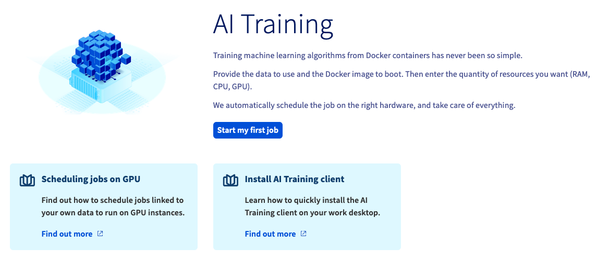
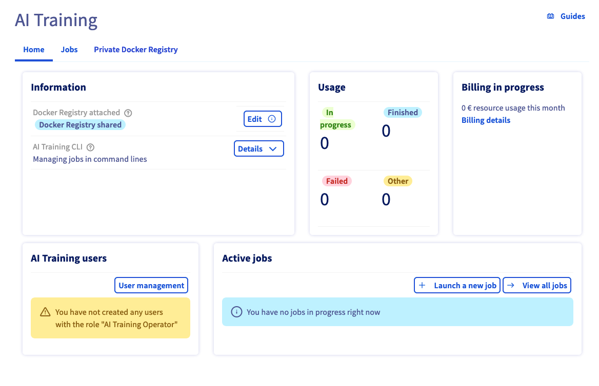
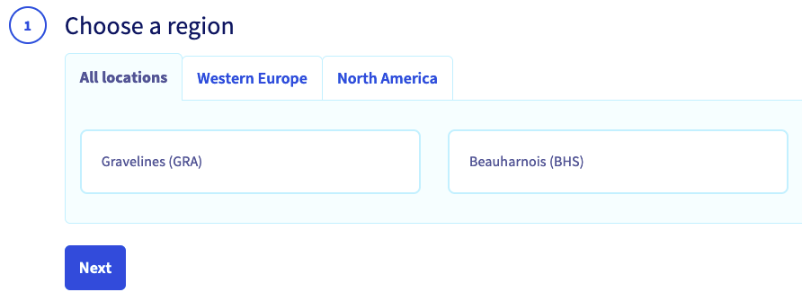
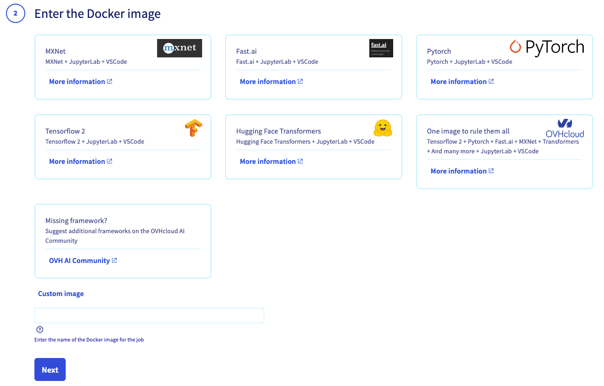
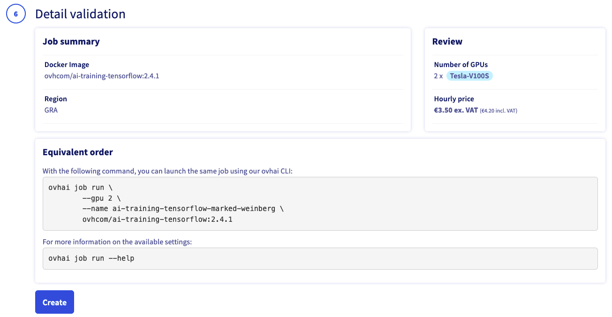
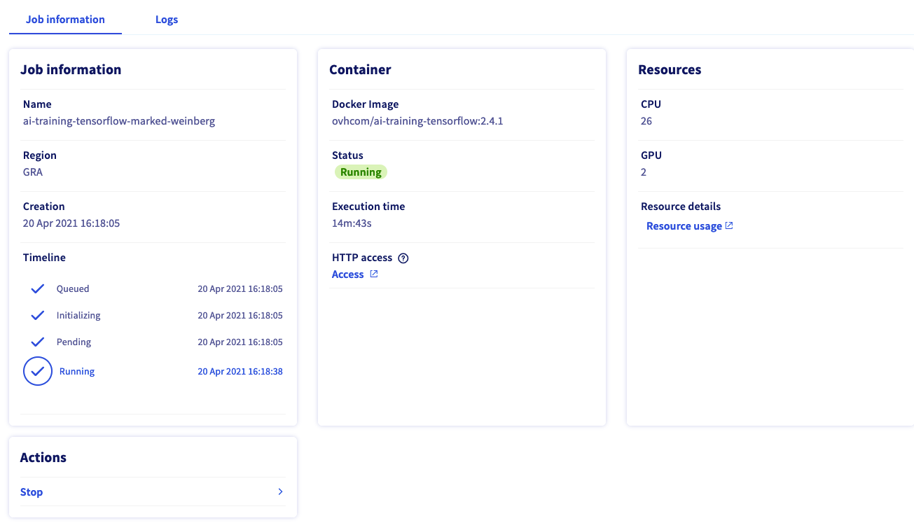

**Last updated 18th May, 2021.**

## Objective

This guide covers the initialisation of **AI Training** and the submission of [**jobs**](https://docs.ovh.com/fr/publiccloud/ai/training/jobs) through the OVHcloud Control Panel.

## Requirements

-   a **Public cloud** project
-   optionally container objects to attach data to the **job** at step 6, see our [create data container](https://docs.ovh.com/fr/storage/pcs/create-container/) guide.
-   access to the [OVHcloud Control Panel](https://www.ovh.com/auth/?action=gotomanager&from=https://www.ovh.com/fr/&ovhSubsidiary=fr)

## Instructions

### Step 1 - Going to the AI Training menu

Log in to the [OVHcloud Control Panel](https://www.ovh.com/auth/?action=gotomanager&from=https://www.ovh.com/fr/&ovhSubsidiary=fr), go to the `Public Cloud`{.action} section and then to the `AI Training`{.action} section which is located under `AI & Machine Learning`.

{.thumbnail}

### Step 2 - Activating AI Training service

Once you have read the general information and validated this services's contract terms, you can start submitting your jobs. Upon activating the AI Training service you grant OVHcloud access to your Object Storage containers. This access is only used to synchronise your data within **AI Training** with your containers.

{.thumbnail}

#### Dashboard

Once **AI Training** is activated you land on the **dashboard** service with several components.

{.thumbnail}

-   Information: useful information for service usage
-   Usage: brief summary of number of jobs according to their status
-   Billing: an overview of your ongoing billing
-   **AI Training** users: list of users that can use this service
-   Jobs: list of active jobs

> [!primary]
> You don't need a user to launch a new job from the OVHcloud manager but you will need one later if you want to use the CLI or access your jobs urls. Instructions for creating new users are described [here](https://docs.ovh.com/fr/publiccloud/ai/users).

### Step 3 - Starting a job submission

From the **jobs** list in the dashboard you can start the job submission by clicking the `Launch a new Job`{.action} button.

{.thumbnail}

### Step 4 - Selecting a region for your job

Each **job** is executed in an OVHcloud region. Each region has its own **AI Training** cluster with potentially varying capabilities. For more information see the [capabilities](https://docs.ovh.com/fr/publiccloud/ai/training/capabilities).
Select the desired region and click `Next`{.action}.

{.thumbnail}

### Step 5 - Providing a Docker image

A job is basically a Docker container that is run within the OVHcloud infrastructure. You need to provide a Docker image to be executed. There are several options you can choose from:

#### Preset Images

OVHcloud provides a set of images from which you can choose to ease the submission of your first **jobs**. Provided images are essentially a JupyterLab environment bundled with some Deep Learning technology such as Tensorflow or MXNet.

{.thumbnail}

#### Custom Images

Preset images cannot cover all your needs so you can specify your own image if necessary. You can use any image that is accessible from **AI Training**.

This includes public images (e.g. Dockerhub), images within the shared registry or images in your added private registry. For more information, see how to [add a private registry](https://docs.ovh.com/fr/publiccloud/ai/training/add-private-registry).

Once your image is chosen, click `Next`{.action}.

### Step 6 - Attaching data to your job (optional)

You can attach [**data**](https://docs.ovh.com/fr/publiccloud/ai/data) objects to your job either as input for your training workload or as output for your results (e.g. model weights).

Before attaching a data object you need to [create one](https://docs.ovh.com/fr/publiccloud/ai/data). A **data** object cannot be attached to a running **job**.

To attach a **data** object, just select from the list on the left. Next to each data, within the parenthesis, you can check the mount path in the Docker container for the submitted **job**. If you wish to customise this mount path, you will need to use the **`ovhai` CLI**, its installation procedure is available [here](https://docs.ovh.com/fr/publiccloud/ai/cli/install-client).

{.thumbnail}

> [!warning]
>
> To attach a **data** object you must click on the plus (+) button after filling the fields

Once the data is configured click `Next`{.action}.

### Step 7 - Overriding the Docker entrypoint (optional)

The Docker image you provided in Step 5 includes an entrypoint for your container. You can override this entrypoint by specifying your own command. Once the entrypoint is set up click `Next`{.action}.

{.thumbnail}

### Step 8 - Specifying the amount of resources

In this step you can either select the amount of GPUs or CPUs you need for your training workload.

The max amount of GPUs or CPUs you can select for your **job** is region dependent. If you choose a GPU a fixed ratio of CPU is applied based on the number of GPUs. Similarly, there is a fixed ratio of Memory based on the number of CPUs. For more information see the [capabilities](https://docs.ovh.com/fr/publiccloud/ai/training/capabilities).

Once the amount of resources is set you can see a preview of the billing rate. Click `Next`{.action}.

{.thumbnail}

### Step 9 - Submitting your job

In the final step you get an overview of the **job** you configured before submission. You also get the equivalent command to use with the **`ovhai` CLI**.

{.thumbnail}

The **AI Training** service is mainly supposed to be used through the **`ovhai` CLI**. The OVHcloud Control Panel only offers a subset of the features and is meant to help you get started before using the CLI.

Finally click `Submit`{.action} to submit your **job** to the cluster.

> [!warning]
>
> A job will run indefinitely until completion or manual interruption.

### Step 10 - Consulting your job

Once the job is submitted you are redirected to the **jobs** list page.

{.thumbnail}

From this list you can access your job details either by clicking on its `ID` or by clicking on `...`{.action} and selecting `Details`. The details include several components:

{.thumbnail}

-   **Job Information**: basic information on the job you submitted
-   **Container**: describes the status of your job and provides you with the URL to access any service exposed by your job on the port `8080`. The URL is of the form `https://<JOB-ID>.job.<REGION>.training.ai.cloud.ovh.net/`. If the service is not exposed on the port `8080` it is still accessible by specifying the port in the URL this way: `https://<JOB-ID>-<PORT>.job.<REGION>.training.ai.cloud.ovh.net/`. You can check the list of available ports in the [capabilities](https://docs.ovh.com/fr/publiccloud/ai/training/capabilities).
-   **Resources**: a summary of the resources consumed by the **job**
-   **Actions**: available actions
-   **Data**: list of **data** objects attached to the job

### Step 11 - Cancelling your job

If you are done using your job, if your model converged prematurely or if you just wish to interrupt your job you can do so from the **jobs** list.

From the list of **jobs** you can list the available actions at the far right of each entry and interrupt the job by clicking `Stop`{.action}. Alternatively, from the **job** details you can also interrupt the **job** from the list of actions.

## Feedback

Please send us your questions, feedback and suggestions to improve the service:

- On the OVHcloud [Discord server](https://discord.com/invite/vXVurFfwe9)
