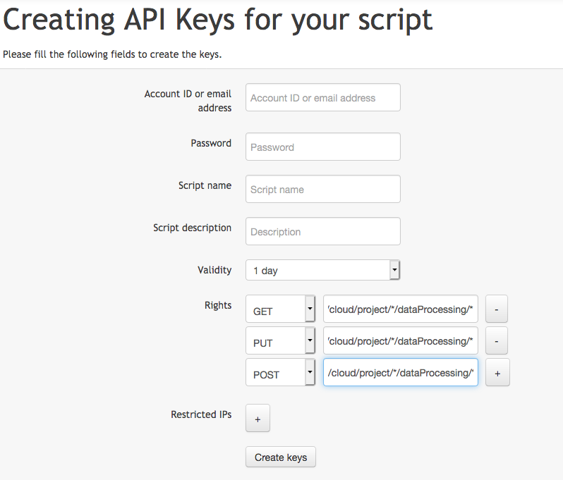
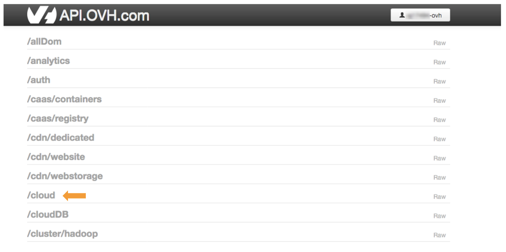
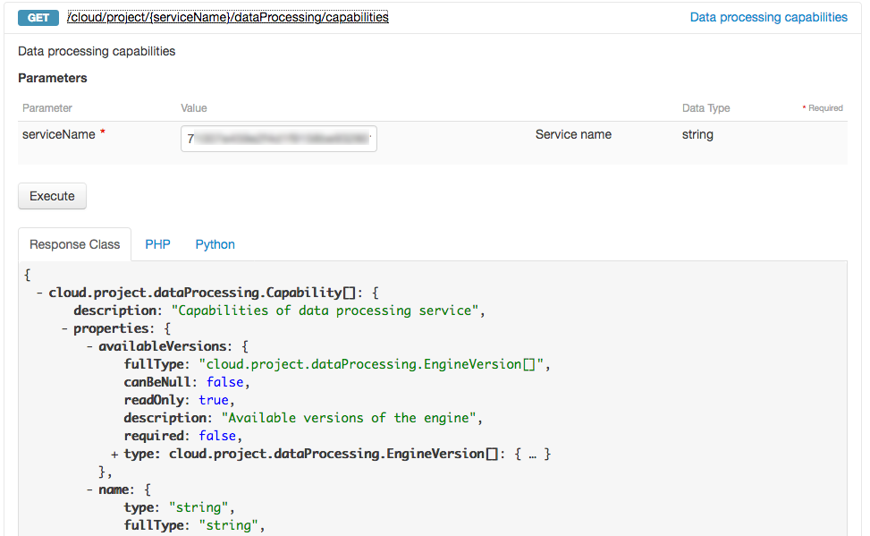
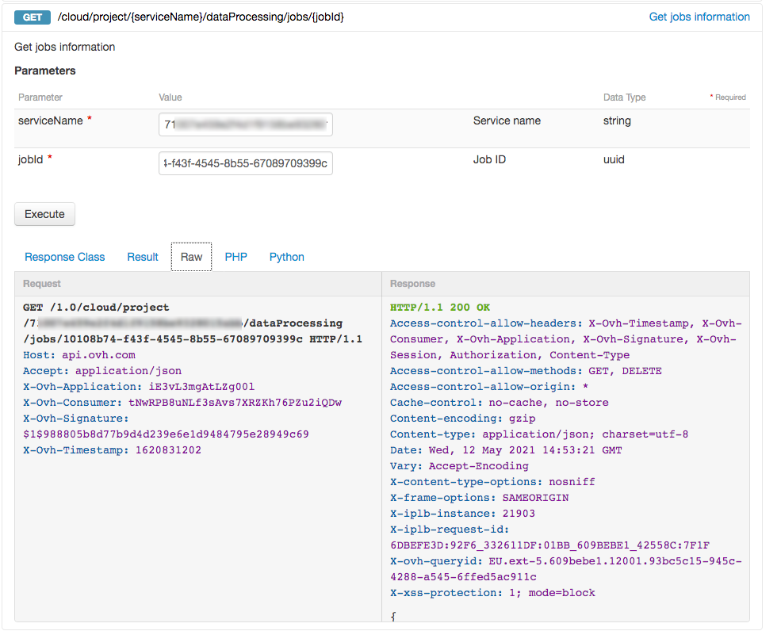

**Last updated 14<sup>th</sup> May, 2021**

## Objective
This guide helps you to use the Data Processing endpoints through the OVHcloud API in order to develop your own applications with Data Processing.

To read an introduction about the Data Processing service you can visit [Data Processing Overview](../overview).

## Requirements
- An OVHcloud account
- An activated cloud project in your OVHcloud account (see [How to create a cloud project](../../public-cloud/getting_started_with_public_cloud_logging_in_and_creating_a_project) and [How to activate the Data Processing service for your cloud project](../activation){.external} for details.)
- An Openstack user in your cloud project and access to Openstack Horizon dashboard (see [How to create an Openstack user and access to Horizon](../../public-cloud/configure_user_access_to_horizon/) for details.)
- An application code to be run in Apache Spark environment

## Instructions

### Step 1: Get your OVHcloud API credentials
To be able to use the OVHcloud API, you must set up some configurations that will allow it to authenticate.
To do so, you will need an application key, a secret application key and a consumer key. These can be obtained [here]( https://eu.api.ovh.com/createToken/){.external}.

You need to add the rights `GET/POST/PUT` on the endpoint `/cloud/project/\*/dataProcessing/\*` .
{.thumbnail}

Keep those credentials as they will be needed to use the OVHcloud API.

To store and use them you can create file or set them as environment variables. 
The way you proceed depends on which medium you chose to reach the API.

But most of the wrappers provided by OVHcloud use an `ovh.conf` file that looks like the following:
    ```
    endpoint=ovh-eu
    application_key=my_app_key
    application_secret=my_application_secret
    consumer_key=my_consumer_key
    ```
You should create in your application's directory and fill it with your own 3 keys.

### Step 2: Chose your mean to reach the OVHcloud API
Now that you got your credentials, you're able to query the OVHcloud API. To do so, you can choose between: 
- using a HTTP client or the curl command line. 
You can find a documentation to learn how to use the OVHcloud API [here](../../../account/customer/first-steps-with-ovh-api).

- using one of the wrappers provided by OVHcloud which will handle all the authentication for you.
Several wrappers (for Python, java, c#, PHP, golang, etc...) are available on the [OVHcloud github](https://github.com/ovh?q=&type=&language=&sort=){.external}.
All the information needed to use them are in their respective README.md files.

### Step 3: Take a look to the OVHcloud API endpoints
In order to know which endpoints are available through the OVHcloud API, you can have a look at this [web page](https://api.ovh.com/){.external} and click on the explore the API button.

To use this UI, you have to be logged in with your OVHcloud account.

There you can find all the Data Processing endpoints in the "cloud" section. 
{.thumbnail}
Scroll down into the "cloud section until you reach the `/cloud/project/{serviceName}/dataProcessing/... ` endpoints.
Once you get there, you can try out the endpoints directly in the UI by clicking on them.

>[!primary]
>
> The serviceName parameters that is required for every endpoint of the `cloud` section is your Public Cloud project ID.

If you need further information about an endpoint, you can find the response class that tells you what the API response will look like, just under the `execute` button, and examples of wrappers code.
{.thumbnail}

You can also see what your request body looks like in a json format for a specific endpoint by having a look in the `raw` tab that appears if the request has been executed once.
{.thumbnail}

>[!primary]
>
> For the POST on `cloud/project/{serviceName}/dataProcessing/jobs` endpoint, the `engineParameters` property is a mandatory list of key/value parameters.
> To know which parameters you should use, you just have to query the `cloud/project/{serviceName}/dataProcessing/capabilites` endpoint to list the several parameters depending on the engine you are using.
> It will also show you which of those parameters are required and how they should be formed.


### Step 4: Make sure the Data Processing service is activated for your Public Cloud project
To use the Data Processing endpoints you will need the Data Processing service to be activated for your Public Cloud project.
You can check your project activation status by calling the `GET cloud/project/{serviceName}/dataProcessing/activation` endpoint with the OVHcloud API or more easily check it out in the OVHcloud manager.
To do so, go on the OVHcloud manager in the Public Cloud tab and, with the wanted project selected, click on the Data Processing tab on the left. If your project is activated, you should see a list (or an empty list) of jobs. 
Else you'll have a page that invites you to activate your current project.
To know how and why activate your project, you can read this documentation: [How to activate the Data Processing service for your cloud project](../../activation).

### Step 5: Use Data Processing with your application
Now you have your credentials, a mean to reach the OVHcloud API and all the information about the request body and response for each of Data Processing endpoints. 
Thus you can try to use the Data processing endpoints from your own application. 

Just a friendly reminder that for submitting a job, you need to have your application code stored in your Public Cloud object storage. 
If you never used Data Processing before, we recommend you to try it out first by following [this documentation for a Java job](../../submit-javascala) or [this one for Python](../../submit-python).

## Go further

To learn more about using Data Processing and how to submit a job and process your data, we invite you to look at [Data Processing documentations page](../).

You can send your questions, suggestions or feedbacks in our community of users on [https://community.ovh.com/en/](https://community.ovh.com/en/){.external} or in our public [Gitter](https://gitter.im/ovh/data-processing){.external}
