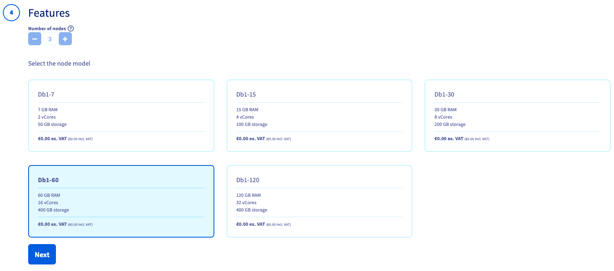
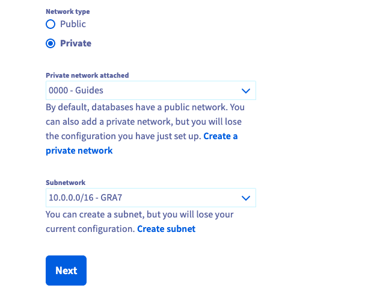

**Last updated 11th October 2021**

## Objective

OVHcloud Databases as-a-service (DBaaS) allow you to focus on building and deploying cloud applications while OVHcloud takes care of the database infrastructure and maintenance.

**This guide explains how to order a database solution in the OVHcloud Control Panel.**

## Requirements

- access to the [OVHcloud Control Panel](https://ca.ovh.com/auth/?action=gotomanager&from=https://www.ovh.com/ca/fr/&ovhSubsidiary=qc)
- a [Public Cloud project](https://www.ovhcloud.com/fr-ca/public-cloud/) in your OVHcloud account

## Instructions

### Subscribing to the service

Log in to your [OVHcloud Control Panel](https://ca.ovh.com/auth/?action=gotomanager&from=https://www.ovh.com/ca/fr/&ovhSubsidiary=qc) and switch to `Public Cloud`{.action} in the top navigation bar. After selecting your Public Cloud project, click on `Databases`{.action} in the left-hand navigation bar under **Storage**.

Click on the button `Create a database instance`{.action}. (`Create a service`{.action} if your project already contains databases.)

#### Step 1: Select your database type

Click on the type of database you want to use and then select the version to install from the respective drop-down menu. Click on `Next`{.action} to continue.

{.thumbnail}

#### Step 2: Select a solution

In this step, choose an appropriate service plan. You will be able to upgrade the plan after creation.

{.thumbnail}

Please visit the [capabilities page](https://docs.ovh.com/ca/fr/publiccloud/databases/) of your selected database type for detailed information on each plan's properties.

Click on `Next`{.action} to continue.

#### Step 3: Select a location

Choose the geographical region of the data centre in which your database will be hosted.

{.thumbnail}

Click on `Next`{.action} to continue.

#### Step 4: Configure database nodes

You can increase the number of nodes and choose the node model in this step. The initial and maximum numbers of nodes depends on the solution chosen in step 2.

{.thumbnail}

Please visit the [capabilities page](https://docs.ovh.com/ca/fr/publiccloud/databases/) of your selected database type for detailed information on the hardware resources and other properties of the database installation.

Take note of the pricing information and click on `Next`{.action} to continue.

#### Step 5: Configure your options

You can name your database in this step and decide to attach a private network.

{.thumbnail}

##### **Connecting a private network (optional)**

{.thumbnail}

If you already have a private subnet available, check the box **Private** and select it from the drop-down menu. Note that this option might not be available for the selected service type.

You can be forwarded to create a private network or subnet by clicking on the respective links. You will have to start the database order process anew in that case.

Please follow [this guide](https://docs.ovh.com/ca/fr/public-cloud/public-cloud-vrack/) for detailed instructions.

#### Step 6: Summary and confirmation

The final section will display a summary of your order as well as the API equivalent of creating this database instance with the [OVHcloud API](https://docs.ovh.com/ca/fr/api/api-premiers-pas/).

{.thumbnail}

Within a few minutes your new database service will be deployed. Messages in the OVHcloud Control Panel will inform you when the database is ready to use.

Please continue with the [Database Management guide](https://docs.ovh.com/ca/fr/publiccloud/databases/mongodb/managing-service/) to configure your service after installation.

> [!warning]
> For security reasons the default network configuration doesn't allow any incoming connections. It is thus critical you [authorize the suitable IP addresses](https://docs.ovh.com/ca/fr/publiccloud/databases/mongodb/managing-service/#configuring-authorised-ips) in order to successfully access your database.

## Go further

[Managing a MongoDB service from the OVHcloud Control Panel](https://docs.ovh.com/ca/fr/publiccloud/databases/mongodb/managing-service/)

[Configuring vRack for Public Cloud](https://docs.ovh.com/ca/fr/public-cloud/public-cloud-vrack/)

Visit our dedicated Discord channel: <https://discord.gg/PwPqWUpN8G>. Ask questions, provide feedback and interact directly with the team that builds our databases services.

Join our community of users on <https://community.ovh.com/>.
