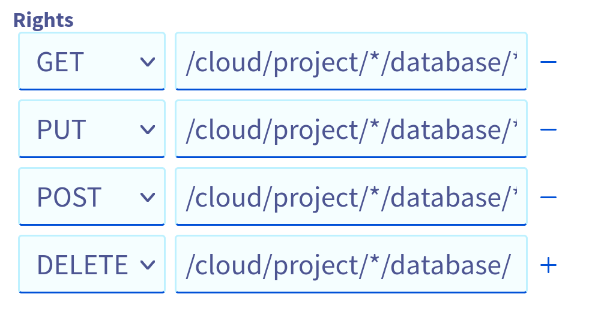

**Last updated October 19<sup>th</sup>, 2022**

## Objective

Public Cloud managed databases allow you to focus on building and deploying cloud applications while OVHcloud takes care of the database infrastructure and maintenance.

**This guide explains how to order a MongoDB instance of a Public Cloud managed database service using Terraform.**

## Requirements

- [Terraform >= 0.17.1](https://www.terraform.io/) installed
- Access to the [OVHcloud API](https://ca.api.ovh.com/console/) (create your credentials by consulting [this guide](https://docs.ovh.com/sg/en/api/first-steps-with-ovh-api/))
- A [Public Cloud project](https://www.ovhcloud.com/en-sg/public-cloud/) in your OVHcloud account

## Instructions

### Step 1: Gather the OVHcloud required parameters

#### Getting your cluster/API tokens information

The "OVH provider" needs to be configured with a set of credentials:

- an `application_key`
- an `application_secret`
- a `consumer_key`

**Why?**

Because, behind the scenes, the "OVH Terraform provider" is doing requests to OVHcloud APIs. 

In order to retrieve this necessary information, please follow our [First steps with the OVHcloud APIs](https://docs.ovh.com/sg/en/api/first-steps-with-ovh-api/) tutorial.

Specifically, you have to generate these credentials via the [OVHcloud token generation page](https://ca.api.ovh.com/createToken/?GET=/*&POST=/*&PUT=/*&DELETE=/*) with the following rights:

{.thumbnail}

When you have successfully generated your OVHcloud tokens, please save them as you will have to use them very soon.

The last needed information is the `service_name`: it is the ID of your Public Cloud project.

**How to get it?**

In the Public Cloud section, you can retrieve your service name ID thanks to the `Copy to clipboard`{.action} button.

{.thumbnail}

You will also use this information in Terraform resources definition files.

### Step 2: Gather the set of required parameters

In order to create a new MongoDB cluster, you will need to specify at least:

- the _version_ (e.g. "5.0")
- the _region_ (e.g. "DE")
- the _plan_ (e.g. "business")
- the _flavor_ of the cluster (e.g. "db1.7")

### Step 3: Create Terraform files

First, create a `main.tf` file defining the resources that will be created

```bash
terraform {
  required_providers {
    ovh = {
      source  = "ovh/ovh"
      version = "0.22"
    }
  }

  required_version = ">= 0.17.1"
}

provider "ovh" {
  endpoint           = var.ovh.endpoint
  application_key    = var.ovh.application_key
  application_secret = var.ovh.application_secret
  consumer_key       = var.ovh.consumer_key
}

resource "ovh_cloud_project_database" "service" {
  service_name = var.product.project_id
  description  = var.product.name
  engine       = "mongodb"
  version      = var.product.version
  plan         = var.product.plan
  nodes {
    region = var.product.region
  }
  flavor = var.product.flavor
}


resource "ovh_cloud_project_database_mongodb_user" "dbuser" {
  service_name = ovh_cloud_project_database.service.service_name
  cluster_id   = ovh_cloud_project_database.service.id
  name         = var.access.name
}

resource "ovh_cloud_project_database_ip_restriction" "iprestriction" {
  service_name = ovh_cloud_project_database.service.service_name
  engine       = ovh_cloud_project_database.service.engine
  cluster_id   = ovh_cloud_project_database.service.id
  ip           = var.access.ip
}
```

Then, create a `variables.tf` file defining the variables used in `main.tf`:

```bash
variable "ovh" {
  type = map(string)
  default = {
    endpoint           = "ovh-eu"
    application_key    = ""
    application_secret = ""
    consumer_key       = ""
  }
}

variable "product" {
  type = map(string)
  default = {
    name       = "mongodb-terraform"
    project_id = ""
    region     = "DE"
    plan       = "essential"
    flavor     = "db1-7"
    version    = "5.0"
  }
}

variable "access" {
  type = map(string)
  default = {
    name = "johndoe"
    ip = "xx.xx.xx.xx/32"
  }
}
```

Here, we defined the `ovh-eu` endpoint because we want to call the OVHcloud Europe API. Other endpoints exist, depending on your needs:

- `ovh-eu` for OVHcloud Europe API
- `ovh-us` for OVHcloud US API
- `ovh-ca` for OVHcloud North-America API

Then, create a `secrets.tfvars` file containing the required variables values:

```bash
ovh = {
  endpoint           = "ovh-eu"
  application_key    = "<application_key>"
  application_secret = "<application_secret>"
  consumer_key       = "<consumer_key>"
}

product = {
  project_id = "<service_name>"
  name       = "mongodb-terraform"
  region     = "DE"
  plan       = "essential"
  flavor     = "db1-7"
  version    = "5.0"
}

access = {
  name = "johndoe"
  ip = "$(curl -fs ifconfig.me)/32"
}
```

> [!primary]
>
> Don't forget to replace `<service_name>`, `<application_key>`, `<application_secret>` and `<consumer_key>` by the real data.

Finally, create an `outputs.tf` file defining the resources that will be exported:

```bash
output "cluster_uri" {
  value = ovh_cloud_project_database.service.endpoints.0.uri
}

output "user_name" {
  value = ovh_cloud_project_database_mongodb_user.dbuser.name
}

output "user_password" {
  value     = ovh_cloud_project_database_mongodb_user.dbuser.password
  sensitive = true
}
```

### Step 4: Run

Now we need to initialise Terraform, generate a plan, and apply it.

```bash
$ terraform init
```

The `init` command will initialize your working directory which contains `.tf` configuration files.

It’s the first command to execute for a new configuration, or after doing a checkout of an existing configuration in a given git repository for example.

The `init` command will:

- Download and install Terraform providers/plugins
- Initialise backend (if defined)
- Download and install modules (if defined)

Now, we can generate our plan:

```bash
$ terraform plan -var-file=secrets.tfvars
```

Thanks to the `plan` command, we can check what Terraform wants to create, modify or remove.

The plan is OK for us, so let's apply it:

```bash
$ terraform apply -var-file=secrets.tfvars -auto-approve
```

Finally export the user credentials and the URI

```bash
export PASSWORD=$(terraform output -raw user_password)
export USER=$(terraform output -raw user_name)
export URI=$(terraform output -raw cluster_uri)
```

And, voilà, the MongoDB cluster is created.

## Go further

Visit the [Github examples repository](https://github.com/ovh/public-cloud-databases-examples) to find out how to create other databases clusterswith Terraform.

[MongoDB capabilities](https://docs.ovh.com/sg/en/publiccloud/databases/mongodb/capabilities/)

[Managing a MongoDB service from the OVHcloud Control Panel](https://docs.ovh.com/sg/en/publiccloud/databases/mongodb/managing-service/)

[Configuring vRack for Public Cloud](https://docs.ovh.com/sg/en/public-cloud/public-cloud-vrack/)

Visit our dedicated Discord channel: <https://discord.gg/PwPqWUpN8G>. Ask questions, provide feedback and interact directly with the team that builds our databases services.

Join our community of users on <https://community.ovh.com/en/>.
