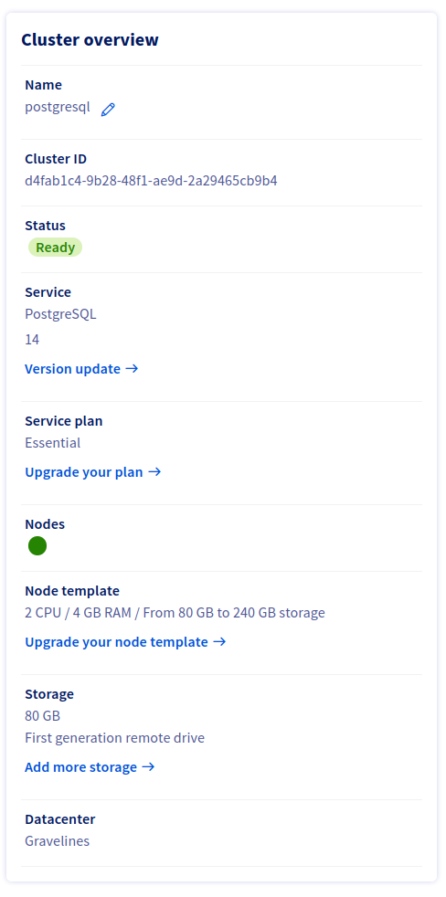

## Objective

Learn how to adjust the storage space of your cluster according to your needs.

> [!primary]
>
> This feature is only available for engines that use storage space.
>

## How to increase storage

This option is available through the OVHcloud [API](https://ca.api.ovh.com/console/) and the [Control Panel](https://ca.ovh.com/auth/?action=gotomanager&from=https://www.ovh.com/asia/&ovhSubsidiary=asia).

### Requirements

- Access to your [OVHcloud Control Panel](https://ca.ovh.com/auth/?action=gotomanager&from=https://www.ovh.com/asia/&ovhSubsidiary=asia) or to the [API](https://ca.api.ovh.com/console/)
- A [Public Cloud project](https://www.ovhcloud.com/asia/public-cloud/) in your OVHcloud account

### Instructions

To adjust the storage space of your cluster, log in to the OVHcloud Control Panel and open your Public Cloud project. Click `Databases`{.action} in the left navigation bar, select your engine instance then click the `General Information`{.action} tab.

Click `Add more storage`{.action} and adjust the storage space of your cluster.

## How to decrease storage

This option is currently only available via the OVHcloud [API](https://ca.api.ovh.com/console/).

### Requirements

- Access to the OVHcloud [API](https://ca.api.ovh.com/console/){.external} (create your credentials by consulting [this guide](/pages/account/api/first-steps))
- A [Public Cloud project](https://www.ovhcloud.com/asia/public-cloud/) in your OVHcloud account

### Instructions

In order to be able to decrease your storage, you must have a threshold of 20% between your current disk space used and the new disk storage (base storage + additional storage).

For instance, if you have a MongoDB with 120 GB of storage and 80 GB of disk space used, you can decrease the storage up to 100GB on that endpoint:

> [!api]
> @api {PUT} /cloud/project/{serviceName}/database/mongodb/{clusterId}

## We want your feedback!

We would love to help answer questions and appreciate any feedback you may have.

If you need training or technical assistance to implement our solutions, contact your sales representative or click on [this link](https://www.ovhcloud.com/asia/professional-services/) to get a quote and ask our Professional Services experts for a custom analysis of your project.

Are you on Discord? Connect to our channel at <https://discord.gg/PwPqWUpN8G> and interact directly with the team that builds our databases service!
