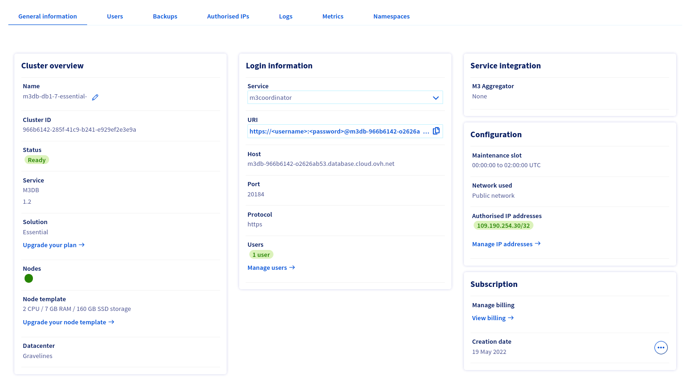
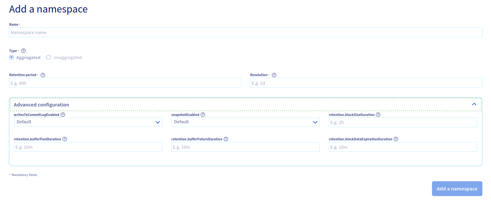

**Last updated 12th May 2022**

## Objective

Public Cloud Databases allow you to focus on building and deploying cloud applications while OVHcloud takes care of the database infrastructure and maintenance in operational conditions.

**This guide explains how to configure your M3db instance to accept incoming connections.**

## Requirements

- A [Public Cloud project](https://www.ovhcloud.com/en-au/public-cloud/) in your OVHcloud account
- Access to the [OVHcloud Control Panel](https://ca.ovh.com/auth/?action=gotomanager&from=https://www.ovh.com.au/&ovhSubsidiary=au)
- A M3db database running on your OVHcloud Public Cloud Databases ([this guide](https://docs.ovh.com/au/en/publiccloud/databases/getting-started/) can help you to meet this requirement)

## Instructions

### Configure your M3db instance to accept incoming connections

Before making a connection, we need to verify that our M3db instance is correctly configured.

Log in to your [OVHcloud Control Panel](https://ca.ovh.com/auth/?action=gotomanager&from=https://www.ovh.com.au/&ovhSubsidiary=au) and open your `Public Cloud`{.action} project. Click on `Databases`{.action} in the left-hand navigation bar and select your M3db instance.

#### Step 1: Verify your user roles and password

Select the `Users`{.action} tab. Verify that you have a user with sufficient rights and a configured password. If you don't remember the user's password, you can either create a new user or regenerate the password of an existing user.

> [!warning]
> Be careful! By doing so you will need to update all the places where you already use this user/password pair.
>

{.thumbnail}

You can add more users by clicking on the button `Add user`{.action}.

{.thumbnail}

Enter a username *(required)* and a group *(optional)*, then click `Create User`{.action}.

> [!primary]
> You can delete a user or regenerate a password via the `...`{.action} button in the `Users & Roles` table.

#### Step 2: Authorise incoming connections from the M3db client

> [!warning]
> For security reasons the default network configuration doesn't allow any incoming connections. It is thus critical you authorise the suitable IP addresses in order to successfully access your database.

In this step, select the `Authorised IPs`{.action} tab. IP addresses must be authorised here before they can connect to your database.

Clicking on `Add an IP address or IP address block (CIDR)`{.action} opens a new window in which you can add single IP addresses or blocks to allow access to the databse.

{.thumbnail}

You can edit and retract database access via the `...`{.action} button in the IP table.

> [!primary]
>
> If you want to allow connections from the outside, you can enter the IP 0.0.0.0/0. Please use it carefully.
>

#### Collect required information

Select the `General information`{.action} tab to find the required login credentials in the `Login informations` section.

{.thumbnail}

Select the `Namespaces`{.action} tab to get the namespaces information.

{.thumbnail}

> [!primary]
>
> To create a new namespaces click on `Add a namespace`{.action} then fill the form :
>
> {.thumbnail}

Select the `Users`{.action} tab to get the username.

{.thumbnail}

## Go further

Visit our dedicated Discord channel: <https://discord.gg/PwPqWUpN8G>. Ask questions, provide feedback and interact directly with the team that builds our databases services.

Join our community of users on <https://community.ovh.com/en/>.
