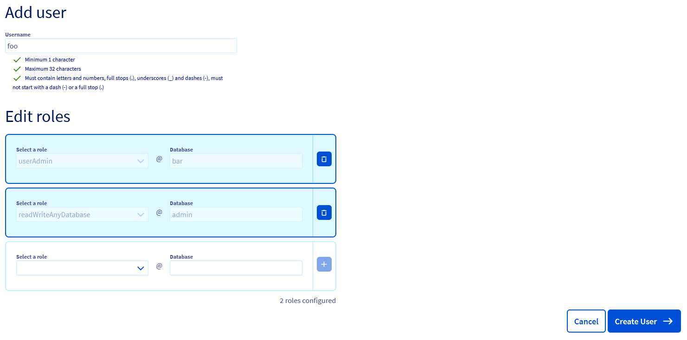
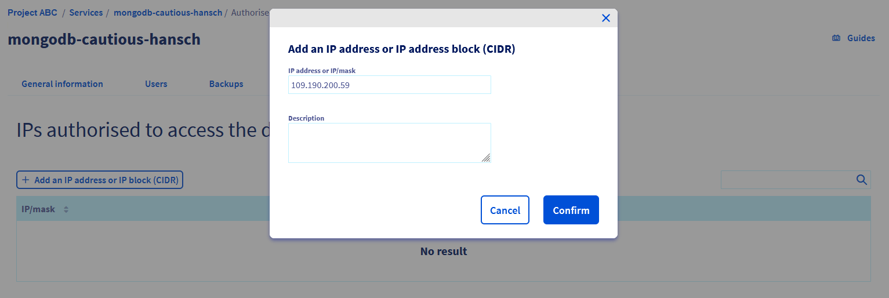
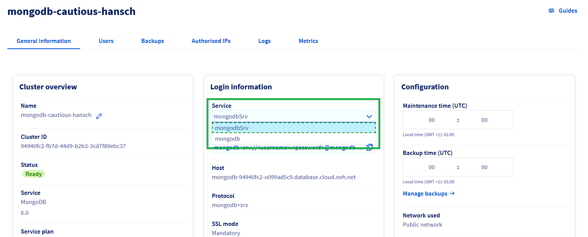
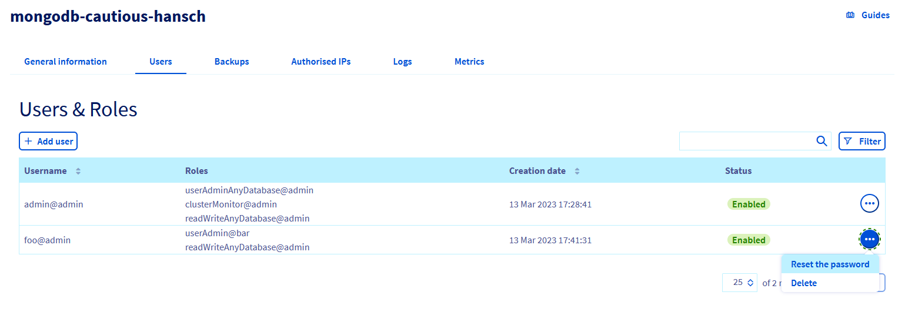

**Last updated March 14th, 2023**

## Objective

Public Cloud Databases allow you to focus on building and deploying cloud applications while OVHcloud takes care of the database infrastructure and maintenance in operational conditions.

**This guide explains how to configure your MongoDB instance to accept incoming connections.**

## Requirements

- A [Public Cloud project](https://www.ovhcloud.com/pl/public-cloud/) in your OVHcloud account
- Access to the [OVHcloud Control Panel](https://www.ovh.com/auth/?action=gotomanager&from=https://www.ovh.pl/&ovhSubsidiary=pl)
- A MongoDB database running on your OVHcloud Public Cloud Databases ([this guide](https://docs.ovh.com/pl/publiccloud/databases/getting-started/) can help you to meet this requirement)

## Instructions

### Configure your MongoDB instance to accept incoming connections

Before making a connection, we need to verify that our MongoDB instance is correctly configured.

Log in to your [OVHcloud Control Panel](https://www.ovh.com/auth/?action=gotomanager&from=https://www.ovh.pl/&ovhSubsidiary=pl) and open your `Public Cloud`{.action} project. Click on `Databases`{.action} in the left-hand navigation bar and select your MongoDB instance.

#### Step 1: Verify your user roles and password

Select the `Users`{.action} tab. Verify that you have a user with sufficient rights and a configured password. If you don't remember the user's password, you can either create a new user or regenerate the password of an existing user. Be careful! By doing so you will need to update all the places where you already use this user/password pair.

We provide official MongoDB built-in roles. Please read the [official MongoDB documentation](https://docs.mongodb.com/manual/reference/built-in-roles/){.external} to select the right roles for your use case.

In our example, we will create a user called `foo` with the role `userAdmin` on the `bar` database and the role `readWriteAnyDatabase` on any database as its name implies:

{.thumbnail}

Once created or updated, note the password then after a few seconds check to verify the user is ready and with the "Enabled" status in the OVHcloud Control Panel.

{.thumbnail}

#### Step 2: Authorise incoming connections from the MongoDB client

In this step, select the `Authorised IP's`{.action} tab (Access Control List).
By default, a Public Cloud Database does not accept any form of connection from the outside world.
This way we can help prevent intrusive connection attempts.

Click to authorise a new IP. In our case we will enter 109.190.200.59:

{.thumbnail}

> [!primary]
>
> If you want to allow any connections from the outside, you can enter the IP 0.0.0.0/0. Please use it carefully. Every IP will be authorised.
>

### Get your connection information (URI)

Select the `General Information`{.action} tab. In the **Login Information** section, copy the Service URI.

You can specify the MongoDB connection string using either:

- *Service -> mongoDB* for the Standard Connection String format **(soon deprecated)**.
- *Service -> mongodbSrv* for the DNS Seed List Connection String format.

{.thumbnail}

> [!primary]
>
> MongoDB 3.6 introduced the concept of a seed list that is specified using DNS records, specifically SRV and TXT records. This allows a client to connect to a replica set even if one of the nodes that the client specifies is unavailable.
>
> The use of SRV records eliminates the requirement for every client to pass in a complete set of state information for the cluster. Instead, a single SRV record identifies all the nodes associated with the cluster (and their port numbers) and an associated TXT record defines the options for the URI.
>
> *Learn more [here](https://www.mongodb.com/docs/manual/reference/connection-string/)*.
>

> [!tabs]
> mongodb
>> It should be similar to this when you have a single node (Essential service plan):
>> ```
>> mongodb://<username>:<password>@<hostname>/admin?tls=true
>> ```
>> And like this when you have a MongoDB cluster with multiple nodes, called a replica set (Business or Enterprise service plans):
>> ```
>> mongodb://<username>:<password>@<hostname node1>,<hostname node 2>,<hostname node 3>/admin?replicaSet=replicaset&tls=true
>> ```
> mongodbSrv
>> It should be similar to this:
>> ```
>> mongodb+srv://<username>:<password>@mongodb-d5674315-o2626ab53.database.cloud.ovh.net/admin?replicaSet=replicaset
>> ```

Select the `Users`{.action} tab to get the username or reset a user password.

{.thumbnail}

## Go further

[MongoDB capabilities](https://docs.ovh.com/pl/publiccloud/databases/mongodb/capabilities/)

Visit the [Github examples repository](https://github.com/ovh/public-cloud-databases-examples/tree/main/databases/mongodb) to find how to connect to your database with several languages.

Visit our dedicated Discord channel: <https://discord.gg/ovhcloud>. Ask questions, provide feedback and interact directly with the team that builds our databases services.

If you need training or technical assistance to implement our solutions, contact your sales representative or click on [this link](https://www.ovhcloud.com/pl/professional-services/) to get a quote and ask our Professional Services experts for a custom analysis of your project.

Join our community of users on <https://community.ovh.com/en/>.
