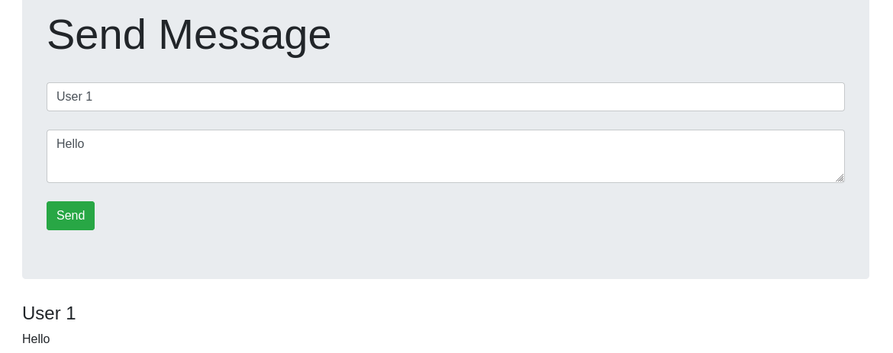
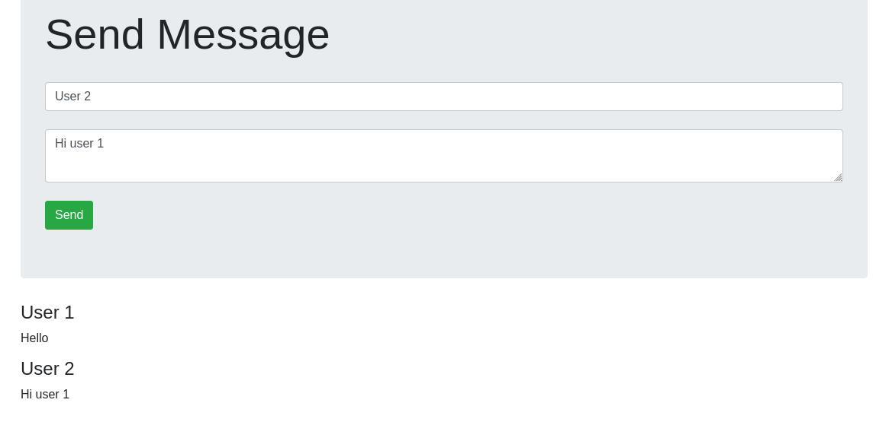

**Last updated 27<sup>th</sup> July 2022**

## Objective

In this tutorial, we will use the Node.js platform to build a **real-time chat application** that sends and shows messages to a recipient instantly without any page refresh. We will use the JavaScript framework Express.js and the Mongoose and Socket.io libraries to achieve this.

> [!warning]
>
> OVHcloud provides services for which you are responsible for their configuration and management. You are therefore responsible for their proper functioning.
>
> This tutorial is designed to help you as much as possible with common tasks. If you are having difficulty performing these actions, please contact a specialized service provider and/or discuss it with our community of users on <https://community.ovh.com/en/>. OVHcloud can't provide you with technical support in this regard.
>

## Requirements

- A [Public Cloud project](https://www.ovhcloud.com/de/public-cloud/) in your OVHcloud account
- Access to the [OVHcloud Control Panel](https://www.ovh.com/auth/?action=gotomanager&from=https://www.ovh.de/&ovhSubsidiary=de)
- A MongoDB database running on your OVHcloud Public Cloud Databases ([this guide](https://docs.ovh.com/de/publiccloud/databases/getting-started/) can help you to meet this requirement)
- [Configure your MongoDB instance](https://docs.ovh.com/de/publiccloud/databases/mongodb/managing-service/) to accept incoming connections
- A [NodeJS working environment](https://nodejs.dev/learn/how-to-install-nodejs) and public network connectivity (Internet). This tutorial was made using NodeJS LTS 16.14.0.

## Instructions

### Building a simple Chat Application

Our app must allow multiple users to chat together. The messages should update without refreshing the page. For simplicity, we will be avoiding authentication.

We can start by creating a new project directory and moving into it. Then we can initiate our project with the following command:

```bash
npm init
```

This will prompt us to enter details about our project.

After this a `package.json` file will be created:

```json
{
  "name": "demo-chat-app",
  "version": "1.0.0",
  "description": "",
  "main": "index.js",
  "scripts": {
    "test": "echo \"Error: no test specified\" && exit 1"
  },
  "author": "",
  "license": "ISC"
}
```

Our app directory is now set.

The first thing we need to create is a server. In order to create that, we will be making use of a framework named **Express.**

### Express.js

Express.js, or simply Express, is a web application framework for Node.js. Express [provides a robust set of features for web and mobile applications](https://expressjs.com/) and a thin layer of fundamental web application features, without obscuring Node.js features.

Install Express.js using the following command:

```bash
npm install -s express
```

Inside the package.json file, a new line will be added:

```json
"dependencies": {  
  "express": "4.16.3"
}
```

Next, we will create a `server.js` file.

In this file, we need to require Express and create a reference to a variable from an instance of Express. Static contents like HTML, CSS or JavaScript can be served using Express.js:

```javascript
var express = require('express'),
    app = express();
```

And we can start listening to a port using the code:

```javascript
var server = app.listen(3000, () => {  
 console.log('server is running on port', server.address().port);  
});
```

Now we need to create an HTML file, `index.html`, that displays our UI.

```html
<!DOCTYPE html>
<html lang="en">
<head>
  <meta charset="UTF-8">
  <meta name="viewport" content="width=device-width, initial-scale=1.0">
  <meta http-equiv="X-UA-Compatible" content="ie=edge">
  <title>My First Node App</title>
  <link rel="stylesheet" href="https://maxcdn.bootstrapcdn.com/bootstrap/4.0.0-beta/css/bootstrap.min.css" integrity="sha384-/Y6pD6FV/Vv2HJnA6t+vslU6fwYXjCFtcEpHbNJ0lyAFsXTsjBbfaDjzALeQsN6M" crossorigin="anonymous">
  <script src="https://code.jquery.com/jquery-3.2.1.min.js" crossorigin="anonymous"></script>
  <script src="https://cdnjs.cloudflare.com/ajax/libs/popper.js/1.11.0/umd/popper.min.js" integrity="sha384-b/U6ypiBEHpOf/4+1nzFpr53nxSS+GLCkfwBdFNTxtclqqenISfwAzpKaMNFNmj4" crossorigin="anonymous"></script>
  <script src="https://maxcdn.bootstrapcdn.com/bootstrap/4.0.0-beta/js/bootstrap.min.js" integrity="sha384-h0AbiXch4ZDo7tp9hKZ4TsHbi047NrKGLO3SEJAg45jXxnGIfYzk4Si90RDIqNm1" crossorigin="anonymous"></script>
</head>
<body>
<div class="container">
  <div class="jumbotron">
    <h1 class="display-4">Send Message</h1>
    <br />
    <input id = "name" class="form-control" placeholder="Name">
    <br />
    <textarea id = "message" class="form-control" placeholder="Your Message Here"></textarea>
    <br />
    <button id="send" class="btn btn-success">Send</button>
  </div>
  <div id="messages">

  </div>
</div>
<script></script>
</body>
</html>
```

Please note that the empty `<script></script>` tag will be the place where we will write the client-side JavaScript code.

In order to tell Express that, we will be using a static file. We will add a new line inside `server.js`:

```javascript
app.use(express.static(__dirname));
```

We can run server.js using the command:

```bash
node ./server.js
```

Or with a package called **nodemon,** so that the changes made in the code will be automatically detected. Download nodemon using the command:

```bash
npm install -g nodemon
```

The `-g` stands for global, so that it is accessible in all projects.

Run the code using the command:

```bash
nodemon ./server.js
```

If you go to localhost:3000 we can see the index file:


Now that our server is up and running, we need to create our database. For this app, we will have a No-SQL database and will be using **MongoDB**. Our database will contain a single collection called messages with the fields name and message.

In order to connect this database to the app, we will use another package called **Mongoose**.

### Mongoose

[Mongoose](https://mongoosejs.com/docs/guide.html) is a MongoDB object modeling tool designed to work in an asynchronous environment.

Mongoose can be installed with the command:

```bash
npm install -s mongoose
```

Inside server.js we will require Mongoose:

```javascript
var mongoose = require('mongoose');
```

We will assign a variable, the `Service URI` of our MongoDB instance database.

```javascript
var dbUrl = 'mongodb+srv://<username>:<password>@mongodb-e49d02ee-o2626ab53.database.cloud.ovh.net/admin?replicaSet=replicaset'
```

Mongoose will connect to the MongoDB database with the connect method:

```javascript
mongoose.connect(dbUrl , (err) => {   
   console.log('mongodb connected',err);  
})
```

And we will be defining our message model as:

```javascript
var Message = mongoose.model('Message',{ name : String, message : String})
```

We can implement the chat logic now, but before that, there is one more package that needs to be added.

### Body-Parser

Body-Parser extracts the entire body portion of an incoming request stream and exposes it on req.body. The middleware was a part of Express.js earlier, but now you have to install it separately.

Install it using the following command:

```bash
npm install -s body-parser
```

Add the following code to **server.js:**

```javascript
var bodyParser = require('body-parser')  
app.use(bodyParser.json());  
app.use(bodyParser.urlencoded({extended: false}))
```

### Routing

Routing refers to how an application's endpoints (URIs) respond to client requests. You define routing using methods of the Express app object that correspond to HTTP methods: app.get() to handle GET requests and app.post() to handle POST requests.

These routing methods [specify a callback function](https://expressjs.com/en/guide/routing.html) (sometimes called “handler functions”) called when the application receives a request to the specified route (endpoint) and HTTP method. In other words, the application “listens” for requests that match the specified routes and methods, and when it detects a match, it calls the specified callback function.

Now we need to create two routes to the messages for our chat to work.

Inside server.js:

-   **Get** will get all the message from the database:

```javascript
app.get('/messages', (req, res) => {
  Message.find({},(err, messages)=> {
    res.send(messages);
  })
})
```

-   **Post** will post new messages created by the user to the database:

```javascript
app.post('/messages', (req, res) => {
  var message = new Message(req.body);
  message.save((err) =>{
    if(err)
      sendStatus(500);
    res.sendStatus(200);
  })
})
```

In order to connect these routes to the front end we need to add the following code in the client side script tag in the `index.html`:

```javascript
$(() => {
   $("#send").click(()=>{
       sendMessage({name: $("#name").val(), message: $("#message").val()});
   })
   getMessages()
})

function addMessages(message){
   $("#messages").append(`<h4> ${message.name} </h4> <p> ${message.message} </p>`)
}

function getMessages(){
 $.get('http://localhost:3000/messages', (data) => {
   data.forEach(addMessages);
 })
}

function sendMessage(message){
 $.post('http://localhost:3000/messages', message)
}
```

Here sendMessage is used to invoke the post route of the messages and save a message sent by the user. The message is created when a user clicks the send button.

Similarly, **getMessage** is used to invoke the get route of messages. This will get all the messages saved in the database and will be appended to the messages div.



The only issue now is that there is no way for the client to know if the server is updated. So each time we post a message we need to refresh the page to see the new messages.

To solve this we can add a push notification system that will send messages from server to client. In Node.js we use socket.io.

### Socket.io

Socket.io is a JavaScript library for real-time web applications. It enables real-time, bi-directional communication between web clients and server and has two parts: a client-side library that runs in the browser and a server-side library for Node.js. Socket.io enables real-time bi-directional event-based communication.

To install socket.io:

```bash
npm install -s socket.io
```

We also need an HTTP package for Socket.io to work:

```bash
npm install -s http
```

Add the following code to server.js:

```javascript
var http = require('http').Server(app);  
var io = require('socket.io')(http);
```

And create a connection:

```javascript
io.on('connection', () =>{  
 console.log('a user is connected')  
})
```

In `index.html`, add the following tag:

```html
<script src=”/socket.io/socket.io.js”></script>
```

Now we need to create an emit action when a message is created in server.js. So the post route becomes:

```javascript
app.post('/messages', (req, res) => {  
  var message = new Message(req.body);  
  message.save((err) =>{  
    if(err)  
      sendStatus(500);  
      io.emit('message', req.body);
    res.sendStatus(200);  
  })  
})
```

And in the client side script tag in `index.html`, add the following code:

```javascript
var socket = io();
socket.on('message', addMessages)
```

So each time a message is posted, the server will update the messages in the message div.



Great! You now have a nodeJS chat application up and running, with messages stored on a MongoDB cluster. Reach out to [official NodeJS tutorials](https://nodejs.dev/learn) for more use cases.


## Attachments

`package.json`

```json
{
  "name": "demo-chat-app",
  "version": "1.0.0",
  "description": "demo chat app",
  "main": "index.js",
  "scripts": {
    "test": "jasmine"
  },
  "author": "",
  "license": "ISC",
  "dependencies": {
    "body-parser": "^1.18.3",
    "express": "^4.16.3",
    "mongoose": "^5.7.5",
    "socket.io": "^2.1.1"
  },
  "devDependencies": {
    "jasmine": "^3.1.0",
    "request": "^2.87.0"
  }
}
```

`index.html`

```html
<!DOCTYPE html>
<html>
<head>
  <title>My First Node App</title>
  <link rel="stylesheet" href="https://maxcdn.bootstrapcdn.com/bootstrap/4.0.0-beta/css/bootstrap.min.css" integrity="sha384-/Y6pD6FV/Vv2HJnA6t+vslU6fwYXjCFtcEpHbNJ0lyAFsXTsjBbfaDjzALeQsN6M" crossorigin="anonymous">
  <script src="https://code.jquery.com/jquery-3.2.1.min.js" crossorigin="anonymous"></script>
  <script src="https://cdnjs.cloudflare.com/ajax/libs/popper.js/1.11.0/umd/popper.min.js" integrity="sha384-b/U6ypiBEHpOf/4+1nzFpr53nxSS+GLCkfwBdFNTxtclqqenISfwAzpKaMNFNmj4" crossorigin="anonymous"></script>
  <script src="https://maxcdn.bootstrapcdn.com/bootstrap/4.0.0-beta/js/bootstrap.min.js" integrity="sha384-h0AbiXch4ZDo7tp9hKZ4TsHbi047NrKGLO3SEJAg45jXxnGIfYzk4Si90RDIqNm1" crossorigin="anonymous"></script>
  <script src="/socket.io/socket.io.js"></script>
</head>
<body>
<div class="container">
  <div class="jumbotron">
    <h1 class="display-4">Send Message</h1>
    <br />
    <input id = "name" class="form-control" placeholder="Name">
    <br />
    <textarea id = "message" class="form-control" placeholder="Your Message Here"></textarea>
    <br />
    <button id="send" class="btn btn-success">Send</button>
  </div>
  <div id="messages">

  </div>
</div>
<script>
var socket = io();
$(() => {
  $("#send").click(()=>{
    sendMessage({name: $("#name").val(), message: $("#message").val()});
  })
  getMessages()
})

socket.on('message', addMessages)

function addMessages(message){
  $("#messages").append(`<h4> ${message.name} </h4> <p> ${message.message} </p>`)
}

function getMessages(){
  $.get('http://localhost:3000/messages', (data) => {
    data.forEach(addMessages);
  })
}

function sendMessage(message){
  $.post('http://localhost:3000/messages', message)
}
</script>
</body>
</html>
```

`server.js`

```javascript
var express = require('express');
var bodyParser = require('body-parser')
var app = express();
var http = require('http').Server(app);
var io = require('socket.io')(http);
var mongoose = require('mongoose');

app.use(express.static(__dirname));
app.use(bodyParser.json());
app.use(bodyParser.urlencoded({extended: false}))

var Message = mongoose.model('Message',{
  name : String,
  message : String
})

var dbUrl = 'mongodb+srv://<username>:<password>@mongodb-e49d02ee-o2626ab53.database.cloud.ovh.net/admin?replicaSet=replicaset'

app.get('/messages', (req, res) => {
  Message.find({},(err, messages)=> {
    res.send(messages);
  })
})

app.get('/messages/:user', (req, res) => {
  var user = req.params.user
  Message.find({name: user},(err, messages)=> {
    res.send(messages);
  })
})

app.post('/messages', async (req, res) => {
  try{
    var message = new Message(req.body);
    var savedMessage = await message.save()
      console.log('saved');
    var censored = await Message.findOne({message:'badword'});
    if(censored)
      await Message.remove({_id: censored.id})
    else
      io.emit('message', req.body);
    res.sendStatus(200);
  }
  catch (error){
    res.sendStatus(500);
    return console.log('error',error);
  }
  finally{
    console.log('Message Posted')
  }

})

io.on('connection', () =>{
  console.log('a user is connected')
})

mongoose.connect(dbUrl ,{useMongoClient : true} ,(err) => {
  console.log('mongodb connected',err);
})

var server = http.listen(3000, () => {
  console.log('server is running on port', server.address().port);
});
```

`spec/server.spec.js`

```javascript
var request = require('request')


describe('get messages', () => {
    it('should return 200 Ok', (done) => {
        request.get('http://localhost:3000/messages', (err, res) => {
            expect(res.statusCode).toEqual(200)
            done()
        })
    })
    it('should return a list, thats not empty', (done) => {
        request.get('http://localhost:3000/messages', (err, res) => {
            expect(JSON.parse(res.body).length).toBeGreaterThan(0)
            done()
        })
    })
})


describe('get messages from particular user', () => {
    it('should return 200 Ok', (done) => {
        request.get('http://localhost:3000/messages/Arun', (err, res) => {
            expect(res.statusCode).toEqual(200)
            done()
        })
    })
    it('should return the message of the user', (done) => {
        request.get('http://localhost:3000/messages/Arun', (err, res) => {
            expect(JSON.parse(res.body)[0].name).toEqual('Arun')
            done()
        })
    })
})
```

`spec/support/jasmine.json`

```json
{
  "spec_dir": "spec",
  "spec_files": [
    "**/*[sS]pec.js"
  ],
  "helpers": [
    "helpers/**/*.js"
  ],
  "stopSpecOnExpectationFailure": false,
  "random": true
}
```

## We want your feedback!

We would love to help answer questions and appreciate any feedback you may have.

Are you on Discord? Connect to our channel at <https://discord.gg/PwPqWUpN8G> and interact directly with the team that builds our databases service!
