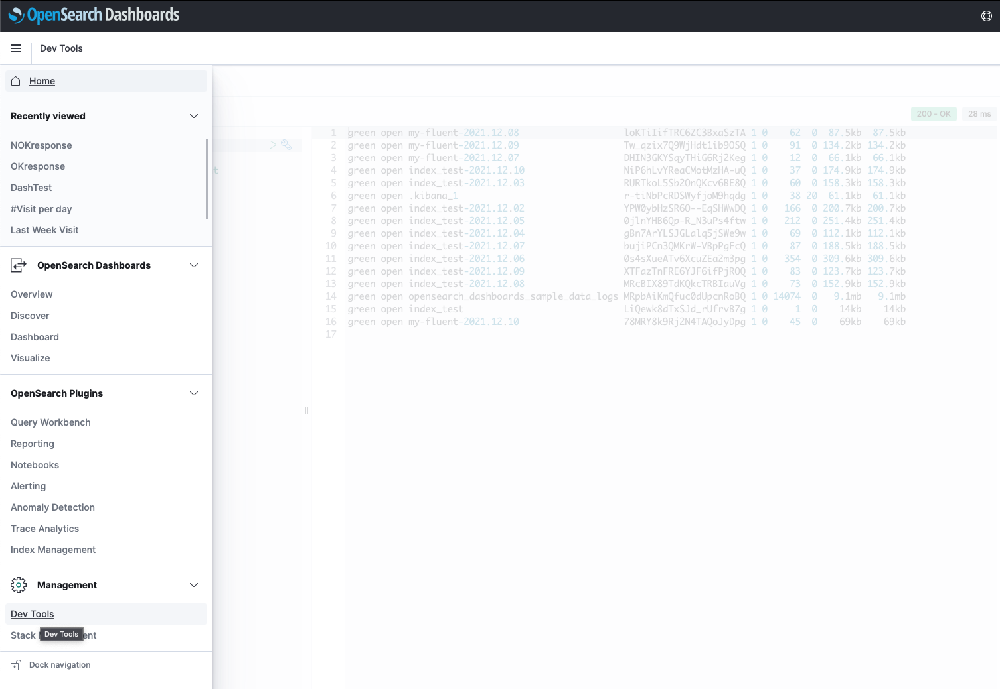
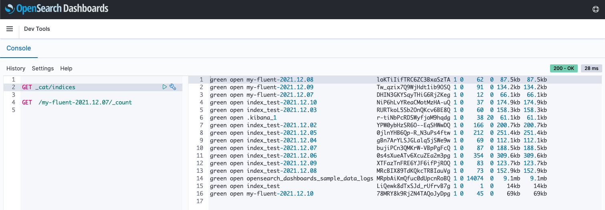
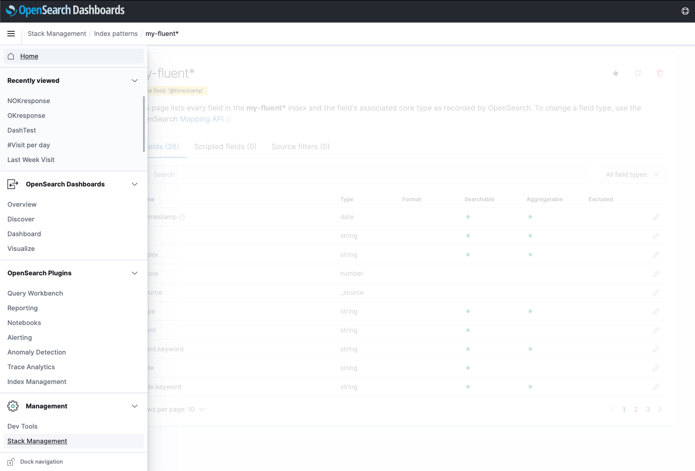
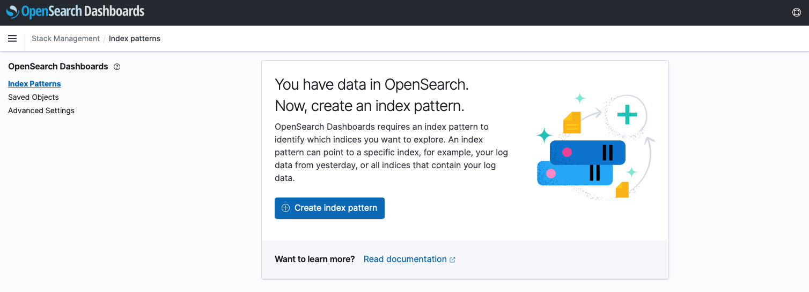
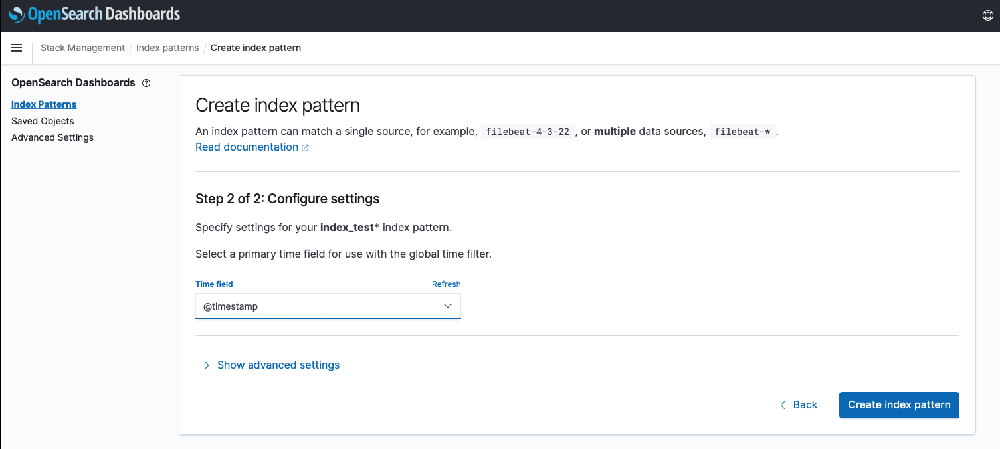
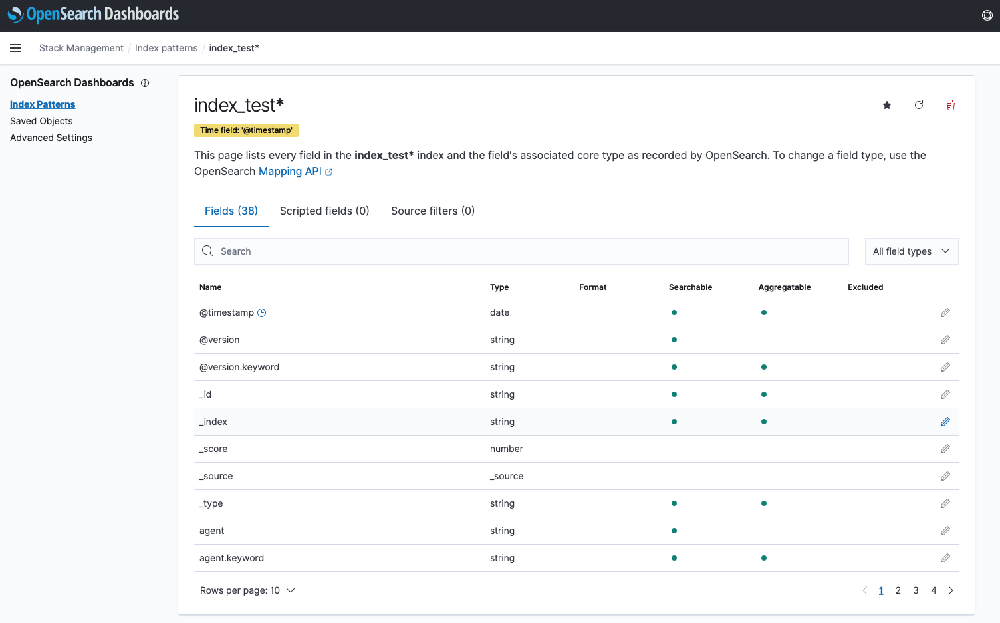
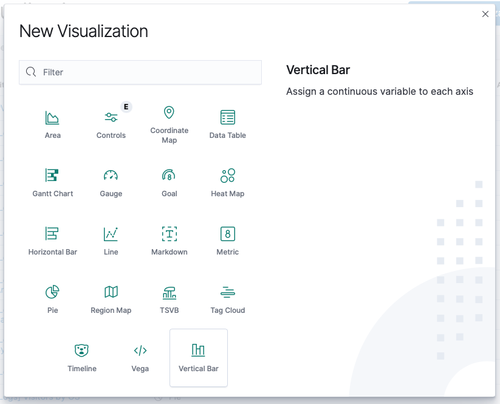
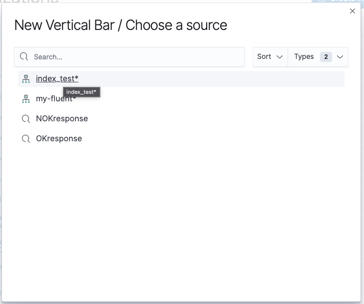
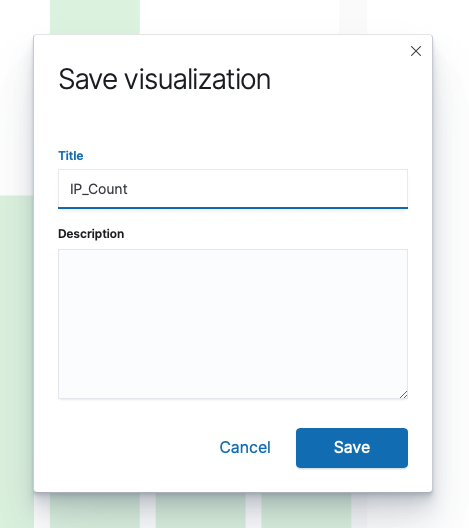
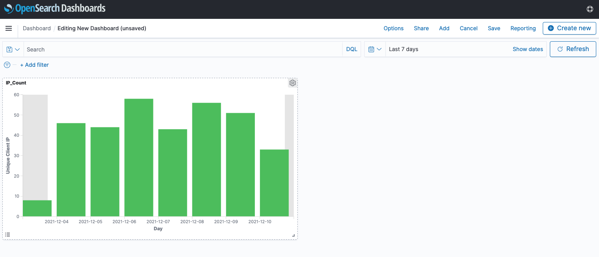

**Last updated 17<sup>th</sup> December 2021**

## Objective

OpenSearch is an open source search and analytics suite. In order to push relevant data to OpenSearch, several methods are available.
You can upload a file easily, but for real-time data such as metrics and logs, collectors are required.

**This tutorial explains how to configure two famous collectors, Logstash and Fluent Bit, to connect and forward data logs to your OpenSearch database service.**

## Requirements

This tutorial requires:

- An access to the [OVHcloud Control Panel](https://ca.ovh.com/auth/?action=gotomanager&from=https://www.ovh.com/world/&ovhSubsidiary=ws)
- A [Public Cloud project](https://www.ovhcloud.com/es/public-cloud/) in your OVHcloud account, running at least:
    - one Public Cloud Database for OpenSearch service running;
    - one or more additional compute instance running Linux, acting as a data injector. It can also be your computer, a Kubernetes cluster, etc.

> [!warning]
> Make sure that you have a user account with enough privileges to write to the OpenSearch database, and that the IP addresses that you will use to run your agents (Logstash and Fluent Bit) are part of the authorized list. Check our [Getting Started guide](https://docs.ovh.com/us/es/publiccloud/databases/opensearch/getting-started/){.external} for more information.

### Software environment

The main software components used to create this tutorial are:

- OpenSearch 1.0 Public Cloud DB instance
- Linux Ubuntu 21.10 / Apache2 2.4.48 to run:
	- Logstash 7.13.2
	- Fluent Bit 1.8

### OpenSearch Agents and ingestion tools compatibility Matrix

Due to the fork from ElasticSearch, it is recommended to verify the version of software that you will use:[OpenSearch compatibility Matrices](https://opensearch.org/docs/latest/clients/agents-and-ingestion-tools/index/#compatibility-matrices){.external}.

## Instructions

### Step 1: Logstash as the data log source

#### Install Logstash on client sources

To collect data, you need to install the collector agent on the data source. In our case it's a Linux Ubuntu virtual machine, but it can be anything.

Please refer to the official [OpenSearch Logstash installation documentation](https://opensearch.org/docs/latest/clients/logstash/index/){.external}

As detailed in the compatibility matrix, select and download a compatible release from ElasticSearch: [download OSS past releases](https://www.elastic.co/fr/downloads/past-releases#logstash-oss){.external}

#### Configure Logstash

The default configuration is sufficient for this tutorial but in case you need to review the configuration, go to */etc/logstash* and look at the configuration files (*logstash.yml*).

#### Configure a pipeline

Every pipeline is based on 3 phases: inputs, filters and outputs. For this tutorial, let's assume an Apache service is running. We will collect Apache access logs to configure one:

- the Apache access.log file as the input;
- the filter is based on the predefined grok;
- the OpenSearch database as the target output. Modify with your own values accordingly.

Configuration file : */etc/logstash/conf.d/apache2.conf*

```text
input {
  file {
    path => "/var/log/apache2/access.log"
  }
}
filter { 
  grok {
    match => { "message" => "%{COMBINEDAPACHELOG}" }
  }
  date {
    match => [ "timestamp" , "dd/MMM/yyyy:HH:mm:ss Z" ]
  }
}
output {
  opensearch { 
    hosts => ["https://opensearch-682faf00-682faf00.database.cloud.ovh.net:20184"]
    index => "index_test-%{+YYYY.MM.dd}"
    user => "admin"
    password => "2fakeSVV5wvyPykF"
  }
}
```

#### Grok patterns and debugger

As an example of the main pattern matching that are currently used, or to test some more specific ones, you can use some tools like [Grok Debugger](https://grokdebug.herokuapp.com){.external} :

{.thumbnail}

### Step 2: Visualize Logstash data in OpenSearch Dashboard

#### Validate that the index has been created and now populated

Now that we have Logstash running and parsing the Apache access log file, let's do a different connection to the Apache service and validate that Logstash is forwarding all access data to OpenSearch. Let's also connect to the OpenSearch Dashboard to check that the corresponding index has been created and that some first documents have been populated.

Use the Dev Tools to query the indices:

{.thumbnail}

Then, in the console, execute a *GET /_cat/indices* command to get the index list with the number of documents for each:

{.thumbnail}

#### Create an index pattern

To aggregate all corresponding daily indices, we have to create an index pattern from the Stack Management menu:

{.thumbnail}

To create the first index pattern:

{.thumbnail}

As we want to consolidate all our daily indices, let define the pattern as *index_test*:

{.thumbnail}

Then define the timestamp:

{.thumbnail}

OpenSearch will then define all fields available and their type directly from stored documents in the index:

{.thumbnail}

#### Create a new dashboard

##### **Create a new visualization**

In the OpenSearch Dashboard / Visualize, create a new visualization:

{.thumbnail}

Select the visualization type:

{.thumbnail}

Then select the data source (the index pattern you just created):

{.thumbnail}

You now have to define all criteria that you need to visualize:

- the period (last 7 days in our example);
- for the metrics, the Y-axis data (aggregation/field);
- and same for Buckets with time interval in case of date aggregation.

Click on `update`{.action} if there are any changes in the data definition, or refresh if you change the data time scale.

{.thumbnail}

Save your visualization:

{.thumbnail}

##### **Add visualizations to a dashboard**

Let's make a dashboard with the visualization you've just saved.

Create a new dashboard :

{.thumbnail}

As we have already created a visualization, *Add an existing object*:

{.thumbnail}

Search and select the one we just created:

{.thumbnail}

Reorganize your panels, add new or existing ones as wanted:

{.thumbnail}

We now have a real time dashboard showing us the unique IP address per day, found in Apache logs.

### Step 3: Fluent Bit alternative as the data log source

Multiple agents exist. Fluent Bit is a strong, full open source, alternative to Logstash, and works natively with OpenSearch: [official website for Fluent Bit](https://fluentbit.io){.external}.

We propose now to parse the Apache access logs and push these information to the OpenSearch database for this agent.

{.thumbnail}

#### Install Fluent Bit

To install Fluent Bit on our Linux Ubuntu instance, we will install the td-agent-bit package, as described in the Fluent Bit installation process from the [Official Documentation](https://docs.fluentbit.io/manual/installation/linux){.external}.

Check that the service is running and is enabled to start automatically when the system boots:

```bash
sudo systemctl enable td-agent-bit.service
sudo systemctl status td-agent-bit.service 
```

#### Configure Fluent Bit

Let's modify the configuration file /etc/td-agent-bit/td-agent-bit.conf for the INPUT and OUTPUT section :

```text
[INPUT]
    Name              tail
    Tag               test.file
    Path              /var/log/apache2/access.log
    DB                /var/log/apache2_access.db
    Path_Key          filename
    Parser            apache2
    Mem_Buf_Limit     8MB
    Skip_Long_Lines   On
    Refresh_Interval  30


[OUTPUT]
    Name es
    Match *
    Host opensearch-682faf00-682faf00.database.cloud.ovh.net
    Port 20184
    tls On
    tls.verify off
    HTTP_user admin
    HTTP_Passwd 2FakeSVV5wvyPykF
    Logstash_Format True
    Logstash_Prefix my-fluent
```

If required, please refer to parameters in the [Fluent Bit Official Documentation](https://docs.fluentbit.io/manual/administration/configuring-fluent-bit){.external}.

All Apache access logs will now be pushed to the OpenSearch database under the "my-fluent" index.

### Step 4: Visualize Fluent Bit data in OpenSearch Dashboard

As we did for Logstash, you can create an index pattern to aggregate all the daily data logs stored in OpenSearch then visualize those data or create dashboards. In this example, the indices will be *my-fluent-YYYY.MM.DD* , so you can define a pattern like : *my-fluent-**.

Congratulations, you are now able to collect data from multiple sources and push them to Public Cloud Databases for Opensearch!

## Go further

[OVHcloud documentation on managed Public Cloud Databases](https://docs.ovh.com/us/es/publiccloud/databases/)

[OpenSearch capabilities](https://docs.ovh.com/us/es/publiccloud/databases/opensearch/capabilities/)

[OpenSearch Official documentation](https://opensearch.org/docs/latest){.external}

[OpenSearch Dashboard Official documentation](https://opensearch.org/docs/latest){.external}

[OpenSearch Project GitHub](https://github.com/opensearch-project){.external}

[Fluent Bit Official Documentation](https://docs.fluentbit.io/manual/){.external}

Visit our dedicated Discord channel: <https://discord.gg/ovhcloud>. Ask questions, provide feedback and interact directly with the team that builds our databases services.

If you need training or technical assistance to implement our solutions, contact your sales representative or click on [this link](https://www.ovhcloud.com/es/professional-services/) to get a quote and ask our Professional Services experts for a custom analysis of your project.
