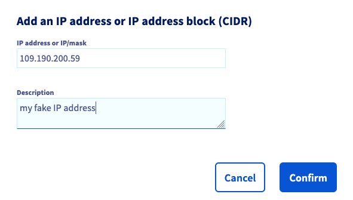

**Last updated 5th of November 2021**

## Objective

Public Cloud Databases allow you to focus on building and deploying cloud applications while OVHcloud takes care of the database infrastructure and maintenance in operational conditions.

**This guide explains how to connect to a Redis database instance with one of the world's most famous programming language: PHP.**

## Requirements

- Access to the [OVHcloud Control Panel](https://ca.ovh.com/auth/?action=gotomanager&from=https://www.ovh.com/asia/&ovhSubsidiary=asia);
- A [Public Cloud project](https://www.ovhcloud.com/asia/public-cloud/) in your OVHcloud account;
- An up and running Public Cloud Database for Redis;
- A PHP environment with a stable version and public network connectivity (Internet). This guide was made in PHP 7.4.

## Concept

A Redis instance can be managed through multiple ways.
One of the easiest, yet powerful, is to use a Command Line Interface (CLI), as shown in our guide : [Connect to Redis with CLI](https://docs.ovh.com/asia/en/publiccloud/databases/redis/connect-cli).

Another way is to interact directly using programming languages, such as PHP.
PHP is used in almost 80% of the websites in the world, such as Facebook, Wikipedia or Wordpress.
Redis has multiple PHP clients, allowing us to connect and manage a Redis instance from code. Please follow the official [Redis documentation for PHP clients](https://redis.io/clients#php){.external} to get the latest information for all Redis clients.

We will need to set up our PHP environment with phpredis client, then configure our Public Cloud Databases for Redis instances to accept incoming connections, and finally code in PHP to perform a few example actions.

## Instructions

### Set up your PHP environment

To interact with your Redis instance with PHP, your development environment needs to be configured with:

- A compatible version of PHP;
- PHP extension that support Redis 6 and TLS, as recommended by Redis : phpredis or Predis PHP Libraries.

For both phpredis and Predis it is recommended to check their respective sites on how to do the install:

- [phpredis official GitHub](https://github.com/phpredis/phpredis);
- [Predis official GitHub](https://github.com/predis/predis).

We are now ready to learn how to connect to our Redis instance. We will use phpredis as the PHP client.

### Configure your Redis instance to accept incoming connections

Before making a connection, we need to verify that our redis instance is correctly configured.

Log in to your [OVHcloud Control Panel](https://ca.ovh.com/auth/?action=gotomanager&from=https://www.ovh.com/asia/&ovhSubsidiary=asia) and switch to `Public Cloud`{.action} in the top navigation bar. After selecting your Public Cloud project, click on `Databases`{.action} in the left-hand navigation bar, and select your Redis instance.

#### Step 1: Verify your user roles and password

Select the `Users`{.action} tab. Verify that you have a user with sufficient rights and a password. If you don't remember the user's password, you can either create a new user or regenerate the password of an existing user. Be careful! By doing so you will need to update all the places where you already use this user + password pair.

We provide official Redis ACL, Access Control List. Please read the [official Redis documentation](https://redis.io/topics/acl/){.external} to select the right privileges for your user. Those ACL will define the allow or disallow commands or categories of commands, keys and Pub/Sub channels.

In our example, we will create a user called *redisUser* with the generated (fake) password *3FAKExSW6Rez9Xw0admB* and *allcommands* for commands (syntax equivalent to *<+@all>*) / *allkeys* for keys (syntax equivalent to *<\*>*)/ *allchannels* for channels (syntax equivalent to *<\*>*).

{.thumbnail}

Once created or updated, the user has to be ready and with the "Enabled" status in the control panel.

{.thumbnail}

#### Step 2: Authorize incoming connections from the Redis client

In this step, select the `Authorised IP's`{.action} tab.
By default, a Public Cloud Database does not accept any form of connection from the outside world.
Like this we can help prevent intrusive connection attempts.

Click to authorize a new IP, and enter the previously found IP of your remote client. In our case we will enter 109.190.200.59.

{.thumbnail}

> [!primary]
>
> If you want to allow a connection from the outside, you can enter the IP 0.0.0.0/0. Please use it carefully.
>

### Get your connection information (URI)

Now all the setup should be done for the remote client and the Redis instance.

Select the `General Information`{.action} tab. In the **Login Information** section, copy the Service URI.

It should be similar to this :

```
rediss://<username>:<password>@<hostname>:<port>
```

A bit of information to know :

- It will pass the username and password arguments
- not on the default Redis port
- TLS is activated

We will now follow the official MongoDB documentation to perform our first connection with PHP.

### Connect with PHP

In your PHP environment, let's try a connection. To be sure that we are indeed connected, set a data pair and then check we can get the value of it.


```php
<?php
   // PHP version 7.4 used here
	echo "\nConnection to server ongoing...";
	$redis = new Redis() or die("Cannot load Redis module in PHP.");

	//Connection to the Redis DB
	$redis->connect('tls://redis-9f6095f3-of5ff6e31.database.cloud.ovh.net', 20185);

	//Setup the user
	$redis->auth(['redisUser', '3FAKExSW6Rez9Xw0admB']);

	// Ping the redis instance
	echo "\nServer is running: ".$redis->ping("OK");

	// Set the key pair
	echo "\nSet key pair (foo,cowabunga)."; 
	$redis->set('foo', 'cowabunga');

	//Get the value of the key foo
	$response = $redis->get('foo');
	echo "\nGet the value for key foo :"; 
	echo $response;

	if ($response == "cowabunga") {
		echo "\nPHP test with Redis OK.•\n";
	} else {
		echo "\nPHP Test FAILED\n";
	}
?>
```

Congratulations! Everything is working properly.


## Go further

[Redis official tutorial : simple Twitter clone using PHP](https://redis.io/topics/twitter-clone)

[Redis capabilities](https://docs.ovh.com/asia/en/publiccloud/databases/redis/capabilities/)

[Configuring vRack for Public Cloud](https://docs.ovh.com/asia/en/public-cloud/public-cloud-vrack/)

Visit our dedicated Discord channel: <https://discord.gg/PwPqWUpN8G>. Ask questions, provide feedback and interact directly with the team that builds our databases services.

Join our community of users on <https://community.ovh.com/en/>.
