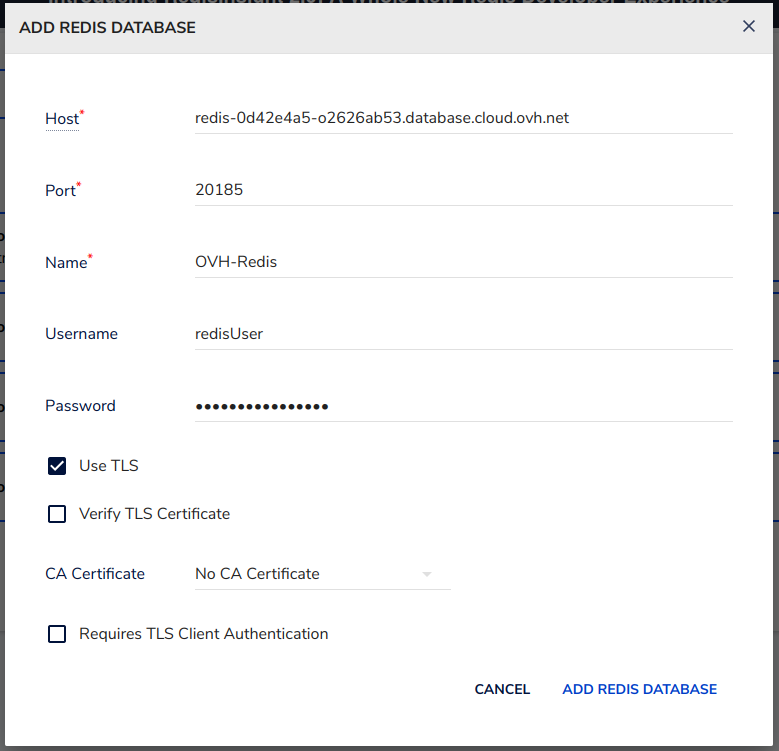
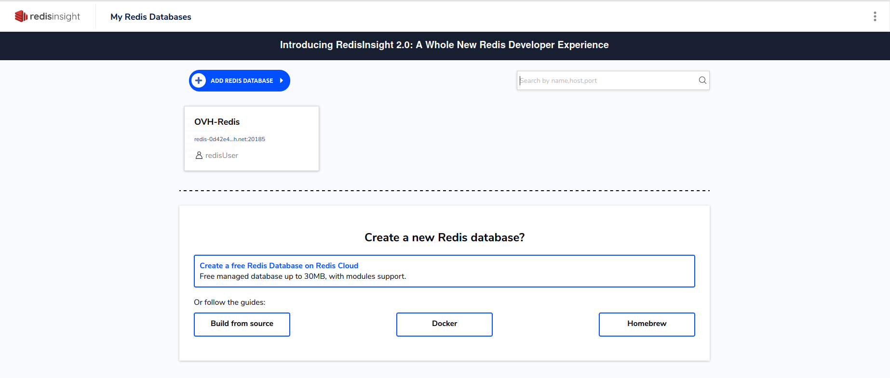
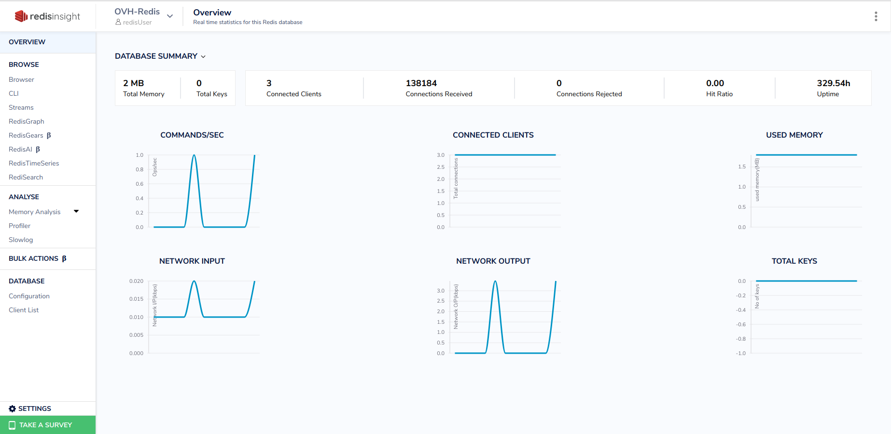

**Last updated 24th March 2022**

## Objective

Public Cloud Databases allow you to focus on building and deploying cloud applications while OVHcloud takes care of the database infrastructure and maintenance in operational conditions.

**This guide explains how to connect to a Redis database instance with the free GUI: RedisInsight.**

## Requirements

- Access to the [OVHcloud Control Panel](https://www.ovh.com/auth/?action=gotomanager&from=https://www.ovh.co.uk/&ovhSubsidiary=GB)
- A [Public Cloud project](https://www.ovhcloud.com/en-gb/public-cloud/) in your OVHcloud account
- A Redis database running on your OVHcloud Public Cloud Databases ([this guide](https://docs.ovh.com/gb/en/publiccloud/databases/getting-started/) can help you to meet this requirement)
- [Configure your Redis instance](https://docs.ovh.com/fr/publiccloud/databases/redis/configure-redis-instance/) to accept incoming connections
- A RedisInsight stable version installed and public network connectivity (Internet). This guide was made in RedisInsight 1.11.1

## Concept

A Redis instance can be managed through multiple ways.
One of the easiest, yet powerful, is to use a Command Line Interface (CLI), as shown in our guide: [Redis - Connect with CLI](https://docs.ovh.com/gb/en/publiccloud/databases/redis/connect-cli/) or by using programming languages, such as [PHP](https://docs.ovh.com/gb/en/publiccloud/databases/redis/connect-php/).

Another way is to interact directly using the GUI: RedisInsight.

In order to do so, we will need to install RedisInsight, then configure our Public Cloud Databases for Redis instances to accept incoming connections, and finally configure RedisInsight.

## Instructions

### Installation

To interact with your Redis instance with RedisInsight you need to install it.

Please follow the official [RedisInsight](https://docs.redis.com/latest/ri/installing){.external} to get the latest information.

We are now ready to learn how to connect to our Redis instance.

### Connect with RedisInsight

#### Collect required informations

Select the `General information`{.action} tab to find the required login information:

{.thumbnail}

#### Configuration

Once connected to the RedisInsight interface, click on the `I already have a database`{.action} link:

{.thumbnail}

Then on Connect to a Redis database`{.action} :

{.thumbnail}

Fill in the form with the previously collected credentials. Check the `Use TLS` check box and uncheck the `Verify TLS Certificate` check box. Then click on `ADD REDIS DATABASE`{.action} :

{.thumbnail}

Finally, select your Redis database:

{.thumbnail}

Congratulations! You are now connected to your Redis instance!

{.thumbnail}

> [!primary]
>
> RedisInsight has useful features.
> Learn more about them [here](https://redis.com/redis-enterprise/redis-insight/).
>

## Go further

Visit our dedicated Discord channel: <https://discord.gg/ovhcloud>. Ask questions, provide feedback and interact directly with the team that builds our databases services.

If you need training or technical assistance to implement our solutions, contact your sales representative or click on [this link](https://www.ovhcloud.com/en-gb/professional-services/) to get a quote and ask our Professional Services experts for a custom analysis of your project.

Join our community of users on <https://community.ovh.com/en/>.
