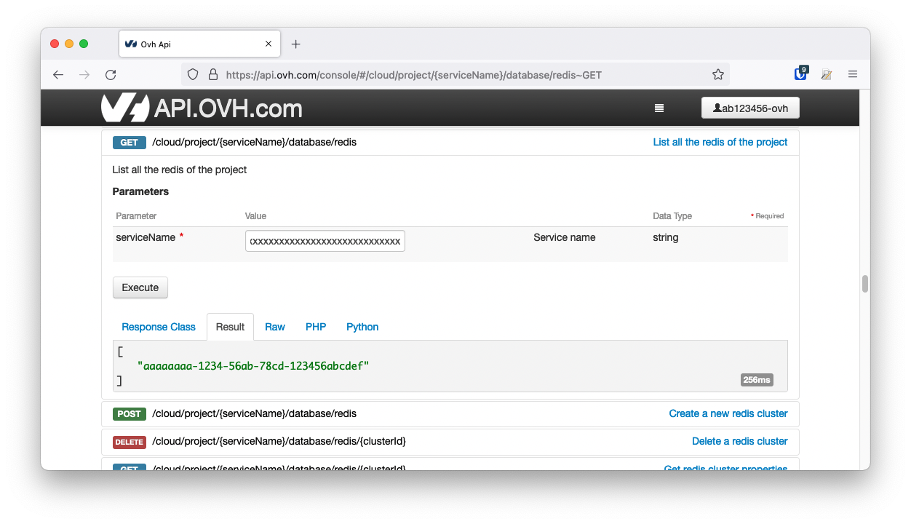
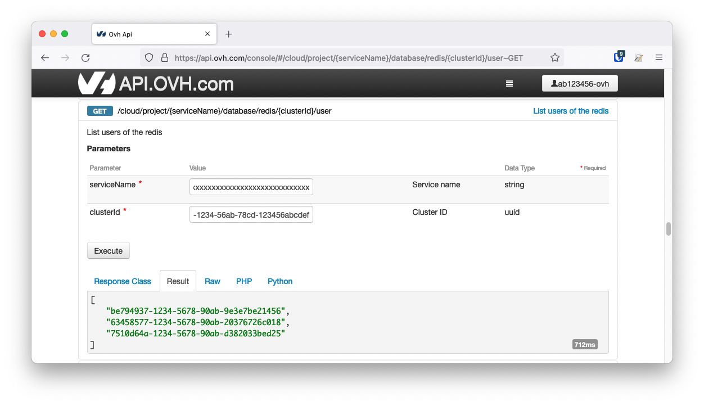
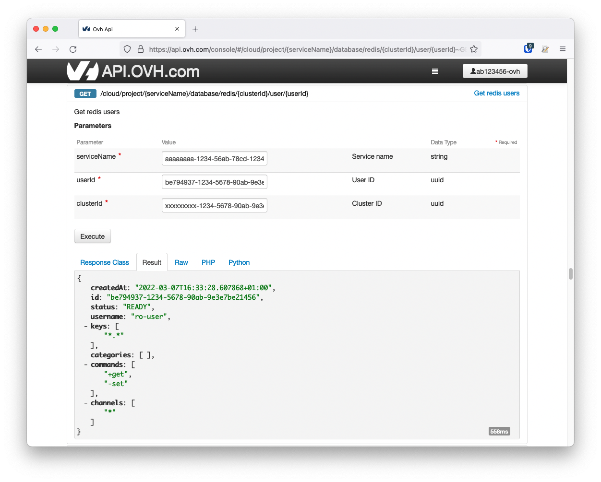
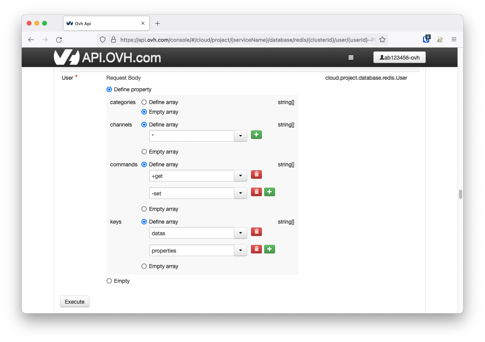
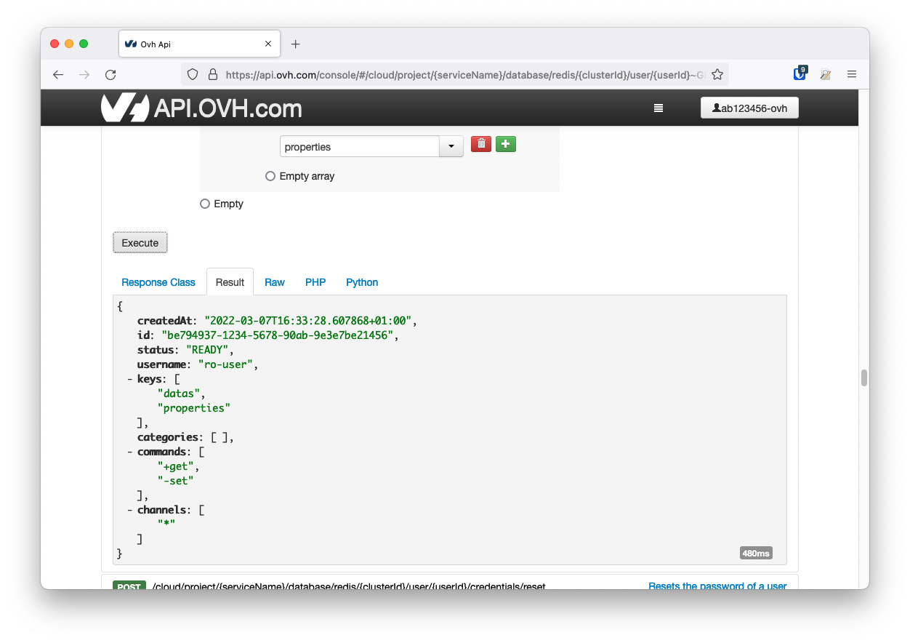

**Last updated March 8th, 2022**

## Objective

This page shows you how to update your Redis user ACLs with the OVHcloud API.

## Users and roles

As explained on this page: [Redis Capabilities, Users & roles](https://docs.ovh.com/gb/en/publiccloud/databases/redis/capabilities/#users-and-roles) we cannot update users' ACLs via the manager.

You must therefore use the OVHcloud() API.

## Requirements

- Access to the [OVHcloud Control Panel](https://www.ovh.com/auth/?action=gotomanager&from=https://www.ovh.co.uk/&ovhSubsidiary=GB).
- A [Public Cloud project](https://www.ovhcloud.com/en-gb/public-cloud/) in your OVHcloud account.
- An up and running Public Cloud Database for Redis.

If you have never used the OVHcloud API before, then follow this tutorial: [First Steps with the OVHcloud APIs](https://docs.ovh.com/gb/en/api/first-steps-with-ovh-api/).

For the rest of this tutorial, we consider that you are connected and identified on the site [API.OVH.com](https://api.ovh.com/console).

## Get your service, Redis cluster and user ids

start by identifying the service, the redis cluster and the user you want to apply the changes to.

### Get the desired service id

Open this url: [https://api.ovh.com/console/#/cloud/project~GET](https://api.ovh.com/console/#/cloud/project~GET) in a web browser, then click on the [Execute] button.

From the resulting list, select and copy the service identifier corresponding to the desired service, also known as **serviceName**.

{.thumbnail}

### Get the desired Redis cluster id

Open this url: [https://api.ovh.com/console/#/cloud/project/%7BserviceName%7D/database/redis~GET](https://api.ovh.com/console/#/cloud/project/%7BserviceName%7D/database/redis~GET) in a web browser, paste the service id into the **serviceName** input field, then click on [Execute].

From the resulting list, select and copy the Redis cluster id, also known as **clusterId**.

{.thumbnail}

### Get the desired user id

Open this url: [https://api.ovh.com/console/#/cloud/project/%7BserviceName%7D/database/redis/%7BclusterId%7D/user~GET](https://api.ovh.com/console/#/cloud/project/%7BserviceName%7D/database/redis/%7BclusterId%7D/user~GET) in a web browser, paste the service id into the **serviceName** input field, paste the cluster id into the **clusterId** input field, then click on [Execute].

From the resulting list, find and select the desired **user**.

{.thumbnail}

To get more details on a user, simply add the **user** value to the end of the previous request: [https://api.ovh.com/console/#/cloud/project/%7BserviceName%7D/database/redis/%7BclusterId%7D/user/%7BuserId%7D~GET](https://api.ovh.com/console/#/cloud/project/%7BserviceName%7D/database/redis/%7BclusterId%7D/user/%7BuserId%7D~GET)

Example:

{.thumbnail}

The result shows four string arrays, which represent the ACLs defined for the given user.

- Keys: Allow and disallow certain keys and key permissions.
- Categories: Add all the commands in such category to be called by the user, with valid categories being like @admin, @set, @sortedset,...
- Commands: Add or remove the command to the list of commands the user can call.
- Channels: Allow and disallow Pub/Sub channels.

You can follow the official Redis documentation about users and ACL: [https://redis.io/topics/acl](https://redis.io/topics/acl){.external}.

## Update an ACL with the API

Open the url: [https://api.ovh.com/console/#/cloud/project/%7BserviceName%7D/database/redis/%7BclusterId%7D/user/%7BuserId%7D~PUT](https://api.ovh.com/console/#/cloud/project/%7BserviceName%7D/database/redis/%7BclusterId%7D/user/%7BuserId%7D~PUT) in a web browser, and paste the corresponding identifiers (**serviceName**, **clusterId**, **user**).

Now, according the strategy you choosed, set the different values into the string arrays, as example:

{.thumbnail}

Click on the [Execute] button and see that tha Redis user ACL has been changed:

{.thumbnail}

## We want your feedback!

We would love to help answer questions and appreciate any feedback you may have.

Are you on Discord? Connect to our channel at <https://discord.gg/PwPqWUpN8G> and interact directly with the team that builds our databases service!
