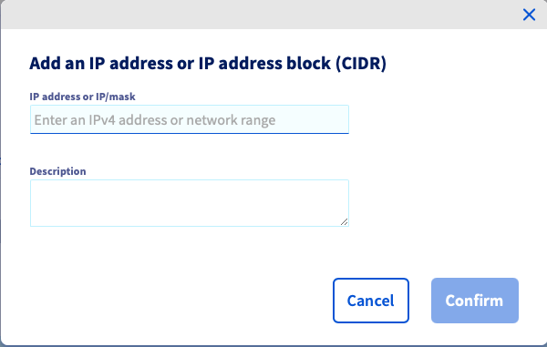
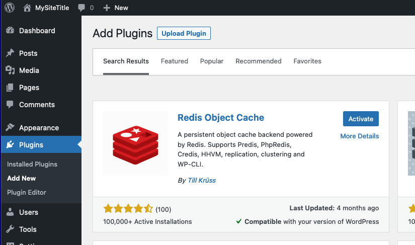
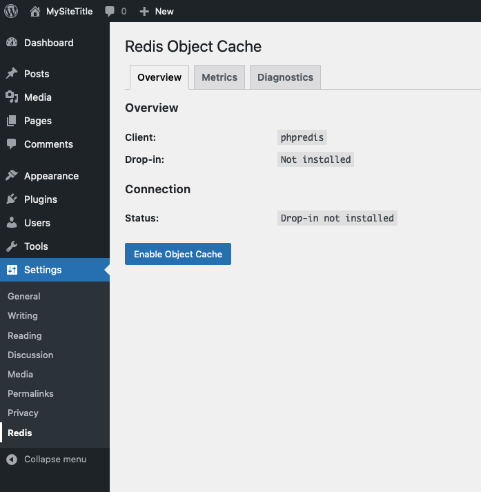
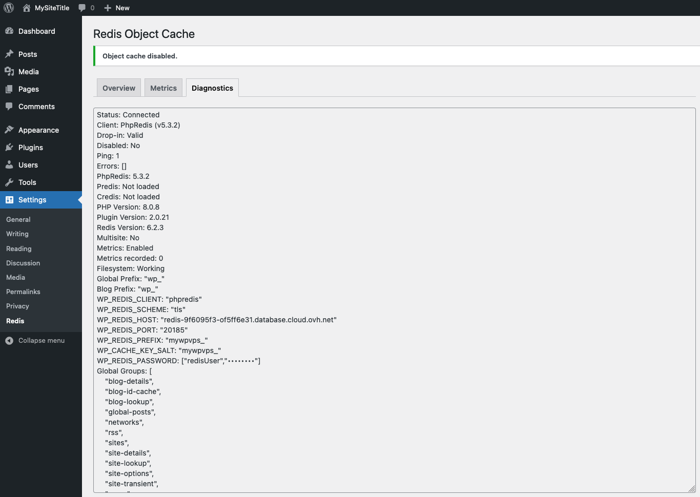
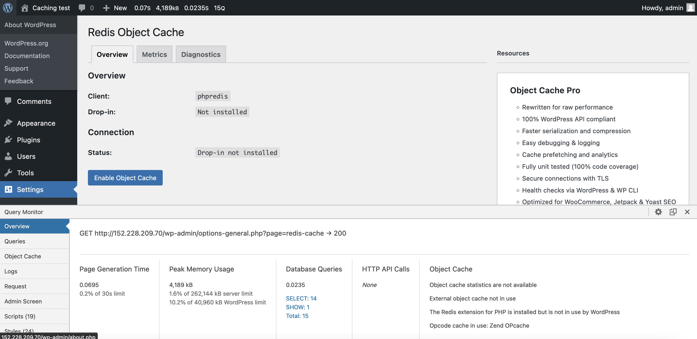
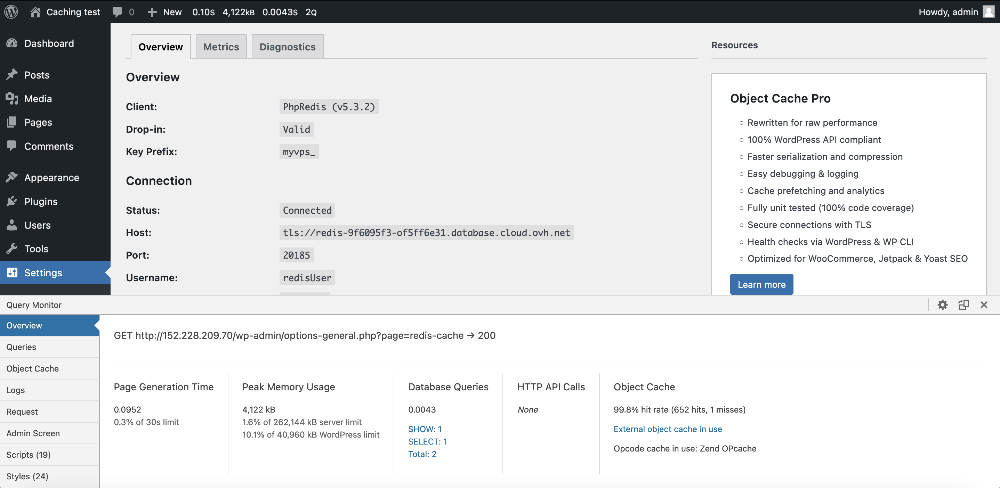

**Last updated 22nd November 2021**

## Objective

Do you have a CMS website or blog, perhaps powered by WordPress? Learn how to speed up page load times and SQL queries using Redis! In this tutorial, we will set up a NoSQL Redis database and use it to cache data. All users, even administrators and especially visitors, will directly benefit from a better performance of the website.

### CMS platform

For this tutorial we propose to use the WordPress CMS, running on Linux Ubuntu with MySQL as the main database. To get the object cache we will use a Public Cloud Database for Redis and a WordPress plugin for Redis.

> [!warning]
>This guide will show you how to use one or more OVHcloud solutions with external tools, and will describe the actions to be carried out in a specific context. Please remember to adapt these actions to fit your situation.
>
>If you encounter any difficulties performing these actions, please contact a specialised service provider and/or discuss the issue with [our community](https://community.ovh.com/en/). OVHcloud cannot provide you with technical support in this regard.
>
> Remember to back up your files prior to making any changes.
>

## Requirements

This tutorial requires:

- A running WordPress
- A WordPress administrator account to install a plugin
- A [PHP Redis client](https://redis.io/clients#php){.external} supported by the plugin
- An OVHcloud Public Cloud database for Redis

## Instructions

### Tutorial technical environment

The main software component releases used for the following screenshots and example are as follows:

- Linux Ubuntu 21.10 / apache2 2.4.48 / PHP 8.0 / MySQL 8.0.27
- WordPress: 5.8.2
- phpredis: 5.3.2
- Redis Object Cache: 2.0.21
- Redis: 6.2


### Configuring your CMS: WordPress

If you need to install WordPress, please refer to the official guide: [WordPress How To Install](https://wordpress.org/support/article/how-to-install-wordpress/){.external}.

Once done, we will set up the WordPress backend correctly.
For the next steps, let's consider that you have an up and running WordPress system on a LAMP (Linux, Apache, MySQL, PHP) platform.


### PHP Redis Client: PhpRedis

As WordPress is based on PHP, we will need a PHP Redis client. We propose to use one of the main recommended [PHP Redis clients](https://redis.io/clients#php){.external}: PhpRedis.

As TLS is required to secure the connection to the OVHcloud Public Cloud database for Redis, we have to use the v5.3.x release of PhpRedis or above.

Please check that PhpRedis is installed, with a compliant release:

- If you do have SSH access to your WordPress server you can use the following command:

```bash
dpkg -l php-redis
```

In case it is not available on your system, please install it:

```bash
sudo apt install php-redis
sudo systemctl restart apache2
```

- If you don't have SSH access to the system, use the `phpinfo()` function and do a search on the Redis module as in the following example:

{.thumbnail}


### Redis WordPress plugin

There are multiple Redis plugins that could be used to cache data to Redis. You can search them directly in the Plugin menu. For this tutorial we decided to use the most popular one: Redis Object Cache. Click on the *Install Now* button:

{.thumbnail}

You can get more information related to this WordPress plugin at the official [WordPress plugin documentation - Redis Object Cache](https://wordpress.org/plugins/redis-cache/){.external}.

### Configure WordPress to connect to Redis

#### Modify wp-config.php

Before activating the Redis Object Cache plugin, it is required to configure the Redis database connection parameters. 
By default, this plugin looks for a Redis hosted in the same server as your WordPress. 
It's not our case scenario here, since the Redis is hosted in OVhcloud Public Cloud Databases.

We will follow the official plugin wiki to define the remote Redis server: <https://github.com/rhubarbgroup/redis-cache/wiki/Configuration-Options>.
This has to be done in the WordPress configuration file (**wp-config.php** located in /var/www/wordpress/ in our example) and add the following lines:

```php
define('WP_REDIS_CLIENT', 'phpredis' );
define('WP_REDIS_SCHEME', 'tls');
define('WP_REDIS_HOST', 'my_redis-123456-123456.database.cloud.ovh.net');
define('WP_REDIS_PORT', '20185');
define('WP_REDIS_PASSWORD', ['my_redis_user', 'my_password_here']);
define('WP_CACHE_KEY_SALT', 'myvps_' );
```

#### Modify the host

The salt key is not mandatory, even more if you have only one application using Redis, but if you have several WordPress sites, it will be useful to determine **what-pushes-what**.

#### Check that authorised IPs for Redis are updated

Do not forget to add the WordPress IP address to the authorised IPs list of the Redis database.

{.thumbnail}


#### Activate and enable the plugin

Now all installation and configurations are done. So let's activate the plugin.

{.thumbnail}

Then enable the object cache functionality.

{.thumbnail}

If you run into any problems enabling the Redis Object Cache plugin, start your investigation by looking at the information available in the Diagnostics tab on the Plugin Settings:

{.thumbnail}


#### Additional parameters

Please find below more documentation on the additional available parameters that you might want to use to optimise your Redis database usage:

- [Redis Object Cache connection parameters](https://github.com/rhubarbgroup/redis-cache/wiki/Connection-Parameters){.external}
- [Redis Object Cache configuration options](https://github.com/rhubarbgroup/redis-cache/wiki/Configuration-Options){.external}


### Checking performance boost

#### Validate that cache is populated

If you can use a CLI to query the Redis database, you can check that information populated to it after browsing some WordPress pages.

In our case:

```bash
my_redis-123456-123456.database.cloud.ovh.net:20185> SCAN 0
1) "480"
2) 1) "myvps_wp:post_meta:782"
2) "myvps_wp:post_meta:418"
3) "myvps_wp:terms:13"
4) "myvps_wp:site-options:1-notoptions"
5) "myvps_wp:options:alloptions"
6) "myvps_wp:post_meta:905"
7) "myvps_wp:options:notoptions"
8) "mywpvps_wp:posts:get_page_by_path-83503918bbdb048f39fd1d3e462c8251-0.24924400 1637188954"
9) "myvps_wp:useremail:yo@chrisam.es"
10) "myvps_wp:terms:3"
```

#### Install a query monitoring plugin

If you want to have more information about how the Redis cache usage has impacted the performance, you can measure the gain in response delay directly with your browser. You can also see more details using an additional WordPress plugin like [Query Monitor](https://wordpress.org/plugins/query-monitor/){.external}.

#### Example of performance boost with a basic WordPress site

Using a simple WordPress site populated with poor content and a very limited number of posts, Let's take a look at the improvement.

We will look at the number of database requests for both cases: with and without the Redis cache enabled.

Without the Redis cache, there is a total of 15 database queries taking 0.0235s:

{.thumbnail}

With the Redis cache, there is a total of 2 database queries taking 0.0043s:

{.thumbnail}

#### Two main benefits using Redis cache

As seen using Redis cache you will see a performance gain for your CMS. It will be even more efficient as soon as your site will store more and larger data. You will also directly benefit from the fact that the MySQL server will be less stressed with the load / concurrent accesses, which will offer the opportunity to handle more and more users.

## Go further

[OVHcloud documentation on managed Public Cloud Databases](https://docs.ovh.com/gb/en/publiccloud/databases/)

[Redis capabilities](https://docs.ovh.com/gb/en/publiccloud/databases/redis/capabilities/)

[How to connect to Redis with CLI](https://docs.ovh.com/gb/en/publiccloud/databases/redis/connect-cli/)

[How to connect to Redis with PHP](https://docs.ovh.com/gb/en/publiccloud/databases/redis/connect-php/)

[Redis Roadmap](https://github.com/ovh/public-cloud-roadmap/projects/2?card_filter_query=label%3Aredis)

Join our community of users on <https://community.ovh.com/en/>.

## We want your feedback!

We would love to help answer questions and appreciate any feedback you may have.

Are you on Discord? Connect to our channel at <https://discord.gg/PwPqWUpN8G> and interact directly with the team that builds our databases service!
