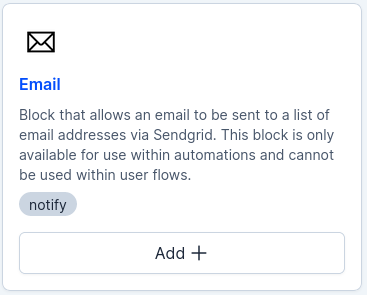
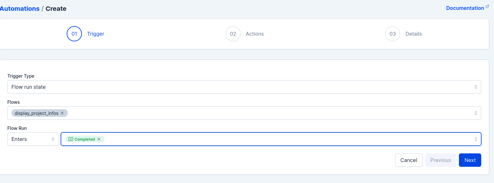

**Last updated 12th May 2023**
 
## Objective

The purpose of this tutorial is to show you how to send a notification (in this case an email) with Prefect Cloud. This result will be achieved through two Prefect primitives: blocks and automations. At the end of the tutorial, you will be able to send an email via Prefect. You will also be able to understand the concept of blocks and automations and how to use them.  
 
## Requirements

- Basic Knowledge of Prefect.io
- First configuration for Prefect and OVHcloud. See our guide [Getting started](/pages/platform/integrations/prefect_guide_01_getting_started)
- An email address

## Instructions
 
### Configure an Email block

In Prefect, "blocks" are pre-built, reusable building blocks that encapsulate common tasks or operations. They are designed to make it easier for users to build workflows by abstracting away the underlying complexity and allowing them to focus on the high-level logic of their pipelines. Blocks can be thought of as building blocks that can be pieced together to create complex workflows. They are created and maintained by the Prefect community and can be easily shared and used by other users.

To access the lists of blocks, go on your Prefect Cloud account. In the sidebar, you can see the tab `Blocks`. Click on it and you will be able to see a list of software. It can be Docker, Github, json... Here, we will use the Email Block. It should be similar to this: 

{.thumbnail}

Click on `Add +`button and fill the block with a name and the desired email address, where you will receive a notification. You can enter multiple email address. Once your block is created, let's see what is an automation and why it will be useful to send our email. 

### Configure a first automation

In Prefect, as explained in their official documentation, an automation is a higher-level construct that allows you to orchestrate and automate workflows using a set of pre-defined rules and conditions. It provides an easy-to-use interface for configuring, scheduling, and monitoring the execution of workflows, making it easier for developers to manage and maintain their pipelines. Automations can be used to trigger workflows based on specific events or data conditions, schedule workflows to run at specific times or intervals, and handle errors and exceptions in a more streamlined manner. 

In our case, we will use automation to send a notification. Thanks to the block **Email**, we will create a notification through an automation. This automation can only be created on the Prefect cloud's UI. Custom automations can also be created directly from your Python code. Go on the sidebar of our workspace, select `Automations` and click on the `+` icon. 

The first step to complete is the trigger. For this example, we will send an email when the our flow previously created in our [Getting Started guide](/pages/platform/integrations/prefect_guide_01_getting_started) is completed. You can fill the page like this:

{.thumbnail}

> [!primary]
>
> You can select multiple flows for an aggregated email notification
>

!next, you will have to describe the action to do when your flow  will end. Here, we want to send a notification, more precisely an email. Choose `Send a notification` as an action type, then choose the email block we created before and define the subject of the email and the body. The creation of the automation is responsive. The suggestions will vary depending on the action chosen. Your actions page should look like this: 

{.thumbnail}

In the last step, you have to fill the details of your automations like the name and the description. Choose a name and a description as you want. 

### Run your flow

Before running the flow, be sure that you set up your agent in prefect. Following the guide [getting-started](/pages/platform/integrations/prefect_guide_01_getting_started) you should be able to have the python code. Check if you connected to the prefect cloud UI. If you not sure that your agent is connected to the client run `prefect login` and connect with your credentials. Now, run the flow !  

```console
python3 console.py
```

Wait until your flow is completed and... Check your mailbox, you will receive an email from prefect ! If you go directly on the events feed in the prefect UI, you can see the email has been sent. Here is a picture of the event run by your automation :

{.thumbnail}

The event feed tab is a good way to see if you flow failed or not and if the automation has been proceed. In our case, we also receive an email on the address mail provided. 

## Go further

- Official documentation for [blocks in Prefect](https://docs.prefect.io/concepts/blocks/)
- Official documentation for [automations in Prefect](https://docs.prefect.io/ui/automations/)
- Run your first job with Prefect and the OVHcloud API : [Create your first AI pipeline with prefect](/pages/platform/integrations/prefect_tuto_03_ai_pipeline)
