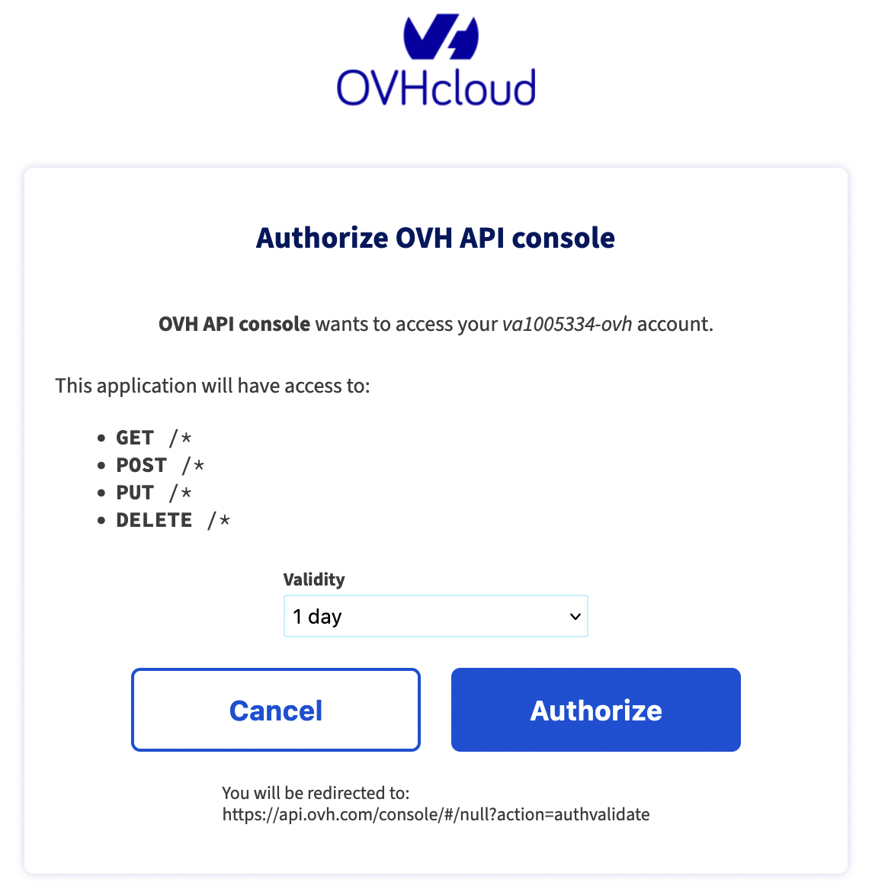

<style>
 pre {
     font-size: 14px;
 }
 pre.console {
   background-color: #300A24; 
   color: #ccc;
   font-family: monospace;
   padding: 5px;
   margin-bottom: 5px;
 }
 pre.console code {
   border: solid 0px transparent;
   font-family: monospace !important;
   font-size: 0.75em;
   color: #ccc;
 }
 .small {
     font-size: 0.75em;
 }
</style>

**Last updated 1st February 2023**

## Objective

The OVHcloud Managed Kubernetes service provides you with Kubernetes clusters without the hassle of installing or operating them.

The kube-proxy Kubernete's component (which runs on each Nodes and allows network comunication to Pods) with iptables is actually a bottleneck to scale the cluster to a high number of Nodes so at OVHcloud we decided to reduce this bottleneck and allow you to use kube-proxy with IPVS.

[IPVS (IP Virtual Server)](https://kubernetes.io/blog/2018/07/09/ipvs-based-in-cluster-load-balancing-deep-dive/) is built on top of the Netfilter and implements transport-layer Load Balancing as part of the Linux kernel.

At OVHcloud, we listen to our users and improve our products and services accordingly, which is why we give you the ability to customize the kube-proxy configuration.

## Requirements 

- An OVHcloud Managed Kubernetes cluster

## Instructions

### Configure kube-proxy through the API

#### The API Explorer

To simplify things, we are using the [API Explorer](https://api.ovh.com/) which allows to explore, learn and interact with the API in an interactive way.

Log in to the API Explorer using your OVHcloud NIC handle.

{.thumbnail}

If you go to the [Kubernetes section](https://api.ovh.com/console/#/kube) of the API Explorer, you will see the available endpoints:

{.thumbnail}

#### API endpoints

- Get an existing cluster's customization:

> [!api]
>
> @api {GET} /cloud/project/{serviceName}/kube/{kubeID}/customization
>

**Result:**

```json
{
    "apiServer": {
      "admissionPlugins": {
        "disabled": [],
        "enabled": ["AlwaysPullImages", "NodeRestriction"]
      }
    },
    "kubeProxy": {
      "iptables": {
        "minSyncPeriod": "PT1S",
        "syncPeriod": "PT30S"
      },
      "ipvs": {
        "minSyncPeriod": "PT0S",
        "scheduler": "rr",
        "syncPeriod": "PT30S",
        "tcpFinTimeout": "PT0S",
        "tcpTimeout": "PT0S",
        "udpTimeout": "PT0S",
      }
    }
}
```

- Create a Kubernetes cluster in the GRA5 region with IPVS kube-proxy mode:

> [!api]
>
> @api {POST} /cloud/project/{serviceName}/kube
>

```json
{
    "region": "GRA5",
    "name": "my-super-cluster",
    "kubeProxyMode": "ipvs",
    "customization": {
      "kubeProxy":{
          // All fields are optional
          "iptables":{
            "minSyncPeriod":"PT1S",
            "syncPeriod":"PT30S"
         },
         "ipvs":{
            "minSyncPeriod":"PT0S",
            "scheduler":"rr",
            "syncPeriod":"PT30S",
            "tcpFinTimeout":"PT0S",
            "tcpTimeout":"PT0S",
            "udpTimeout":"PT0S"
         }
      }
   }
}
```

> [!primary]
>
> This API call generate a `configMap` that will be used by the kube-proxy component.
>
> To access this `configMap` you can execute the `kubectl get cm kube-proxy -n kube-system -o yaml` command.
>
> The kube-proxy `configMap` in new Kubernetes clusters includes `config.conf` entry.

Both IPVS and iptables specific configuration can be set at the same time and kube-proxy will select the one to use according to the mode value.

If a field is not specified in the API payload, it will not be present in the config file and let kube-proxy use its default value (`kubeProxyMode` default is 'iptables').

You can take a look to the [Kube-proxy default values](https://github.com/kubernetes/kubernetes/blob/master/pkg/proxy/apis/config/v1alpha1/defaults.go#L38) for more information.

- Reset a Kubernetes cluster (all Kubernetes data will be erased (pods, services, configuration, etc), nodes will be either deleted or reinstalled)

> [!primary]
>
> `kubeProxyMode` cannot be modified, you need to reset your Kubernetes cluster.
>

> [!api]
>
> @api {POST} /cloud/project/{serviceName}/kube/{kubeID}/reset
> 

```json
{
    "region": "GRA5",
    "name": "my-super-cluster",
    "kubeProxyMode": "ipvs",
    "customization": {
      "kubeProxy":{
         "iptables":{
            "minSyncPeriod":"PT1S",
            "syncPeriod":"PT30S"
         },
         "ipvs":{
            "minSyncPeriod":"PT0S",
            "scheduler":"rr",
            "syncPeriod":"PT30S",
            "tcpFinTimeout":"PT0S",
            "tcpTimeout":"PT0S",
            "udpTimeout":"PT0S"
         }
      }
   }
}
```

Both kubeProxyMode and customization.* can be modified on cluster reset with the same payload used for creation.

If these fields are not specified, it will reset to default value (ipvs for kubeProxyMode and empty customization).

- Update only `kubeProxy` and keeping existing `apiServer` customization if any:

> [!primary]
>
> `kubeProxyMode` cannot be modified by updating an existing cluster, it can only be set on cluster creation and reset.

> [!api]
>
> @api {PUT} /cloud/project/{serviceName}/kube/{kubeID}/customization
> 

```json
{
	"kubeProxy": {
		"iptables": {
			"minSyncPeriod": "PT60S"
			"syncPeriod": "PT60S"
		}
	}
}
```

- Update both apiServer and override kubeProxy configuration:

> [!api]
>
> @api {PUT} /cloud/project/{serviceName}/kube/{kubeID}/customization
> 

```json
{
	"apiServer": {
		"admissionPlugins": {
			"enabled": [],
			"disabled": [
				"AlwaysPullImages"
			]
		}
	},
	// kubeProxy customization will be OVERRIDDEN (minSyncPeriod will be removed in this example)
	"kubeProxy": {
		"iptables": {
			"syncPeriod": "PT120S"
		}
	}
}
```

> [!primary]
>
> Updating customization.kubeProxy will trigger the following actions:
>
> - apply updated configMap
> - then rollout restart kube-proxy so it uses the new configuration

## Go further

To have an overview of OVHcloud Managed Kubernetes service, you can go to the [OVHcloud Managed Kubernetes page](https://www.ovhcloud.com/fr/public-cloud/kubernetes/).

Join our community of users on <https://community.ovh.com/en/>.