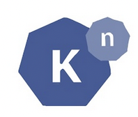
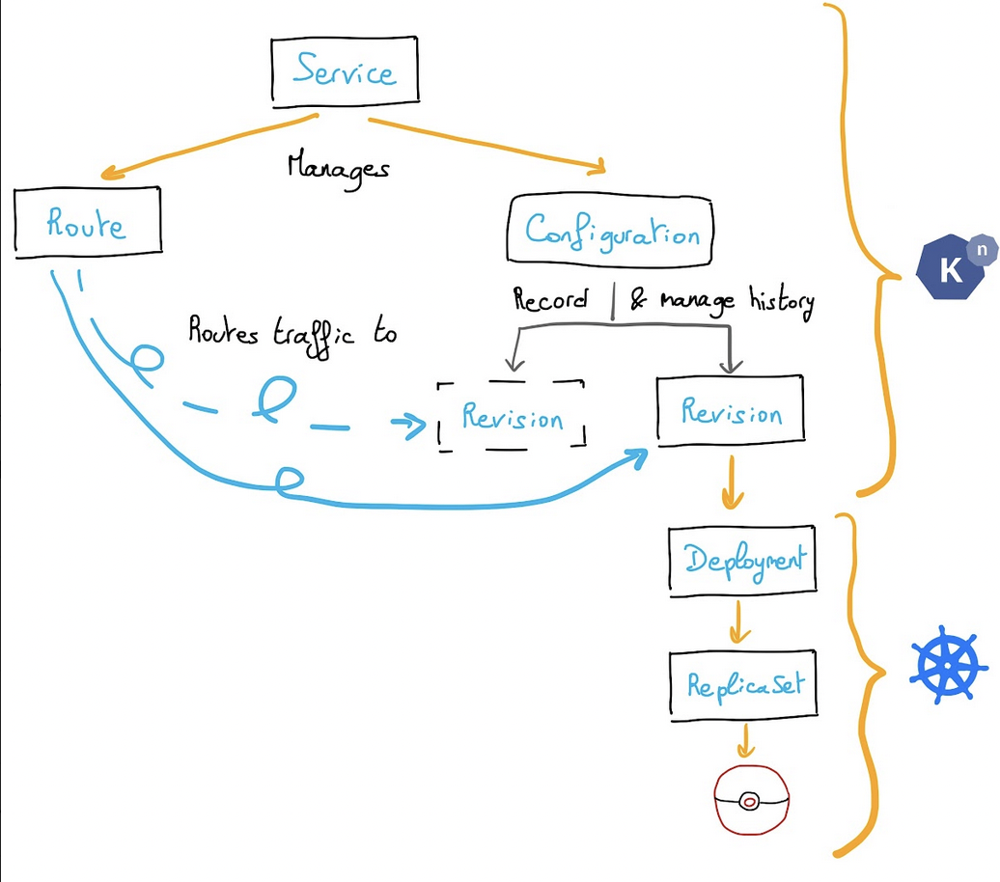

**Last updated 12 November, 2021.**

<style>
 pre {
     font-size: 14px;
 }
 pre.console {
   background-color: #300A24; 
   color: #ccc;
   font-family: monospace;
   padding: 5px;
   margin-bottom: 5px;
 }
 pre.console code {
   border: solid 0px transparent;
   font-family: monospace !important;
   font-size: 0.75em;
   color: #ccc;
 }
 .small {
     font-size: 0.75em;
 }
</style>


[Knative](https://knative.dev) is a platform to deploy and manage Serverless applications on Kubernetes.



Knative provides a set of middleware components build on top of Kubernetes, abstracting away the complex details and enabling developers to focus on what matters. Built by codifying the best practices shared by successful real-world implementations, Knative solves the "boring but difficult" parts of deploying and managing cloud native services so you don't have to.

Concretely, you will deploy Knative components and Knative will create Kubernetes components itselfs. You don't have to worry about Kubernetes components.

Knative supports multiple HTTP routing layers, including Istio, Gloo, Contour, Kourier and Ambassador.

Knative have two components:

- Serving
- Eventing


It helps for:

- Rapid deployment of Serverless containers
- Scale to zero (no call = no pod = no memory/CPU usage)
- Scale from zero (traffic spike start x Pods)
- Configuration & revision management
- Traffic splitting between revisions, blue/green...
- Eventing system

Read more about [Knative 1.0 features](https://knative.dev/blog/articles/knative-1.0/).

Knative reached the 1.0 milestone. To celebrate this achievement, in this tutorial we are going to install Knative on a freshly created OVHcloud Managed Kubernetes Service cluster and we will deploy an example app using Knative Serving component. You can use the *Reset cluster* function on the Public Cloud section of the [OVHcloud Control Panel](https://www.ovh.com/auth?onsuccess=https%3A%2F%2Fwww.ovh.com%2Fmanager%2Fpublic-cloud&ovhSubsidiary=us){.external} to reinitialize your cluster before following this tutorial.


## Before you begin

This tutorial presupposes that you already have a working OVHcloud Managed Kubernetes cluster, and some basic knowledge of how to operate it. If you want to know more on those topics, please look at the [deploying a Hello World application](../deploying-hello-world/) documentation.


## Install Knative "kn" CLI

The Knative CLI (kn) provides a quick and easy interface for creating Knative resources, such as Knative Services and Event Sources, without the need to create or modify YAML files directly.

`kn` also simplifies completion of otherwise complex procedures such as autoscaling and traffic splitting.

In order to install the CLI, [follow the instructions](https://knative.dev/docs/getting-started/#install-the-knative-cli) depending on your OS.

Then test the CLI is correctly installed in your computer:
```
kn version
```

Here the result in my computer:

<pre class="console"><code>$ kn version
Version:      v0.26.0
Build Date:   2021-09-22T09:11:17Z
Git Revision: 61b8a754
Supported APIs:
* Serving
  - serving.knative.dev/v1 (knative-serving v0.26.0)
* Eventing
  - sources.knative.dev/v1 (knative-eventing v0.26.0)
  - eventing.knative.dev/v1 (knative-eventing v0.26.0)
</code></pre>


## Installing Knative

### Installing the Knative Serving component

The first thing to do is to install the Knative Serving component:

- Install the required custom resources by running the command:

```
kubectl apply -f https://github.com/knative/serving/releases/download/knative-v1.0.0/serving-crds.yaml
```

Here the result in my computer:

<pre class="console"><code>$ kubectl apply -f https://github.com/knative/serving/releases/download/knative-v1.0.0/serving-crds.yaml
customresourcedefinition.apiextensions.k8s.io/certificates.networking.internal.knative.dev created
customresourcedefinition.apiextensions.k8s.io/configurations.serving.knative.dev created
customresourcedefinition.apiextensions.k8s.io/clusterdomainclaims.networking.internal.knative.dev created
customresourcedefinition.apiextensions.k8s.io/domainmappings.serving.knative.dev created
customresourcedefinition.apiextensions.k8s.io/ingresses.networking.internal.knative.dev created
customresourcedefinition.apiextensions.k8s.io/metrics.autoscaling.internal.knative.dev created
customresourcedefinition.apiextensions.k8s.io/podautoscalers.autoscaling.internal.knative.dev created
customresourcedefinition.apiextensions.k8s.io/revisions.serving.knative.dev created
customresourcedefinition.apiextensions.k8s.io/routes.serving.knative.dev created
customresourcedefinition.apiextensions.k8s.io/serverlessservices.networking.internal.knative.dev created
customresourcedefinition.apiextensions.k8s.io/services.serving.knative.dev created
customresourcedefinition.apiextensions.k8s.io/images.caching.internal.knative.dev created
</code></pre>

- Install the core components of Knative Serving by running the command:

```
kubectl apply -f https://github.com/knative/serving/releases/download/knative-v1.0.0/serving-core.yaml
```

Here the result in my computer:

<pre class="console"><code>$ kubectl apply -f https://github.com/knative/serving/releases/download/knative-v1.0.0/serving-core.yaml
namespace/knative-serving created
clusterrole.rbac.authorization.k8s.io/knative-serving-aggregated-addressable-resolver created
clusterrole.rbac.authorization.k8s.io/knative-serving-addressable-resolver created
clusterrole.rbac.authorization.k8s.io/knative-serving-namespaced-admin created
clusterrole.rbac.authorization.k8s.io/knative-serving-namespaced-edit created
clusterrole.rbac.authorization.k8s.io/knative-serving-namespaced-view created
clusterrole.rbac.authorization.k8s.io/knative-serving-core created
clusterrole.rbac.authorization.k8s.io/knative-serving-podspecable-binding created
serviceaccount/controller created
clusterrole.rbac.authorization.k8s.io/knative-serving-admin created
clusterrolebinding.rbac.authorization.k8s.io/knative-serving-controller-admin created
clusterrolebinding.rbac.authorization.k8s.io/knative-serving-controller-addressable-resolver created
customresourcedefinition.apiextensions.k8s.io/images.caching.internal.knative.dev unchanged
customresourcedefinition.apiextensions.k8s.io/certificates.networking.internal.knative.dev unchanged
customresourcedefinition.apiextensions.k8s.io/configurations.serving.knative.dev unchanged
customresourcedefinition.apiextensions.k8s.io/clusterdomainclaims.networking.internal.knative.dev unchanged
customresourcedefinition.apiextensions.k8s.io/domainmappings.serving.knative.dev unchanged
customresourcedefinition.apiextensions.k8s.io/ingresses.networking.internal.knative.dev unchanged
customresourcedefinition.apiextensions.k8s.io/metrics.autoscaling.internal.knative.dev unchanged
customresourcedefinition.apiextensions.k8s.io/podautoscalers.autoscaling.internal.knative.dev unchanged
customresourcedefinition.apiextensions.k8s.io/revisions.serving.knative.dev unchanged
customresourcedefinition.apiextensions.k8s.io/routes.serving.knative.dev unchanged
customresourcedefinition.apiextensions.k8s.io/serverlessservices.networking.internal.knative.dev unchanged
customresourcedefinition.apiextensions.k8s.io/services.serving.knative.dev unchanged
image.caching.internal.knative.dev/queue-proxy created
configmap/config-autoscaler created
configmap/config-defaults created
configmap/config-deployment created
configmap/config-domain created
configmap/config-features created
configmap/config-gc created
configmap/config-leader-election created
configmap/config-logging created
configmap/config-network created
configmap/config-observability created
configmap/config-tracing created
horizontalpodautoscaler.autoscaling/activator created
Warning: policy/v1beta1 PodDisruptionBudget is deprecated in v1.21+, unavailable in v1.25+; use policy/v1 PodDisruptionBudget
poddisruptionbudget.policy/activator-pdb created
deployment.apps/activator created
service/activator-service created
deployment.apps/autoscaler created
service/autoscaler created
deployment.apps/controller created
service/controller created
deployment.apps/domain-mapping created
deployment.apps/domainmapping-webhook created
service/domainmapping-webhook created
horizontalpodautoscaler.autoscaling/webhook created
poddisruptionbudget.policy/webhook-pdb created
deployment.apps/webhook created
service/webhook created
validatingwebhookconfiguration.admissionregistration.k8s.io/config.webhook.serving.knative.dev created
mutatingwebhookconfiguration.admissionregistration.k8s.io/webhook.serving.knative.dev created
mutatingwebhookconfiguration.admissionregistration.k8s.io/webhook.domainmapping.serving.knative.dev created
secret/domainmapping-webhook-certs created
validatingwebhookconfiguration.admissionregistration.k8s.io/validation.webhook.domainmapping.serving.knative.dev created
validatingwebhookconfiguration.admissionregistration.k8s.io/validation.webhook.serving.knative.dev created
secret/webhook-certs created
</code></pre>


### Installing a networking layer (Ingress Gateway)

As the networking layer, you can [install the one you want](https://knative.dev/docs/install/serving/install-serving-with-yaml/#install-a-networking-layer): Istio, Contour, Gloo or Ambassador. In this tutorial, we will install [Kourier](https://github.com/3scale-archive/kourier): a lightweight Knative Serving Ingress.

Install the Knative Kourier controller by running the command:

```
kubectl apply -f https://github.com/knative/net-kourier/releases/download/knative-v1.0.0/kourier.yaml
```

Configure Knative Serving to use Kourier by default by running the command:

```
kubectl patch configmap/config-network \
  --namespace knative-serving \
  --type merge \
  --patch '{"data":{"ingress.class":"kourier.ingress.networking.knative.dev"}}'
```

As you can see, a new `kourier-system` namespace is created with a deployment:

<pre class="console"><code>$ kubectl get deploy -n kourier-system
NAME                     READY   UP-TO-DATE   AVAILABLE   AGE
3scale-kourier-gateway   1/1     1            1           104m
</code></pre>

Fetch the External IP address or CNAME by running the command:

```
kubectl get service kourier -n kourier-system
```

Here the result in my computer:

<pre class="console"><code>$ kubectl get service kourier -n kourier-system 
NAME      TYPE           CLUSTER-IP    EXTERNAL-IP      PORT(S)                      AGE
kourier   LoadBalancer   10.3.65.167   135.125.83.166   80:31357/TCP,443:31782/TCP   2m19s
</code></pre>

    Warning: As the `LoadBalancer` creation is asynchronous, and the provisioning of the load balancer can take several minutes, you will surely get a `pending` state for `EXTERNAL-IP` field. Please try again in a few minutes to get the external IP. 

Save this to use in the following Configure DNS section.

## Verifying the installation

A new `knative-serving` namespace have been created on your Kubernetes cluster with knative serving components, so let's check if Knative Serving components are correctly running:

```
kubectl get pods -n knative-serving
```

Here the result in my computer:

<pre class="console"><code>$ kubectl get pods -n knative-serving
NAME                                      READY   STATUS    RESTARTS   AGE
activator-68b7698d74-hwrj6                1/1     Running   0          33m
autoscaler-6c8884d6ff-6g6pv               1/1     Running   0          33m
controller-76cf997d95-5b4l4               1/1     Running   0          33m
domain-mapping-57fdbf97b-6vdft            1/1     Running   0          33m
domainmapping-webhook-66c5f7d596-l97d9    1/1     Running   0          33m
net-kourier-controller-6f68cbb74f-cgqvx   1/1     Running   0          107s
webhook-7df8fd847b-rm9q2                  1/1     Running   0          33m
</code></pre>

And we can check the Knative Serving installed version:

```
kubectl get namespace knative-serving -o 'go-template={{index .metadata.labels "serving.knative.dev/release"}}'
```

Here the result in my computer:

<pre class="console"><code>$ kubectl get namespace knative-serving -o 'go-template={{index .metadata.labels "serving.knative.dev/release"}}'
v1.0.0
</code></pre>

Knative Serving version 1.0.0 is correctly deployed in our cluster, Cool!

### Configuring DNS

By default, Knative Serving uses `example.com` as the default domain.

For this tutorial, it is not mandatory, but you can configure DNS to prevent the need to run `curl` commands with a host header.

To configure DNS for Knative, take the External IP from setting up networking, and configure it with your DNS provider as follows:

Configure a wildcard A record for the domain:

```
# Here knative.my-website.com is the domain suffix for your cluster
*.knative.my-website.com == A 135.125.83.166
```

Once your DNS provider has been configured, direct Knative to use that domain:

```
# Replace knative.example.com with your domain suffix
kubectl patch configmap/config-domain \
  --namespace knative-serving \
  --type merge \
  --patch '{"data":{"knative.my-website.com":""}}'
```

If you have questions about DNS on OVHcloud, we have a FAQ page for you that explain [how to configure a DNS zone](https://docs.ovh.com/us/en/domains/domains-dns-faq/#how-do-i-configure-my-dns-zone).

## Deploying an application

To verify that Knative is truly working in the cluster, you are going to deploy a hello-world application.

The first thing to do is to create a namespace in which our apps will run:

```
kubectl create namespace knative-apps
```

Here the result in my computer:

<pre class="console"><code>$ kubectl create namespace knative-apps
namespace/knative-apps created
</code></pre>

Now, let's create our first Knative Service file named `service.yaml`:


```
apiVersion: serving.knative.dev/v1
kind: Service
metadata:
  name: hello-world
spec:
  template:
    spec:
      containers:
      - image: ovhplatform/hello
        ports:
            - containerPort: 80
```

As you can see, the Knative service YAML file is simple and concise.

We need to apply it on our cluster with the command:

```
kubectl apply -f service.yaml -n knative-apps
```

Here the result in my computer:

<pre class="console"><code>$ kubectl apply -f service.yaml -n knative-apps
service.serving.knative.dev/hello-world created
</code></pre>

Under the hood, Knative created several Knative and Kubernetes components:



A deployment:
<pre class="console"><code>$ kubectl get deployment -n knative-apps
NAME                           READY   UP-TO-DATE   AVAILABLE   AGE
hello-world-00001-deployment   1/1     1            1           8s
</code></pre>

A pod:
<pre class="console"><code>$ kubectl get pod -n knative-apps
NAME                                            READY   STATUS    RESTARTS   AGE
hello-world-00001-deployment-797f65cdd9-h47sk   2/2     Running   0          9s
</code></pre>

Services:
<pre class="console"><code>$ kubectl get svc -n knative-apps
NAME                        TYPE           CLUSTER-IP    EXTERNAL-IP                                         PORT(S)                                      AGE
hello-world                 ExternalName   <none>        kourier-internal.kourier-system.svc.cluster.local   80/TCP                                       9s
hello-world-00001           ClusterIP      10.3.82.197   <none>                                              80/TCP                                       12s
hello-world-00001-private   ClusterIP      10.3.0.240    <none>                                              80/TCP,9090/TCP,9091/TCP,8022/TCP,8012/TCP   12s
</code></pre>

And also Knative service, route and revision:

<pre class="console"><code>$ kn service list -n knative-apps
NAME          URL                                           LATEST              AGE   CONDITIONS   READY   REASON
hello-world   http://hello-world.knative-apps.example.com   hello-world-00001   26m   3 OK / 3     True

$ kn route list -n knative-apps
NAME          URL                                           READY
hello-world   http://hello-world.knative-apps.example.com   True

$ kn revision list -n knative-apps
NAME                SERVICE       TRAFFIC   TAGS   GENERATION   AGE   CONDITIONS   READY   REASON
hello-world-00001   hello-world   100%             1            26m   3 OK / 4     True
</code></pre>

As we can see, by default, 100% of the traffic go the `hello-world-00001` revision.

Now, we need to retrieve the route URL:

<pre class="console"><code>$ kn service describe hello-world -n knative-apps -o url
http://hello-world.knative-apps.example.com
</code></pre>

Ok, so with this information, and with the Load Balancer external IP, we can test to call our app:

```
$ curl -H "Host: hello-world.knative-apps.example.com" http://135.125.83.166:80
<!doctype html>

<html>
<head>
<title>OVH K8S</title>
</head>
<style>
.title {
font-size: 3em;
padding: 2em;
text-align: center;
}
</style>
<body>
<div class="title">
<p>Hello from Kubernetes!</p>

</div>
</body>
</html>
```

## Scaling to zero

And one of Knative Serving's powers is built-in automatic scaling (autoscaling). This means your Knative Service only spins up your application to perform its job, if it is needed; otherwise, it will "scale to zero" by spinning down and waiting for a new request to come in.

So, if you don't send requests to your application, Pods will be terminated automatically! :-)

<pre class="console"><code>$ kubectl get po -n knative-apps
No resources found in knative-apps namespace.
</code></pre>

Cool!

## What's next?

Now you have a working "Hello World" app deployed on Knative on an OVHcloud Managed Kubernetes cluster. Next time we will see Knative awesome features like traffic splitting, blue/green deployment and horizontal scaling.

In this tutorial we only see the Serving component. If you are interested about Knative Eventing component, we recommand you the [official documentation](https://knative.dev/docs/eventing/).

## Cleanup

If you want, you can unininstall Knative apps, serving and core components.

First, delete our Hello World app:

```
kubectl delete -f service.yaml -n knative-apps
```

Then, delete Knative CRDs:

```
kubectl api-resources -o name | grep knative | xargs kubectl delete crd
```

Then, delete Knative resources:

```
kubectl -n knative-serving delete po,svc,daemonsets,replicasets,deployments,rc,secrets --all
kubectl -n kourier-system delete po,svc,daemonsets,replicasets,deployments,rc,secrets --all
```

Finally, delete namespaces:

```
kubectl delete namespace knative-serving
kubectl delete namespace kourier-system
kubectl delete namespace knative-apps
```