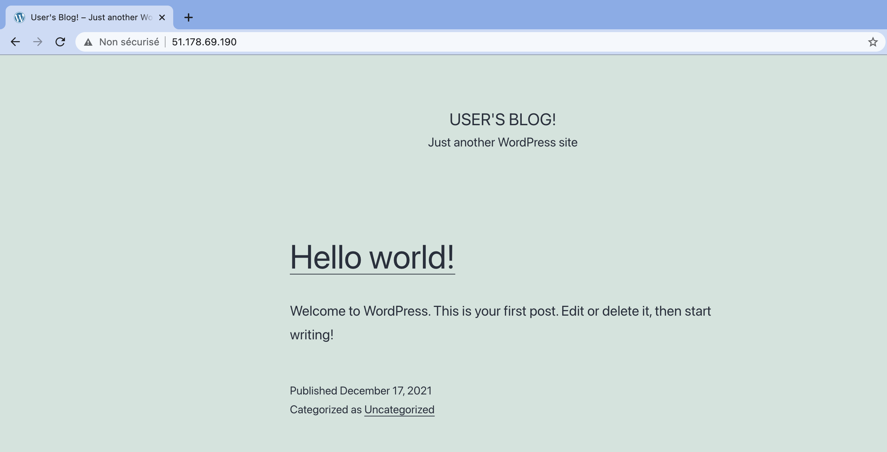
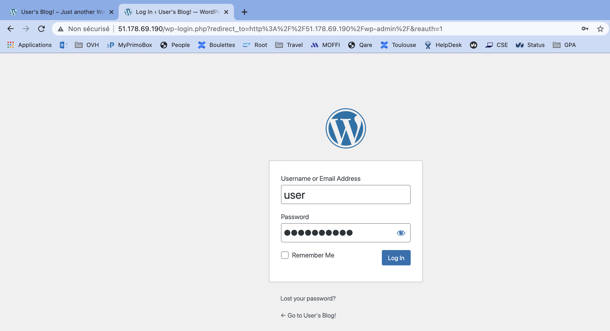
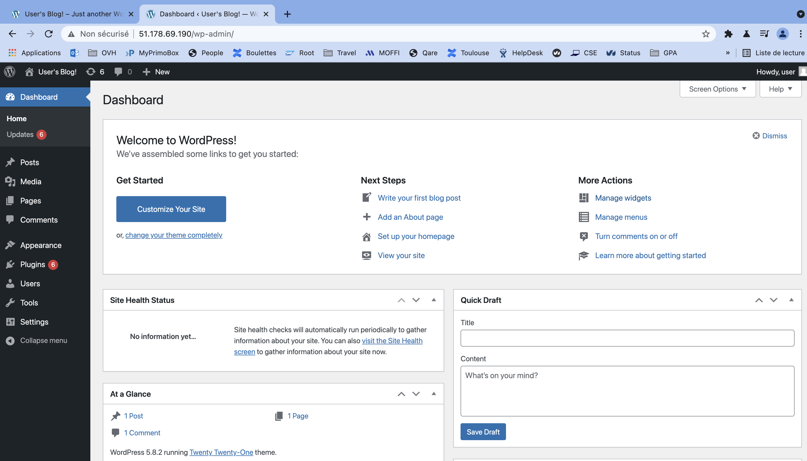

**Last updated December 17, 2021.**

<style>
 pre {
     font-size: 14px;
 }
 pre.console {
   background-color: #300A24; 
   color: #ccc;
   font-family: monospace;
   padding: 5px;
   margin-bottom: 5px;
 }
 pre.console code {
   border: solid 0px transparent;
   font-family: monospace !important;
   font-size: 0.75em;
   color: #ccc;
 }
 .small {
     font-size: 0.75em;
 }
</style>

In this tutorial, we will guide you through the installation of [WordPress](https://wordpress.org/){.external} on your OVHcloud Managed Kubernetes Service.

## Before you begin

This tutorial presupposes that you already have a working OVHcloud Managed Kubernetes cluster, and some basic knowledge of how to operate it. If you want to know more on those topics, please look at the [OVHcloud Managed Kubernetes Service Quickstart](../deploying-hello-world/).

You also need to have [Helm](https://docs.helm.sh/) installed on your workstation and your cluster, please refer to the [How to install Helm on OVHcloud Managed Kubernetes Service](../installing-helm/) tutorial.

## Pre-requisites

We (the OVHcloud Managed Kubernetes Service team) are working on a patch to be released in early 2022. In the meantime, please remove the default storage class and install the new one.

- Delete the concerned `StorageClass` that you are using by default 

```bash
kubectl delete storageclasses.storage.k8s.io csi-cinder-high-speed
```

It will delete the existing `StorageClass`:

<pre class="console"><code>$ kubectl delete storageclasses.storage.k8s.io csi-cinder-high-speed
storageclass.storage.k8s.io "csi-cinder-high-speed" deleted
</code></pre>

- Create a new `StorageClass` with the required fix

```bash
kubectl apply -f https://raw.githubusercontent.com/ovh/docs/develop/pages/platform/kubernetes-k8s/fix-persistent-volumes-permissions/files/fixed-cinder-high-speed-storage-class.yaml
```

It will apply the correct `StorageClass` YAML manifest:

<pre class="console"><code>$ kubectl apply -f https://raw.githubusercontent.com/ovh/docs/develop/pages/platform/kubernetes-k8s/fix-persistent-volumes-permissions/files/fixed-cinder-high-speed-storage-class.yaml
storageclass.storage.k8s.io/csi-cinder-high-speed created
</code></pre>

If you have already installed a previous version of Bitnami's WordPress Helm chart, please follow the following step by step guide.

- Delete the concerned Helm Chart

For example with the Helm Chart `bitnami/wordpress` which is concerned by this behavior:

```bash
helm uninstall my-first-k8s-wordpress
```

And don't forget to verify if concerned `PersistentVolumeClaim` (PVC) and `PersistentVolume` (PV) have been deleted before reinstalling the Helm Chart:

```bash
kubectl get persistentvolumeclaims -A | grep wordpress
kubectl get persistentvolumes 
```

If a `PersistentVolumeClaim` is listed, please delete it (the `PersistentVolume` will be deleted automatically).

```bash
kubectl delete pvc data-my-first-k8s-wordpress-mariadb-0
```

The command will delete the remaining `PersistentVolumeClaim`:

<pre class="console"><code>$ kubectl delete pvc data-my-first-k8s-wordpress-mariadb-0
persistentvolumeclaim "data-my-first-k8s-wordpress-mariadb-0" deleted
</code></pre>

## Installing the WordPress Helm chart

For this tutorial we are using the [WordPress Helm chart](https://github.com/bitnami/charts/tree/master/bitnami/wordpress){.external} found on [Bitnami repository](https://github.com/bitnami/charts/). The chart is fully configurable, but here we are using the default configuration, with only the minimal set of customization to make it work well on OVHcloud Managed Kubernetes Service.

> [!primary]
>
> ### Customizing your install
>
> Maybe you would like your username to be different, or be able to set your password, or choose an external database instead of deploying the MariaDB container...
>
> In order to customize your install, without having to leave the simplicity of using Helm and the WordPress Helm chart, you can simply set some of the [configurable parameters of the WordPress chart](https://github.com/helm/charts/tree/master/stable/wordpress#configuration){.external}. Then you can add it to your `helm install` with the `--set` option (`--set param1=value1,param2=value2`)

```
helm install my-first-k8s-wordpress bitnami/wordpress --set allowOverrideNone=true
```

This will install the needed elements:

- a MariaDB `Pod` for the database
- a WordPress `Pod` for the webserver with the WordPress PHP code
- allocate the persistent volumes (`PersistentVolumeClaim` and `PersistentVolume`) 
- and initialize the `Services`. 

And at the end, it will give you the connection parameters for your new WordPress:

<pre class="console"><code>$ helm install my-first-k8s-wordpress bitnami/wordpress --set allowOverrideNone=true
NAME: my-first-k8s-wordpress
LAST DEPLOYED: Fri Dec 17 15:42:22 2021
NAMESPACE: default
STATUS: deployed
REVISION: 1
TEST SUITE: None
NOTES:
CHART NAME: wordpress
CHART VERSION: 12.2.5
APP VERSION: 5.8.2

** Please be patient while the chart is being deployed **

Your WordPress site can be accessed through the following DNS name from within your cluster:

    my-first-k8s-wordpress.default.svc.cluster.local (port 80)

To access your WordPress site from outside the cluster follow the steps below:

1. Get the WordPress URL by running these commands:

  NOTE: It may take a few minutes for the LoadBalancer IP to be available.
        Watch the status with: 'kubectl get svc --namespace default -w my-first-k8s-wordpress'

   export SERVICE_IP=$(kubectl get svc --namespace default my-first-k8s-wordpress --template "{{ range (index .status.loadBalancer.ingress 0) }}{{.}}{{ end }}")
   echo "WordPress URL: http://$SERVICE_IP/"
   echo "WordPress Admin URL: http://$SERVICE_IP/admin"

2. Open a browser and access WordPress using the obtained URL.

3. Login with the following credentials below to see your blog:

  echo Username: user
  echo Password: $(kubectl get secret --namespace default my-first-k8s-wordpress -o jsonpath="{.data.wordpress-password}" | base64 --decode)
</code></pre>

As the instructions say, you will need to wait a few moments to get the `LoadBalancer` URL.
You can test if the `LoadBalancer` is ready using:

```
kubectl get svc --namespace default -w my-first-k8s-wordpress
```

After some minutes, you will get the `LoadBalancer` URL:

<pre class="console"><code>$ kubectl get svc --namespace default -w my-first-k8s-wordpress
NAME                     TYPE           CLUSTER-IP    EXTERNAL-IP     PORT(S)                      AGE
my-first-k8s-wordpress   LoadBalancer   10.3.83.253   &lt;pending>      80:32296/TCP,443:31838/TCP   2m13s
my-first-k8s-wordpress   LoadBalancer   10.3.83.253   51.178.69.190   80:32296/TCP,443:31838/TCP   2m13s
</code></pre>

Then you can follow the instructions to get the Admin URL:

<pre class="console"><code>$ export SERVICE_IP=$(kubectl get svc --namespace default my-first-k8s-wordpress --template "{{ range (index .status.loadBalancer.ingress 0) }}{{.}}{{ end }}")

$ echo "WordPress URL: http://$SERVICE_IP/"
WordPress URL: http://51.178.69.190/

$ echo "WordPress Admin URL: http://$SERVICE_IP/admin"
WordPress Admin URL: http://51.178.69.190/admin
</code></pre>

Copy/paste the WordPress URL in your browser to see your new running blog:

{.thumbnail}

In order to log in on the Admin interface, you need to use the instructions given by the Helm install to get the default username and password for your blog.

In my case:

<pre class="console"><code>$ echo Username: user
Username: user
$ echo Password: $(kubectl get secret --namespace default my-first-k8s-wordpress -o jsonpath="{.data.wordpress-password}" | base64 --decode)
Password: 9hF2YWSpXB
</code></pre>

{.thumbnail}

{.thumbnail}

You have a working WordPress on your OVHcloud Managed Kubernetes Service, congratulations!

## Cleaning up

To clean up your cluster, simply use Helm to delete your WordPress blog.

```bash
helm uninstall my-first-k8s-wordpress
```

It will delete your WordPress and its associated resources from your cluster:

<pre class="console"><code>$ helm uninstall my-first-k8s-wordpress
release "my-first-k8s-wordpress" uninstalled
</code></pre>

You also need to remove remaining `PersistentVolumeClaim` manually, for the moment:

```bash
kubectl delete pvc data-my-first-k8s-wordpress-mariadb-0
```

It will delete the `PersistentVolumeClaim` installed by Bitnami WordPress helm chart:

<pre class="console"><code>$ kubectl delete pvc data-my-first-k8s-wordpress-mariadb-0
persistentvolumeclaim "data-my-first-k8s-wordpress-mariadb-0" deleted
</code></pre>

## Where do we go from here?

So now you have a working WordPress on your OVHcloud Managed Kubernetes cluster.

Don't hesitate to go to our [Managed Kubernetes guides and tutorials](../).

## Go further

- If you need training or technical assistance to implement our solutions, contact your sales representative or click on [this link](https://www.ovhcloud.com/es/professional-services/) to get a quote and ask our Professional Services experts for assisting you on your specific use case of your project.

- Join our [community of users](https://community.ovh.com/en/).