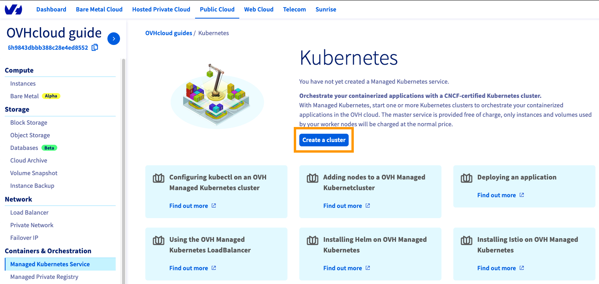
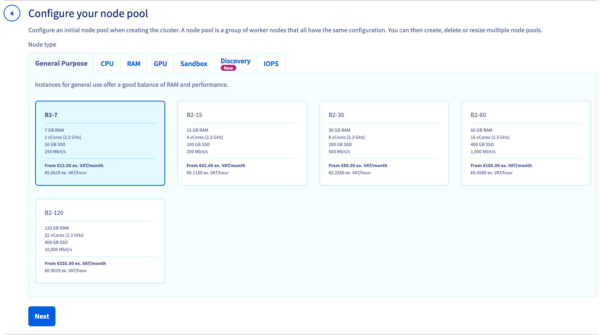
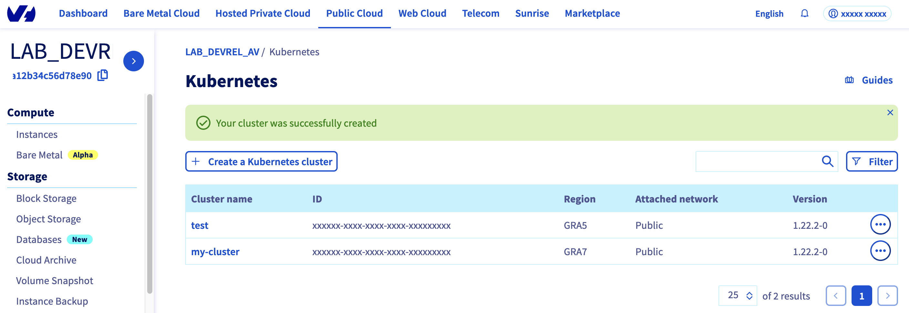
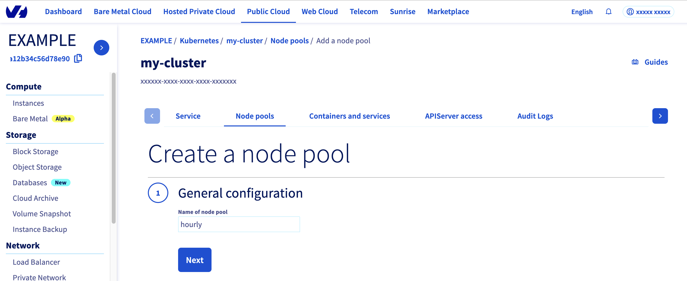
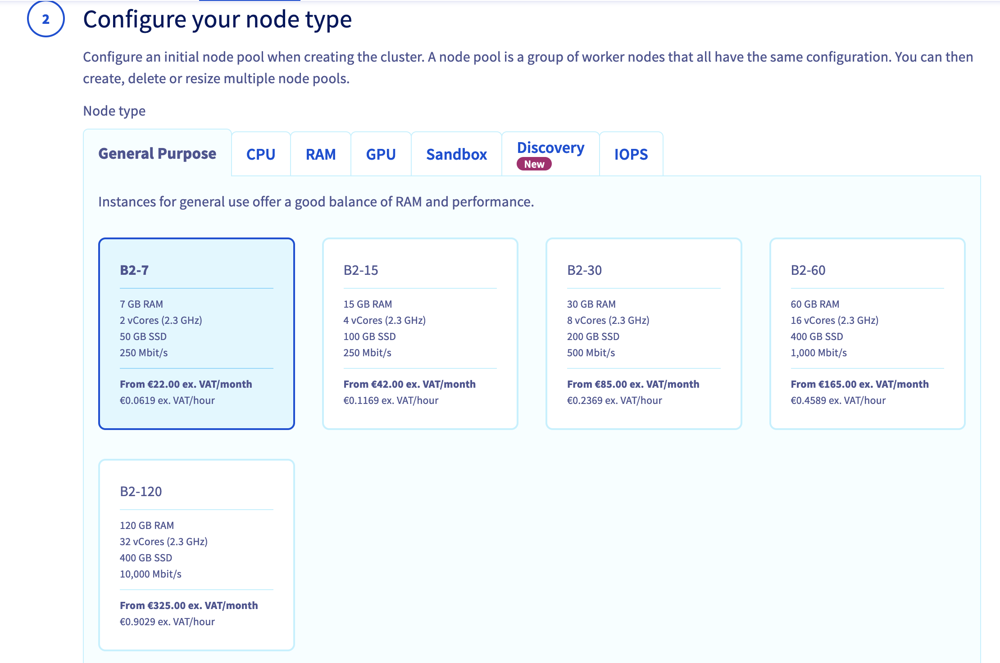
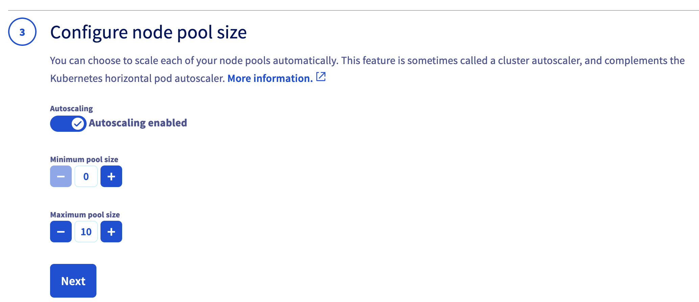
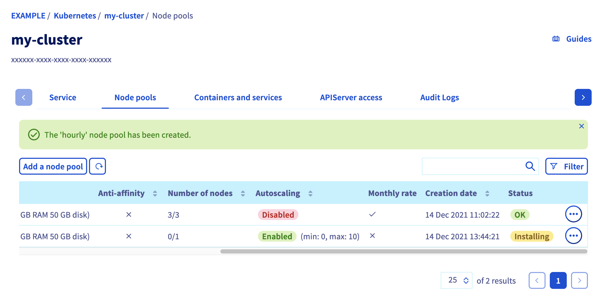
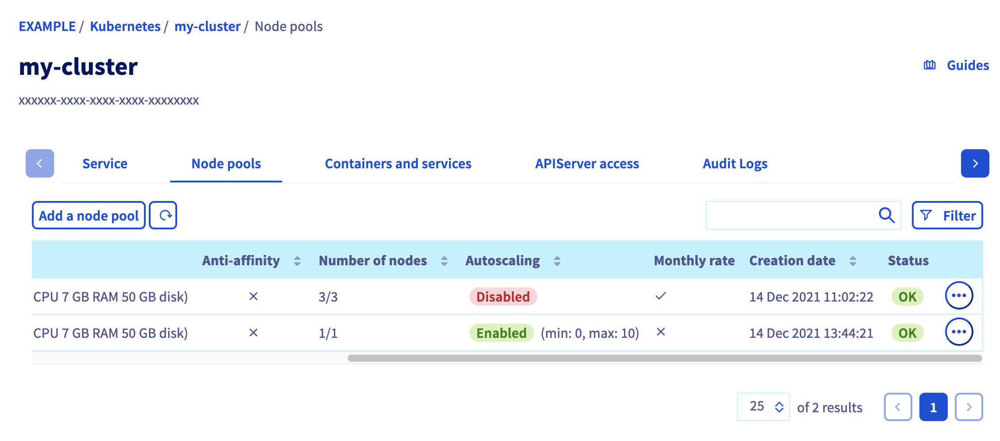

<style>
 pre {
     font-size: 14px;
 }
 pre.console {
   background-color: #300A24;
   color: #ccc;
   font-family: monospace;
   padding: 5px;
   margin-bottom: 5px;
 }
 pre.console code {
   border: solid 0px transparent;
   font-family: monospace !important;
   font-size: 0.75em;
   color: #ccc;
 }
 .small {
     font-size: 0.75em;
 }
</style>

**Last updated 15 December 2021.**

## Objective

In this tutorial we are going to show you how to deploy your applications to specific `Nodes` and` Nodes Pools`, with `labels` and `NodeAffinity` Kubernetes concepts, on your OVHcloud Managed Kubernetes Service.

The example chosen here will take advantage of an OVHcloud billing specificity: using monthly billing for nodes that you also plan to keep for the long term can decrease your Kubernetes costs by up to 50%. We are seeing customers with varying workloads creating a first node pool with monthly billing to cover their long-term compute needs, and adding elasticity to the cluster with a second node pool using autoscaling and hourly billing.

We will:

- create a Managed Kubernetes cluster
- create a node pool with 3 nodes and "monthly" billing mode
- create another node pool with autoscaling activated (0 nodes minimum and maximum 10), with "hourly" billing mode
- deploy an application to a specific node pool (and nodes)


## Requirements

- a [Public Cloud project](https://www.ovhcloud.com/asia/public-cloud/) in your OVHcloud account
- access to the [OVHcloud Control Panel](https://ca.ovh.com/auth/?action=gotomanager&from=https://www.ovh.com/asia/&ovhSubsidiary=asia)


## Instructions

### Cluster creation

Log in to the [OVHcloud Control Panel](https://ca.ovh.com/auth/?action=gotomanager&from=https://www.ovh.com/asia/&ovhSubsidiary=asia), go to the `Public Cloud`{.action} section and select the Public Cloud project concerned.

Access the administration UI for your OVHcloud Managed Kubernetes clusters by clicking on `Managed Kubernetes Service`{.action} in the left-hand menu and click on `Create a cluster`{.action}.

{.thumbnail}

Or if you already have a cluster, the UI is a little bit different, you need ton click on `Create a Kubernetes cluster`{.action} button:

{.thumbnail}

Select a location for your new cluster.

{.thumbnail}

Choose the minor version of Kubernetes.

> [!primary]
> We recommend to always use the last stable version. 
> Please read our [End of life / end of support](../eos-eol-policies/) page to understand our version policy.
>

{.thumbnail}

You can now choose to integrate your Kubernetes cluster into a private network using OVHcloud vRack. For more information about this option, please read our guide [Using the vRack](../using_vrack/).

{.thumbnail}

For this tutorial, we will configure two different node pools.

Reminder: A node pool is a group of nodes sharing the same configuration, allowing you a lot of flexibility in your cluster management. 

{.thumbnail}

> [!primary]
> You can read the [Managing node pools](../managing-nodes/) guide for more information on node pools.
>

For our first node pool, choose a flavor, "B2-7" for example.

{.thumbnail}

In the next step, define the size of the default node pool.

{.thumbnail}

In the next step, choose `Monthly` billing mode.

{.thumbnail}

Finally, enter a name for your cluster and click on the `Send`{.action} button.

{.thumbnail}

The cluster creation is now in progress. It should be available within a few minutes in your OVHcloud Control Panel.

### Second node pool creation

Now, your Kubernetes cluster is up and running. You can see it in your OVHcloud Control Panel.

{.thumbnail}

Click on your cluster, then on `Node pools`{.action} tab.

We will create our second Node pool.
Click on `Add a node pool`{.action} button.

Then enter a name for your second node pool, `hourly` for example.

{.thumbnail}

Select a flavor for your new node pool, we can choose "B2-7" like our other node pool.

{.thumbnail}

In the next step, define the size of our second node pool.
This time, we can enable the `Autoscaling`{.action} feature.
Define the minimum and maximum pool size in that case, 0 in minimum and 10 in maximum, for example.

> [!primary]
> By enabling anti-affinity, current and future nodes will be launched on different hypervisors (physical servers), guaranteeing higher fault tolerance.
> 

{.thumbnail}

And then, choose `Hourly` billing mode for this second node pool.

{.thumbnail}

The node pool creation is now in progress. It should be available within a few minutes in your OVHcloud Control Panel.

The second node pool will be first in `Installing` status.
Wait until its status changes to `OK`.

{.thumbnail}

{.thumbnail}

### Check and prepare our Node pools

To deploy your application on your Kubernetes cluster, we invite you to follow our guide to [configuring default settings](https://docs.ovh.com/asia/en/kubernetes/configuring-kubectl/) for `kubectl`.

When you can access to the cluster through `kubectl` command, let's display our node pools:

```bash
$ kubectl get nodepool
NAME                                            FLAVOR   AUTO SCALED   MONTHLY BILLED   ANTI AFFINITY   DESIRED   CURRENT   UP-TO-DATE   AVAILABLE   MIN   MAX   AGE
hourly                                          b2-7     true          false            false           1         1         1            1           0     10    4m39s
nodepool-cc40f90c-effb-4945-b7b9-05073725d62d   b2-7     false         true             false           3         3         3            3           0     100   164m
```

Our two node pools exist and we can see the different configuration and autoscaling mode.

Let's display our nodes. You should have 3 nodes running in our first node pool and 1 node in our "hourly" node pool:

```bash
$ kubectl get node
NAME                                         STATUS   ROLES    AGE     VERSION
hourly-node-8e4db2                           Ready    <none>   3m13s   v1.22.2
nodepool-cc40f90c-effb-4945-b7-node-23e81b   Ready    <none>   161m    v1.22.2
nodepool-cc40f90c-effb-4945-b7-node-4bd23f   Ready    <none>   163m    v1.22.2
nodepool-cc40f90c-effb-4945-b7-node-ef121e   Ready    <none>   161m    v1.22.2
```

If you don't do anything during several minutes, the AutoScaling in "hourly" node pool will terminate the node because of inactivity:

```bash
$ kubectl get node
NAME                                         STATUS   ROLES    AGE     VERSION
nodepool-cc40f90c-effb-4945-b7-node-23e81b   Ready    <none>   3h18m   v1.22.2
nodepool-cc40f90c-effb-4945-b7-node-4bd23f   Ready    <none>   3h20m   v1.22.2
nodepool-cc40f90c-effb-4945-b7-node-ef121e   Ready    <none>   3h18m   v1.22.2
```

### Deploying our application

It's time to discover the power of `labels` and `NodeAffinity` Kubernetes concepts.

We have one node pool with "monthly" billing and another one with "hourly" billing. The goal to have these two node pools is to have the possibility to separate our needs depending on our applications types.

In order to deploy our application in specific nodes, we need to know what is the label of the target node pool.

The thing to know is that the nodes created by Kubernetes have in their label the name of the Node Pool. Thanks to that you can ask Kubernetes to deploy applications in the wanted node pool.

Let's show the labels of our running nodes:

```bash
$ kubectl get node --show-labels
NAME                                         STATUS   ROLES    AGE     VERSION   LABELS
nodepool-cc40f90c-effb-4945-b7-node-23e81b   Ready    <none>   3h56m   v1.22.2   beta.kubernetes.io/arch=amd64,beta.kubernetes.io/instance-type=0da61e94-ce69-4971-b6df-c410fa3659ec,beta.kubernetes.io/os=linux,failure-domain.beta.kubernetes.io/region=GRA7,failure-domain.beta.kubernetes.io/zone=nova,kubernetes.io/arch=amd64,kubernetes.io/hostname=nodepool-cc40f90c-effb-4945-b7-node-23e81b,kubernetes.io/os=linux,node.k8s.ovh/type=standard,node.kubernetes.io/instance-type=0da61e94-ce69-4971-b6df-c410fa3659ec,nodepool=nodepool-cc40f90c-effb-4945-b7b9-05073725d62d,topology.cinder.csi.openstack.org/zone=nova,topology.kubernetes.io/region=GRA7,topology.kubernetes.io/zone=nova
nodepool-cc40f90c-effb-4945-b7-node-4bd23f   Ready    <none>   3h58m   v1.22.2   beta.kubernetes.io/arch=amd64,beta.kubernetes.io/instance-type=0da61e94-ce69-4971-b6df-c410fa3659ec,beta.kubernetes.io/os=linux,failure-domain.beta.kubernetes.io/region=GRA7,failure-domain.beta.kubernetes.io/zone=nova,kubernetes.io/arch=amd64,kubernetes.io/hostname=nodepool-cc40f90c-effb-4945-b7-node-4bd23f,kubernetes.io/os=linux,node.k8s.ovh/type=standard,node.kubernetes.io/instance-type=0da61e94-ce69-4971-b6df-c410fa3659ec,nodepool=nodepool-cc40f90c-effb-4945-b7b9-05073725d62d,topology.cinder.csi.openstack.org/zone=nova,topology.kubernetes.io/region=GRA7,topology.kubernetes.io/zone=nova
nodepool-cc40f90c-effb-4945-b7-node-ef121e   Ready    <none>   3h56m   v1.22.2   beta.kubernetes.io/arch=amd64,beta.kubernetes.io/instance-type=0da61e94-ce69-4971-b6df-c410fa3659ec,beta.kubernetes.io/os=linux,failure-domain.beta.kubernetes.io/region=GRA7,failure-domain.beta.kubernetes.io/zone=nova,kubernetes.io/arch=amd64,kubernetes.io/hostname=nodepool-cc40f90c-effb-4945-b7-node-ef121e,kubernetes.io/os=linux,node.k8s.ovh/type=standard,node.kubernetes.io/instance-type=0da61e94-ce69-4971-b6df-c410fa3659ec,nodepool=nodepool-cc40f90c-effb-4945-b7b9-05073725d62d,topology.cinder.csi.openstack.org/zone=nova,topology.kubernetes.io/region=GRA7,topology.kubernetes.io/zone=nova
```

As you can maybe see, our running Nodes got the label `nodepool=nodepool-cc40f90c-effb-4945-b7b9-05073725d62d`.
The format of the label is: `nodepool=<name of the nodepool>`.

It's time to deploy an application, only on our `hourly` node pool and let's see the behavior of the AutoScaling.

Create a `deployment.yaml` file with this content:

```yaml
apiVersion: v1
kind: Service
metadata:
  name: hello-world
  labels:
    app: hello-world
spec:
  type: LoadBalancer
  ports:
  - port: 80
    targetPort: 80
    protocol: TCP
    name: http
  selector:
    app: hello-world
---
apiVersion: apps/v1
kind: Deployment
metadata:
  name: hello-world-deployment
  labels:
    app: hello-world
spec:
  replicas: 1
  selector:
    matchLabels:
      app: hello-world
  template:
    metadata:
      labels:
        app: hello-world
    spec:
      containers:
      - name: hello-world
        image: ovhplatform/hello
        ports:
        - containerPort: 80
      affinity:
        nodeAffinity:
          requiredDuringSchedulingIgnoredDuringExecution:
            nodeSelectorTerms:
            - matchExpressions:
              - key: nodepool
                operator: In
                values:
                - hourly
```

```bash
$ kubectl apply -f deployment.yaml
service/hello-world created
deployment.apps/hello-world-deployment created
```

When you apply this YAML manifest, a Pod will be first in `Pending` state. A new Node will be created. When the new Node will be successfully created, the Pod will be started in this Node.

```bash
$ kubectl get pod -w
NAME                                      READY   STATUS    RESTARTS   AGE
hello-world-deployment-585c6cfcd8-kntp9   0/1     Pending   0          12s
hello-world-deployment-585c6cfcd8-kntp9   0/1     Pending   0          3m3s
hello-world-deployment-585c6cfcd8-kntp9   0/1     ContainerCreating   0          3m29s
hello-world-deployment-585c6cfcd8-kntp9   0/1     ContainerCreating   0          3m41s
hello-world-deployment-585c6cfcd8-kntp9   1/1     Running             0          3m45s
```

You have to wait several minutes in order to have a new Node that matches your criteria.

```bash
$ kubectl get node
NAME                                         STATUS   ROLES    AGE   VERSION
hourly-node-d4f9d7                           Ready    <none>   18s   v1.22.2
nodepool-cc40f90c-effb-4945-b7-node-23e81b   Ready    <none>   21h   v1.22.2
nodepool-cc40f90c-effb-4945-b7-node-4bd23f   Ready    <none>   21h   v1.22.2
nodepool-cc40f90c-effb-4945-b7-node-ef121e   Ready    <none>   21h   v1.22.2
```

And you can check in which node our application is running:

```bash
$ kubectl get pod -o wide
NAME                                      READY   STATUS    RESTARTS   AGE   IP         NODE                 NOMINATED NODE   READINESS GATES
hello-world-deployment-585c6cfcd8-kntp9   1/1     Running   0          13m   10.2.8.2   hourly-node-d4f9d7   <none>           <none>
```

With this feature you can choose and control where you want to deploy your applications.

Note that a given label can be applied to multiple node pools and / or specific nodes only if it makes sense to you.

## Where do we go from here?

In this tutorial you saw how to create, in your OVHcloud Managed Kubernetes cluster, several kinds of node pools and how to deploy your applications easily where you want to.

But do you know that you can do several others Node operations like taint, drain and cordon thanks to Node pool labels propagation to the Nodes?

To learn more about using your Kubernetes cluster the practical way, we invite you to look at our [OVHcloud Managed Kubernetes documentation site](../).

Join our [community of users](https://community.ovh.com/en/).
