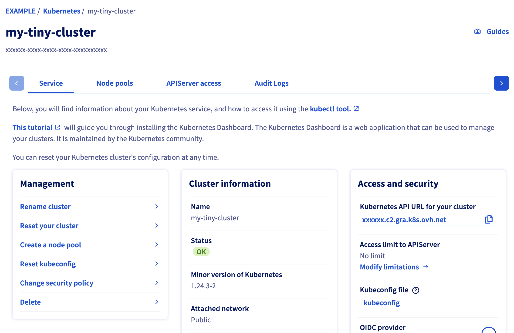
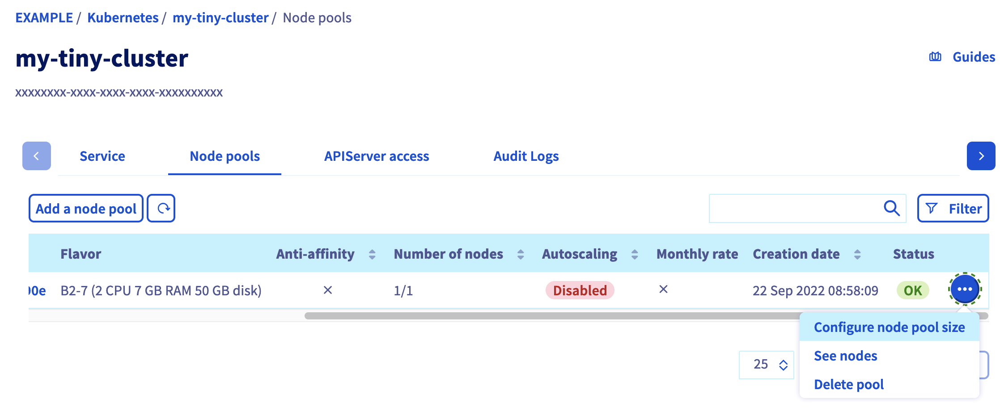
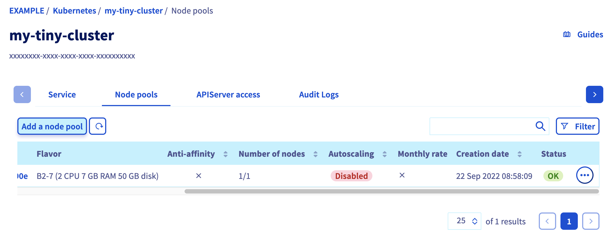
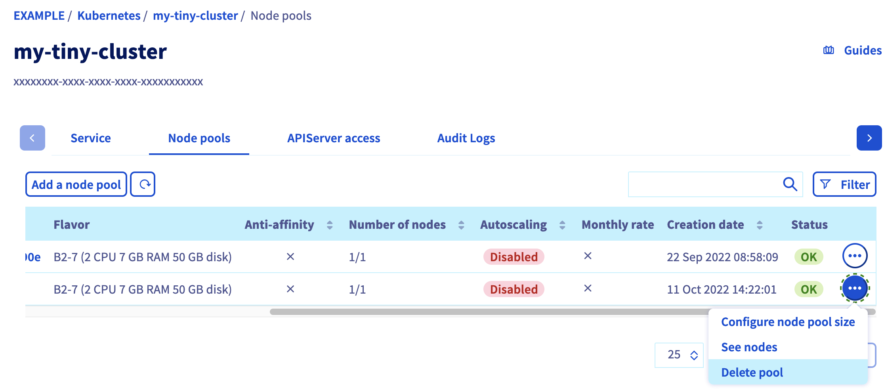
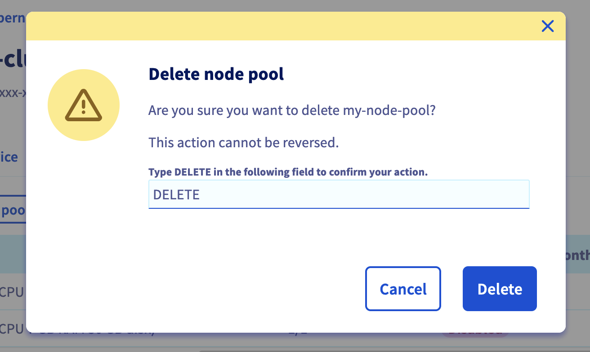

**Last updated Nov 2nd, 2020.**

## Objective

OVHcloud Managed Kubernetes service provides you Kubernetes clusters without the hassle of installing or operating them. This guide will cover one of the first steps after ordering a cluster: managing nodes and node pools.

## Requirements

- An OVHcloud Managed Kubernetes cluster

## Nodes and node pools

In your OVHcloud Managed Kubernetes cluster, nodes are grouped in node pools (group of nodes sharing the same configuration).  

When you create your cluster, it's created with a default node pool. Then, you can modify the size of this node pool, or add additional node pools of different sizes and types.

In this guide we explain how to do some basic operations with nodes and node pools using the Public Cloud section of the [OVHcloud Control Panel](https://www.ovh.com/auth?onsuccess=https%3A%2F%2Fwww.ovh.com%2Fmanager%2Fpublic-cloud&ovhSubsidiary=gb): adding nodes to an existing node pool, creating a new node pool...

## Editing nodes to an existing node pool

### Step 1 - Editing nodes to an existing node pool using the OVH Cloud Manager

Access our administration UI for your OVHcloud Managed Kubernetes clusters by clicking on the *Platforms and services* menu in the Public Cloud section of the [OVHcloud Control Panel](https://www.ovh.com/auth?onsuccess=https%3A%2F%2Fwww.ovh.com%2Fmanager%2Fpublic-cloud&ovhSubsidiary=gb)

{.thumbnail}

In this administration UI you have three tabs:

- *Service*: here you will have a global view of your cluster, with important information like the status, the API URL or the `kubectl` configuration file.

- *Node pools*: you will find here the active node pools of your cluster. You will be able to add, resize or remove node pools.

- *Containers and Services*: Coming soon...

To add nodes to a node pool, choose your node pool in the *Node pools* tab, and click on the *...* button at the right, then select *Edit pool*.

{.thumbnail}

#### Adding a node to an existing node pool

In the node pool edition section, click on *Actions*, then on *Add Node*. 

{.thumbnail}

Select the number of node to add. The type of node is automatically decided, as a node pool can have only on type of instance.

{.thumbnail}

Then you can choose the billing mode and anti-affinity properties. Anti affinity ensures that nodes will be created on different hypervisors (baremetal machines) and therefore ensure the best availability for your workloads. Note that anti-affinity limits the number of nodes in the pool to 5 maximum (but you can of course create multiple pools). Activating Monthly billing will apply to all current and upcoming nodes in the pool.

After you validate, your nodes will be installed.

{.thumbnail}

#### Deleting a node from an existing node pool

In the node pool edition section, click on *Actions*, then on *Add Node*. 

{.thumbnail}

Choose the number of nodes to delete, confirm the choice by typing `DELETE` in the confirmation field, and click on the *Delete* button.

{.thumbnail}

After you click on *Delete*, the nodes will be deleted.

{.thumbnail}

### Step 2 - Creating a node pool

In the *Node pools* tab, click on the *Add a node pool* button.

{.thumbnail}

In the *Create a node pool* dialog, choose a name for your node.

{.thumbnail}

Then choose the type of instance for your node pool. For this tutorial choose a general purpose node, like the B2-7 flavor: 

{.thumbnail}

> [!primary]
> If you want to know more about the flavors on the current OVH range, [here you have a complete guide](https://docs.ovh.com/gb/en/public-cloud/faq-how-to-understand-the-new-flavor-naming-rules-for-the-2017-range/).

Finally, choose the billing mode (monthly or hourly) and validate to init the creation of the node pool.

### Step 3 - Deleting a node pool

In the *Node pools* tab, choose the node pool to delete and click on the *...* button at the right, then select *Delete pool*.

{.thumbnail}

Confirm the choice by typing `DELETE` in the confirmation field, and click on the *Delete* button.

{.thumbnail}

## Go further

To have an overview of OVHcloud Managed Kubernetes service, you can go to the [OVHcloud Managed Kubernetes site](https://www.ovh.com/public-cloud/kubernetes/).

Otherwise to skip it and push to deploy your first application on your Kubernetes cluster, we invite you to follow our guide to [configuring default settings for `kubectl`](../configuring-kubectl/) and [deploying an application](../deploying-an-application/) .

Join our community of users on [https://community.ovh.com/en/](https://community.ovh.com/en/).
