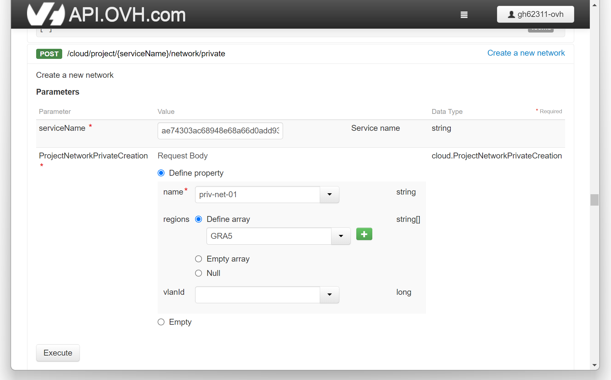
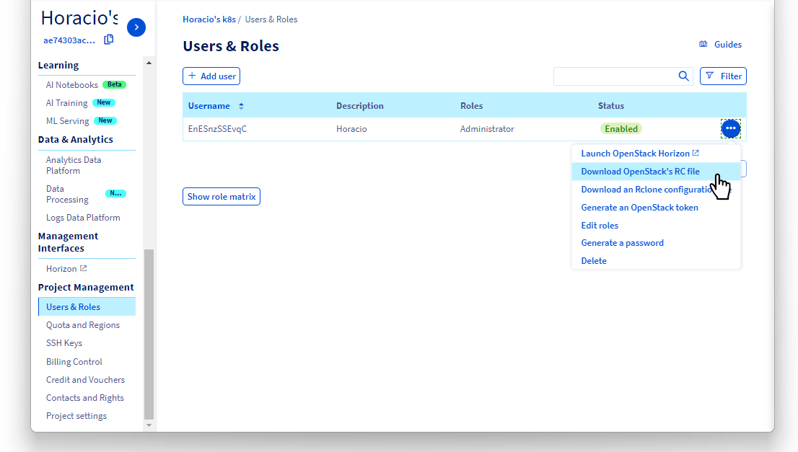
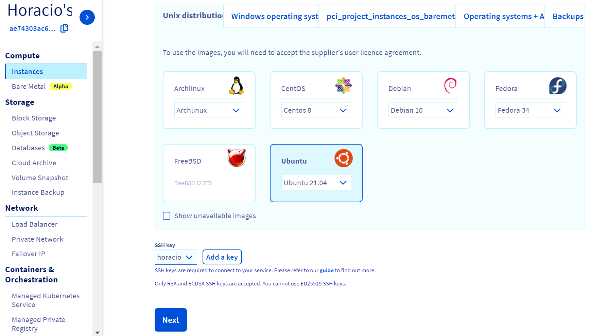
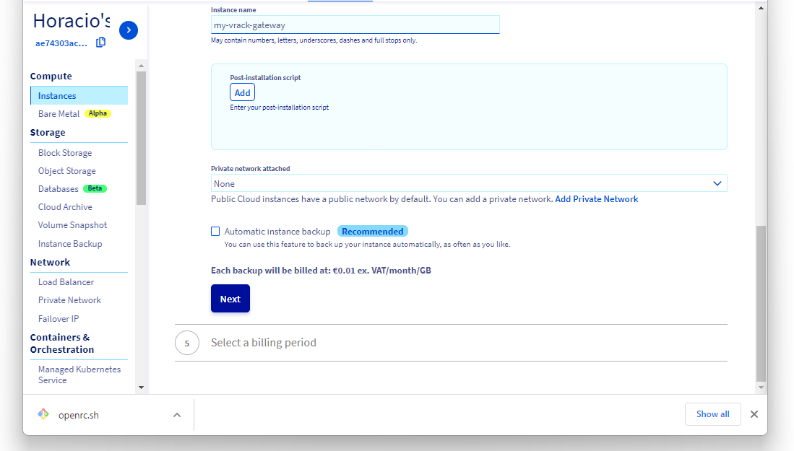

**Last updated July 31th<sup>th</sup>, 2021.**

<style>
 pre {
     font-size: 14px;
 }
 pre.console {
   background-color: #300A24; 
   color: #ccc;
   font-family: monospace;
   padding: 5px;
   margin-bottom: 5px;
 }
 pre.console code {
   border: solid 0px transparent;
   font-family: monospace !important;
   font-size: 0.75em;
   color: #ccc;
 }
 .small {
     font-size: 0.75em;
 }
</style>

## Objective

OVHcloud [vRack](https://www.ovh.co.uk/solutions/vrack/) is a private networking solution that enables our customers to route traffic between OVHcloud dedicated servers as well as other OVHcloud services. It allows you to add Public Cloud instances and Managed Kubernetes clusters to your private networks to create an infrastructure of physical and virtual resources.

Connecting a Managed Kubernetes cluster to another service in the same private network in the vRack is an easier process, as no network configuration is needed. Please have a look to our [../vrack-example-k8s-and-pci/](Working with vRack example - Managed Kubernetes and Public Cloud instances) tutorial to see an example in action.  

In this tutorial, we are going to activate the vRack on a Public Cloud project. Then we will create a Managed Kubernetes cluster and a Public Cloud instance (PCI). Eventually, both of them will be added inside the vRack but in **different private networks**. 

Then we are going to deploy a  [Wordpress](https://wordpress.org/){.external} on the Kubernetes cluster that will connect across the private networks using vRack, to the [MariaDB database](https://mariadb.org/) installed in the Public Cloud instance.

**In this tutorial we are going to give you an example of how to use the OVHcloud [vRack](https://www.ovh.co.uk/solutions/vrack/) to connect a Managed Kubernetes cluster with a Public Cloud instance inside different private network.**

> [!warning]
> The method described in this tutorial is a **temporary one**, only required if you want to route traffic between different private networks in a single vRack. Our Managed Kubernetes team is working on a more streamlined solution for this advanced use case, as explained in [this issue](https://github.com/ovh/public-cloud-roadmap/issues/116) in our [Public Cloud roadmap](https://github.com/ovh/public-cloud-roadmap/).
>


## Requirements

This tutorial presupposes that you already have a working OVHcloud Managed Kubernetes cluster, and some basic knowledge of how to operate it. If you want to know more on those topics, please look at the [OVHcloud Managed Kubernetes Service Quickstart](../deploying-hello-world/).

You also need to have [Helm](https://docs.helm.sh/) installed on your workstation and your cluster. Please refer to the [How to install Helm on OVHcloud Managed Kubernetes Service](../installing-helm/) tutorial.

It also supposes that you already have followed the [Using vRack](../using-vrack/) guide to activate the vRack on your Public Cloud project and put your OVHcloud Managed Kubernetes cluster inside the vRack.  It will also be useful to have followed our [../vrack-example-k8s-and-pci/](Working with vRack example - Managed Kubernetes and Public Cloud instances) tutorial to understand the easier use case when both services are in the same private network.

And to understand why this configuration is needed, please have a look at the [Using vRack - Communicating between different private networks](../using-vrack-between-private-networks/) technical document.


## Instructions

### Setting-up the vRack

First of all, we will need to set up vRack Private Network for our Public Cloud. To do it, we follow the [Configuring vRack for Public Cloud](../../public-cloud/public-cloud-vrack/) guide. 


Once we have created a vRack, we need to create two different Private Networks enabled at least on GRA5 region. Don't activate the default gateway option during creation.

{.thumbnail}


### Retrieving the Openstack configuration file

Now we need to download the `openrc.sh` configuration file, as explained in the [Setting OpenStack environment variables](../../public-cloud/set-openstack-environment-variables/) guide. 

{.thumbnail}

We will be working on GRA5 region, so we download the *Gravelines (GRA5)* file.

{.thumbnail}

Following the steps on the [Setting OpenStack environment variables](../../public-cloud/set-openstack-environment-variables/) guide to be sure that the Openstack CLI is working on our workstation.


<pre class="console"><code>$ source openrc.sh
Please enter your OpenStack Password:

$ nova list
+--------------------------------------+---------------------+--------+------------+-------------+------------------------+
| ID                                   | Name                | Status | Task State | Power State | Networks               |
+--------------------------------------+---------------------+--------+------------+-------------+------------------------+
| 0bee959e-48fb-4a7d-94d0-35470837320d | horacio-workstation | ACTIVE | -          | Running     | Ext-Net=51.210.xxx.xxx |
  [...]                         
+--------------------------------------+---------------------+--------+------------+-------------+------------------------+
</code></pre>


### Configuring the private networks

Let's begin by getting the private networks openstack IDs using the openstack CLI:

> [!warning]
> In my case, *My private network* has a subnet range of `10.0.0.0/16`, and *My second private network* has a subnet range of `10.2.0/16`, don't forget to adapt the commands to your specific subnet ranges.

```bash
MY_PRIVATE_NETWORK=$(openstack subnet list --subnet-range 10.0.0.0/16 --column ID -f value)
MY_SECOND_PRIVATE_NETWORK=$(openstack subnet list --subnet-range 10.2.0.0/16 --column ID -f value)
```

Now we can configure *My private network* with a static route to *My second private network*, and *My second private network* with a static route to *My private network*:

```bash
openstack subnet set --host-route destination=10.2.0.0/16,gateway=10.0.0.1 ${MY_PRIVATE_NETWORK}
openstack subnet set --host-route destination=10.0.0.0/16,gateway=10.2.0.1 ${MY_SECOND_PRIVATE_NETWORK}
```


<pre class="console"><code>$ MY_PRIVATE_NETWORK=$(openstack subnet list --subnet-range 10.0.0.0/16 --column ID -f value)

$ MY_SECOND_PRIVATE_NETWORK=$(openstack subnet list --subnet-range 10.2.0.0/16 --column ID -f value)

$ echo $MY_PRIVATE_NETWORK
5eda1998-abf0-4787-87a2-acd7431c9c3f

$ echo $MY_SECOND_PRIVATE_NETWORK
a019c436-6da3-4a10-a00d-49f8a3462bcd

$ openstack subnet set --host-route destination=10.2.0.0/16,gateway=10.0.0.1 ${MY_PRIVATE_NETWORK}

$ openstack subnet set --host-route destination=10.0.0.0/16,gateway=10.2.0.1 ${MY_SECOND_PRIVATE_NETWORK}
</code></pre>


### Setting-up a PCI gateway


Now we are going to create a Public Cloud instance in GRA5, to acr as a gateway for our vRack. 

{.thumbnail}

We are going to create an Ubuntu instance:

{.thumbnail}

We do NOT attach the instance to a private network yet, as you can unfortunately configure only one private network at the creation stage in the OVHcloud Manager. 

{.thumbnail}

Once the gateway instance is created, we need to add the two private networks to its configuration.


