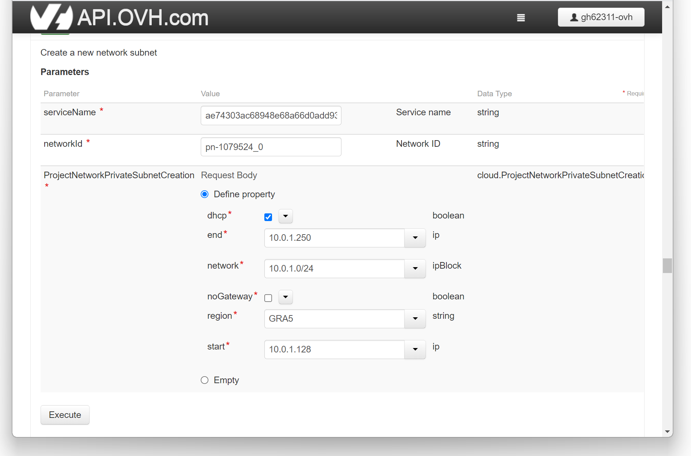
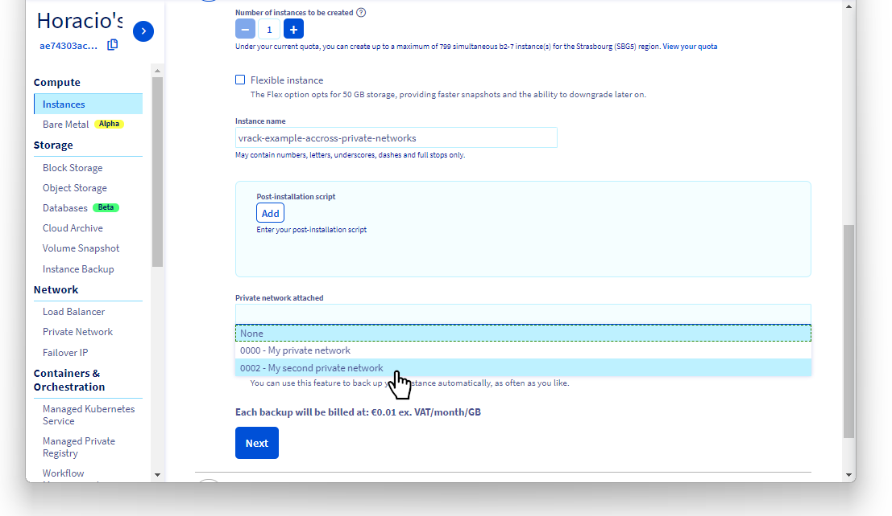

**Last updated July 31thth, 2021.**

## Objective

OVHcloud [vRack](https://www.ovh.co.uk/solutions/vrack/) is a private networking solution that enables our customers to route traffic between OVHcloud dedicated servers as well as other OVHcloud services. It allows you to add Public Cloud instances and Managed Kubernetes clusters to your private networks to create an infrastructure of physical and virtual resources.

Connecting a Managed Kubernetes cluster to another service in the same private network in the vRack is an easier process, as no network configuration is needed. Please have a look to our [../vrack-example-k8s-and-pci/](Working with vRack example - Managed Kubernetes and Public Cloud instances) tutorial to see an example in action.  

In this tutorial, we are going to activate the vRack on a Public Cloud project. Then we will create a Managed Kubernetes cluster and a Public Cloud instance (PCI). Eventually, both of them will be added inside the vRack but in **different provate networks**. 

Then we are going to deploy a  [Wordpress](https://wordpress.org/){.external} on the Kubernetes cluster that will connect across the private networks using vRack, to the [MariaDB database](https://mariadb.org/) installed in the Public Cloud instance.

**In this tutorial we are going to give you an example of how to use the OVHcloud [vRack](https://www.ovh.co.uk/solutions/vrack/) to connect a Managed Kubernetes cluster with a Public Cloud instance inside different private network.**

> [!warning]
> The method described in this tutorial is a **temporary workaround**. Our Managed Kubernetes team is working on a more streamlined solution, as explained in [this issue](https://github.com/ovh/public-cloud-roadmap/issues/116) in our [Public Cloud roadmap](https://github.com/ovh/public-cloud-roadmap/).
>

## Requirements

This tutorial presupposes that you already have a working OVHcloud Managed Kubernetes cluster, and some basic knowledge of how to operate it. If you want to know more on those topics, please look at the [OVHcloud Managed Kubernetes Service Quickstart](../deploying-hello-world/).

You also need to have [Helm](https://docs.helm.sh/) installed on your workstation and your cluster. Please refer to the [How to install Helm on OVHcloud Managed Kubernetes Service](../installing-helm/) tutorial.

It also supposes that you already have followed the [Using vRack](../using-vrack/) guide to activate the vRack on your Public Cloud project and put your OVHcloud Managed Kubernetes cluster inside the vRack. 

It will also be useful to have followed our [../vrack-example-k8s-and-pci/](Working with vRack example - Managed Kubernetes and Public Cloud instances) tutorial to understand the easier use case when both services are in the same private network.

## Instructions

### Setting-up the vRack

First of all, we will need to set up vRack Private Network for our Public Cloud. To do it, we follow the [Configuring vRack for Public Cloud](../../public-cloud/public-cloud-vrack/) guide. Once you have created a vRack, we need to create two different Private Networks.

{.thumbnail}

### Setting-up the Managed Kubernetes

Then we create a Kubernetes cluster, as explained in the [Create a cluster](https://docs.ovh.com/gb/en/kubernetes/creating-a-cluster/) guide, and in the third step (*Choose a Private Network for this cluster*) we choose the first of the private networks:

{.thumbnail}

Our new cluster will be created inside the vRack Private Network we have chosen.

In the Managed Kubernetes Service Dashboard, we can see the cluster, with the chosen private network in the *Attached network* column:

{.thumbnail}

### Setting-up the PCI

Now we can create a new Public Cloud instance inside the vRack, by following the [Integrating an instance into vRack](../../public-cloud/public-cloud-vrack/#step-3-integrating-an-instance-into-vrack_1) guide.

We are going to create an Ubuntu instance:

{.thumbnail}

In the fourth step of creation, we attach it to the second of the private network we created before:

{.thumbnail}

After instance creation, we can see the connection details in the OVHcloud Control Panel. If we log in to the instance using SSH, we can see that it has two network interfaces, one attached to the public IP address we use to log in, the other attached to the private network:

