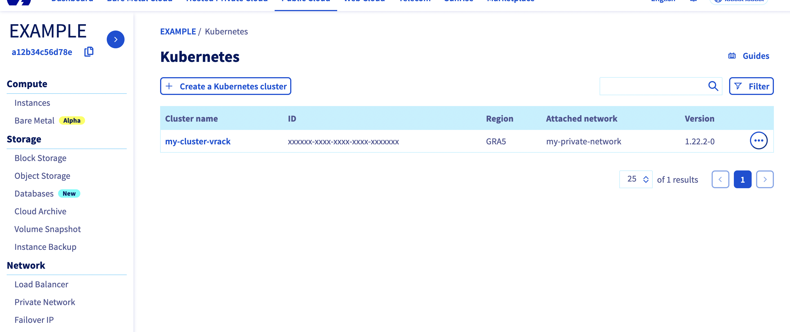

title: Working with vRack example: Managed Kubernetes and Public Cloud instances
slug: vrack-example-k8s-and-pci
excerpt: ''
section: Tutorials
order: 10
---

**Last updated June 17thth, 2021.**

In this tutorial we are going to give you an example of how to use the OVHcloud [vRack](https://www.ovh.co.uk/solutions/vrack/ to connect a Managed Kubernetes cluster with a Public Cloud instances inside a private network. 

## Before you begin

This tutorial presupposes that you already have a working OVHcloud Managed Kubernetes cluster, and some basic knowledge of how to operate it. If you want to know more on those topics, please look at the [OVHcloud Managed Kubernetes Service Quickstart](../deploying-hello-world/).

It also supposes that you already have followed the [Using vRack](../using-vrack/) guide to activate vRack on your Public Cloud project and put your OVHcloud Managed Kubernetes cluster inside the vRack.

During this guide, you will [setup a Public Cloud instance](../../public-cloud/public-cloud-first-steps/), install a Redis database and [put the instance in the same virtual private network](../../public-cloud/public-cloud-first-steps/) than the Kubernetes cluster. 

## Objectives

OVHcloud [vRack](https://www.ovh.co.uk/solutions/vrack/) is a private network solution that enables our customers to route traffic between OVHcloud dedicated servers as well as other OVHcloud services. At the same time, it allows you to add Public Cloud instances and Managed Kubernetes clusters to your private network to create an infrastructure of physical and virtual resources.

In this tutorial we are going to activate the vRack on a Public Cloud project. Then we will create and put inside the vRack a Managed Kubernetes cluster and a Public Cloud instance (PCI). 

## Setting-up the vRack

First of all, we will need to set up vRack Private Network for our Public Cloud. To do it, we follow the [Configuring vRack for Public Cloud](../../public-cloud/public-cloud-vrack/) guide. Once we have created a vRack and added it into a Private Network, you can continue. 

{.thumbnail}

## Setting-up the Managed Kubernetes

Then we create a Kubernetes cluster, as explained in the [Create a cluster](https://docs.ovh.com/gb/en/kubernetes/creating-a-cluster/) guide. Integrating a cluster into a vRack Private Network must be done at the third step on cluster creation, when we can choose an existing private network for the cluster:

{.thumbnail}

Our new cluster will be created inside the vRack Private Network we have chosen.

In the Managed Kubernetes Service Dashboard, we can see the cluster, with the chosen private network in the *Attached network* column:

{.thumbnail}

## Setting-up the PCI

Now we can create a new Public Cloud instance inside the vRack, by following the [Integrating an instance into vRack](../../public-cloud/public-cloud-vrack/#step-3-integrating-an-instance-into-vrack_1) guide.

We are going to create an Ubuntu instance:

{.thumbnail}

In the fourth step of creation, we attach it to the private network we created before:

{.thumbnail}